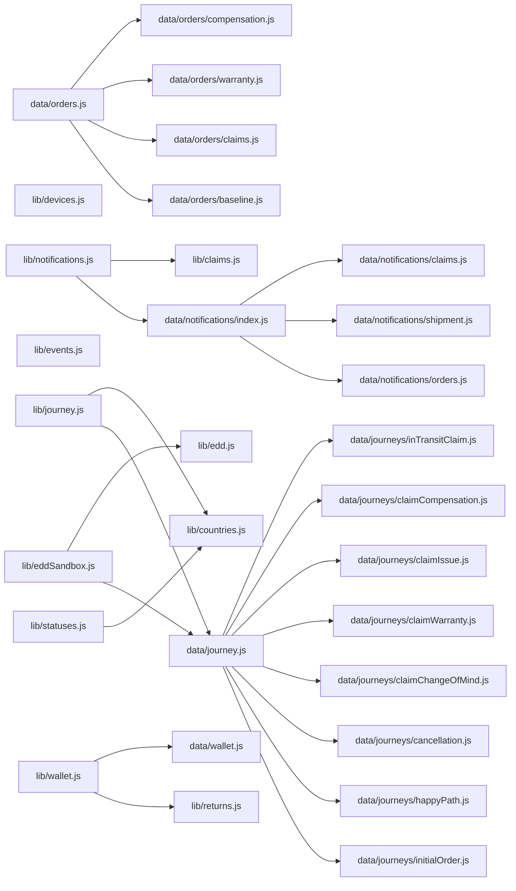

# Code map

> Navigation + impact layer for agents. **Read this before exploring.** It exists to replace fan-out search: locate a concept here, then do one targeted read at the listed file/line instead of grepping the tree. The generated block (below the marker) is rebuilt by `node scripts/codemap.mjs` — never hand-edit it. The curated sections above the marker carry the "why" and the couplings a dependency graph can't see.

## How agents should use this doc

1. **Finding code** → use _Where is X_ + the generated _Module index_. The index lists every export with its line number. Jump straight there; do **not** spawn an Explore agent for a symbol that is already listed.
2. **Planning a change** → read _Coupling the import graph can't see_ first, then the generated _Shared-core consumers_ table. Together they are the blast radius: imports + string contracts. Hand both to the planning agent.
3. **Reading cost** → the _LOC_ column flags expensive whole-file reads (the largest is now `resetGuideMocks.jsx` ~1.7k of CSS-art). `data/journey.js`, `data/orders.js`, and `ResetGuideSheet.jsx` are thin barrels/shells — open the specific sub-module (`data/journeys/*`, `data/orders/*`, `resetGuideMocks`/`resetGuideAnim`) or read a slice around the listed line, not the whole file.
4. **The "why"** → this doc deliberately does not explain rationale. Each row links to the per-feature doc in `docs/output/`; follow it only when you need the reasoning, not the location.

## Where is X — concept → module

| You want… | Module(s) | Why-doc |
|---|---|---|
| Order status / banner copy + tone / timeline / `pickActiveOrderId` | `lib/statuses.js` | `output/orders.md` |
| Claim pipeline states / tone / SLAs / sub-status copy / action-gate copy | `lib/claims.js` | `output/returns/claim_tracking.md` |
| Cancel claim — window / clean-revert vs ship-back / confirm sheet | `lib/claims.js` (`canCancelClaim`·159, `cancelNeedsShipBack`·170, `cancelReturnGate`·182), `components/CancelClaimSheet.jsx`, `components/InvalidClaimCard.jsx` (`reason: 'cancelled'`), `App.jsx` (`cancelledClaims` / `shipBackCancels`) | `output/returns/claim_tracking.md` §2.8 |
| Returns eligibility / refund math / fee rate / window / `generateClaimRef` | `lib/returns.js` | `output/returns/change_of_mind.md`, `issue.md` |
| Returns-flow steps, soft validation, situation→remedy→claimType derivation | `components/ClaimFlow/` + `flowReducer.js` (`sequenceFor`·57, `claimTypeFor`·65, `progressFor`·109, `stepError`·329) | `output/returns/*.md`, `warranties_compensations.md` |
| Returns decision phase — situation-first Screen 1 (4 situations) → per-branch screens → derived remedy/claimType; the issue taxonomy (6 categories ≤5 issues + wrong-item details) | `Step1Situation.jsx` (situations), `Step2Reason.jsx` (CoM reasons + tripwires), `StepIssueCategory.jsx`/`StepIssueSpecific.jsx` (device_fault), `StepWrongItem.jsx` (wrong_item), `StepRemedy.jsx` (refund/repair/replacement), `StepEvidence.jsx` (proof + description), `issueTaxonomy.js` (`ISSUE_CATEGORIES`/`WRONG_ITEM_DETAILS`/`findSpecificIssue`), `SwitchFlowSheet.jsx` (tripwire safety net) | `output/returns/change_of_mind.md`, `issue.md` |
| Guided-reset mapping / copy / steps / device frames | `lib/devices.js` + `components/ClaimFlow/ResetGuideSheet.jsx` + `Step3DevicePrep.jsx` | `output/returns/guided_reset.md` |
| History-thread events | `lib/events.js` (`getHistoryEvents`·119) | `output/orders.md` §6 |
| EDD / SLA model | `lib/edd.js`; sandbox: `lib/eddSandbox.js` + `data/journey.js` | `output/journey_backend_spec.md` |
| Journey replay mode | `lib/journey.js` + `data/journey.js` + `JourneyDevPanel.jsx` | `output/journey_backend_spec.md` |
| Card routing (which card renders) | `App.jsx` (routing block ≈ L285–375) | `output/orders.md` §2 |
| Cancellation sheet / keep-order undo | `CancelOrderSheet.jsx`, `KeepOrderSheet.jsx` | `output/cancellations.md` |
| Mock orders / field shapes | `data/orders.js` | `output/orders.md` §7 |
| Product line-item (thumbnail · name · variant · Revibe Care callout · price breakdown), shared across all cards | `components/ProductSummary.jsx` (exports `REVIBE_CARE_ICON`) | `output/orders.md` §3.0 |
| `See detailed tracking` dropdown — single shared surface for **every** claim courier leg (ClaimCard inbound, WarrantyClaimCard inbound, WarrantyClaimCard ship-back, InvalidClaimCard paid return) | `components/ReturnShipmentTracking.jsx` (exports `TrackingDropdown{steps,currentIndex,stamps}` + the `ReturnShipmentTracking{ship}` return-leg adapter; milestone rows via `Timeline` dense; expanded panel ends in a Track package / Get Help action row) | `output/warranties_compensations.md` §2.3.3, `output/returns/claim_tracking.md` §3.3 |
| **Any** step/milestone timeline (the single component — order status collapsed/hero/in-progress/past, claim/warranty/return progress, shipping + cancellation sub-timelines, transit dropdowns) | `components/Timeline.jsx` (props `{ orientation, tone, steps, currentIndex, stamps, dense, onDark, complete, frozen, toneForStep }`); status lists in `lib/statuses.js` + `lib/claims.js` | `docs/handoff/timeline/design.md`, `output/returns/claim_tracking.md`, `output/orders.md` |
| Per-country capability flags / country-specific card + journey differences | `lib/countries.js` (`COUNTRIES`, `countryConfig`); selector `components/CountryPicker.jsx`; journey-flow forks via per-edge `next` country tags in `lib/journey.js` (`validNext`) | `output/country_split.md` |
| Revibe Wallet — balance/ledger derivation, switchable-credit + Move-to-card deduction math, seed history; the `GreetRow` pill + `WalletSheet` | `lib/wallet.js` (`walletLedger`, `walletBalance`, `latestSwitchableCredit`, `cardEquivalentFor`) + `data/wallet.js` (`WALLET_SEED_TRANSACTIONS`); `components/WalletSheet.jsx`; pill in `components/GreetRow.jsx`; state in `App.jsx` (`walletTransfers`) | `output/wallet.md` |
| Split-payment refunds (card + gift card) — the proportional split display, shared by every refund surface | `lib/returns.js` (`isSplitPaid`, `refundDestinations`) + `components/RefundSplitRows.jsx` (the two-destination-row component); gift-card portion credited in `lib/wallet.js`; rendered by `CancelOrderSheet`/`Step5RefundMethod`/`Step6Review`/`Step7Confirmation`/`RefundDetailsSheet`/`ClaimDetailsSheet`/`ClaimCard`/`PastOrderCard` | `output/orders.md` §7.1, `output/wallet.md`, `output/cancellations.md` |

## Coupling the import graph can't see

These are **string contracts**: a value written as a literal in data/flow code, switched on elsewhere. No `import` edge connects them, so the generated tables below miss them — but renaming or adding a value breaks every consumer here. Verified counts are from `data/orders.js`.

| Contract value | Written in | Switched on in | Add/rename a value → also touch |
|---|---|---|---|
| `statusId` (`created`/`quality_check`/`shipped`/`delivered`) | `data/orders.js`, `data/journey.js` | `lib/statuses.js` (`STATUSES`, `statusDescription`), `App.jsx` routing, `Timeline` (via the cards) | `STATUSES` + `STATUS_DESCRIPTIONS` in `statuses.js` |
| `subStatusId` (shipping legs) | `data/orders.js` | `lib/statuses.js` (`SHIPPING_SUB_STATUSES`), `Timeline` (via `OrderCard`/`HeroCard`/`ReturnShipmentTracking`) | `SHIPPING_SUB_STATUSES` in `statuses.js` |
| `state` (`open`/`close`/`cancelled`) | `data/orders.js` | `lib/statuses.js` (`ORDER_STATES`), header chips | `ORDER_STATES` in `statuses.js` |
| `claim.claimStatusId` (`initiated`→…→`refund_credited` / warranty tail) | `data/orders.js`, `ClaimFlow` seed (always `initiated`) | `lib/claims.js` (`CLAIM_STATUSES` / `COMPENSATION_` / `WARRANTY_`), `hasActiveClaim`, `isClaimRefunded`, `isWarrantyDelivered` | the right status list in `claims.js` + the `hasActive`/`isRefunded` predicates |
| `claim.type` (`change_of_mind`/`issue`/`warranty`/`compensation`) | `ClaimFlow` (derived from `situation`+`remedy` via `claimTypeFor`), `data/orders.js` | `App.jsx` routing, `claimStatusesFor`, `flowReducer` step tails (`sequenceFor`) | routing in `App.jsx` + `claimTypeFor`/`sequenceFor` in `flowReducer.js` |
| `state.situation` (`changed_mind`/`device_fault`/`wrong_item`/`keep_compensation`) + `state.remedy` (`refund`/`repair`/`replacement`) | flow state only (Step1Situation / StepRemedy) | `flowReducer.js` (`DECISION_STEPS`, `tailSteps`, `claimTypeFor`); tripwire sentinels `WRONG_ITEM_FAULT_TRIP`/`CATEGORY_COM_TRIP`/`trip_*` → `SwitchFlowSheet` via `ClaimFlow.pendingSwitch` | `claimTypeFor`/`DECISION_STEPS` in `flowReducer.js` + the `pendingSwitch` map in `ClaimFlow.jsx` |
| Takeover flags `claim.docsRejection` / `pickupFailure` / `resetFailed` / `invalidClaim` | `data/orders.js` (hand-seeded only) | `App.jsx` routing **precedence** → takeover cards | the routing precedence list in `App.jsx` (order matters) |
| `claim.invalidClaim.reason` (`invalid` default / `cancelled`) | `data/journeys/claim*.js`, `lib/claims.js` (`cancelReturnGate`), `App.jsx` (`shipBackCancels` projection) | `components/InvalidClaimCard.jsx` (copy + `Decline`-vs-`Keep claim`) | the `reason` branches in `InvalidClaimCard.jsx` |
| `category_name` (`iPhone`/`Macbook`/`Samsung phone`/`Tablet`/`Laptop`) | `data/orders.js` product | `lib/devices.js` → `ResetGuideSheet` variant | mapping in `devices.js` + a guide variant in `ResetGuideSheet.jsx` |
| `claim.transitSubTimeline.picked_up`, `claim.shipBack.awb` | `data/orders.js` | gate the `See detailed tracking` dropdown in `ClaimCard` / `WarrantyClaimCard` | the gating check in the relevant card |
| `order.country` (`AE`/`ZA`/`SA`/`Others`) | `data/orders/*` (mocks), `App.jsx` (injected onto the replayed order from `?country=`/`CountryPicker`) | `lib/countries.js` (`countryConfig`) → `detailedTracking` gate in `HeroCard`/`OrderCard`/`ClaimCard`/`WarrantyClaimCard`/`InvalidClaimCard`; per-edge `next` country tags in `lib/journey.js` (`validNext`) | a flag in `COUNTRIES` + the card guard, or a `{id,countries}` edge in the journey `next` |
| `order.paymentSplit` (`{ card, giftCard }`) — split-paid marker | `data/orders/*`, `data/journey.js` (cancellation + change_of_mind `initialOrder`) | `lib/returns.js` (`isSplitPaid`/`refundDestinations`), `lib/wallet.js` (gift-portion credit), every refund surface via `RefundSplitRows` | the `refundDestinations` math + each surface's split gate (rendered only on the original-payment path) |

**Projection invariant:** `App.jsx` projects the in-session `submittedClaims` map over `ORDERS` (≈L204), so a freshly-submitted claim always lands on `initiated`. Every post-`initiated` state and all four takeover surfaces are reachable **only** via hand-seeded mocks in `data/orders.js` — see each `docs/output/*.md` "Mocked vs production" list.

## Cross-cutting diagrams

The connective control flow — spans more than one file, so it can't be read off a single module. Read the relevant one before planning a change that crosses flows. All three live in [`output/diagrams.md`](output/diagrams.md):

- [**Card routing**](output/diagrams.md#card-routing) — the two-stage `isOpen` partition + precedence ladder in `App.jsx`. Read before touching routing precedence or adding a card variant / takeover flag.
- [**Claim lifecycle**](output/diagrams.md#claim-lifecycle) — all four pipelines (refund / compensation / warranty) + the four takeover detours on one canvas, with the card per state. Read before changing a claim pipeline or adding a state.
- [**Returns data-flow**](output/diagrams.md#returns-data-flow) — `ClaimFlow.onSubmitClaim` → `submittedClaims` → projection over `ORDERS` → card routing. Read before changing how a submitted claim reaches a card. This is the runtime projection no import edge shows.

<!-- codemap:generated:start -->

### Module index

_Concept → file → symbol → line. Read the file + jump to the line; do not fan-out search for a symbol that is listed here. `In` = how many src files import this module._

| Module | LOC | In | Exports (line) |
|---|--:|--:|---|
| `App.jsx` | 879 | 1 | `App`·85 |
| `components/BnplDisclaimerTooltip.jsx` | 86 | 7 | `bnplProviderLabel`·9, `isBnpl`·13, `BnplDisclaimerTooltip`·17 |
| `components/CancelClaimSheet.jsx` | 155 | 1 | `CancelClaimSheet`·15 |
| `components/CancelOrderSheet.jsx` | 742 | 2 | `CancelOrderSheet`·21 |
| `components/ChatFab.jsx` | 14 | 1 | `ChatFab`·3 |
| `components/ClaimActionBanner.jsx` | 46 | 1 | `ClaimActionBanner`·8 |
| `components/ClaimCard.jsx` | 366 | 1 | `ClaimCard`·49 |
| `components/ClaimDetailsSheet.jsx` | 243 | 2 | `ClaimDetailsSheet`·19 |
| `components/ClaimFlow/BatteryHealthCheck.jsx` | 260 | 1 | `BatteryHealthCheck`·16 |
| `components/ClaimFlow/ClaimFlow.jsx` | 451 | 1 | `ClaimFlow`·25 |
| `components/ClaimFlow/InlineError.jsx` | 16 | 12 | `InlineError`·6 |
| `components/ClaimFlow/IssueEvidence.jsx` | 556 | 1 | `IssueEvidence`·83 |
| `components/ClaimFlow/ProgressBar.jsx` | 38 | 1 | `ProgressBar`·6 |
| `components/ClaimFlow/ResetGuideSheet.jsx` | 803 | 3 | `ResetGuideSheet`·424 |
| `components/ClaimFlow/Step1Situation.jsx` | 91 | 1 | `Step1Situation`·36 |
| `components/ClaimFlow/Step2Compensation.jsx` | 238 | 1 | `Step2Compensation`·23 |
| `components/ClaimFlow/Step2Reason.jsx` | 163 | 2 | `REASONS`·13, `REASON_TRIPWIRES`·24, `REASON_LABELS`·42, `tripwireFor`·49, `Step2Reason`·53 |
| `components/ClaimFlow/Step3DevicePrep.jsx` | 550 | 1 | `Step3DevicePrep`·37 |
| `components/ClaimFlow/Step4Packing.jsx` | 253 | 2 | `PACKING_OPTIONS`·15, `PACKING_LABELS`·36, `Step4Packing`·40 |
| `components/ClaimFlow/Step4PickupDetails.jsx` | 427 | 1 | `Step4PickupDetails`·53 |
| `components/ClaimFlow/Step5RefundMethod.jsx` | 280 | 1 | `Step5RefundMethod`·10 |
| `components/ClaimFlow/Step6Review.jsx` | 655 | 1 | `Step6Review`·30 |
| `components/ClaimFlow/Step7Confirmation.jsx` | 241 | 1 | `Step7Confirmation`·18 |
| `components/ClaimFlow/StepEvidence.jsx` | 81 | 1 | `StepEvidence`·12 |
| `components/ClaimFlow/StepHeading.jsx` | 16 | 12 | `StepHeading`·1 |
| `components/ClaimFlow/StepIssueCategory.jsx` | 92 | 1 | `CATEGORY_COM_TRIP`·9, `StepIssueCategory`·15 |
| `components/ClaimFlow/StepIssueSpecific.jsx` | 148 | 1 | `StepIssueSpecific`·15 |
| `components/ClaimFlow/StepRemedy.jsx` | 100 | 1 | `StepRemedy`·40 |
| `components/ClaimFlow/StepWrongItem.jsx` | 112 | 1 | `WRONG_ITEM_FAULT_TRIP`·10, `StepWrongItem`·14 |
| `components/ClaimFlow/StickyActionBar.jsx` | 38 | 1 | `StickyActionBar`·1 |
| `components/ClaimFlow/SwitchFlowSheet.jsx` | 173 | 1 | `SwitchFlowSheet`·64 |
| `components/ClaimFlow/compensationSubtypes.js` | 39 | 3 | `COMPENSATION_SUBTYPES`·8, `COMPENSATION_SUBTYPE_LABELS`·32, `findCompensationSubtype`·36 |
| `components/ClaimFlow/flowReducer.js` | 404 | 2 | `BRANCH_ENTRY`·28, `sequenceFor`·57, `claimTypeFor`·65, `progressFor`·109, `initialState`·127, `flowReducer`·229, `stepError`·334, `canAdvance`·401 |
| `components/ClaimFlow/issueTaxonomy.js` | 438 | 6 | `PROOF_GUIDE_LABEL`·22, `DEFAULT_PROOF_GUIDE_URL`·25, `ISSUE_CATEGORIES`·116, `WRONG_ITEM_DETAILS`·317, `SOMETHING_ELSE_ID`·346, `categoryById`·361, `findSpecificIssue`·365, `categoryForIssue`·373, `scopeForIssue`·379, `visibleIssuesFor`·391, `labelForIssue`·399, `resolveNeed`·410, `evidenceSubFor`·425 |
| `components/ClaimFlow/resetGuideAnim.js` | 10 | 2 | `STEP_ANIM_CSS`·3, `stepAnim`·8 |
| `components/ClaimFlow/resetGuideMocks.jsx` | 1654 | 1 | _(none)_ |
| `components/ClosedClaimCard.jsx` | 164 | 1 | `ClosedClaimCard`·47 |
| `components/CountryPicker.jsx` | 37 | 2 | `CountryPicker`·8 |
| `components/DeliveryAddressPill.jsx` | 44 | 5 | `DeliveryAddressPill`·9 |
| `components/DocsRejectedCard.jsx` | 495 | 1 | `DocsRejectedCard`·35 |
| `components/EddSandboxPanel.jsx` | 164 | 1 | `EddSandboxPanel`·10 |
| `components/GreetRow.jsx` | 41 | 1 | `GreetRow`·3 |
| `components/Header.jsx` | 50 | 1 | `Header`·6 |
| `components/HeroCard.jsx` | 222 | 1 | `HeroCard`·30 |
| `components/HistoryThread.jsx` | 218 | 3 | `HistoryThread`·86 |
| `components/InProgressCard.jsx` | 222 | 1 | `InProgressCard`·30 |
| `components/InvalidClaimCard.jsx` | 792 | 1 | `InvalidClaimCard`·43 |
| `components/JourneyDevPanel.jsx` | 257 | 1 | `JourneyDevPanel`·16 |
| `components/JourneyNotificationPanel.jsx` | 205 | 1 | `JourneyNotificationPanel`·29 |
| `components/KeepOrderSheet.jsx` | 122 | 1 | `KeepOrderSheet`·9 |
| `components/NpsSurvey.jsx` | 63 | 1 | `NpsSurvey`·8 |
| `components/OrderCard.jsx` | 430 | 1 | `OrderCard`·38 |
| `components/OrderClaimLink.jsx` | 248 | 8 | `OrderClaimLink`·182 |
| `components/OrderFilters.jsx` | 75 | 1 | `STATUS_CHIPS`·3, `OrderFilters`·13 |
| `components/PastOrderCard.jsx` | 404 | 3 | `PastOrderCard`·35, `DestinationChip`·352 |
| `components/PickupFailedCard.jsx` | 431 | 1 | `PickupFailedCard`·22 |
| `components/ProductSummary.jsx` | 152 | 17 | `REVIBE_CARE_ICON`·1, `ProductSummary`·20 |
| `components/RefundDetailsSheet.jsx` | 177 | 2 | `RefundDetailsSheet`·9 |
| `components/RefundSplitRows.jsx` | 121 | 8 | `RefundSplitRows`·22 |
| `components/ResetFailedCard.jsx` | 501 | 1 | `ResetFailedCard`·28 |
| `components/ResetGuidePicker.jsx` | 98 | 1 | `ResetGuidePicker`·30 |
| `components/ReturnShipmentTracking.jsx` | 107 | 3 | `TrackingDropdown`·24, `ReturnShipmentTracking`·70 |
| `components/RevibeCancellationCard.jsx` | 216 | 1 | `RevibeCancellationCard`·43 |
| `components/StatusExplainer.jsx` | 51 | 4 | `StatusExplainer`·14 |
| `components/TapToFixCta.jsx` | 14 | 4 | `TapToFixCta`·3 |
| `components/Timeline.jsx` | 264 | 8 | `Timeline`·108 |
| `components/UndoSnackbar.jsx` | 44 | 1 | `UndoSnackbar`·8 |
| `components/WalletInfoTooltip.jsx` | 71 | 6 | `REVIBE_WALLET_ICON`·4, `WalletInfoTooltip`·7 |
| `components/WalletSheet.jsx` | 300 | 1 | `WalletSheet`·21 |
| `components/WarrantyClaimCard.jsx` | 376 | 1 | `WarrantyClaimCard`·55 |
| `data/journey.js` | 123 | 3 | `INITIAL_ORDER`·32, `JOURNEYS`·46 |
| `data/journeys/cancellation.js` | 778 | 1 | `CANCELLATION_NODES`·25 |
| `data/journeys/claimChangeOfMind.js` | 831 | 1 | `CLAIM_COM_NODES`·19 |
| `data/journeys/claimCompensation.js` | 375 | 1 | `CLAIM_COMPENSATION_NODES`·29 |
| `data/journeys/claimIssue.js` | 944 | 1 | `CLAIM_ISSUE_NODES`·31 |
| `data/journeys/claimWarranty.js` | 1009 | 1 | `CLAIM_WARRANTY_NODES`·26 |
| `data/journeys/happyPath.js` | 128 | 1 | `HAPPY_PATH_NODES`·5 |
| `data/journeys/inTransitClaim.js` | 97 | 1 | `IN_TRANSIT_ENTRY_STAGES`·32, `withInTransitClaim`·44 |
| `data/journeys/initialOrder.js` | 37 | 1 | `INITIAL_ORDER`·2 |
| `data/notifications/claims.js` | 263 | 1 | `CLAIM_NOTIFICATIONS`·26 |
| `data/notifications/index.js` | 16 | 1 | `NOTIFICATIONS`·11 |
| `data/notifications/orders.js` | 122 | 1 | `ORDER_NOTIFICATIONS`·19 |
| `data/notifications/shipment.js` | 40 | 1 | `SHIPMENT_NOTIFICATIONS`·9 |
| `data/orders.js` | 20 | 3 | `ORDERS`·14 |
| `data/orders/baseline.js` | 622 | 1 | `BASELINE_ORDERS`·3 |
| `data/orders/claims.js` | 806 | 1 | `CLAIM_ORDERS`·4 |
| `data/orders/compensation.js` | 184 | 1 | `COMPENSATION_ORDERS`·3 |
| `data/orders/warranty.js` | 174 | 1 | `WARRANTY_ORDERS`·3 |
| `data/wallet.js` | 94 | 1 | `WALLET_SEED_TRANSACTIONS`·21 |
| `lib/claims.js` | 747 | 17 | `CLAIM_STATUSES`·18, `COMPENSATION_CLAIM_STATUSES`·64, `claimStatusesFor`·98, `CLAIM_EXPLANATIONS`·108, `COMPENSATION_EXPLANATIONS`·120, `claimExplanation`·132, `claimToneFor`·142, `claimProgressIndex`·148, `RETURN_CLAIM_STATUSES`·158, `returnClaimProgressIndex`·171, `CLAIM_TRANSIT_SUB_STATUSES`·180, `transitSubProgressIndex`·187, `hasActiveClaim`·196, `isClaimRefunded`·205, `isClaimClosed`·216, `CLAIM_CLOSURE_REASONS`·222, `closureCopyFor`·261, `canCancelClaim`·276, `cancelNeedsShipBack`·287, `cancelReturnGate`·299, `isWarrantyDelivered`·319, `isReturnDelivered`·332, `claimPhaseTag`·338, `claimStatusHeadline`·355, `claimStatusSubline`·360, `WARRANTY_CLAIM_STATUSES`·378, `warrantyClaimToneFor`·426, `warrantyClaimProgressIndex`·434, `warrantyClaimPhaseTag`·438, `warrantyClaimStatusHeadline`·457, `warrantyClaimStatusSubline`·462, `WARRANTY_EXPLANATIONS`·471, `warrantyClaimExplanation`·485, `REASON_LABELS`·499, `reasonText`·511, `devicePrepText`·519, `CLAIM_TYPE_LABELS`·527, `claimTypeLabel`·534, `CLAIM_REF_PREFIXES`·546, `formatClaimRef`·554, `claimRequiresProof`·567, `refundMethodLabel`·573, `CLAIM_SLAS`·592, `expectedCompletionFor`·615, `SUB_STATUS_LABELS`·640, `actionGateCopy`·701 |
| `lib/countries.js` | 32 | 9 | `DEFAULT_COUNTRY`·15, `COUNTRIES`·17, `COUNTRY_CODES`·24, `countryConfig`·28 |
| `lib/devices.js` | 65 | 5 | `osForCategory`·26, `deviceOsForOrder`·33, `deviceTypeForCategory`·39, `deviceTypeForOrder`·51, `isOsAmbiguous`·62 |
| `lib/edd.js` | 245 | 1 | `MARKETS`·24, `STAGE_ORDER_CREATED`·60, `STAGE_QC`·61, `STAGE_SHIPPED`·62, `SLA_ON_TIME`·64, `SLA_LATE`·65, `MSG_ORDER_LATE`·72, `MSG_QC_BACK_ON_TRACK`·74, `MSG_QC_LATE`·76, `MSG_SHIPPED_LATE`·78, `workdayIntl`·100, `currentStage`·117, `calculateEdd`·125, `buildCustomerMessage`·161, `orderStatus`·185 |
| `lib/eddSandbox.js` | 231 | 1 | `useEddSandbox`·187 |
| `lib/events.js` | 152 | 3 | `getHistoryEvents`·119 |
| `lib/journey.js` | 112 | 1 | `useJourney`·25 |
| `lib/notifications.js` | 93 | 2 | `NOTIFICATIONS`·14, `NOTIFICATION_STATUSES`·26, `notificationStatus`·39, `notificationFor`·53, `journeyNotificationCoverage`·83 |
| `lib/returns.js` | 299 | 14 | `RETURN_WINDOW_DAYS`·4, `RESTOCKING_FEE_RATE`·5, `CANCELLATION_FEE_RATE`·10, `ISSUE_WALLET_BONUS`·14, `addDays`·41, `startOfDay`·45, `eligibilityFor`·51, `groupOrdersByEligibility`·76, `refundBreakdown`·94, `isSplitPaid`·144, `refundDestinations`·155, `formatMoney`·164, `formatLongDate`·169, `formatShortDate`·178, `generateClaimRef`·190, `BATTERY_BASELINE_BY_GRADE`·198, `conditionGradeOf`·207, `batteryBaselineFor`·214, `daysSinceDelivery`·225, `assessBattery`·242 |
| `lib/statuses.js` | 384 | 6 | `STATUSES`·4, `CANCELLATION_STATUSES`·32, `SHIPPING_SUB_STATUSES`·56, `ORDER_STATES`·81, `progressIndex`·95, `subProgressIndex`·100, `cancellationProgressIndex`·105, `cancellationStepsFor`·116, `statusDescription`·126, `STATUS_EXPLANATIONS`·260, `statusExplanation`·277, `pickActiveOrderId`·299, `statusHeadline`·312, `statusSubline`·331, `statusIconFor`·360 |
| `lib/wallet.js` | 303 | 2 | `walletLedger`·92, `walletBalance`·214, `walletCurrency`·222, `latestSwitchableCredit`·231, `cardEquivalentFor`·244 |
| `main.jsx` | 11 | 0 | _(none)_ |

### Shared-core consumers (blast radius)

_Editing a `lib/` or `data/` module touches every file listed. Hand these importers to a planning agent before changing a signature or a data shape._

| Source-of-truth module | Consumers |
|---|---|
| `lib/claims.js` | `App.jsx`, `components/CancelClaimSheet.jsx`, `components/ClaimActionBanner.jsx`, `components/ClaimCard.jsx`, `components/ClaimDetailsSheet.jsx`, `components/ClaimFlow/ClaimFlow.jsx`, `components/ClaimFlow/Step4PickupDetails.jsx`, `components/ClaimFlow/Step6Review.jsx`, `components/ClaimFlow/Step7Confirmation.jsx`, `components/ClosedClaimCard.jsx`, `components/DocsRejectedCard.jsx`, `components/InvalidClaimCard.jsx`, `components/OrderClaimLink.jsx`, `components/PickupFailedCard.jsx`, `components/ResetFailedCard.jsx`, `components/WarrantyClaimCard.jsx`, `lib/notifications.js` |
| `lib/returns.js` | `components/CancelOrderSheet.jsx`, `components/ClaimCard.jsx`, `components/ClaimDetailsSheet.jsx`, `components/ClaimFlow/BatteryHealthCheck.jsx`, `components/ClaimFlow/ClaimFlow.jsx`, `components/ClaimFlow/IssueEvidence.jsx`, `components/ClaimFlow/Step5RefundMethod.jsx`, `components/ClaimFlow/Step6Review.jsx`, `components/ClaimFlow/Step7Confirmation.jsx`, `components/PastOrderCard.jsx`, `components/RefundDetailsSheet.jsx`, `components/RefundSplitRows.jsx`, `components/WalletSheet.jsx`, `lib/wallet.js` |
| `lib/countries.js` | `App.jsx`, `components/ClaimCard.jsx`, `components/CountryPicker.jsx`, `components/HeroCard.jsx`, `components/InvalidClaimCard.jsx`, `components/OrderCard.jsx`, `components/WarrantyClaimCard.jsx`, `lib/journey.js`, `lib/statuses.js` |
| `lib/statuses.js` | `App.jsx`, `components/HeroCard.jsx`, `components/InProgressCard.jsx`, `components/OrderCard.jsx`, `components/PastOrderCard.jsx`, `components/ReturnShipmentTracking.jsx` |
| `lib/devices.js` | `components/ClaimFlow/Step3DevicePrep.jsx`, `components/ClaimFlow/flowReducer.js`, `components/ClaimFlow/issueTaxonomy.js`, `components/ResetFailedCard.jsx`, `components/ResetGuidePicker.jsx` |
| `data/journey.js` | `App.jsx`, `lib/eddSandbox.js`, `lib/journey.js` |
| `data/orders.js` | `App.jsx`, `components/ClaimFlow/ClaimFlow.jsx`, `components/ClaimFlow/flowReducer.js` |
| `lib/events.js` | `components/ClaimCard.jsx`, `components/PastOrderCard.jsx`, `components/WarrantyClaimCard.jsx` |
| `lib/notifications.js` | `components/JourneyDevPanel.jsx`, `components/JourneyNotificationPanel.jsx` |
| `lib/wallet.js` | `App.jsx`, `components/WalletSheet.jsx` |
| `data/journeys/cancellation.js` | `data/journey.js` |
| `data/journeys/claimChangeOfMind.js` | `data/journey.js` |
| `data/journeys/claimCompensation.js` | `data/journey.js` |
| `data/journeys/claimIssue.js` | `data/journey.js` |
| `data/journeys/claimWarranty.js` | `data/journey.js` |
| `data/journeys/happyPath.js` | `data/journey.js` |
| `data/journeys/inTransitClaim.js` | `data/journey.js` |
| `data/journeys/initialOrder.js` | `data/journey.js` |
| `data/notifications/claims.js` | `data/notifications/index.js` |
| `data/notifications/index.js` | `lib/notifications.js` |
| `data/notifications/orders.js` | `data/notifications/index.js` |
| `data/notifications/shipment.js` | `data/notifications/index.js` |
| `data/orders/baseline.js` | `data/orders.js` |
| `data/orders/claims.js` | `data/orders.js` |
| `data/orders/compensation.js` | `data/orders.js` |
| `data/orders/warranty.js` | `data/orders.js` |
| `data/wallet.js` | `lib/wallet.js` |
| `lib/edd.js` | `lib/eddSandbox.js` |
| `lib/eddSandbox.js` | `App.jsx` |
| `lib/journey.js` | `App.jsx` |

### Source-of-truth spine

_Internal edges among `lib/` + `data/` only. Component→lib edges live in the consumers table above (too many to draw)._

_Generated by `scripts/codemap.mjs` — 101 modules, 27371 LOC. Re-run after structural changes; do not hand-edit between the markers._

<!-- codemap:generated:end -->
