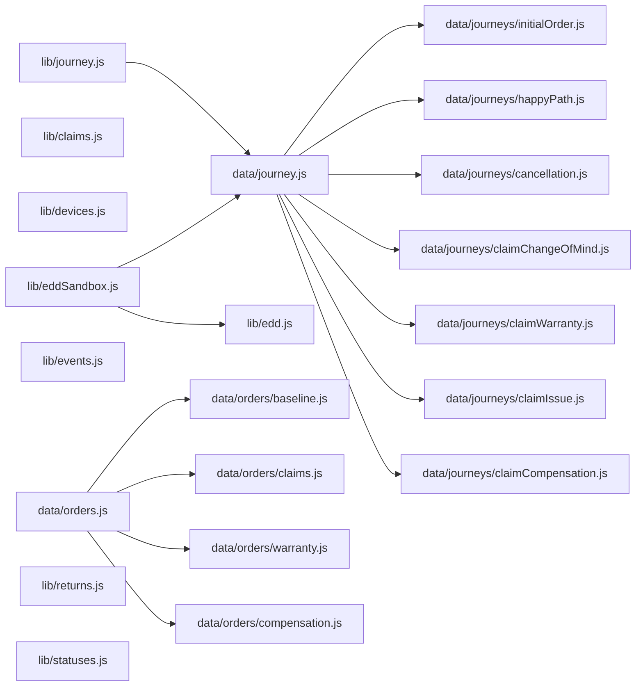

# Code map

> Navigation + impact layer for agents. **Read this before exploring.** It exists to replace fan-out search: locate a concept here, then do one targeted read at the listed file/line instead of grepping the tree. The generated block (below the marker) is rebuilt by `node scripts/codemap.mjs` — never hand-edit it. The curated sections above the marker carry the "why" and the couplings a dependency graph can't see.

## How agents should use this doc

1. **Finding code** → use _Where is X_ + the generated _Module index_. The index lists every export with its line number. Jump straight there; do **not** spawn an Explore agent for a symbol that is already listed.
2. **Planning a change** → read _Coupling the import graph can't see_ first, then the generated _Shared-core consumers_ table. Together they are the blast radius: imports + string contracts. Hand both to the planning agent.
3. **Reading cost** → the _LOC_ column flags expensive whole-file reads (the largest is now `resetGuideMocks.jsx` ~1.7k of CSS-art). `data/journey.js`, `data/orders.js`, and `ResetGuideSheet.jsx` are thin barrels/shells — open the specific sub-module (`data/journeys/*`, `data/orders/*`, `resetGuideMocks`/`resetGuideAnim`) or read a slice around the listed line, not the whole file.
4. **The "why"** → this doc deliberately does not explain rationale. Each row links to the per-feature doc in `docs/output/`; follow it only when you need the reasoning, not the location.

## Where is X — concept → module

| You want… | Module(s) | Why-doc |
|---|---|---|
| Order status / banner copy + tone / timeline / `pickActiveOrderId` | `lib/statuses.js` | `output/orders.md` |
| Claim pipeline states / tone / SLAs / sub-status copy / action-gate copy | `lib/claims.js` | `output/returns/claim_tracking.md` |
| Cancel claim — window / clean-revert vs ship-back / confirm sheet | `lib/claims.js` (`canCancelClaim`·159, `cancelNeedsShipBack`·170, `cancelReturnGate`·182), `components/CancelClaimSheet.jsx`, `components/InvalidClaimCard.jsx` (`reason: 'cancelled'`), `App.jsx` (`cancelledClaims` / `shipBackCancels`) | `output/returns/claim_tracking.md` §2.8 |
| Returns eligibility / refund math / fee rate / window / `generateClaimRef` | `lib/returns.js` | `output/returns/change_of_mind.md`, `issue.md` |
| Returns-flow steps, soft validation, step-skips | `components/ClaimFlow/` + `flowReducer.js` (`stepError`·199) | `output/returns/*.md`, `warranties_compensations.md` |
| Guided-reset copy / steps / device frames | `components/ClaimFlow/ResetGuideSheet.jsx` + `lib/devices.js` | CLAUDE.md (devices bullet) |
| History-thread events | `lib/events.js` (`getHistoryEvents`·119) | `output/orders.md` §6 |
| EDD / SLA model | `lib/edd.js`; sandbox: `lib/eddSandbox.js` + `data/journey.js` | `output/journey_backend_spec.md` |
| Journey replay mode | `lib/journey.js` + `data/journey.js` + `JourneyDevPanel.jsx` | `output/journey_backend_spec.md` |
| Card routing (which card renders) | `App.jsx` (routing block ≈ L285–375) | `output/orders.md` §2 |
| Cancellation sheet / keep-order undo | `CancelOrderSheet.jsx`, `KeepOrderSheet.jsx` | `output/cancellations.md` |
| Mock orders / field shapes | `data/orders.js` | `output/orders.md` §7 |
| Product line-item (thumbnail · name · variant · Revibe Care callout · price breakdown), shared across all cards | `components/ProductSummary.jsx` (exports `REVIBE_CARE_ICON`) | `output/orders.md` §3.0 |

## Coupling the import graph can't see

These are **string contracts**: a value written as a literal in data/flow code, switched on elsewhere. No `import` edge connects them, so the generated tables below miss them — but renaming or adding a value breaks every consumer here. Verified counts are from `data/orders.js`.

| Contract value | Written in | Switched on in | Add/rename a value → also touch |
|---|---|---|---|
| `statusId` (`created`/`quality_check`/`shipped`/`delivered`) | `data/orders.js`, `data/journey.js` | `lib/statuses.js` (`STATUSES`, `statusDescription`), `App.jsx` routing, `StatusTimeline` | `STATUSES` + `STATUS_DESCRIPTIONS` in `statuses.js` |
| `subStatusId` (shipping legs) | `data/orders.js` | `lib/statuses.js` (`SHIPPING_SUB_STATUSES`), `ShippingSubTimeline` | `SHIPPING_SUB_STATUSES` in `statuses.js` |
| `state` (`open`/`close`/`cancelled`) | `data/orders.js` | `lib/statuses.js` (`ORDER_STATES`), header chips | `ORDER_STATES` in `statuses.js` |
| `claim.claimStatusId` (`initiated`→…→`refund_credited` / warranty tail) | `data/orders.js`, `ClaimFlow` seed (always `initiated`) | `lib/claims.js` (`CLAIM_STATUSES` / `COMPENSATION_` / `WARRANTY_`), `hasActiveClaim`, `isClaimRefunded`, `isWarrantyDelivered` | the right status list in `claims.js` + the `hasActive`/`isRefunded` predicates |
| `claim.type` (`change_of_mind`/`issue`/`warranty`/`compensation`) | `ClaimFlow`, `data/orders.js` | `App.jsx` routing, `claimStatusesFor`, `flowReducer` step-skips (`visibleStepCount`) | routing in `App.jsx` + step-skip logic in `flowReducer.js` |
| Takeover flags `claim.docsRejection` / `pickupFailure` / `resetFailed` / `invalidClaim` | `data/orders.js` (hand-seeded only) | `App.jsx` routing **precedence** → takeover cards | the routing precedence list in `App.jsx` (order matters) |
| `claim.invalidClaim.reason` (`invalid` default / `cancelled`) | `data/journeys/claim*.js`, `lib/claims.js` (`cancelReturnGate`), `App.jsx` (`shipBackCancels` projection) | `components/InvalidClaimCard.jsx` (copy + `Decline`-vs-`Keep claim`) | the `reason` branches in `InvalidClaimCard.jsx` |
| `category_name` (`iPhone`/`Macbook`/`Samsung phone`/`Tablet`/`Laptop`) | `data/orders.js` product | `lib/devices.js` → `ResetGuideSheet` variant | mapping in `devices.js` + a guide variant in `ResetGuideSheet.jsx` |
| `claim.transitSubTimeline.picked_up`, `claim.shipBack.awb` | `data/orders.js` | gate the `See detailed tracking` dropdown in `ClaimCard` / `WarrantyClaimCard` | the gating check in the relevant card |

**Projection invariant:** `App.jsx` projects the in-session `submittedClaims` map over `ORDERS` (≈L204), so a freshly-submitted claim always lands on `initiated`. Every post-`initiated` state and all four takeover surfaces are reachable **only** via hand-seeded mocks in `data/orders.js` — see each `docs/output/*.md` "Mocked vs production" list.

## Cross-cutting diagrams

The connective control flow — spans more than one file, so it can't be read off a single module. Read the relevant one before planning a change that crosses flows. All three live in [`output/diagrams.md`](output/diagrams.md):

- [**Card routing**](output/diagrams.md#card-routing) — the two-stage `isOpen` partition + precedence ladder in `App.jsx`. Read before touching routing precedence or adding a card variant / takeover flag.
- [**Claim lifecycle**](output/diagrams.md#claim-lifecycle) — all four pipelines (refund / compensation / warranty) + the four takeover detours on one canvas, with the card per state. Read before changing a claim pipeline or adding a state.
- [**Returns data-flow**](output/diagrams.md#returns-data-flow) — `ClaimFlow.onSubmitClaim` → `submittedClaims` → projection over `ORDERS` → card routing. Read before changing how a submitted claim reaches a card. This is the runtime projection no import edge shows.

<!-- codemap:generated:start -->

### Module index

_Concept → file → symbol → line. Read the file + jump to the line; do not fan-out search for a symbol that is listed here. `In` = how many src files import this module._

| Module | LOC | In | Exports (line) |
|---|--:|--:|---|
| `App.jsx` | 666 | 1 | `App`·85 |
| `components/BnplDisclaimerTooltip.jsx` | 86 | 6 | `bnplProviderLabel`·9, `isBnpl`·13, `BnplDisclaimerTooltip`·17 |
| `components/CancelClaimSheet.jsx` | 155 | 1 | `CancelClaimSheet`·15 |
| `components/CancelOrderSheet.jsx` | 711 | 2 | `CancelOrderSheet`·19 |
| `components/CancellationSubTimeline.jsx` | 94 | 1 | `CancellationSubTimeline`·11 |
| `components/ChatFab.jsx` | 14 | 1 | `ChatFab`·3 |
| `components/ClaimActionBanner.jsx` | 46 | 1 | `ClaimActionBanner`·8 |
| `components/ClaimCard.jsx` | 504 | 1 | `ClaimCard`·41 |
| `components/ClaimDetailsSheet.jsx` | 230 | 2 | `ClaimDetailsSheet`·16 |
| `components/ClaimFlow/ClaimFlow.jsx` | 369 | 1 | `ClaimFlow`·25 |
| `components/ClaimFlow/InlineError.jsx` | 16 | 7 | `InlineError`·6 |
| `components/ClaimFlow/ProgressBar.jsx` | 28 | 1 | `ProgressBar`·3 |
| `components/ClaimFlow/ResetGuideSheet.jsx` | 888 | 1 | `ResetGuideSheet`·471 |
| `components/ClaimFlow/Step1ClaimType.jsx` | 225 | 1 | `Step1ClaimType`·33 |
| `components/ClaimFlow/Step2Compensation.jsx` | 229 | 1 | `Step2Compensation`·22 |
| `components/ClaimFlow/Step2IssueDetails.jsx` | 612 | 1 | `Step2IssueDetails`·44 |
| `components/ClaimFlow/Step2Reason.jsx` | 78 | 1 | `Step2Reason`·12 |
| `components/ClaimFlow/Step3DevicePrep.jsx` | 478 | 1 | `Step3DevicePrep`·35 |
| `components/ClaimFlow/Step4Packing.jsx` | 253 | 2 | `PACKING_OPTIONS`·15, `PACKING_LABELS`·36, `Step4Packing`·40 |
| `components/ClaimFlow/Step4PickupDetails.jsx` | 433 | 1 | `Step4PickupDetails`·53 |
| `components/ClaimFlow/Step5RefundMethod.jsx` | 269 | 1 | `Step5RefundMethod`·9 |
| `components/ClaimFlow/Step6Review.jsx` | 599 | 1 | `Step6Review`·35 |
| `components/ClaimFlow/Step7Confirmation.jsx` | 210 | 1 | `Step7Confirmation`·15 |
| `components/ClaimFlow/StepHeading.jsx` | 16 | 9 | `StepHeading`·1 |
| `components/ClaimFlow/StickyActionBar.jsx` | 38 | 1 | `StickyActionBar`·1 |
| `components/ClaimFlow/compensationSubtypes.js` | 30 | 3 | `COMPENSATION_SUBTYPES`·6, `COMPENSATION_SUBTYPE_LABELS`·23, `findCompensationSubtype`·27 |
| `components/ClaimFlow/flowReducer.js` | 305 | 2 | `TOTAL_STEPS`·4, `visibleStepCount`·11, `visibleStepIndex`·20, `initialState`·28, `flowReducer`·95, `stepError`·199, `canAdvance`·245 |
| `components/ClaimFlow/issueSubtypes.js` | 165 | 2 | `PROOF_GUIDE_LABEL`·9, `DEFAULT_PROOF_GUIDE_URL`·12, `ISSUE_SCOPES`·19, `NOT_WORKING_SUBTYPES`·32, `WRONG_DEVICE_SUBTYPES`·129, `findSubtype`·152, `scopeForSubtype`·160 |
| `components/ClaimFlow/resetGuideAnim.js` | 10 | 2 | `STEP_ANIM_CSS`·3, `stepAnim`·8 |
| `components/ClaimFlow/resetGuideMocks.jsx` | 1670 | 1 | _(none)_ |
| `components/DocsRejectedCard.jsx` | 501 | 1 | `DocsRejectedCard`·33 |
| `components/EddSandboxPanel.jsx` | 154 | 1 | `EddSandboxPanel`·9 |
| `components/GreetRow.jsx` | 39 | 1 | `GreetRow`·3 |
| `components/Header.jsx` | 50 | 1 | `Header`·6 |
| `components/HeroCard.jsx` | 298 | 1 | `HeroCard`·29 |
| `components/HistoryThread.jsx` | 218 | 3 | `HistoryThread`·86 |
| `components/InProgressCard.jsx` | 291 | 1 | `InProgressCard`·29 |
| `components/InvalidClaimCard.jsx` | 878 | 1 | `InvalidClaimCard`·39 |
| `components/JourneyDevPanel.jsx` | 162 | 1 | `JourneyDevPanel`·12 |
| `components/KeepOrderSheet.jsx` | 122 | 1 | `KeepOrderSheet`·9 |
| `components/OrderCard.jsx` | 449 | 1 | `OrderCard`·36 |
| `components/OrderFilters.jsx` | 151 | 1 | `STATUS_CHIPS`·4, `DATE_RANGES`·11, `OrderFilters`·21 |
| `components/PastOrderCard.jsx` | 409 | 1 | `PastOrderCard`·29 |
| `components/PickupFailedCard.jsx` | 429 | 1 | `PickupFailedCard`·20 |
| `components/ProductSummary.jsx` | 136 | 13 | `REVIBE_CARE_ICON`·1, `ProductSummary`·12 |
| `components/RefundDetailsSheet.jsx` | 165 | 1 | `RefundDetailsSheet`·7 |
| `components/ResetFailedCard.jsx` | 476 | 1 | `ResetFailedCard`·24 |
| `components/ShippingSubTimeline.jsx` | 73 | 1 | `ShippingSubTimeline`·9 |
| `components/StatusTimeline.jsx` | 62 | 1 | `StatusTimeline`·6 |
| `components/UndoSnackbar.jsx` | 44 | 1 | `UndoSnackbar`·8 |
| `components/WalletInfoTooltip.jsx` | 71 | 4 | `REVIBE_WALLET_ICON`·4, `WalletInfoTooltip`·7 |
| `components/WarrantyClaimCard.jsx` | 659 | 1 | `WarrantyClaimCard`·50 |
| `data/journey.js` | 89 | 3 | `INITIAL_ORDER`·28, `JOURNEYS`·30 |
| `data/journeys/cancellation.js` | 626 | 1 | `CANCELLATION_NODES`·25 |
| `data/journeys/claimChangeOfMind.js` | 751 | 1 | `CLAIM_COM_NODES`·19 |
| `data/journeys/claimCompensation.js` | 349 | 1 | `CLAIM_COMPENSATION_NODES`·29 |
| `data/journeys/claimIssue.js` | 850 | 1 | `CLAIM_ISSUE_NODES`·27 |
| `data/journeys/claimWarranty.js` | 839 | 1 | `CLAIM_WARRANTY_NODES`·22 |
| `data/journeys/happyPath.js` | 101 | 1 | `HAPPY_PATH_NODES`·5 |
| `data/journeys/initialOrder.js` | 37 | 1 | `INITIAL_ORDER`·2 |
| `data/orders.js` | 20 | 3 | `ORDERS`·14 |
| `data/orders/baseline.js` | 435 | 1 | `BASELINE_ORDERS`·3 |
| `data/orders/claims.js` | 661 | 1 | `CLAIM_ORDERS`·4 |
| `data/orders/compensation.js` | 184 | 1 | `COMPENSATION_ORDERS`·3 |
| `data/orders/warranty.js` | 174 | 1 | `WARRANTY_ORDERS`·3 |
| `lib/claims.js` | 560 | 10 | `CLAIM_STATUSES`·18, `COMPENSATION_CLAIM_STATUSES`·64, `claimStatusesFor`·98, `claimToneFor`·108, `claimProgressIndex`·114, `CLAIM_TRANSIT_SUB_STATUSES`·123, `transitSubProgressIndex`·130, `hasActiveClaim`·137, `isClaimRefunded`·145, `canCancelClaim`·159, `cancelNeedsShipBack`·170, `cancelReturnGate`·182, `isWarrantyDelivered`·202, `claimPhaseTag`·212, `claimStatusHeadline`·229, `claimStatusSubline`·234, `WARRANTY_CLAIM_STATUSES`·252, `warrantyClaimToneFor`·300, `warrantyClaimProgressIndex`·308, `warrantyClaimPhaseTag`·312, `warrantyClaimStatusHeadline`·331, `warrantyClaimStatusSubline`·336, `REASON_LABELS`·350, `reasonText`·358, `devicePrepText`·366, `CLAIM_TYPE_LABELS`·373, `claimTypeLabel`·380, `refundMethodLabel`·386, `CLAIM_SLAS`·405, `expectedCompletionFor`·428, `SUB_STATUS_LABELS`·453, `actionGateCopy`·514 |
| `lib/devices.js` | 65 | 2 | `osForCategory`·26, `deviceOsForOrder`·33, `deviceTypeForCategory`·39, `deviceTypeForOrder`·51, `isOsAmbiguous`·62 |
| `lib/edd.js` | 245 | 1 | `MARKETS`·24, `STAGE_ORDER_CREATED`·60, `STAGE_QC`·61, `STAGE_SHIPPED`·62, `SLA_ON_TIME`·64, `SLA_LATE`·65, `MSG_ORDER_LATE`·72, `MSG_QC_BACK_ON_TRACK`·74, `MSG_QC_LATE`·76, `MSG_SHIPPED_LATE`·78, `workdayIntl`·100, `currentStage`·117, `calculateEdd`·125, `buildCustomerMessage`·161, `orderStatus`·185 |
| `lib/eddSandbox.js` | 231 | 1 | `useEddSandbox`·187 |
| `lib/events.js` | 152 | 3 | `getHistoryEvents`·119 |
| `lib/journey.js` | 91 | 1 | `useJourney`·17 |
| `lib/returns.js` | 267 | 5 | `RETURN_WINDOW_DAYS`·4, `RESTOCKING_FEE_RATE`·5, `ISSUE_WALLET_BONUS`·9, `addDays`·36, `startOfDay`·40, `eligibilityFor`·46, `groupOrdersByEligibility`·71, `refundBreakdown`·89, `formatMoney`·135, `formatLongDate`·140, `formatShortDate`·149, `generateClaimRef`·158, `BATTERY_BASELINE_BY_GRADE`·166, `conditionGradeOf`·175, `batteryBaselineFor`·182, `daysSinceDelivery`·193, `assessBattery`·210 |
| `lib/statuses.js` | 338 | 10 | `STATUSES`·4, `CANCELLATION_STATUSES`·31, `SHIPPING_SUB_STATUSES`·55, `ORDER_STATES`·80, `progressIndex`·94, `subProgressIndex`·99, `cancellationProgressIndex`·104, `cancellationStepsFor`·115, `statusDescription`·125, `pickActiveOrderId`·253, `statusHeadline`·266, `statusSubline`·285, `statusIconFor`·314 |
| `main.jsx` | 11 | 0 | _(none)_ |

### Shared-core consumers (blast radius)

_Editing a `lib/` or `data/` module touches every file listed. Hand these importers to a planning agent before changing a signature or a data shape._

| Source-of-truth module | Consumers |
|---|---|
| `lib/claims.js` | `App.jsx`, `components/CancelClaimSheet.jsx`, `components/ClaimActionBanner.jsx`, `components/ClaimCard.jsx`, `components/ClaimDetailsSheet.jsx`, `components/ClaimFlow/ClaimFlow.jsx`, `components/ClaimFlow/Step4PickupDetails.jsx`, `components/ClaimFlow/Step6Review.jsx`, `components/ClaimFlow/Step7Confirmation.jsx`, `components/WarrantyClaimCard.jsx` |
| `lib/statuses.js` | `App.jsx`, `components/CancellationSubTimeline.jsx`, `components/HeroCard.jsx`, `components/InProgressCard.jsx`, `components/InvalidClaimCard.jsx`, `components/OrderCard.jsx`, `components/PastOrderCard.jsx`, `components/ShippingSubTimeline.jsx`, `components/StatusTimeline.jsx`, `components/WarrantyClaimCard.jsx` |
| `lib/returns.js` | `components/ClaimFlow/ClaimFlow.jsx`, `components/ClaimFlow/Step2IssueDetails.jsx`, `components/ClaimFlow/Step5RefundMethod.jsx`, `components/ClaimFlow/Step6Review.jsx`, `components/ClaimFlow/Step7Confirmation.jsx` |
| `data/journey.js` | `App.jsx`, `lib/eddSandbox.js`, `lib/journey.js` |
| `data/orders.js` | `App.jsx`, `components/ClaimFlow/ClaimFlow.jsx`, `components/ClaimFlow/flowReducer.js` |
| `lib/events.js` | `components/ClaimCard.jsx`, `components/PastOrderCard.jsx`, `components/WarrantyClaimCard.jsx` |
| `lib/devices.js` | `components/ClaimFlow/Step3DevicePrep.jsx`, `components/ClaimFlow/flowReducer.js` |
| `data/journeys/cancellation.js` | `data/journey.js` |
| `data/journeys/claimChangeOfMind.js` | `data/journey.js` |
| `data/journeys/claimCompensation.js` | `data/journey.js` |
| `data/journeys/claimIssue.js` | `data/journey.js` |
| `data/journeys/claimWarranty.js` | `data/journey.js` |
| `data/journeys/happyPath.js` | `data/journey.js` |
| `data/journeys/initialOrder.js` | `data/journey.js` |
| `data/orders/baseline.js` | `data/orders.js` |
| `data/orders/claims.js` | `data/orders.js` |
| `data/orders/compensation.js` | `data/orders.js` |
| `data/orders/warranty.js` | `data/orders.js` |
| `lib/edd.js` | `lib/eddSandbox.js` |
| `lib/eddSandbox.js` | `App.jsx` |
| `lib/journey.js` | `App.jsx` |

### Source-of-truth spine

_Internal edges among `lib/` + `data/` only. Component→lib edges live in the consumers table above (too many to draw)._

_Generated by `scripts/codemap.mjs` — 74 modules, 22340 LOC. Re-run after structural changes; do not hand-edit between the markers._

<!-- codemap:generated:end -->
