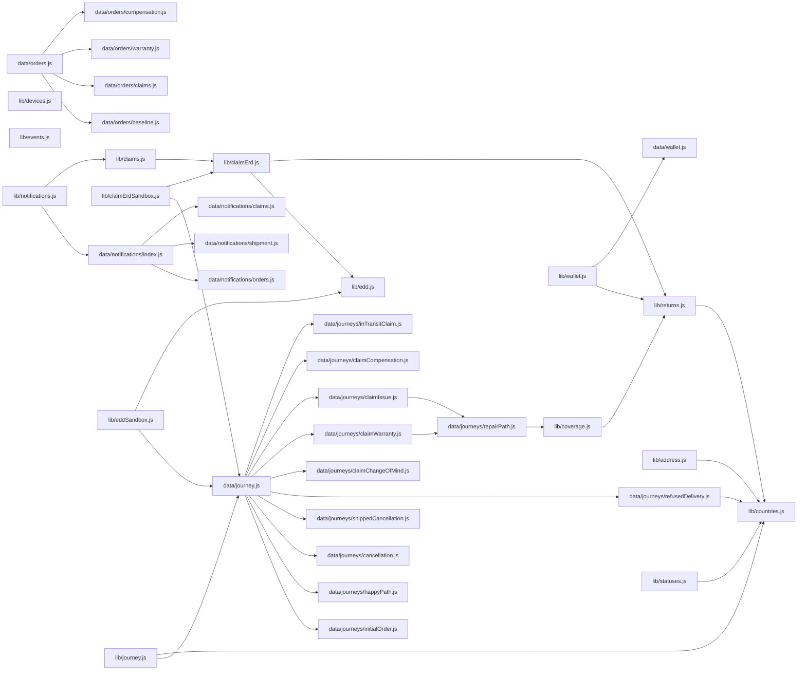

# Code map

> Navigation + impact layer for agents. **Read this before exploring.** It exists to replace fan-out search: locate a concept here, then do one targeted read at the listed file/line instead of grepping the tree. The generated block (below the marker) is rebuilt by `node scripts/codemap.mjs` — never hand-edit it. The curated sections above the marker carry the "why" and the couplings a dependency graph can't see.

## How agents should use this doc

1. **Finding code** → use _Where is X_ + the generated _Module index_. The index lists every export with its line number. Jump straight there; do **not** spawn an Explore agent for a symbol that is already listed.
2. **Planning a change** → read _Coupling the import graph can't see_ first, then the generated _Shared-core consumers_ table. Together they are the blast radius: imports + string contracts. Hand both to the planning agent.
3. **Reading cost** → the _LOC_ column flags expensive whole-file reads (the largest is now `resetGuideMocks.jsx` ~1.7k of CSS-art). `data/journey.js`, `data/orders.js`, and `ResetGuideSheet.jsx` are thin barrels/shells — open the specific sub-module (`data/journeys/*`, `data/orders/*`, `resetGuideMocks`/`resetGuideAnim`) or read a slice around the listed line, not the whole file.
4. **The "why"** → this doc deliberately does not explain rationale. Each row links to the per-feature doc in `docs/output/`; follow it only when you need the reasoning, not the location.

## Where is X — concept → module

| You want… | Module(s) | Why-doc |
|---|---|---|
| Order status / banner copy + tone / timeline / `pickActiveOrderId` | `lib/statuses.js` | `output/orders.md` |
| Claim pipeline states / tone / SLAs / sub-status copy / action-gate copy | `lib/claims.js` | `output/returns/claim_tracking.md` |
| Cancel claim — window / clean-revert vs ship-back / confirm sheet | `lib/claims.js` (`canCancelClaim`·159, `cancelNeedsShipBack`·170, `cancelReturnGate`·182), `components/CancelClaimSheet.jsx`, `components/InvalidClaimCard.jsx` (`reason: 'cancelled'`), `App.jsx` (`cancelledClaims` / `shipBackCancels`) | `output/returns/claim_tracking.md` §2.8 |
| Returns eligibility / refund math / fee rate / window / `generateClaimRef` | `lib/returns.js` | `output/returns/change_of_mind.md`, `issue.md` |
| Warranty coverage — which warranty applies (standard 12mo vs Revibe Care 24mo + accidental damage), the AED 1,500 cap, the remedy-menu filter, coverage copy | `lib/coverage.js` (`coverageFor`, `remedyOptionsFor`, `coverageStripFor`, `coverageSummary`, `coverageArmLabel`, `hasExtendedWarranty`) | `output/warranties_compensations.md` §4 |
| Over-cap repair quote — QC prices an accidental-damage repair above the Care cap; the claim **pauses at `qc`** behind `claim.repairQuote` until the customer pays the excess or declines | `components/RepairQuoteCard.jsx` (the sixth takeover), `lib/coverage.js` (`repairQuoteSplit`·211 — the only split arithmetic), `lib/claims.js` (`repairQuotePending`·330, `repairDeclined`·338, `warrantyStepsFor`·468, `actionGateCopy` `repair_over_cap`), `data/journeys/repairPath.js` (`claim_repair_quote_over_cap` / `_excess_paid` / `_declined`), `App.jsx` (`handlePayRepairExcess` / `handleDeclineRepair`) | `output/warranties_compensations.md` §5 |
| One-time accidental-damage acknowledgement — the third Review ack, gating submit on the accidental arm and frozen onto the claim | `lib/coverage.js` (`coverageSummary().ack`), `ClaimFlow/Step6Review.jsx` (`AckCheckboxRow` in "What you'll get back"), `ClaimFlow/flowReducer.js` (`accidentalAckConfirmed` + `SET_ACCIDENTAL_ACK`), `ClaimFlow/ClaimFlow.jsx` (`handlePrimary` gate + `buildClaim` freeze), `ClaimDetailsSheet.jsx` ("Covered by" sub-line) | `output/warranties_compensations.md` §4.3 |
| The prototype's clock — why journey replays don't use the wall clock for window/coverage math | `lib/returns.js` (`journeyAsOfDate`·66, `orderAsOf`·77), stamped onto the replay order in `App.jsx` beside the country injection | `output/journey_backend_spec.md` |
| Shared repair path — the submit nodes + repair/ship-back tail both `claim_issue` and `claim_warranty` spread in | `data/journeys/repairPath.js` (`REPAIR_SUBMIT_NODES`, `REPAIR_TAIL_NODES`) | `output/journey_backend_spec.md` |
| Returns-flow steps, soft validation, situation→remedy→claimType derivation | `components/ClaimFlow/` + `flowReducer.js` (`sequenceFor`·57, `claimTypeFor`·65, `progressFor`·109, `stepError`·329) | `output/returns/*.md`, `warranties_compensations.md` |
| Returns decision phase — situation-first Screen 1 (4 situations) → per-branch screens → derived remedy/claimType; the issue taxonomy (6 categories ≤5 issues + wrong-item details) | `Step1Situation.jsx` (situations), `Step2Reason.jsx` (CoM reasons + tripwires), `StepIssueCategory.jsx`/`StepIssueSpecific.jsx` (device_fault), `StepWrongItem.jsx` (wrong_item), `StepRemedy.jsx` (refund/repair/replacement), `StepEvidence.jsx` (proof + description), `issueTaxonomy.js` (`ISSUE_CATEGORIES`/`WRONG_ITEM_DETAILS`/`findSpecificIssue`), `SwitchFlowSheet.jsx` (tripwire safety net) | `output/returns/change_of_mind.md`, `issue.md` |
| Guided-reset mapping / copy / steps / device frames | `lib/devices.js` + `components/ClaimFlow/ResetGuideSheet.jsx` + `Step3DevicePrep.jsx` | `output/returns/guided_reset.md` |
| History-thread events | `lib/events.js` (`getHistoryEvents`·119) | `output/orders.md` §6 |
| EDD / SLA model | `lib/edd.js`; sandbox: `lib/eddSandbox.js` + `data/journey.js` | `output/journey_backend_spec.md` |
| Claim resolution date (ERD) — the computed *window* (earliest/latest) shown on a claim card, its per-market working-day levers, stage precedence, overdue roll, and every suppression rule | `lib/claimErd.js` (`claimErd`, `claimErdFor` — the one call the cards make, `claimErdStage`, `formatClaimErd`, `claimErdExplanation`, `CLAIM_MARKETS`), reuses `workdayIntl` from `lib/edd.js`; surface `components/ClaimErdStrip.jsx` in `ClaimCard`/`WarrantyClaimCard` heroes; sandbox `lib/claimErdSandbox.js` + `components/ClaimErdPanel.jsx` | `output/returns/claim_tracking.md` §11 |
| Journey replay mode | `lib/journey.js` + `data/journey.js` + `JourneyDevPanel.jsx` | `output/journey_backend_spec.md` |
| Card routing (which card renders) | `App.jsx` (routing block ≈ L285–375) | `output/orders.md` §2 |
| Cancellation sheet / keep-order undo | `CancelOrderSheet.jsx`, `KeepOrderSheet.jsx` | `output/cancellations.md` |
| Refused-delivery **auto-cancellation** (parcel turned away at the door → we cancel + refund, no sheet) | `data/journeys/refusedDelivery.js` (`REFUSED_DELIVERY_NODES`·40 — `delivery_refused` stamps the cancellation, `refused_cancel_accepted` = SA ops sign-off), `lib/countries.js` (`refusalReview` flag), `lib/statuses.js` (`cancellationStepsFor`·124 two-vs-three-step fork, `cancellationProgressIndex`·109, refusal `statusDescription` branches + `cancellation_*_refused` copy), `components/PastOrderCard.jsx` (`canKeep` excludes refusals, SA caveat row) | `output/cancellations.md` §2.7, `output/country_split.md` §4d |
| Stuck-in-transit self-cancellation (cancel a `shipped` order) | `lib/returns.js` (`SHIPPED_CANCEL_WINDOW_DAYS`·18, `canCancelShipped`·66), `lib/countries.js` (`shippedCancellation` flag), `components/HeroCard.jsx` (live `Cancel order` + hosts the sheet), `components/CancelOrderSheet.jsx` (`DISSUADE_STATUSES` incl. `shipped` + 48h recall-review copy, all `isShipped`-gated), `data/journeys/shippedCancellation.js`, `App.jsx` (`cancel_shipped_*` candidates) | `output/cancellations.md` §2.6 |
| Cancellation review outcomes (accepted / declined / reversed) | `data/journeys/shippedCancellation.js` (`cancel_shipped_accepted_*`, shared `cancel_shipped_declined`, `cancellation_kept`) + `data/journeys/cancellation.js` (at-QC equivalents), `lib/statuses.js` (`statusExplanation` stage-specific `cancellation_{phase}_{statusId}` key), `lib/events.js` (`buildCancellationEvent` rejected/reverted), `components/HistoryThread.jsx` (`chipLabel`), `components/PastOrderCard.jsx` (`canKeep` = `requested` only) | `output/cancellations.md` §2.6/§4/§5 |
| Mock orders / field shapes | `data/orders.js` | `output/orders.md` §7 |
| Product line-item (thumbnail · name · variant · Revibe Care callout · price breakdown), shared across all cards | `components/ProductSummary.jsx` (exports `REVIBE_CARE_ICON`; `afterRow` slots extra content under the row) | `output/orders.md` §3.0 |
| NSYS third-party condition-report link ("Verified by NSYS") — delivered card + returned-device surfaces | shared `components/ConditionReportChip.jsx` (extracted out of `PastOrderCard`), rendered via `ProductSummary`'s `afterRow` by `PastOrderCard` (`order.conditionReport`), `WarrantyClaimCard` `device_returned` (`claim.shipBack.conditionReport` → `order.conditionReport`), `InvalidClaimCard` delivered (`claim.invalidClaim.returnShipment.conditionReport` → `order.conditionReport`); report shape `{ url, reportId }`; icon `public/nsys-icon.svg` | `output/orders.md` §3.3, §7.5; `output/returns/claim_tracking.md` §3.3; `output/warranties_compensations.md` §2.3.2 |
| Airway-bill (AWB) row in a scheduled-pickup strip — shared `View airway bill · AWB {n}` CTA (opens the AWB PDF) or plain text fallback | shared `components/AwbLink.jsx` (`AwbLink{awb,awbUrl}`), used by `ClaimCard` + `WarrantyClaimCard` pickup strips; PDF served from `public/awb-document.pdf` (gitignored) via `scheduledPickup.awbUrl` | `output/returns/claim_tracking.md` §3.5; `output/warranties_compensations.md` §2.3.2 |
| `See detailed tracking` dropdown — single shared surface for **every** claim courier leg (ClaimCard inbound, WarrantyClaimCard inbound, WarrantyClaimCard ship-back, InvalidClaimCard paid return) | `components/ReturnShipmentTracking.jsx` (exports `TrackingDropdown{steps,currentIndex,stamps}` + the `ReturnShipmentTracking{ship}` return-leg adapter; milestone rows via `Timeline` dense; expanded panel ends in a Track package / Get Help action row) | `output/warranties_compensations.md` §2.3.3, `output/returns/claim_tracking.md` §3.3 |
| **Any** step/milestone timeline (the single component — order status collapsed/hero/in-progress/past, claim/warranty/return progress, shipping + cancellation sub-timelines, transit dropdowns) | `components/Timeline.jsx` (props `{ orientation, tone, steps, currentIndex, stamps, dense, onDark, complete, frozen, toneForStep }`); status lists in `lib/statuses.js` + `lib/claims.js` | `docs/handoff/timeline/design.md`, `output/returns/claim_tracking.md`, `output/orders.md` |
| Per-country capability flags / country-specific card + journey differences | `lib/countries.js` (`COUNTRIES`, `countryConfig`); selector `components/CountryPicker.jsx`; journey-flow forks via per-edge `next` country tags in `lib/journey.js` (`validNext`) | `output/country_split.md` |
| Revibe Wallet — balance/ledger derivation, switchable-credit + Move-to-card deduction math, seed history; the `GreetRow` pill + `WalletSheet` | `lib/wallet.js` (`walletLedger`, `walletBalance`, `latestSwitchableCredit`, `cardEquivalentFor`) + `data/wallet.js` (`WALLET_SEED_TRANSACTIONS`); `components/WalletSheet.jsx`; pill in `components/GreetRow.jsx`; state in `App.jsx` (`walletTransfers`) | `output/wallet.md` |
| Split-payment refunds (card + gift card) — the proportional split display, shared by every refund surface | `lib/returns.js` (`isSplitPaid`, `refundDestinations`) + `components/RefundSplitRows.jsx` (the two-destination-row component); gift-card portion credited in `lib/wallet.js`; rendered by `CancelOrderSheet`/`Step5RefundMethod`/`Step6Review`/`Step7Confirmation`/`RefundDetailsSheet`/`ClaimDetailsSheet`/`ClaimCard`/`PastOrderCard` | `output/orders.md` §7.1, `output/wallet.md`, `output/cancellations.md` |

## Coupling the import graph can't see

These are **string contracts**: a value written as a literal in data/flow code, switched on elsewhere. No `import` edge connects them, so the generated tables below miss them — but renaming or adding a value breaks every consumer here. Verified counts are from `data/orders.js`.

| Contract value | Written in | Switched on in | Add/rename a value → also touch |
|---|---|---|---|
| `statusId` (`created`/`quality_check`/`shipped`/`delivered`) | `data/orders.js`, `data/journey.js` | `lib/statuses.js` (`STATUSES`, `statusDescription`), `App.jsx` routing, `Timeline` (via the cards) | `STATUSES` + `STATUS_DESCRIPTIONS` in `statuses.js` |
| `subStatusId` (shipping legs) | `data/orders.js` | `lib/statuses.js` (`SHIPPING_SUB_STATUSES`), `Timeline` (via `OrderCard`/`HeroCard`/`ReturnShipmentTracking`) | `SHIPPING_SUB_STATUSES` in `statuses.js` |
| `state` (`open`/`close`/`cancelled`) | `data/orders.js` | `lib/statuses.js` (`ORDER_STATES`), header chips | `ORDER_STATES` in `statuses.js` |
| `claim.claimStatusId` (`initiated`→…→`refund_credited` / warranty tail) | `data/orders.js`, `ClaimFlow` seed (always `initiated`) | `lib/claims.js` (`CLAIM_STATUSES` / `COMPENSATION_` / `WARRANTY_`), `hasActiveClaim`, `isClaimRefunded`, `isWarrantyDelivered` | the right status list in `claims.js` + the `hasActive`/`isRefunded` predicates |
| `claim.type` (`change_of_mind`/`issue`/`warranty`/`compensation`) | `ClaimFlow` (derived from `situation`+`remedy` via `claimTypeFor`), `data/orders.js` | `App.jsx` routing, `claimStatusesFor`, `flowReducer` step tails (`sequenceFor`) | routing in `App.jsx` + `claimTypeFor`/`sequenceFor` in `flowReducer.js` |
| `state.situation` (`changed_mind`/`device_fault`/`wrong_item`/`keep_compensation`) + `state.remedy` (`refund`/`repair`/`replacement`) | flow state only (Step1Situation / StepRemedy) | `flowReducer.js` (`DECISION_STEPS`, `tailSteps`, `claimTypeFor`); tripwire sentinels `WRONG_ITEM_FAULT_TRIP`/`CATEGORY_COM_TRIP`/`trip_*` → `SwitchFlowSheet` via `ClaimFlow.pendingSwitch` | `claimTypeFor`/`DECISION_STEPS` in `flowReducer.js` + the `pendingSwitch` map in `ClaimFlow.jsx` |
| Takeover flags `claim.docsRejection` / `awbFailure` / `pickupFailure` / `resetFailed` / `invalidClaim` / `repairQuote` | `data/orders.js` (hand-seeded), `data/journeys/claim*.js` (`awbFailure` replay), `data/journeys/repairPath.js` (`repairQuote`) | `App.jsx` routing **precedence** → takeover cards (`docsRejection → awbFailure → pickupFailure → resetFailed → invalidClaim → repairQuote`) | the routing precedence list in `App.jsx` (order matters) |
| `claim.repairQuote` (`{ total, cap, covered, excess, overCap, summary, quotedAt, deadline, deadlineLabel, paidAt, declinedAt }`) — the **only** takeover flag that is a *pause*: the claim keeps `claimStatusId: 'qc'` throughout | `data/orders/warranty.js` (89615), `data/journeys/repairPath.js` (`claim_repair_quote_over_cap`, numbers from `repairQuoteSplit`) | `lib/claims.js` (`repairQuotePending` — live only while `!paidAt && !declinedAt`; `repairDeclined` → `warrantyStepsFor` / tone / phase tag / headline / explanation), `App.jsx` routing, `RepairQuoteCard.jsx` | `repairQuotePending`/`repairDeclined` in `claims.js`; the split must stay `repairQuoteSplit`'s (`lib/coverage.js`) or card, mock and journey drift |
| `claim.actionRequired.kind` gained `'repair_over_cap'` | `data/journeys/repairPath.js`, `data/orders/warranty.js` (89615) | `lib/claims.js` (`actionGateCopy`) → `ClaimActionBanner` | the `actionGateCopy` switch in `claims.js` |
| `claim.accidentalAck` (`true`) — the one-use acknowledgement **frozen at submit**, absent on every other arm and on pre-existing mocks | `ClaimFlow.jsx` (`buildClaim`, accidental branch), `data/orders/warranty.js` (89615) | `ClaimDetailsSheet.jsx` ("Covered by" sub-line) | any surface restating the terms agreed at submit; readers must tolerate `undefined` |
| `claim.invalidClaim.reason` (`invalid` default / `cancelled`) | `data/journeys/claim*.js`, `lib/claims.js` (`cancelReturnGate`), `App.jsx` (`shipBackCancels` projection) | `components/InvalidClaimCard.jsx` (copy + `Decline`-vs-`Keep claim`) | the `reason` branches in `InvalidClaimCard.jsx` |
| `category_name` (`iPhone`/`Macbook`/`Samsung phone`/`Tablet`/`Laptop`) | `data/orders.js` product | `lib/devices.js` → `ResetGuideSheet` variant | mapping in `devices.js` + a guide variant in `ResetGuideSheet.jsx` |
| `claim.transitSubTimeline.picked_up`, `claim.shipBack.awb` | `data/orders.js` | gate the `See detailed tracking` dropdown in `ClaimCard` / `WarrantyClaimCard` | the gating check in the relevant card |
| `claim.scheduledPickup.awb` (airway-bill number) | `data/orders/claims.js`, `data/orders/warranty.js`, `data/journeys/claim*.js` (`claim_awb_generated` — now incl. `claimWarranty.js`) | gates the Initiated scheduled-pickup strip on **both** `ClaimCard` and `WarrantyClaimCard` (present → strip w/ `AwbLink` row; absent → `ArrangingPickupStrip` placeholder) | the `showScheduledPickup` / `showArrangingPickup` checks in `ClaimCard.jsx` **and** `WarrantyClaimCard.jsx` |
| `order.country` (`AE`/`ZA`/`SA`/`Others`) | `data/orders/*` (mocks), `App.jsx` (injected onto the replayed order from `?country=`/`CountryPicker`) | `lib/countries.js` (`countryConfig`) → `detailedTracking` gate in `HeroCard`/`OrderCard`/`ClaimCard`/`WarrantyClaimCard`/`InvalidClaimCard`, `shippedCancellation` gate via `canCancelShipped` in `HeroCard`, `refusalReview` fork in `cancellationStepsFor`/`statusDescription`; per-edge `next` country tags in `lib/journey.js` (`validNext`, which reads the `country` now stamped onto the replay order by `useJourney` itself) | a flag in `COUNTRIES` + the card guard, or a `{id,countries}` edge in the journey `next` |
| `order.promiseBreached` (boolean — SLA blown past the initial delivery promise) | `data/journeys/cancellation.js` (`order_late`/`qc_late`), `data/journeys/shippedCancellation.js` (`shipped_stuck`) | `CancelOrderSheet.jsx` (fee waived + `LATE_PROMISE_WALLET_BONUS` + apology dissuade variant), `lib/returns.js` (`canCancelShipped` — stands in for the transit-window check) | the `breached` branches in `CancelOrderSheet.jsx` **and** `canCancelShipped` |
| `order.deliveryRefused` (boolean — parcel turned away at the door; the node stamps `state: 'cancelled'` in the same breath) | `data/journeys/refusedDelivery.js` (`delivery_refused`) | `lib/statuses.js` (`cancellationStepsFor` drops the `requested` step outside `refusalReview` markets; `statusDescription` refusal bodies; `statusExplanation` `cancellation_{phase}_refused` keys), `PastOrderCard.jsx` (`canKeep` false — the customer never asked; SA caveat row) | every consumer must pair it with `countryConfig(order).refusalReview`; it is **not** a self-cancel gate any more (`canCancelShipped` no longer reads it) |
| Banner `tone` (`brand`/`warn`/`danger`/`success`) | `lib/statuses.js` (`STATUS_DESCRIPTIONS`, `statusDescription`), journey `statusBanner`s | `HeroCard.jsx` (`ALERT_TONES` → `warn` = amber "Active order" + amber block; `danger` = red "Action needed" pill + red block), `OrderCard` / `InProgressCard` banner styling | the `ALERT_TONES` map in `HeroCard.jsx` when adding a tone — and pick `warn` vs `danger` by whether the customer must act |
| `statusBanner.headline` (optional — overrides the card headline, not just the banner) | **nothing today** (the refusal banner that introduced it is gone — the refusal now cancels straight away) | `lib/statuses.js` (`statusHeadline`, after the cancelled branch) | the mechanism is live but unused; set it only when an event *contradicts* the last courier scan |
| `state.remedy` gained `'accidental'` (the Revibe Care accidental-damage arm) | `StepRemedy.jsx` via `remedyOptionsFor` | `flowReducer.js` (`claimTypeFor` → `'warranty'`, `tailSteps` `noRefund`), `ClaimFlow.jsx` (`buildClaim`) | `claimTypeFor` + `tailSteps` in `flowReducer.js`, and the copy map in `StepRemedy.jsx` |
| `claim.coverage` (`'standard'`/`'extended'`) + `claim.cause` (`'defect'`/`'accidental'`) — the entitlement **frozen at submit**, never re-derived | `ClaimFlow.jsx` (`buildClaim`, warranty branch), `data/journeys/repairPath.js` (`claim_submitted_warranty_accidental`) | `lib/coverage.js` (`coverageSummary`, `coverageArmLabel`) → `WarrantyClaimCard` arm label, `ClaimDetailsSheet` "Covered by" row | the two helpers in `coverage.js`; absent on pre-existing mocks, so every reader must tolerate `undefined` |
| `order.warranty > 0` = the Revibe Care entitlement (**not** `!= null` — some compensation mocks carry `warranty: 0`) | `data/orders/*` (amount paid at checkout) | `lib/coverage.js` (`hasExtendedWarranty`), `ProductSummary` Care tile (still gates on `!= null`) | `hasExtendedWarranty` in `coverage.js` |
| `claim.milestones` (`{ createdAt, docsClearedAt, pickedUpAt, qcAt, expertRevisionAt, decidedAt, asOf? }`, ISO `YYYY-MM-DD`) — the machine clock the resolution window runs on, parallel to the display-string `claim.timeline`. `docsClearedAt` is the clock start (stamped **at submit** — proof review is folded into the SLA, not gated); `asOf` is an optional per-mock "today" so a stale fixture doesn't read as months overdue; sandbox-only `assumeToday` flips `claimErdFor` to the `always` what-if | `ClaimFlow.jsx` (`buildClaim`), `data/orders/{claims,warranty,compensation}.js` (all 20 claim mocks), `data/journeys/{claimChangeOfMind,claimIssue,claimWarranty,claimCompensation,repairPath}.js` (33 nodes) | `lib/claimErd.js` (`claimErdStage` precedence, `claimMilestones` — which un-clears `docsClearedAt` on a live `docsRejection`, `claimErdFor`) → `ClaimErdStrip` | the stage ladder + `boundsFor` in `claimErd.js`; absent on anything predating the field, so **every reader must tolerate `undefined`**. A new milestone means a stage, an anchor, and a bounds row |
| `order.asOfDate` (ISO) — the replay's own "now", so frozen journey calendars don't drift against the wall clock | `App.jsx` (stamped on the journey order via `journeyAsOfDate`) | `lib/returns.js` (`eligibilityFor`), `lib/coverage.js` (`coverageFor`) | any new date-sensitive helper — default its `today` to `orderAsOf(order)`, not `new Date()` |
| Journey edge guard `{ id, when: (order) => bool }` — forks the graph on claim state, beside the existing `countries` tag | `data/journeys/claimIssue.js` (`claim_qc_started`: refund vs repair tail) | `lib/journey.js` (`validNext`) | `validNext`'s filter; both guards must keep ANDing |
| `order.paymentSplit` (`{ card, giftCard }`) — split-paid marker | `data/orders/*`, `data/journey.js` (cancellation + change_of_mind `initialOrder`) | `lib/returns.js` (`isSplitPaid`/`refundDestinations`), `lib/wallet.js` (gift-portion credit), every refund surface via `RefundSplitRows` | the `refundDestinations` math + each surface's split gate (rendered only on the original-payment path) |

**Projection invariant:** `App.jsx` projects the in-session `submittedClaims` map over `ORDERS` (≈L204), so a freshly-submitted claim always lands on `initiated`. Every post-`initiated` state and all six takeover surfaces are reachable **only** via hand-seeded mocks in `data/orders.js` (or the journey-mode replay) — see each `docs/output/*.md` "Mocked vs production" list.

## Cross-cutting diagrams

The connective control flow — spans more than one file, so it can't be read off a single module. Read the relevant one before planning a change that crosses flows. All three live in [`output/diagrams.md`](output/diagrams.md):

- [**Card routing**](output/diagrams.md#card-routing) — the two-stage `isOpen` partition + precedence ladder in `App.jsx`. Read before touching routing precedence or adding a card variant / takeover flag.
- [**Claim lifecycle**](output/diagrams.md#claim-lifecycle) — all four pipelines (refund / compensation / warranty) + the six takeover detours on one canvas, with the card per state. Read before changing a claim pipeline or adding a state.
- [**Returns data-flow**](output/diagrams.md#returns-data-flow) — `ClaimFlow.onSubmitClaim` → `submittedClaims` → projection over `ORDERS` → card routing. Read before changing how a submitted claim reaches a card. This is the runtime projection no import edge shows.

<!-- codemap:generated:start -->

### Module index

_Concept → file → symbol → line. Read the file + jump to the line; do not fan-out search for a symbol that is listed here. `In` = how many src files import this module._

| Module | LOC | In | Exports (line) |
|---|--:|--:|---|
| `App.jsx` | 1021 | 1 | `App`·91 |
| `components/AddressForm.jsx` | 89 | 2 | `AddressForm`·11 |
| `components/AwbFailedCard.jsx` | 318 | 1 | `AwbFailedCard`·28 |
| `components/AwbLink.jsx` | 40 | 2 | `AwbLink`·11 |
| `components/BnplDisclaimerTooltip.jsx` | 86 | 7 | `bnplProviderLabel`·9, `isBnpl`·13, `BnplDisclaimerTooltip`·17 |
| `components/CancelClaimSheet.jsx` | 155 | 1 | `CancelClaimSheet`·15 |
| `components/CancelOrderSheet.jsx` | 781 | 3 | `CancelOrderSheet`·28 |
| `components/ChatFab.jsx` | 14 | 1 | `ChatFab`·3 |
| `components/ClaimActionBanner.jsx` | 46 | 1 | `ClaimActionBanner`·8 |
| `components/ClaimCard.jsx` | 403 | 1 | `ClaimCard`·53 |
| `components/ClaimDetailsSheet.jsx` | 269 | 2 | `ClaimDetailsSheet`·21 |
| `components/ClaimErdPanel.jsx` | 251 | 1 | `ClaimErdPanel`·11 |
| `components/ClaimErdStrip.jsx` | 37 | 2 | `ClaimErdStrip`·12 |
| `components/ClaimFlow/BatteryHealthCheck.jsx` | 260 | 1 | `BatteryHealthCheck`·16 |
| `components/ClaimFlow/ClaimFlow.jsx` | 487 | 1 | `ClaimFlow`·26 |
| `components/ClaimFlow/InlineError.jsx` | 16 | 12 | `InlineError`·6 |
| `components/ClaimFlow/IssueEvidence.jsx` | 556 | 1 | `IssueEvidence`·83 |
| `components/ClaimFlow/ProgressBar.jsx` | 38 | 1 | `ProgressBar`·6 |
| `components/ClaimFlow/ResetGuideSheet.jsx` | 803 | 3 | `ResetGuideSheet`·424 |
| `components/ClaimFlow/Step1Situation.jsx` | 91 | 1 | `Step1Situation`·36 |
| `components/ClaimFlow/Step2Compensation.jsx` | 238 | 1 | `Step2Compensation`·23 |
| `components/ClaimFlow/Step2Reason.jsx` | 163 | 2 | `REASONS`·13, `REASON_TRIPWIRES`·24, `REASON_LABELS`·42, `tripwireFor`·49, `Step2Reason`·53 |
| `components/ClaimFlow/Step3DevicePrep.jsx` | 550 | 1 | `Step3DevicePrep`·37 |
| `components/ClaimFlow/Step4Packing.jsx` | 253 | 2 | `PACKING_OPTIONS`·15, `PACKING_LABELS`·36, `Step4Packing`·40 |
| `components/ClaimFlow/Step4PickupDetails.jsx` | 446 | 1 | `Step4PickupDetails`·55 |
| `components/ClaimFlow/Step5RefundMethod.jsx` | 280 | 1 | `Step5RefundMethod`·10 |
| `components/ClaimFlow/Step6Review.jsx` | 712 | 1 | `Step6Review`·33 |
| `components/ClaimFlow/Step7Confirmation.jsx` | 263 | 1 | `Step7Confirmation`·19 |
| `components/ClaimFlow/StepEvidence.jsx` | 81 | 1 | `StepEvidence`·12 |
| `components/ClaimFlow/StepHeading.jsx` | 16 | 12 | `StepHeading`·1 |
| `components/ClaimFlow/StepIssueCategory.jsx` | 92 | 1 | `CATEGORY_COM_TRIP`·9, `StepIssueCategory`·15 |
| `components/ClaimFlow/StepIssueSpecific.jsx` | 148 | 1 | `StepIssueSpecific`·15 |
| `components/ClaimFlow/StepRemedy.jsx` | 216 | 1 | `StepRemedy`·127 |
| `components/ClaimFlow/StepWrongItem.jsx` | 112 | 1 | `WRONG_ITEM_FAULT_TRIP`·10, `StepWrongItem`·14 |
| `components/ClaimFlow/StickyActionBar.jsx` | 38 | 1 | `StickyActionBar`·1 |
| `components/ClaimFlow/SwitchFlowSheet.jsx` | 173 | 1 | `SwitchFlowSheet`·64 |
| `components/ClaimFlow/compensationSubtypes.js` | 39 | 3 | `COMPENSATION_SUBTYPES`·8, `COMPENSATION_SUBTYPE_LABELS`·32, `findCompensationSubtype`·36 |
| `components/ClaimFlow/flowReducer.js` | 427 | 2 | `BRANCH_ENTRY`·30, `sequenceFor`·60, `claimTypeFor`·68, `progressFor`·120, `initialState`·138, `flowReducer`·250, `stepError`·357, `canAdvance`·424 |
| `components/ClaimFlow/issueTaxonomy.js` | 438 | 6 | `PROOF_GUIDE_LABEL`·22, `DEFAULT_PROOF_GUIDE_URL`·25, `ISSUE_CATEGORIES`·116, `WRONG_ITEM_DETAILS`·317, `SOMETHING_ELSE_ID`·346, `categoryById`·361, `findSpecificIssue`·365, `categoryForIssue`·373, `scopeForIssue`·379, `visibleIssuesFor`·391, `labelForIssue`·399, `resolveNeed`·410, `evidenceSubFor`·425 |
| `components/ClaimFlow/resetGuideAnim.js` | 10 | 2 | `STEP_ANIM_CSS`·3, `stepAnim`·8 |
| `components/ClaimFlow/resetGuideMocks.jsx` | 1654 | 1 | _(none)_ |
| `components/ClosedClaimCard.jsx` | 164 | 1 | `ClosedClaimCard`·47 |
| `components/ConditionReportChip.jsx` | 30 | 3 | `ConditionReportChip`·10 |
| `components/CountryPicker.jsx` | 37 | 3 | `CountryPicker`·8 |
| `components/DeliveryAddressPill.jsx` | 44 | 5 | `DeliveryAddressPill`·9 |
| `components/DocsRejectedCard.jsx` | 495 | 1 | `DocsRejectedCard`·35 |
| `components/EddSandboxPanel.jsx` | 221 | 1 | `EddSandboxPanel`·10 |
| `components/EditableContactCard.jsx` | 113 | 3 | `EditableContactCard`·13 |
| `components/GreetRow.jsx` | 41 | 1 | `GreetRow`·3 |
| `components/Header.jsx` | 50 | 1 | `Header`·6 |
| `components/HeroCard.jsx` | 318 | 1 | `HeroCard`·63 |
| `components/HistoryThread.jsx` | 221 | 3 | `HistoryThread`·89 |
| `components/InProgressCard.jsx` | 222 | 1 | `InProgressCard`·30 |
| `components/InvalidClaimCard.jsx` | 705 | 1 | `InvalidClaimCard`·44 |
| `components/JourneyDevPanel.jsx` | 257 | 1 | `JourneyDevPanel`·16 |
| `components/JourneyNotificationPanel.jsx` | 205 | 1 | `JourneyNotificationPanel`·29 |
| `components/KeepOrderSheet.jsx` | 122 | 1 | `KeepOrderSheet`·9 |
| `components/NpsSurvey.jsx` | 63 | 1 | `NpsSurvey`·8 |
| `components/OrderCard.jsx` | 430 | 1 | `OrderCard`·38 |
| `components/OrderClaimLink.jsx` | 248 | 10 | `OrderClaimLink`·182 |
| `components/OrderFilters.jsx` | 75 | 1 | `STATUS_CHIPS`·3, `OrderFilters`·13 |
| `components/PastOrderCard.jsx` | 456 | 3 | `PastOrderCard`·38, `DestinationChip`·404 |
| `components/PickupFailedCard.jsx` | 335 | 1 | `PickupFailedCard`·23 |
| `components/ProductSummary.jsx` | 154 | 20 | `REVIBE_CARE_ICON`·1, `ProductSummary`·20 |
| `components/RefundDetailsSheet.jsx` | 177 | 2 | `RefundDetailsSheet`·9 |
| `components/RefundSplitRows.jsx` | 121 | 8 | `RefundSplitRows`·22 |
| `components/RepairQuoteCard.jsx` | 253 | 1 | `RepairQuoteCard`·32 |
| `components/ResetFailedCard.jsx` | 501 | 1 | `ResetFailedCard`·28 |
| `components/ResetGuidePicker.jsx` | 98 | 1 | `ResetGuidePicker`·30 |
| `components/ReturnShipmentTracking.jsx` | 107 | 3 | `TrackingDropdown`·24, `ReturnShipmentTracking`·70 |
| `components/RevibeCancellationCard.jsx` | 216 | 1 | `RevibeCancellationCard`·43 |
| `components/StatusExplainer.jsx` | 51 | 4 | `StatusExplainer`·14 |
| `components/TapToFixCta.jsx` | 14 | 6 | `TapToFixCta`·3 |
| `components/Timeline.jsx` | 264 | 8 | `Timeline`·108 |
| `components/UndoSnackbar.jsx` | 44 | 1 | `UndoSnackbar`·8 |
| `components/WalletInfoTooltip.jsx` | 71 | 6 | `REVIBE_WALLET_ICON`·4, `WalletInfoTooltip`·7 |
| `components/WalletSheet.jsx` | 300 | 1 | `WalletSheet`·21 |
| `components/WarrantyClaimCard.jsx` | 459 | 1 | `WarrantyClaimCard`·63 |
| `data/journey.js` | 157 | 4 | `INITIAL_ORDER`·34, `JOURNEYS`·48 |
| `data/journeys/cancellation.js` | 778 | 1 | `CANCELLATION_NODES`·25 |
| `data/journeys/claimChangeOfMind.js` | 925 | 1 | `CLAIM_COM_NODES`·19 |
| `data/journeys/claimCompensation.js` | 380 | 1 | `CLAIM_COMPENSATION_NODES`·29 |
| `data/journeys/claimIssue.js` | 1064 | 1 | `CLAIM_ISSUE_NODES`·33 |
| `data/journeys/claimWarranty.js` | 919 | 1 | `CLAIM_WARRANTY_NODES`·28 |
| `data/journeys/happyPath.js` | 128 | 1 | `HAPPY_PATH_NODES`·5 |
| `data/journeys/inTransitClaim.js` | 97 | 1 | `IN_TRANSIT_ENTRY_STAGES`·32, `withInTransitClaim`·44 |
| `data/journeys/initialOrder.js` | 41 | 1 | `INITIAL_ORDER`·2 |
| `data/journeys/refusedDelivery.js` | 275 | 1 | `REFUSED_DELIVERY_NODES`·40 |
| `data/journeys/repairPath.js` | 401 | 2 | `REPAIR_SUBMIT_NODES`·27, `REPAIR_TAIL_NODES`·134 |
| `data/journeys/shippedCancellation.js` | 384 | 1 | `SHIPPED_CANCELLATION_NODES`·51 |
| `data/notifications/claims.js` | 263 | 1 | `CLAIM_NOTIFICATIONS`·26 |
| `data/notifications/index.js` | 16 | 1 | `NOTIFICATIONS`·11 |
| `data/notifications/orders.js` | 122 | 1 | `ORDER_NOTIFICATIONS`·19 |
| `data/notifications/shipment.js` | 40 | 1 | `SHIPMENT_NOTIFICATIONS`·9 |
| `data/orders.js` | 20 | 3 | `ORDERS`·14 |
| `data/orders/baseline.js` | 637 | 1 | `BASELINE_ORDERS`·3 |
| `data/orders/claims.js` | 1168 | 1 | `CLAIM_ORDERS`·4 |
| `data/orders/compensation.js` | 204 | 1 | `COMPENSATION_ORDERS`·3 |
| `data/orders/warranty.js` | 616 | 1 | `WARRANTY_ORDERS`·10 |
| `data/wallet.js` | 94 | 1 | `WALLET_SEED_TRANSACTIONS`·21 |
| `lib/address.js` | 111 | 10 | `ADDRESS_SCHEMAS`·34, `addressSchema`·72, `emptyAddress`·78, `formatAddress`·87, `addressError`·100, `isAddressComplete`·108 |
| `lib/claimErd.js` | 556 | 4 | `CLAIM_MARKETS`·41, `DEFAULT_CLAIM_MARKET`·80, `ERD_PRE_COLLECTION`·85, `ERD_AWAITING_COLLECTION`·86, `ERD_AWAITING_REVIEW`·87, `ERD_IN_TRANSIT`·88, `ERD_QUALITY_CHECK`·89, `ERD_EXPERT_REVISION`·90, `ERD_DECIDED`·91, `ERD_STAGE_LABELS`·93, `toErdDate`·108, `networkdaysIntl`·130, `marketConfig`·144, `claimErdStage`·151, `claimErd`·247, `formatClaimErd`·350, `CLAIM_ERD_EXPLANATIONS`·384, `CLAIM_ERD_OVERDUE`·412, `CLAIM_ERD_ASSUMED`·429, `claimErdExplanation`·438, `claimErdTransit`·501, `claimMilestones`·505, `claimErdFor`·518 |
| `lib/claimErdSandbox.js` | 276 | 1 | `CLAIM_TYPE_OPTIONS`·46, `TOGGLEABLE_MILESTONES`·65, `useClaimErdSandbox`·185 |
| `lib/claims.js` | 846 | 19 | `CLAIM_STATUSES`·20, `COMPENSATION_CLAIM_STATUSES`·66, `claimStatusesFor`·100, `CLAIM_EXPLANATIONS`·110, `COMPENSATION_EXPLANATIONS`·122, `claimExplanation`·134, `claimToneFor`·144, `claimProgressIndex`·150, `RETURN_CLAIM_STATUSES`·160, `returnClaimProgressIndex`·173, `CLAIM_TRANSIT_SUB_STATUSES`·182, `transitSubProgressIndex`·189, `hasActiveClaim`·198, `isClaimRefunded`·207, `isClaimClosed`·218, `CLAIM_CLOSURE_REASONS`·224, `closureCopyFor`·263, `canCancelClaim`·278, `cancelNeedsShipBack`·289, `cancelReturnGate`·301, `repairQuotePending`·331, `repairDeclined`·339, `isWarrantyDelivered`·345, `isReturnDelivered`·358, `claimPhaseTag`·364, `claimStatusHeadline`·381, `claimStatusSubline`·386, `WARRANTY_CLAIM_STATUSES`·404, `warrantyClaimToneFor`·454, `warrantyStepsFor`·469, `warrantyClaimProgressIndex`·476, `warrantyClaimPhaseTag`·482, `warrantyClaimStatusHeadline`·511, `warrantyClaimStatusSubline`·520, `WARRANTY_EXPLANATIONS`·529, `warrantyClaimExplanation`·552, `REASON_LABELS`·570, `reasonText`·582, `devicePrepText`·590, `CLAIM_TYPE_LABELS`·598, `claimTypeLabel`·605, `CLAIM_REF_PREFIXES`·617, `formatClaimRef`·625, `claimRequiresProof`·638, `refundMethodLabel`·644, `CLAIM_SLAS`·663, `expectedCompletionFor`·693, `SUB_STATUS_LABELS`·723, `actionGateCopy`·784 |
| `lib/countries.js` | 46 | 13 | `DEFAULT_COUNTRY`·29, `COUNTRIES`·31, `COUNTRY_CODES`·38, `countryConfig`·42 |
| `lib/coverage.js` | 255 | 8 | `STANDARD_WARRANTY_MONTHS`·33, `EXTENDED_WARRANTY_MONTHS`·34, `ACCIDENTAL_DAMAGE_CAPS`·41, `ACCIDENTAL_DAMAGE_CAP`·47, `accidentalDamageCap`·49, `hasExtendedWarranty`·55, `careAccidentalUsed`·63, `coverageFor`·101, `remedyOptionsFor`·158, `coverageSummary`·177, `repairQuoteSplit`·211, `coverageArmLabel`·228, `coverageStripFor`·244 |
| `lib/devices.js` | 65 | 5 | `osForCategory`·26, `deviceOsForOrder`·33, `deviceTypeForCategory`·39, `deviceTypeForOrder`·51, `isOsAmbiguous`·62 |
| `lib/edd.js` | 245 | 2 | `MARKETS`·24, `STAGE_ORDER_CREATED`·60, `STAGE_QC`·61, `STAGE_SHIPPED`·62, `SLA_ON_TIME`·64, `SLA_LATE`·65, `MSG_ORDER_LATE`·72, `MSG_QC_BACK_ON_TRACK`·74, `MSG_QC_LATE`·76, `MSG_SHIPPED_LATE`·78, `workdayIntl`·100, `currentStage`·117, `calculateEdd`·125, `buildCustomerMessage`·161, `orderStatus`·185 |
| `lib/eddSandbox.js` | 259 | 1 | `useEddSandbox`·191 |
| `lib/events.js` | 152 | 3 | `getHistoryEvents`·119 |
| `lib/journey.js` | 123 | 1 | `useJourney`·25 |
| `lib/notifications.js` | 93 | 2 | `NOTIFICATIONS`·14, `NOTIFICATION_STATUSES`·26, `notificationStatus`·39, `notificationFor`·53, `journeyNotificationCoverage`·83 |
| `lib/returns.js` | 362 | 20 | `RETURN_WINDOW_DAYS`·5, `RESTOCKING_FEE_RATE`·6, `CANCELLATION_FEE_RATE`·11, `ISSUE_WALLET_BONUS`·15, `SHIPPED_CANCEL_WINDOW_DAYS`·18, `parsePlacedAtDate`·24, `addDays`·47, `journeyAsOfDate`·66, `orderAsOf`·77, `startOfDay`·83, `canCancelShipped`·105, `eligibilityFor`·114, `groupOrdersByEligibility`·139, `refundBreakdown`·157, `isSplitPaid`·207, `refundDestinations`·218, `formatMoney`·227, `formatLongDate`·232, `formatShortDate`·241, `generateClaimRef`·253, `BATTERY_BASELINE_BY_GRADE`·261, `conditionGradeOf`·270, `batteryBaselineFor`·277, `daysSinceDelivery`·288, `assessBattery`·305 |
| `lib/statuses.js` | 451 | 6 | `STATUSES`·4, `CANCELLATION_STATUSES`·32, `SHIPPING_SUB_STATUSES`·56, `ORDER_STATES`·81, `progressIndex`·95, `subProgressIndex`·100, `cancellationProgressIndex`·109, `cancellationStepsFor`·124, `statusDescription`·137, `STATUS_EXPLANATIONS`·294, `statusExplanation`·325, `pickActiveOrderId`·359, `statusHeadline`·378, `statusSubline`·398, `statusIconFor`·427 |
| `lib/wallet.js` | 303 | 2 | `walletLedger`·92, `walletBalance`·214, `walletCurrency`·222, `latestSwitchableCredit`·231, `cardEquivalentFor`·244 |
| `main.jsx` | 11 | 0 | _(none)_ |

### Shared-core consumers (blast radius)

_Editing a `lib/` or `data/` module touches every file listed. Hand these importers to a planning agent before changing a signature or a data shape._

| Source-of-truth module | Consumers |
|---|---|
| `lib/returns.js` | `App.jsx`, `components/CancelOrderSheet.jsx`, `components/ClaimCard.jsx`, `components/ClaimDetailsSheet.jsx`, `components/ClaimFlow/BatteryHealthCheck.jsx`, `components/ClaimFlow/ClaimFlow.jsx`, `components/ClaimFlow/IssueEvidence.jsx`, `components/ClaimFlow/Step5RefundMethod.jsx`, `components/ClaimFlow/Step6Review.jsx`, `components/ClaimFlow/Step7Confirmation.jsx`, `components/ClaimFlow/StepRemedy.jsx`, `components/HeroCard.jsx`, `components/PastOrderCard.jsx`, `components/RefundDetailsSheet.jsx`, `components/RefundSplitRows.jsx`, `components/RepairQuoteCard.jsx`, `components/WalletSheet.jsx`, `lib/claimErd.js`, `lib/coverage.js`, `lib/wallet.js` |
| `lib/claims.js` | `App.jsx`, `components/AwbFailedCard.jsx`, `components/CancelClaimSheet.jsx`, `components/ClaimActionBanner.jsx`, `components/ClaimCard.jsx`, `components/ClaimDetailsSheet.jsx`, `components/ClaimFlow/ClaimFlow.jsx`, `components/ClaimFlow/Step4PickupDetails.jsx`, `components/ClaimFlow/Step6Review.jsx`, `components/ClaimFlow/Step7Confirmation.jsx`, `components/ClosedClaimCard.jsx`, `components/DocsRejectedCard.jsx`, `components/InvalidClaimCard.jsx`, `components/OrderClaimLink.jsx`, `components/PickupFailedCard.jsx`, `components/RepairQuoteCard.jsx`, `components/ResetFailedCard.jsx`, `components/WarrantyClaimCard.jsx`, `lib/notifications.js` |
| `lib/countries.js` | `App.jsx`, `components/ClaimCard.jsx`, `components/ClaimFlow/flowReducer.js`, `components/CountryPicker.jsx`, `components/HeroCard.jsx`, `components/InvalidClaimCard.jsx`, `components/OrderCard.jsx`, `components/WarrantyClaimCard.jsx`, `data/journeys/refusedDelivery.js`, `lib/address.js`, `lib/journey.js`, `lib/returns.js`, `lib/statuses.js` |
| `lib/address.js` | `components/AddressForm.jsx`, `components/AwbFailedCard.jsx`, `components/ClaimCard.jsx`, `components/ClaimDetailsSheet.jsx`, `components/ClaimFlow/Step4PickupDetails.jsx`, `components/ClaimFlow/Step6Review.jsx`, `components/ClaimFlow/flowReducer.js`, `components/EditableContactCard.jsx`, `components/PickupFailedCard.jsx`, `components/WarrantyClaimCard.jsx` |
| `lib/coverage.js` | `components/ClaimDetailsSheet.jsx`, `components/ClaimFlow/ClaimFlow.jsx`, `components/ClaimFlow/Step6Review.jsx`, `components/ClaimFlow/Step7Confirmation.jsx`, `components/ClaimFlow/StepRemedy.jsx`, `components/PastOrderCard.jsx`, `components/WarrantyClaimCard.jsx`, `data/journeys/repairPath.js` |
| `lib/statuses.js` | `App.jsx`, `components/HeroCard.jsx`, `components/InProgressCard.jsx`, `components/OrderCard.jsx`, `components/PastOrderCard.jsx`, `components/ReturnShipmentTracking.jsx` |
| `lib/devices.js` | `components/ClaimFlow/Step3DevicePrep.jsx`, `components/ClaimFlow/flowReducer.js`, `components/ClaimFlow/issueTaxonomy.js`, `components/ResetFailedCard.jsx`, `components/ResetGuidePicker.jsx` |
| `data/journey.js` | `App.jsx`, `lib/claimErdSandbox.js`, `lib/eddSandbox.js`, `lib/journey.js` |
| `lib/claimErd.js` | `components/ClaimCard.jsx`, `components/WarrantyClaimCard.jsx`, `lib/claimErdSandbox.js`, `lib/claims.js` |
| `data/orders.js` | `App.jsx`, `components/ClaimFlow/ClaimFlow.jsx`, `components/ClaimFlow/flowReducer.js` |
| `lib/events.js` | `components/ClaimCard.jsx`, `components/PastOrderCard.jsx`, `components/WarrantyClaimCard.jsx` |
| `data/journeys/repairPath.js` | `data/journeys/claimIssue.js`, `data/journeys/claimWarranty.js` |
| `lib/edd.js` | `lib/claimErd.js`, `lib/eddSandbox.js` |
| `lib/notifications.js` | `components/JourneyDevPanel.jsx`, `components/JourneyNotificationPanel.jsx` |
| `lib/wallet.js` | `App.jsx`, `components/WalletSheet.jsx` |
| `data/journeys/cancellation.js` | `data/journey.js` |
| `data/journeys/claimChangeOfMind.js` | `data/journey.js` |
| `data/journeys/claimCompensation.js` | `data/journey.js` |
| `data/journeys/claimIssue.js` | `data/journey.js` |
| `data/journeys/claimWarranty.js` | `data/journey.js` |
| `data/journeys/happyPath.js` | `data/journey.js` |
| `data/journeys/inTransitClaim.js` | `data/journey.js` |
| `data/journeys/initialOrder.js` | `data/journey.js` |
| `data/journeys/refusedDelivery.js` | `data/journey.js` |
| `data/journeys/shippedCancellation.js` | `data/journey.js` |
| `data/notifications/claims.js` | `data/notifications/index.js` |
| `data/notifications/index.js` | `lib/notifications.js` |
| `data/notifications/orders.js` | `data/notifications/index.js` |
| `data/notifications/shipment.js` | `data/notifications/index.js` |
| `data/orders/baseline.js` | `data/orders.js` |
| `data/orders/claims.js` | `data/orders.js` |
| `data/orders/compensation.js` | `data/orders.js` |
| `data/orders/warranty.js` | `data/orders.js` |
| `data/wallet.js` | `lib/wallet.js` |
| `lib/claimErdSandbox.js` | `App.jsx` |
| `lib/eddSandbox.js` | `App.jsx` |
| `lib/journey.js` | `App.jsx` |

### Source-of-truth spine

_Internal edges among `lib/` + `data/` only. Component→lib edges live in the consumers table above (too many to draw)._

```mermaid
graph LR
  data_journey_js["data/journey.js"]
  data_journeys_cancellation_js["data/journeys/cancellation.js"]
  data_journeys_claimChangeOfMind_js["data/journeys/claimChangeOfMind.js"]
  data_journeys_claimCompensation_js["data/journeys/claimCompensation.js"]
  data_journeys_claimIssue_js["data/journeys/claimIssue.js"]
  data_journeys_claimWarranty_js["data/journeys/claimWarranty.js"]
  data_journeys_happyPath_js["data/journeys/happyPath.js"]
  data_journeys_inTransitClaim_js["data/journeys/inTransitClaim.js"]
  data_journeys_initialOrder_js["data/journeys/initialOrder.js"]
  data_journeys_refusedDelivery_js["data/journeys/refusedDelivery.js"]
  data_journeys_repairPath_js["data/journeys/repairPath.js"]
  data_journeys_shippedCancellation_js["data/journeys/shippedCancellation.js"]
  data_notifications_claims_js["data/notifications/claims.js"]
  data_notifications_index_js["data/notifications/index.js"]
  data_notifications_orders_js["data/notifications/orders.js"]
  data_notifications_shipment_js["data/notifications/shipment.js"]
  data_orders_js["data/orders.js"]
  data_orders_baseline_js["data/orders/baseline.js"]
  data_orders_claims_js["data/orders/claims.js"]
  data_orders_compensation_js["data/orders/compensation.js"]
  data_orders_warranty_js["data/orders/warranty.js"]
  data_wallet_js["data/wallet.js"]
  lib_address_js["lib/address.js"]
  lib_claimErd_js["lib/claimErd.js"]
  lib_claimErdSandbox_js["lib/claimErdSandbox.js"]
  lib_claims_js["lib/claims.js"]
  lib_countries_js["lib/countries.js"]
  lib_coverage_js["lib/coverage.js"]
  lib_devices_js["lib/devices.js"]
  lib_edd_js["lib/edd.js"]
  lib_eddSandbox_js["lib/eddSandbox.js"]
  lib_events_js["lib/events.js"]
  lib_journey_js["lib/journey.js"]
  lib_notifications_js["lib/notifications.js"]
  lib_returns_js["lib/returns.js"]
  lib_statuses_js["lib/statuses.js"]
  lib_wallet_js["lib/wallet.js"]
  data_journey_js --> data_journeys_initialOrder_js
  data_journey_js --> data_journeys_happyPath_js
  data_journey_js --> data_journeys_cancellation_js
  data_journey_js --> data_journeys_shippedCancellation_js
  data_journey_js --> data_journeys_refusedDelivery_js
  data_journey_js --> data_journeys_claimChangeOfMind_js
  data_journey_js --> data_journeys_claimWarranty_js
  data_journey_js --> data_journeys_claimIssue_js
  data_journey_js --> data_journeys_claimCompensation_js
  data_journey_js --> data_journeys_inTransitClaim_js
  data_journeys_claimIssue_js --> data_journeys_repairPath_js
  data_journeys_claimWarranty_js --> data_journeys_repairPath_js
  data_journeys_refusedDelivery_js --> lib_countries_js
  data_journeys_repairPath_js --> lib_coverage_js
  data_notifications_index_js --> data_notifications_orders_js
  data_notifications_index_js --> data_notifications_shipment_js
  data_notifications_index_js --> data_notifications_claims_js
  data_orders_js --> data_orders_baseline_js
  data_orders_js --> data_orders_claims_js
  data_orders_js --> data_orders_warranty_js
  data_orders_js --> data_orders_compensation_js
  lib_address_js --> lib_countries_js
  lib_claimErd_js --> lib_edd_js
  lib_claimErd_js --> lib_returns_js
  lib_claimErdSandbox_js --> data_journey_js
  lib_claimErdSandbox_js --> lib_claimErd_js
  lib_claims_js --> lib_claimErd_js
  lib_coverage_js --> lib_returns_js
  lib_eddSandbox_js --> data_journey_js
  lib_eddSandbox_js --> lib_edd_js
  lib_journey_js --> data_journey_js
  lib_journey_js --> lib_countries_js
  lib_notifications_js --> data_notifications_index_js
  lib_notifications_js --> lib_claims_js
  lib_returns_js --> lib_countries_js
  lib_statuses_js --> lib_countries_js
  lib_wallet_js --> lib_returns_js
  lib_wallet_js --> data_wallet_js
```

_Generated by `scripts/codemap.mjs` — 116 modules, 32675 LOC. Re-run after structural changes; do not hand-edit between the markers._

<!-- codemap:generated:end -->
