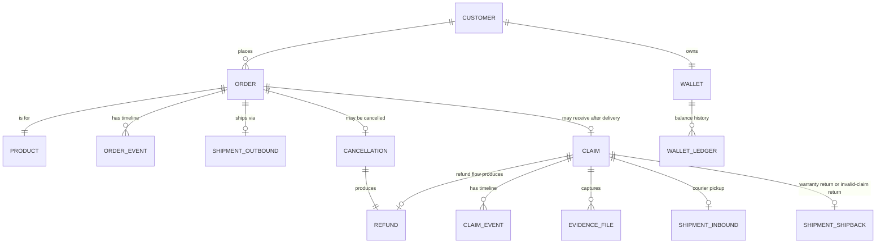
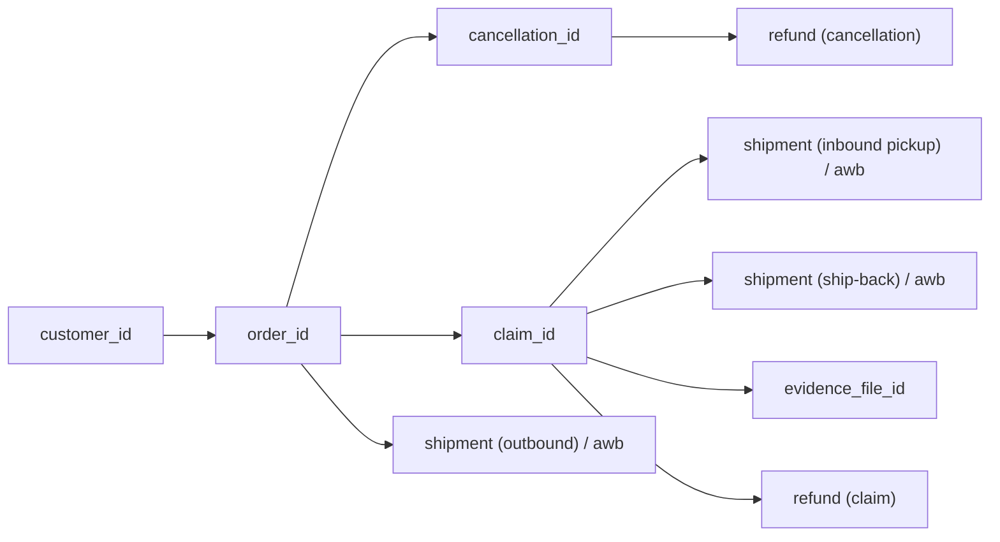
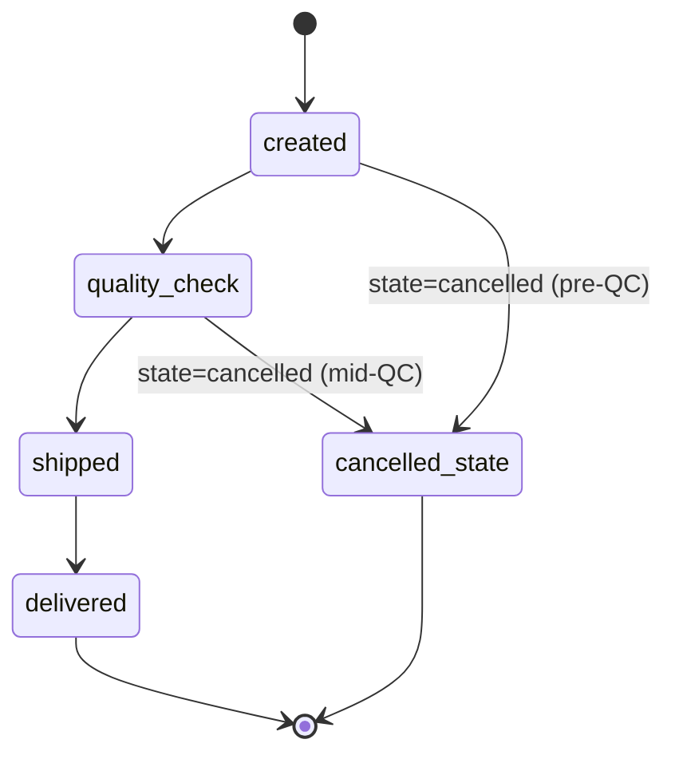
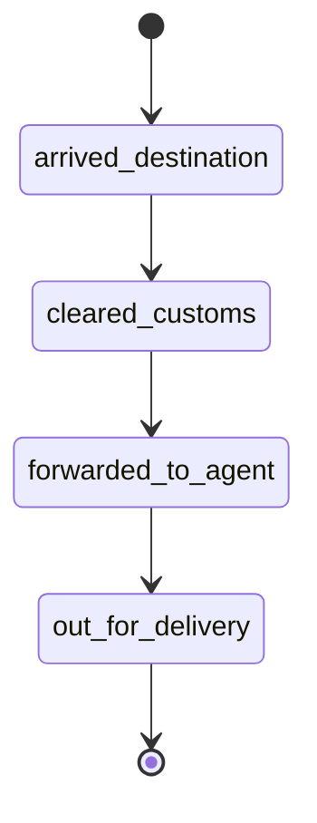
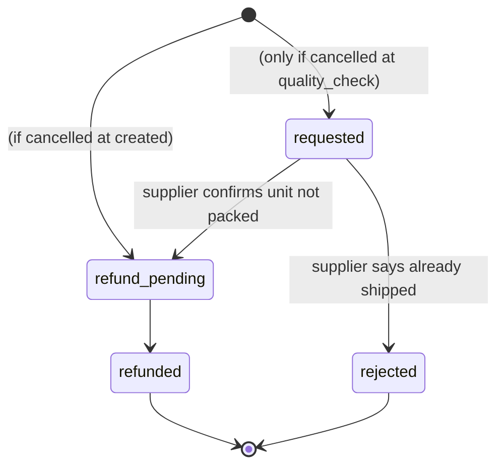
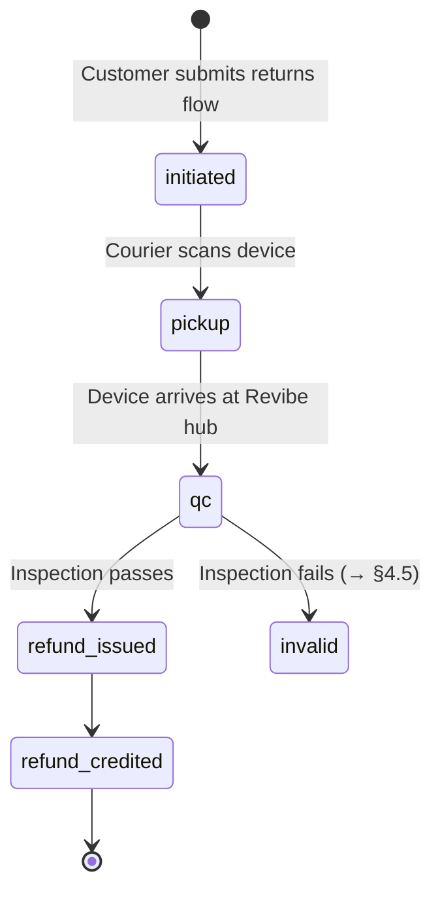
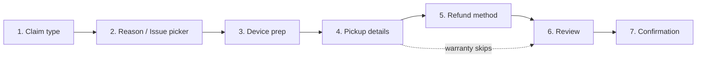
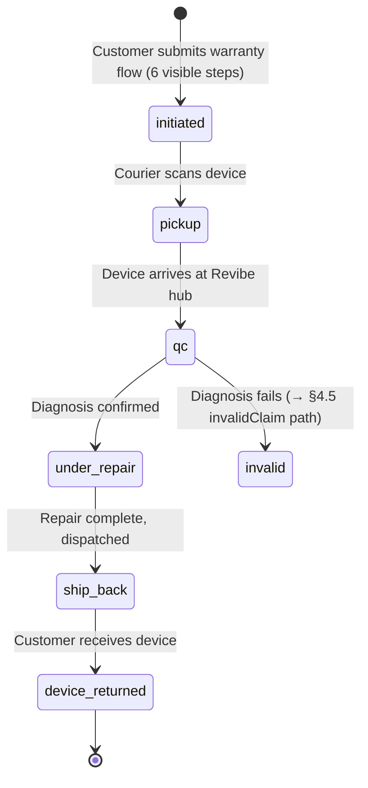

# Revibe My-Account Redesign — Backend Context for a DB Explorer LLM

**Audience.** You are an LLM with read access to Revibe's backend. You have **zero context** on the My-Account redesign. This doc gives you the conceptual model + the load-bearing field names from the front-end prototype so you can map them to real tables.

**What this doc is.** A self-contained brief: glossary → system map → four feature sections (Orders, Cancellations, Returns, Warranties) → cross-cutting requirements → validation checklist. No DB schema is assumed — names like "orders", "claims", "shipments" are entity descriptors, not table names.

**What this doc isn't.** Not exhaustive UI documentation. It names the fields the UI relies on and the state machines they imply. When you need every nested attribute, look it up in the source files referenced at the end of each section.

---

## 0. Glossary

| Term | Meaning |
|---|---|
| **Order** | A customer's purchase of one refurbished device. Progresses through four top-level fulfilment stages. |
| **Top-level status** (`statusId`) | `created` → `quality_check` → `shipped` → `delivered`. Drives the 4-step horizontal timeline. |
| **Sub-status** (`subStatusId`) | Finer-grained step **only while `statusId === 'shipped'`**. Drives the vertical sub-timeline. Inbound courier milestones. |
| **State** (`state`) | Parallel to `statusId`: `open` / `close` / `cancelled`. Controls header chip. An order can be `cancelled` while still at `quality_check` or `shipped`. |
| **Cancellation** | Customer kills an order **before delivery**. Triggers a refund. Three sub-states: `requested` → `refund_pending` → `refunded`. |
| **Claim** | Anything that happens **after delivery**. Three flavours: `change_of_mind`, `issue`, `warranty`. The first two end in a refund; the third ends in a repaired device returning to the customer. |
| **Refund pipeline** | 5-state claim lifecycle for `change_of_mind` + `issue`: `initiated` → `pickup` → `qc` → `refund_issued` → `refund_credited`. |
| **Warranty pipeline** | 6-state claim lifecycle for `warranty`: `initiated` → `pickup` → `qc` → `under_repair` → `ship_back` → `device_returned`. Shares the head, diverges at the tail. |
| **Takeover card** | A claim is "blocked on the customer" — the UI replaces the normal in-progress card with a single-action surface. Three triggers: documents rejected, pickup failed, claim deemed invalid. |
| **Action gate** | Same as takeover but more general: any condition where the claim is paused waiting on a customer action, surfaced as a banner with a deadline. |
| **Wallet** | Revibe store credit. Used as a refund destination and incentivised over original-payment-method refunds. |
| **AWB** | Air Waybill — courier tracking number. Each physical leg (outbound order, inbound return, warranty ship-back, invalid-claim ship-back) carries its own. |
| **SLA** | Expected duration in hours for each step of the claim pipeline. Drives an "expected by" date shown to the customer. |

---

## 1. System map

The front-end recognises **one customer, many orders, and per-order extensions** (cancellation OR claim, never both active at once).

**Entities the backend almost certainly already has** (find them):
- Customer / account
- Order (header) + order lines (Revibe sells one device per order, but warranty add-on `Revibe Care` is on the order as a line/charge)
- Product / device catalogue
- Shipments (outbound + likely a separate inbound for returns)
- Payments + refunds
- Wallet + ledger
- Addresses

**Entities that may not exist as discrete tables yet** (flag if you can't find them):
- Claim (the prototype's `claim` blob — may be a `returns` table, may be split)
- Claim events / claim timeline
- Evidence files (photo/video uploads)
- Pickup / collection requests (separate from outbound shipment?)
- Cancellation timeline (the steps `requested` / `refund_pending` / `refunded` — separate event log, or columns on the order?)
- SLA / pipeline configuration (currently hardcoded in front-end)
- EDD snapshots (initial promise vs current) — may be derived

**Discriminators to expect.** A `claim.type` column or its DB equivalent is load-bearing — `change_of_mind` vs `issue` vs `warranty` determines pipeline, refund math, and which UI card variant renders.

**Identifiers to trace.**

Key question to resolve early: **is there one `refund` table for both cancellation refunds and claim refunds, or two?** Same for `shipment` — is one table covering outbound, inbound-pickup, and ship-back, or multiple?

---

## 2. Orders

### Concept

An order represents one device purchase. It moves through **four top-level stages** (`created` → `quality_check` → `shipped` → `delivered`) regardless of what happens underneath. While `shipped`, a finer-grained **sub-status** tracks the courier journey. **State** (`open`/`close`/`cancelled`) is independent of progression — header chips and tone derive from it, not from the stage.

### Top-level lifecycle

A cancelled order **keeps the `statusId` it had at the moment of cancellation** and gains `state = 'cancelled'`. The header treats `delivered` as terminal-green regardless of state.

### Sub-status (shipping only)

There is **no `delivered` sub-status** — when the package is delivered, the order transitions to top-level `delivered`. Sub-status only applies while `statusId === 'shipped'`.

### Key fields the UI reads

| UI need | Field name in prototype | Notes |
|---|---|---|
| Order identifier (customer-facing) | `id` | Human-readable (5-digit numeric in mocks). |
| Customer contact on order | `customerName`, `email`, `phone`, `address`, `country` | Snapshot at order time. |
| Top-level stage | `statusId` | One of `created` / `quality_check` / `shipped` / `delivered`. |
| Shipping sub-stage | `subStatusId` | Only set while `statusId === 'shipped'`. |
| Header chip | `state` | `open` / `close` / `cancelled`. |
| Delay flag | `delayed` (bool) | Optional. Flips banner tone to warn-amber. |
| Per-stage timestamps | `timeline.created`, `timeline.quality_check`, `timeline.shipped`, `timeline.delivered` | One timestamp per stage entered. |
| Per-sub-stage timestamps | `subTimeline.arrived_destination`, `subTimeline.cleared_customs`, `subTimeline.forwarded_to_agent`, `subTimeline.out_for_delivery` | |
| Order placed (machine) | `placedAt` | DD/MM/YYYY HH:MM AM/PM — canonical machine date. |
| Order placed (human) | `placedAtFull` | E.g. "28 Apr 2026 · 2:15 PM". |
| Delivered date (machine) | `deliveredOn` | ISO `YYYY-MM-DD`. |
| Delivered date (human) | `deliveredOnLong` | E.g. "Friday, 8 May". |
| Ship deadline | `shipDeadline`, `shipDeadlineFull` | Optional. Promise shown pre-ship. |
| Estimated delivery | `estimatedDelivery`, `estimatedDeliveryLong` | Forward-looking ETA. |
| Money | `subtotal`, `warranty`, `total`, `currency`, `unitPrice`, `quantity` | `warranty` is the `Revibe Care` add-on, not a refund/claim concept. |
| Payment method | `paymentMethod.{type,brand,last4}` | Used to label "Original payment method" choices. |
| Carrier | `courier`, `trackingNumber`, `trackingUrl` | Outbound shipment. |
| Product | `product.{name,variant,image}` | |
| Device OS | `deviceOs` | `ios` / `android`. Drives the Step 3 device-prep instructions in the returns flow. |
| Ad-hoc status copy override | `statusMessage` | Optional. Overrides banner body only. |
| Full-banner override | `statusBanner.{tone,lead,body}` | Optional. Used by the EDD sandbox journey. Bypasses status-driven defaults entirely. |

### What the backend must support for Orders

1. **Authoritative `statusId` per order** with timestamps for every stage entered.
2. **Sub-status feed** while shipping, with timestamps. Likely sourced from the courier (DHL Express today).
3. **State separate from status.** A cancelled-while-shipped order must keep its `statusId` and gain a `state` flag.
4. **Delivered date** as a first-class field (the returns window is computed from it — see §4).
5. **EDD model.** The prototype computes EDD client-side from market config (UAE / ZA / SA — working-day, stage SLAs, etc.) — see `src/lib/edd.js`. Backend should either persist `initial_promise` + `delivery_by` snapshots, or expose the inputs the model needs (placement date, current stage, stage entry timestamps, market).
6. **Outbound shipment join** by AWB / tracking number, with carrier name.

### Source files for deeper detail
- `src/lib/statuses.js` — enum definitions, banner copy resolution, header chip mapping.
- `src/data/orders.js` — mock order shape (canonical field reference).
- `docs/output/orders.md` — full UI spec, card-routing tree, auto-expand logic.

---

## 3. Cancellations

### Concept

A cancellation is initiated by the customer **before delivery**. It produces a refund. Three sub-states:

- **Pre-QC cancellations** skip `requested` (nothing is moving yet) and go straight to `refund_pending`.
- **QC-stage cancellations** wait on the supplier to confirm the unit isn't already packed.
- **Rejected cancellations** are a real state: the order continues to delivery, and the rejection chip is surfaced later in history (and inside any subsequent claim card).

### Key fields

| UI need | Field name | Notes |
|---|---|---|
| Cancellation status | `cancellationStatusId` | `requested` / `refund_pending` / `refunded`. |
| Cancellation ref | `cancellationRef` | Short alphanumeric (e.g. `4BTb2x`). |
| Per-step timestamps | `cancellationTimeline.requested`, `.refund_pending`, `.refunded`, `.rejected` | |
| Rejection metadata | `cancellationRejection.{ref,reason}` | Set when supplier rejected the cancellation. Persists on the order even after delivery / claim. |
| Refund subtotal | `refund.subtotal` | Before fees. |
| Refund fee | `refund.fee.{label,rate,amount}` | Optional — only set when there's a restocking-style charge. |
| Refund net | `refund.amount` | What lands. |
| Refund destination | `refund.destination.{kind,label,last4}` | `kind` ∈ `wallet` / `card` / `bank`. |
| Refund line breakdown | `refund.breakdown[].{label,amount}` | Item + Revibe Care. |
| Funds-available copy | `refund.fundsAvailable` | Optional copy shown when terminal. |

### What the backend must support for Cancellations

1. **Cancellation as its own entity** (or status block on order) with timestamps per state including `rejected`.
2. **Cancellation refund** is its own object (or row) — destination, breakdown, fee, net.
3. **Rejection persists** as historical metadata even when the order subsequently delivers and a claim is raised. The UI threads it into the history chips on the resulting claim card.
4. **Whether `rejected` is a `cancellationStatusId` value** or a separate `cancellation_outcome` field — decide and document; UI just needs `cancellationTimeline.rejected` + `cancellationRejection.{ref,reason}` to be queryable.

### Source files
- `src/lib/statuses.js` (`CANCELLATION_STATUSES`, `cancellationStepsFor`)
- `docs/output/cancellations.md`

---

## 4. Returns (refund-bearing claims)

### Concept

A **return** is a post-delivery claim that produces a refund. Two variants share one pipeline:

- **`change_of_mind`** — no fault. Wallet refund is 100%; card refund has a 10% restocking fee.
- **`issue`** — faulty product. No restocking fee. Wallet adds a flat `ISSUE_WALLET_BONUS` (AED 100 today) to incentivise store credit.

Returns are launched from the delivered order via the returns flow (Steps 1–7), which submits a claim row. On submit, the order transitions to a claim-card variant (the UI projects the claim onto the order — the claim does not replace the order).

### Eligibility (front-end rule today)

- Order must be `delivered`.
- Order must not already be returned or refunded.
- Within `RETURN_WINDOW_DAYS = 10` from `deliveredOn`.
- Cancelled orders are ineligible.

### Refund pipeline (5 states)

`hasActiveClaim` is true while `claimStatusId !== 'refund_credited'` (and for warranty, while `!== 'device_returned'`).

### Returns flow (the customer-facing wizard)

7 internal steps, 7 visible for refund flows, 6 visible for warranty (Step 5 skipped — no refund destination needed).

**Step 2** branches on `claimType`:
- `change_of_mind` → reason picker (`no_fit` / `better_option` / `changed_mind` / `mistake` / `other`).
- `issue` and `warranty` → issue picker (category + sub-issue + description + attachment).

**Submit produces a claim** with these fields (the canonical claim shape):

| Field | Notes |
|---|---|
| `claimRef` | Short alphanumeric (`Ib4nP9`). Customer-facing ref. |
| `claimStatusId` | One of the 5 (refund) or 6 (warranty) pipeline states. |
| `type` | `change_of_mind` / `issue` / `warranty`. |
| `submittedAt` | Human-readable timestamp. |
| `units` | Always 1 in mocks (Revibe sells single-unit orders). |
| `reason.{value,otherText}` | Set on change_of_mind. |
| `issueDetails.{category,description,attachmentName}` | Set on issue + warranty. `category` examples: `battery`, `screen`, `charging_port`, `speaker`. |
| `devicePrep.{option,os,resetConfirmed,email,password}` | `option` ∈ `reset` / `credentials`. Credentials only on iCloud-locked-style flows. |
| `pickupDetails.{address,email,phone}` | Pre-seeded from order. |
| `scheduledPickup.{courier,date,slot}` | Revibe assigns after submit. |
| `refundMethod` | `wallet` / `original`. Omitted on warranty. |
| `expectedRefund.{itemTotal,warranty,gross,fee,bonus,net,rate}` | Server-computed at submit. |
| `timeline.{initiated,pickup,qc,refund_issued,refund_credited}` | One timestamp per claim state entered. |
| `transitSubStatusId`, `transitSubTimeline.{picked_up,arrived_origin_hub,in_transit,arrived_revibe_hub}` | Inbound courier milestones for the device's return journey. Optional — only populated once the courier scans the device. |

### Takeover variants (claim is blocked on customer action)

Three optional blocks on the claim. When set, the UI swaps the normal claim card for a takeover card. **Order of precedence** (first one set wins):

1. `claim.docsRejection` — Revibe Quality asked for clearer evidence. Claim pauses at `initiated`. Auto-cancels if ignored.
2. `claim.pickupFailure` — Courier couldn't collect. Customer must confirm a new AWB / slot. Auto-cancels if ignored.
3. `claim.invalidClaim` — Inspection couldn't approve the claim. Customer must pay return shipping to get the device back, otherwise unit stays with Revibe.

Each carries:
- `determinedAt` / `failedAt` — timestamp.
- `autoCancelAt` — hard deadline.
- `timeLeftLabel` — pre-computed countdown string.
- `opsName`, `opsRole`, `opsMessage` — first-person message from a Revibe agent.
- Variant-specific payload:
  - `docsRejection.{reason, requestedEvidence}` (rough shape)
  - `pickupFailure.nextPickup.{awb, slot, courier}`
  - `invalidClaim.returnShipping.{amount, currency}`
  - `invalidClaim.returnShipment.{courier, estimatedDelivery, currentStatusId, timeline.{created,quality_check,shipped,delivered}}` — once customer pays, a fresh outbound-style shipment fires.

### Action gates (banner, not takeover)

Lighter weight than takeover cards. Surface inside the normal claim card via `claim.actionRequired.{kind, deadline, deadlineLabel, failedAt?}`. Kinds: `awaiting_documents`, `collection_failed`, `awaiting_payment`. Maps to the takeover variants for less severe states.

### Sub-statuses inside a claim (not yet a routed state)

`claim.subStatusId` can carry granular labels — `awaiting_documents`, `collection_failed`, `under_revision`, `expert_revision`, `invalid_confirmed`, `awaiting_payment`, `ship_back_pending`, `ship_back_in_transit`, `ship_back_delivered`. Each has copy + tone in `SUB_STATUS_LABELS` (see `src/lib/claims.js`). Backend should be able to set these per claim.

### SLA model

Hardcoded today in `src/lib/claims.js` (`CLAIM_SLAS` map: `expectedHours` + `bufferHours` per state). Decide whether SLA config moves to a backend table or stays in code. The UI computes an `expectedCompletionFor(claimType)` date for the customer.

### What the backend must support for Returns

1. **Claim entity** keyed off `order_id` with a `type` discriminator. One active claim per order at a time.
2. **Per-state timeline log** for the claim (initiated → pickup → qc → refund_issued → refund_credited).
3. **Inbound shipment** (pickup-side AWB) joined to the claim, with its own sub-status feed (`picked_up`, `arrived_origin_hub`, `in_transit`, `arrived_revibe_hub`).
4. **Evidence uploads** — store + retrieve by claim.
5. **Refund record** with destination (wallet / card / bank), gross, fee, bonus, net, rate.
6. **Wallet credit posting** when `refundMethod === 'wallet'` — ledger entry against the customer's wallet.
7. **Customer-action gates** — three flavours (`docsRejection`, `pickupFailure`, `invalidClaim`) with `autoCancelAt` deadlines and ops-authored messages.
8. **Reversal flow** for invalid claims: when the customer pays the return-shipping fee, a fresh outbound shipment must be created and tracked under `invalidClaim.returnShipment` (its own outbound timeline).
9. **SLA / expected-completion** values reachable from the backend (either persisted or queryable from config).

### Source files
- `src/lib/returns.js` — eligibility, refund math, fee rates, window.
- `src/lib/claims.js` — pipeline definitions, sub-status labels, action-gate copy, SLA placeholders.
- `src/components/ClaimFlow/flowReducer.js` — full submit state shape.
- `src/data/orders.js` — claim examples for every state and takeover variant.
- `docs/output/returns/change_of_mind.md`, `docs/output/returns/issue.md`, `docs/output/returns/claim_tracking.md`.
- Operational state machine: `docs/input/return_flow_change_of_mind.md` and `docs/input/return_flow_issue.md` (transcribed from draw.io sources — closer to backend semantics than the UI doc).

---

## 5. Warranties

### Concept

A warranty claim is post-delivery, like a return — but instead of refunding, **Revibe repairs the same physical device and ships it back**. No money moves. Same chrome as the refund-bearing `ClaimCard`, separate routed component (`WarrantyClaimCard`), separate terminal state.

### Warranty pipeline (6 states)

- **Head shared with refund pipeline**: `initiated → pickup → qc` look identical operationally.
- **Tail diverges**: `under_repair → ship_back → device_returned` replaces `refund_issued → refund_credited`.
- Warranty submissions **skip Step 5** of the returns flow (no refund method to pick). Internal step numbering stays 1..7; visible count is 6.
- `isWarrantyDelivered(order)` is true iff `claim.type === 'warranty'` and `claimStatusId === 'device_returned'`.

### Warranty-specific fields on `claim`

| Field | When set | Notes |
|---|---|---|
| `type` | Always for warranty | `'warranty'` |
| `repairWindow.{expectedComplete, expectedCompleteLong, note}` | Set on `under_repair` | Customer-facing date string + human note. |
| `shipBack.{courier, awb, estimatedDelivery, estimatedDeliveryLong, subStatusId, subTimeline}` | Set on `ship_back` and `device_returned` | **Reuses the outbound `SHIPPING_SUB_STATUSES`** (arrived_destination → cleared_customs → forwarded_to_agent → out_for_delivery) — a repaired return reads with the same milestones as a fresh delivery. |
| `timeline.{initiated,pickup,qc,under_repair,ship_back,device_returned}` | Per state entered | |

There is **no `refundMethod`, no `expectedRefund`, no Wallet credit** on a warranty claim.

### What the backend must support for Warranties

1. **Claim type discriminator** — same entity as returns, `type='warranty'` selects the repair tail.
2. **Repair window** — estimated complete date + free-text note (could be ops-authored).
3. **Ship-back shipment** — a fresh outbound shipment from Revibe to the customer, with its own AWB and outbound-style sub-status feed (same enum as a normal outbound order).
4. **Terminal on `device_returned`** — the warranty claim should be "closeable" without producing a refund record.
5. **Routing into the QC fail branch** — if QC determines the warranty issue can't be confirmed, the claim flows into the `invalidClaim` path (§4.5) and gets a return-shipping fee — same as a faulty-product return that fails inspection.

### Source files
- `src/lib/claims.js` — `WARRANTY_CLAIM_STATUSES`, `warrantyClaimToneFor`, `warrantyClaimProgressIndex`, `warrantyClaimPhaseTag`.
- `src/data/orders.js` — orders `89610` (`under_repair`) and `89580` (`ship_back`) are the canonical examples.
- `docs/output/warranties_compensations.md` §2.
- Operational state machine: `docs/input/return_flow_warranty.md`.

---

## 6. Cross-cutting backend requirements

Decisions to make once, apply everywhere.

### 6.1 Enum vocabulary

The front-end uses **lowercase snake_case string IDs** for every enum:
- `statusId`: `created` / `quality_check` / `shipped` / `delivered`
- `subStatusId`: `arrived_destination` / `cleared_customs` / `forwarded_to_agent` / `out_for_delivery`
- `state`: `open` / `close` / `cancelled`
- `cancellationStatusId`: `requested` / `refund_pending` / `refunded` (plus `rejected` via timeline)
- `claim.type`: `change_of_mind` / `issue` / `warranty`
- `claimStatusId` (refund flow): `initiated` / `pickup` / `qc` / `refund_issued` / `refund_credited`
- `claimStatusId` (warranty flow): `initiated` / `pickup` / `qc` / `under_repair` / `ship_back` / `device_returned`
- `claim.transitSubStatusId`: `picked_up` / `arrived_origin_hub` / `in_transit` / `arrived_revibe_hub`
- `claim.subStatusId`: see §4.5 ("Sub-statuses inside a claim")
- `claim.actionRequired.kind`: `awaiting_documents` / `collection_failed` / `awaiting_payment`
- `refund.destination.kind`: `wallet` / `card` / `bank`
- `refundMethod`: `wallet` / `original`
- `devicePrep.option`: `reset` / `credentials`
- `devicePrep.os`: `ios` / `android`
- `reason.value`: `no_fit` / `better_option` / `changed_mind` / `mistake` / `other`
- `issueDetails.category` (open set today): `battery`, `screen`, `charging_port`, `speaker`, …

**Verify whether the backend uses these same string values.** If not, you'll need translation tables.

### 6.2 State vs event log

Each "timeline" object in the prototype (`order.timeline`, `order.subTimeline`, `cancellationTimeline`, `claim.timeline`, `claim.transitSubTimeline`, `claim.subTimeline`, `claim.detailedTimeline`, `claim.repairWindow`, `claim.shipBack.subTimeline`) is a flat map of `state_id → human_timestamp`. The current state is also stored as a column (e.g. `statusId`). Decide for each:
- Is the current state authoritative (column), and the timeline derivable from event logs?
- Or is the timeline authoritative (event log), with the column denormalised?

Both work; UI just needs both queryable.

### 6.3 Timestamps

Two formats coexist in the prototype:
- Machine: ISO (`deliveredOn: '2026-05-17'`) or DD/MM/YYYY HH:MM AM/PM (`placedAt: '28/04/2026 02:15 PM'`).
- Human: "28 Apr · 2:15 PM", "Friday, 8 May".

Backend should expose canonical **ISO 8601 in UTC**; the front-end will format. Locale today is `en-GB`.

### 6.4 Money

- `currency` is `AED` everywhere in mocks.
- Stored as decimals (e.g. `17.45`), not minor units. Decide canonical representation.
- Fee math: `gross * RESTOCKING_FEE_RATE` rounded to 2dp. Bonus: flat `ISSUE_WALLET_BONUS = 100`.
- Wallet refunds: 100% gross.
- Card refunds: change_of_mind has 10% fee, issue has no fee.
- The `expectedRefund` block on a submitted claim freezes the math at submit-time.

### 6.5 Files / media

Evidence uploads (`issueDetails.attachmentName`) need a file store. Today the prototype only stores the filename. Backend should:
- Persist file content + metadata (size, mime, uploaded_by, claim_id).
- Be reachable from claim queries.

### 6.6 Identifiers / refs

- `order.id`: human-readable, 5-digit numeric in mocks. Confirm with backend convention.
- `claim.claimRef`: 6-char alphanumeric mixed-case (e.g. `Ib4nP9`). May or may not be the claim PK.
- `cancellation.cancellationRef`: same shape (`4BTb2x`).
- `cancellationRejection.ref`: `CXL-<sameRef>`.
- Multiple AWBs per claim possible (pickup AWB, ship-back AWB, invalid-claim return AWB) — schema must allow that.

### 6.7 Action gates / SLAs / deadlines

- Every takeover and action-gate variant has an `autoCancelAt` (or `autoCloseAt`) hard deadline.
- The countdown string (`timeLeftLabel`) is pre-computed today but trivially derivable from `autoCancelAt - now`.
- SLA per state (`CLAIM_SLAS`) currently hardcoded — decide whether to move to a `claim_sla_config` table.

### 6.8 Multi-market

`src/lib/edd.js` configures three markets (UAE / ZA / SA) with different working-day rules, stage SLAs, today-buffer, ship-buffer, and weekend definition. Each order should carry its market (today only `country: 'AE'` on some mocks). The EDD model + customer messages key off market.

### 6.9 Things that are decorative in the prototype

If a question is about one of these, the answer is **"not wired to the backend in the prototype"** — don't infer requirements from them:
- Search bar
- Wallet pill balance (decorative)
- Profile menu, language toggle
- "Download receipt"
- `Request compensation` entry on Step 1 of the returns flow (stub — only 3 claim types are wired)
- Two hand-seeded warranty mocks (orders `89610` and `89580`) — they exercise specific heroes but don't reflect a real submit flow.
- The in-session `submittedClaims` mechanism in `App.jsx` — a demo-only projection that doesn't exist in the backend.

---

## 7. Validation checklist — how to confirm a mapping holds

For each section above, walk the journey end-to-end and confirm the backend can:

**Orders.**
- [ ] Return an order with every field listed in §2's table populated.
- [ ] Provide timeline + subTimeline as either an event log or denormalised timestamps.
- [ ] Distinguish `state === 'cancelled'` while keeping the original `statusId`.

**Cancellations.**
- [ ] Surface `cancellationStatusId` and per-step timestamps including `rejected`.
- [ ] Persist `cancellationRejection.{ref,reason}` even after delivery + claim.
- [ ] Produce a refund record with destination, breakdown, fee, net.

**Returns (refund-bearing claims).**
- [ ] Create a claim with the full submit payload (§4.4) and return it queryable by `claim.claimRef` or `order.id`.
- [ ] Move it through all 5 states with per-state timestamps.
- [ ] Set inbound courier sub-status (`transitSubStatusId` + `transitSubTimeline`) once pickup scans.
- [ ] Set `docsRejection` / `pickupFailure` / `invalidClaim` blocks when ops triggers them, with `autoCancelAt` deadlines and ops messages.
- [ ] Reverse an invalid claim into a fresh outbound `returnShipment` when the customer pays the return-shipping fee.
- [ ] Post the refund (`refund_issued` → `refund_credited`) to the right destination (wallet credit or card refund).

**Warranties.**
- [ ] Same head as returns (initiated → pickup → qc).
- [ ] Move to `under_repair` with a `repairWindow.expectedComplete` date.
- [ ] Create a ship-back outbound shipment with outbound-style sub-statuses.
- [ ] Terminate on `device_returned` without producing a refund.
- [ ] Route a failed warranty QC into the `invalidClaim` path (same as a failed faulty-product claim).

If any of these can't be answered from current backend tables, that's a **gap to flag** — likely either a missing column, a missing table, or a missing event source.

---

## 8. Decisions needed

Consolidated list of product / engineering decisions the mapping exercise should surface. Each is scattered through earlier sections; pulling them here so they can be reviewed as a batch.

### Data model

1. **Refund — one table or two?** Cancellation refunds and claim refunds share fields (destination, breakdown, fee, net) but fire from different triggers. Decide whether they share a `refund` table with a `source_kind` discriminator, or split.
2. **Shipment — one table or several?** The prototype generates up to four physical legs per order: outbound, inbound pickup (returns), warranty ship-back, invalid-claim return-to-customer. Decide whether one `shipment` table with a `kind` column covers all four, or multiple.
3. **Claim — one table or three?** `change_of_mind`, `issue`, and `warranty` share most fields and pipeline head. Recommended: one table with `claim.type` discriminator. Confirm against current schema.
4. **`rejected` cancellation — status value or outcome column?** The UI needs `cancellationTimeline.rejected` + `cancellationRejection.{ref, reason}` to persist on the order even after subsequent delivery / claim. Backend may model this as a fourth `cancellationStatusId` value, a separate `cancellation_outcome` field, or a row in a rejection log.
5. **Action gates — column on claim, separate table, or derived from sub-status?** `docsRejection` / `pickupFailure` / `invalidClaim` each carry structured payloads + a hard `autoCancelAt` deadline + ops-authored message. Decide whether these live on the claim row or in a `claim_action` / `claim_gate` table.
6. **Evidence uploads — storage backend.** The prototype stores only a filename. Decide on a file store (S3 or equivalent) + DB row shape (size, mime, uploader, claim_id).
7. **SLA configuration — table or code?** `CLAIM_SLAS` in `src/lib/claims.js` carries `expectedHours` + `bufferHours` per claim state. Decide whether to move to a `claim_sla_config` table or keep in front-end code.
8. **EDD — persisted snapshots or recomputed?** `delivery_by` and `initial_promise` are exposed by `src/lib/edd.js` as derived values. Decide whether to persist snapshots at each stage transition or recompute every read.
9. **Wallet — ledger or balance?** `refundMethod === 'wallet'` posts credit; `ISSUE_WALLET_BONUS` adds AED 100 on issue claims. Confirm whether the backend has a true wallet ledger (event log) or only a current-balance column.
10. **Order line items — one device or N?** Mocks ship one device per order plus a `warranty` (Revibe Care) charge. Confirm whether the order has line items or flat columns (`subtotal`, `warranty`, `total`).

### Conventions

11. **Enum string values.** Front-end uses lowercase snake_case for every enum (full list in §6.1). Confirm backend uses the same strings or build a translation table.
12. **State vs event log.** For every timeline-shaped field (`order.timeline`, `subTimeline`, `cancellationTimeline`, `claim.timeline`, `claim.transitSubTimeline`, `claim.subTimeline`, `claim.detailedTimeline`, `claim.shipBack.subTimeline`), decide whether the current state is authoritative (column) or whether the event log is authoritative (and the column is denormalised).
13. **Timestamp canonicalisation.** Backend should expose ISO 8601 UTC. Front-end formats locally (`en-GB`).
14. **Money representation.** Decide decimal vs minor units. Mocks use decimals with 2dp rounding. Currency is `AED` throughout.
15. **Identifier conventions.** `order.id` (5-digit numeric in mocks), `claimRef` / `cancellationRef` (6-char mixed-case alphanumeric). Confirm whether these are the primary keys or display-only refs alongside internal UUIDs.
16. **Customer-id scoping.** Every customer-facing table needs a customer identifier in its query path. Confirm the column name and that it's present everywhere it needs to be.

### Multi-market

17. **Market discriminator on order.** `src/lib/edd.js` configures UAE / ZA / SA with distinct working-day rules, SLAs, and customer messages. Confirm every order carries its market and that market config (working-days, ship buffers, weekend definition) is queryable.

### Process

18. **Reversal flow for invalid claims.** When a customer pays the return-shipping fee on an `invalidClaim`, a fresh outbound shipment fires under `claim.invalidClaim.returnShipment`. Decide whether this is a row in the main `shipment` table with a back-reference to the claim, or a sub-shipment record.
19. **Auto-cancellation deadlines.** Three gates (`docsRejection`, `pickupFailure`, `invalidClaim`) carry hard `autoCancelAt` deadlines. Confirm there's a scheduled job / state machine that actually enforces them — not just a displayed countdown.

---

## 9. Where to look in the prototype

When this doc isn't specific enough, these are the files to read (paths relative to the prototype repo root):

| Topic | File |
|---|---|
| Status / sub-status / cancellation enums + banner copy | `src/lib/statuses.js` |
| Claim pipelines (refund + warranty), sub-statuses, SLAs, action-gate copy | `src/lib/claims.js` |
| Returns eligibility, refund math, fee/bonus rates | `src/lib/returns.js` |
| EDD model, market config, customer messages | `src/lib/edd.js` |
| Returns-flow submit shape | `src/components/ClaimFlow/flowReducer.js` |
| Canonical mock orders (every state + variant) | `src/data/orders.js` |
| Per-feature UI specs | `docs/output/orders.md`, `docs/output/cancellations.md`, `docs/output/returns/*.md`, `docs/output/warranties_compensations.md` |
| Operational state machines (closer to backend semantics) | `docs/input/return_flow_change_of_mind.md`, `docs/input/return_flow_issue.md`, `docs/input/return_flow_warranty.md` |
| Front-end mental models + conventions | `CLAUDE.md` (repo root) |
