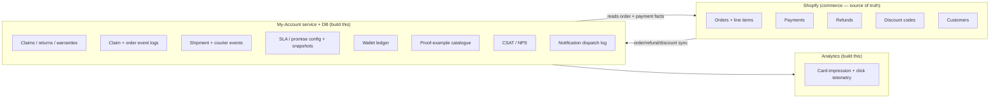

# New My Account — Implementation Handoff

**Audience.** The engineering team building the production **My Account → Orders** area from the Revibe prototype in this repo.

**What this is.** A build-oriented handoff: the **prerequisites** to lock before work starts, the **backend tables** the redesign needs, the **workflows / jobs** that drive them, and a **client-side telemetry** plan. It answers *"what do we need to build?"*.

**What this isn't.** It is **not** a mapping of the prototype onto tables that already exist — that's the sibling brief, [`../backend-mapping/context.md`](../backend-mapping/context.md), written for a read-only DB-explorer. This doc is the inverse: forward-looking, "build this." Where a data shape needs its full field-by-field detail, this doc **cross-links** `context.md` rather than repeating it.

**Fidelity note.** Every field/enum/rule here is derived from the **prototype**, not from a live-schema inspection. Names like `refund`, `claim`, `shipment` are **entity descriptors, not confirmed table names**. Treat every table below as *"build or confirm-against-real-schema."* Depth is deliberately **entity + field lists** — turn these into migrations/DDL during design; the prototype source files (linked per section) are the authority for exact shapes.

> **Convention (whole doc).** Enums are lowercase `snake_case` string IDs (the prototype's convention — full vocabulary in `context.md` §6.1). Timestamps: store **ISO 8601 UTC**, format client-side (`en-GB`). Money: `AED` throughout the mocks; decide decimal-vs-minor-units once and apply everywhere.

---

## 1. System boundary & data ownership

The single architectural decision that frames everything below: **what is Shopify's job, and what is the new My-Account service's job.**

**Source-of-truth split (proposed).**

| Entity | Owner | Notes |
|---|---|---|
| Order header, line items, payment, fulfilment | **Shopify** | My-Account reads; does not own. |
| Refund transactions (the money movement) | **Shopify** | My-Account **mirrors** refund-credited events and links them to a cancellation/claim (item 1, §4.1). |
| Discount codes (the code object + redemption) | **Shopify** | My-Account **grants + tracks** cancellation re-buy offers on top (item 2, §4.2). |
| Claim / return / warranty lifecycle | **My-Account** | Does not exist in Shopify. The core new build. |
| Courier events (orders **and** claims) | **My-Account** | Ingested from the courier (DHL Express today), §4.3. |
| SLA / promise config + per-entity snapshots | **My-Account** | Hardcoded in the prototype today (§4.4–4.5). |
| Wallet ledger | **My-Account** (or existing) | Confirm whether a real ledger exists; §4.7. |
| Proof-example catalogue | **My-Account** | Static-ish reference content, §4.6. |

> **Decision to lock (D1).** Confirm the above split against the real backend. In particular: is there already a `returns` table, a wallet ledger, and a shipment table covering more than outbound? See `context.md` §8 for the full decision list — this doc re-points the build-relevant ones in §7.

---

## 2. Prerequisites — lock before build

Ordered by how much they gate the rest.

1. **Shopify integration surface.** Admin API access + **webhooks** for `refunds/create` (item 1) and discount-code create/usage (item 2). Confirm the order/customer read model the service will join against.
2. **Courier event feed (D2).** A push feed (webhook) or poll from DHL Express (and any market-specific courier) delivering scan events. This is the source for both order shipping sub-status and claim-return transit. Without it, §4.3 and the courier workflow (§5.2) can't be built. Confirm format + auth.
3. **Object storage for evidence.** An S3-equivalent bucket for customer proof uploads (photos/videos), with signed-URL read access from claim queries. The prototype stores only a filename — real files need a home. (§4 "evidence uploads", §5.8.)
4. **Job scheduler / state-machine runner.** A durable scheduler (cron + queue, Temporal, or DB-backed job table) to enforce **auto-cancel deadlines** and **SLA-breach detection** — see §5.3–5.4. These are not display-only countdowns; something must fire when the deadline passes.
5. **Analytics accounts.** A PostHog project (recommended primary — §6) plus the **existing GA4** property. Decide the consent/PII posture before instrumenting (§6.5).
6. **Enum-vocabulary alignment (D3).** Reconcile the prototype's `snake_case` enum vocabulary (`context.md` §6.1) with the real backend. If they differ, a translation layer is a prerequisite, not an afterthought.
7. **Market model (D4).** Every order must carry its market/country (`AE`/`ZA`/`SA`/`Others`). EDD + promise math and several card behaviours key off it (§4.4, `context.md` §6.8).

---

## 3. Reading guide

The 6 items you already scoped are **§4.1–4.6** (tables) with their driving processes in **§5**. Item 7 (telemetry) is **§6**. Tables the redesign implies beyond your six are **§4.7** (accept or trim). Build-relevant open decisions are **§7**. Every subsection ends with the prototype source file(s) that define the exact shape.

---

## 4. Backend tables to build

> **Two layers.** §4.1–4.7 describe the **operational** entities — what the app reads/writes (current state + an event log), in an OLTP store. **§4.8** maps them into the **analytical** star schema (the fact + dimension tables) and settles how each *changing* thing is historized (accumulating-snapshot vs event fact vs SCD). Read §4.8 for the dimensional view; the two layers are kept separate on purpose (D14).

### 4.1 Refund-credited transactions *(your item 1)*

**Purpose.** Mirror each Shopify refund into the My-Account model so a **cancellation** or a **return/issue claim** can show "refunded — sent to X" and link back to the order. The prototype renders this as the refund-hero / refund-credited card; the money itself moves in Shopify.

**Entity — `refund`** (one row per refund event; links to the order and to the cancellation *or* claim that triggered it):

| Field | Meaning |
|---|---|
| `refund_id` | PK. |
| `order_id` | FK → Shopify order. |
| `source_kind` | `cancellation` \| `claim` — which trigger produced it. **(D5: one refund table with this discriminator, or two — see §7.)** |
| `cancellation_id` / `claim_id` | The triggering entity (exactly one set). |
| `shopify_refund_id` | The Shopify transaction this mirrors — the join key for the sync. |
| `status` | `pending` → `credited` (the "refund credited" moment the card celebrates). |
| `subtotal` | Gross before fees. |
| `fee` | `{ label, rate, amount }` — restocking (10% change-of-mind card path) or cancellation card fee (5%); `null`/0 on wallet + issue paths. |
| `bonus` | Flat `ISSUE_WALLET_BONUS` (AED 100) on issue-claim wallet refunds; else 0. |
| `net` | What actually lands (`subtotal − fee + bonus`). |
| `destination` | `{ kind: wallet\|card\|bank, label, last4 }`. |
| `breakdown[]` | `[{ label, amount }]` — item + Revibe Care lines. |
| `split[]` | For a split-paid order: card-portion → card, gift-card-portion → wallet. Proportional to the original split. |
| `credited_at` | ISO timestamp (drives the "funds available" copy). |

**Notes.** Fee/bonus math is frozen at submit-time on the claim's `expectedRefund` block, then realised here. Split-refund ratio math is `refundDestinations(order, net)`. **Source:** `src/lib/returns.js` (`refundBreakdown`, `RESTOCKING_FEE_RATE`, `CANCELLATION_FEE_RATE`, `ISSUE_WALLET_BONUS`, `isSplitPaid`, `refundDestinations`); `context.md` §3 (cancellation refund fields) + §4.4 (`expectedRefund`).

---

### 4.2 Revibe-cancellation discount codes *(your item 2)*

**Purpose.** When **Revibe** cancels an order (not the customer) — item out of stock, price error, undeliverable address — the customer is apologised to and given a **fixed-amount re-buy discount code**. You need to track which customers were granted one, the code, and whether it was redeemed.

**Entity — `cancellation_offer`** (the grant):

| Field | Meaning |
|---|---|
| `offer_id` | PK. |
| `order_id` / `customer_id` | Who it was granted to, and for which cancelled order. |
| `cancellation_reason` | `item_unavailable` \| `price_error` \| `undeliverable_address` (drives the apology copy variant). |
| `code` | The discount code shown to the customer (`reBuyOffer.code`). |
| `amount` / `currency` | Fixed money-off (`reBuyOffer.amount`). |
| `granted_at` | When issued. |
| `expires_at` | `reBuyOffer.expiresAt`. |
| `shopify_discount_id` | FK → the Shopify discount object that actually enforces the code. |

**Entity — `cancellation_offer_redemption`** (the usage; or read from Shopify):

| Field | Meaning |
|---|---|
| `offer_id` | FK → grant. |
| `redeemed_at` | When used. |
| `redeeming_order_id` | The new order the code was applied to. |
| `discount_applied` | Amount actually deducted. |

**Notes.** The **code enforcement** (validity, one-use, expiry) lives in Shopify; My-Account owns the **grant record + redemption tracking** so ops can answer "who got one / who used it / conversion." **(D6: track redemption via a local table synced from Shopify, or query Shopify directly on demand.)** **Source:** `src/components/RevibeCancellationCard.jsx` (`order.reBuyOffer.{code,amount,expiresAt}`, `order.cancellationReason`); `src/data/notifications/*` (apology copy is `variantBy: 'cancellationReason'`).

---

### 4.3 Shipping courier event log — orders **and** claims *(your item 3)*

**Purpose.** One event log behind every physical leg: outbound order delivery, inbound claim pickup, warranty ship-back, invalid-claim return-to-customer. Drives "out for delivery", "picked up", the detailed-tracking dropdowns, and every sub-status timeline.

**Entity — `shipment`** (one per physical leg; **D7: one table with a `kind` column vs several — §7**):

| Field | Meaning |
|---|---|
| `shipment_id` | PK. |
| `kind` | `outbound` \| `inbound_pickup` \| `warranty_ship_back` \| `invalid_claim_return`. |
| `order_id` / `claim_id` | Owner (outbound → order; the other three → claim). |
| `courier` | e.g. `DHL Express`. |
| `awb` | Air waybill / tracking number (a claim can have several across legs). |
| `tracking_url` | Deep link. |
| `current_sub_status_id` | Current milestone (enum depends on `kind`, below). |
| `estimated_delivery` | ETA. |

**Entity — `shipment_event`** (the append-only scan log):

| Field | Meaning |
|---|---|
| `event_id` | PK. |
| `shipment_id` | FK. |
| `sub_status_id` | The milestone this scan represents. |
| `occurred_at` | ISO timestamp of the scan. |
| `raw` | Optional raw courier payload for audit. |

**Milestone enums by leg:**

- **Outbound + warranty ship-back** (`SHIPPING_SUB_STATUSES`): `arrived_destination` → `cleared_customs` → `forwarded_to_agent` → `out_for_delivery`. (No `delivered` sub-status — the parent flips to top-level `delivered`.)
- **Inbound claim pickup** (`CLAIM_TRANSIT_SUB_STATUSES`): `picked_up` → `arrived_origin_hub` → `in_transit` → `arrived_revibe_hub`.
- **Invalid-claim return** reuses the outbound enum (it's a fresh outbound leg from Revibe to the customer).

**Notes.** The current sub-status is denormalised onto the parent (order/claim) for cheap card reads; the event log is authoritative (**D8: state-vs-event-log, `context.md` §6.2**). **Source:** `src/lib/statuses.js` (`SHIPPING_SUB_STATUSES`), `src/lib/claims.js` (`CLAIM_TRANSIT_SUB_STATUSES`, `claim.shipBack`, `claim.invalidClaim.returnShipment`); `context.md` §2/§4/§5.

---

### 4.4 Order promise / SLA definitions *(your item 4)*

**Purpose.** Define, per market, the promised delivery date and the per-stage SLA that decides when an order is **late** (flips banner tone + fires the "taking longer than usual" message). Hardcoded in the prototype's EDD model today.

**Entity — `market_sla_config`** (config; one row per market):

| Field | Meaning |
|---|---|
| `market` | `UAE` \| `ZA` \| `SA` (extend for `Others`). |
| `ocqc_working_days` | Working days for the order-created + QC window (UAE 3 / ZA 5 / SA 7). |
| `ocqc_today_buffer` | Calendar-day buffer if the stage runs late (2 / 5 / 6). |
| `ship_min_buffer` / `ship_today_buffer` | Post-ship calendar buffers (0/4 min; 1 today). |
| `weekend` | Weekend weekday set (UAE/ZA Sat+Sun; SA Fri+Sat). |
| `sla_order_created` / `sla_qc` / `sla_shipped` | Per-stage SLA in calendar days; stage is **late** when elapsed > SLA. |

**Entity — `order_promise_snapshot`** (per order):

| Field | Meaning |
|---|---|
| `order_id` | FK. |
| `initial_promise` | The workday-math delivery date the customer saw at checkout (fixed). |
| `delivery_by` | Current EDD, recomputed as stages complete / run late. |
| `current_stage` | `Order created` \| `QC` \| `Shipped`. |
| `current_stage_sla_status` | `on_time` \| `late`. |
| `customer_message_key` | Drives the SLA-divergence banner (`order_late` / `qc_late` / `qc_back_on_track` / `shipped_late` / on-time = no banner). |

**Notes.** **(D9: persist promise snapshots at each stage transition, or recompute per read from stage timestamps + market config.)** The prototype recomputes; production likely wants a snapshot at each transition for auditability. **Source:** `src/lib/edd.js` (`MARKETS`, `orderStatus`, `calculateEdd`, `buildCustomerMessage`, `initialPromise` vs `deliveryBy`); `context.md` §2 "EDD model" + §6.8.

---

### 4.5 Claim promise / SLA definitions *(your item 5)*

**Purpose.** Per-claim-state SLA so the customer sees an "expected by" date across the claim pipeline, and ops can detect a **late claim step**.

**Entity — `claim_sla_config`** (config; one row per claim state / sub-status):

| Field | Meaning |
|---|---|
| `state_id` | Claim state or sub-status (`initiated`, `pickup`, `qc`, `under_revision`, `expert_revision`, `under_repair`, `ship_back`, `refund_issued`, `awaiting_documents`, `ship_back_pending`, `ship_back_in_transit`, …). |
| `expected_hours` | Target duration for the step. |
| `buffer_hours` | Grace before it counts as breached. |

Prototype placeholder values (ops to revise with measured p50/p90 — flagged as placeholder in code): `initiated` 24/24, `pickup` 60/48, `qc` 48/48, `under_revision` 48/48, `expert_revision` 120/72, `under_repair` 168/72, `ship_back` 96/24, `refund_issued` 24/24, `awaiting_documents` 48/48, `ship_back_pending` 48/24, `ship_back_in_transit` 72/48.

**Entity — `claim_promise` (or derived).** `expected_completion` per claim = sum of `expected_hours` across that claim type's pipeline, added to submit time. Refund pipeline vs warranty pipeline sum different tails.

**Notes.** Action-gate deadlines (`awaiting_documents` etc.) are handled separately by `actionRequired.deadline` (a hard `autoCancelAt`), **not** by an SLA entry — keep the two concepts distinct. **(D10: SLA config → a table, or keep in code — §7.)** **Source:** `src/lib/claims.js` (`CLAIM_SLAS`, `expectedCompletionFor`, `SUB_STATUS_LABELS`); `context.md` §4.5 "SLA model".

---

### 4.6 Proof-example catalogue *(your item 6)*

**Purpose.** The reference images + descriptions the returns flow shows the customer ("here's what good proof looks like") and that a claim-review layer compares submissions against. Three tiers, all keyed to the issue taxonomy.

**Entity — `proof_example`:**

| Field | Meaning |
|---|---|
| `example_id` | PK. |
| `tier` | `universal` \| `golden` \| `bespoke`. |
| `category_id` | Issue category (`battery`/`screen`/`camera_audio`/`software`/`account_lock`/…) — set for golden + bespoke. |
| `issue_id` | Specific issue — set for bespoke (e.g. `battery_drain`, `prev_owner_pw`, `overheat`). |
| `media_type` | `photo` \| `video`. |
| `asset_url` | The reference image/clip (object storage). |
| `caption` / `description` | What it shows + why it's the bar. |
| `os_scope` | Optional `ios`/`android` (some asks are brand-adapted). |
| `proof_optional` | Bool — issue passes on description alone (e.g. overheating). |

**The three tiers** (from the review guidelines, derived from the live flow):
- **Universal** — the 4-shot checklist shown for *every* claim (screen · back & camera · accessories · packed safely), proving no-tampering + safe packing.
- **Golden** — one reference per category defining "acceptable issue-specific proof" (battery symptom video, up-close screen damage, filmed call for mic/speaker, on-screen software error, readable lock prompt).
- **Bespoke** — richer per-issue best-cases (battery-drain two-timestamp shots + Battery Health screen; prev-owner-password login screen; overheating warning screen).

**Notes.** The customer-facing asks (`need` per issue), media types, and golden/bespoke mappings are **generated from `issueTaxonomy.js`** — the catalogue should stay in sync with (or be generated from) that source, not hand-maintained twice. A companion **claim-review agent** already consumes this catalogue — see [`../claim-review-agent/`](../claim-review-agent/) (`guidelines.md` is the rubric; `proof/` is a point-in-time asset snapshot). **Source:** `src/components/ClaimFlow/issueTaxonomy.js`, `src/components/ClaimFlow/IssueEvidence.jsx`, `public/proof/*`; `docs/handoff/claim-review-agent/guidelines.md`.

---

### 4.7 Additional tables the redesign implies *(beyond your six — accept or trim)*

These aren't in your list but the new My Account can't ship without most of them. Grouped so you can prioritise. Field-level detail for the first four is in `context.md` (linked).

| Table | Why it's needed | Detail |
|---|---|---|
| **`claim`** (returns/issue/warranty) | The core new entity — one row per claim, `type` discriminator selects pipeline + refund-vs-repair tail. One active claim per order. | `context.md` §4.4 (full submit payload), §5 (warranty fields). |
| **`claim_event`** | Per-state timeline log (initiated → … → terminal) with timestamps; feeds the tracking timeline. | `context.md` §4 + §6.2. |
| **`evidence_file`** | Customer proof uploads (photo/video) per claim — content in object storage, row holds size/mime/uploader/claim_id. | Prerequisite §2.3; `context.md` §6.5. |
| **`claim_action_gate`** | The three takeover/gate states (`docsRejection` / `pickupFailure` / `invalidClaim`) with structured payload + `auto_cancel_at` + ops-authored message. | Drives §5.3; `context.md` §4.5. |
| **`cancellation`** | Customer-initiated pre-delivery cancellation + timeline (`requested`/`refund_pending`/`refunded`/`rejected`); rejection metadata must persist even after a later delivery + claim. | `context.md` §3. |
| **`wallet_ledger`** | Append-only credit/debit log; refund-to-wallet posts here (+issue bonus); Move-to-card reverses. | §4.7 below; `context.md` §6.9 (decision). |
| **`csat_response`** *(NPS)* | The returns-confirmation CSAT (1–5 "how was raising a claim"). New — prototype is a stub for a Typeform embed carrying `claim_ref` + `claim_type` as hidden fields. | `src/components/NpsSurvey.jsx`. |
| **`notification_dispatch`** | Log of WhatsApp/email comms sent per order/claim event, with a coverage status (`live`/`new`/`changed`/`missing`/`silent`) and the event key. Copy is event-keyed + token-interpolated + variant-selected. | `src/lib/notifications.js`, `src/data/notifications/*`. |

> **Notification copy is owner-authored** — the strings in `src/data/notifications/*` are maintained by the product owner, not generated. The table above is the *dispatch/audit* layer, not the copy store.

---

### 4.8 Analytical model — facts, dimensions & historization (SCD)

The §4.1–4.7 entities are the **operational** layer. This section is the **analytical** layer — the fact + dimension tables — and how each *changing* thing is kept historically. It's written to the confirmed grain: **`fact_claim` is one row per claim (accumulating snapshot).**

**D14 — Recommended: keep the app store and the analytics warehouse separate.** They're opposite workloads: the app is transactional (small reads/writes, real-time gate/deadline enforcement, current-state authoritative), the warehouse is analytical (big columnar scans, denormalized star schema, SCD history). Serving the customer UI *from* a star schema is an anti-pattern (load latency, no per-request writes, analyst queries contend with customer traffic). Pattern: **app OLTP (current state + append-only event log) → CDC/ELT → warehouse star schema.** This also makes the "reconstruct everything as-of" requirement affordable — the **app stays lean (no SCD)**, the **warehouse owns history**.

**Claim star schema:**

| Table | Type · grain | Holds | Historization |
|---|---|---|---|
| `fact_claim` | Accumulating snapshot · 1 row / claim | milestone date-keys (submitted → pickup → qc → refund/repair → terminal), stage-lag + SLA-breach + refund measures, FKs to all dims, **frozen** `sla_policy_key` (captured at submit) | in-place update — **no** history on its own |
| `fact_claim_status_event` | Transaction · 1 row / status transition | each status change + timestamp | **the** source for claim-status point-in-time; feeds the snapshot |
| `fact_claim_action_gate` | Transaction · 1 row / gate occurrence | `gate_type`, `opened_at`, `auto_cancel_at`, `resolved_at`, `outcome` (`responded`/`resolved`/`auto_cancelled`), time-to-respond, `breached` | full gate history + analytics — **not** an SCD |
| `fact_evidence` | Transaction · 1 row / proof file | claim, issue, proof_slot, media_type, uploaded_at, review_verdict | append-only (grain — D15) |
| `dim_sla_policy` | **SCD2** | SLA / promise config versions *(item 5)* | `effective_from`/`_to` + `is_current`; `fact_claim` freezes the surrogate so lag-vs-SLA uses the policy that applied |
| `dim_customer` | **SCD2** | contact + address | effective-dated |
| `dim_device` / `dim_product` | **SCD2** | model, variant, condition grade | effective-dated |
| `dim_issue` | **SCD2** | issue-taxonomy categories / asks *(item 6)* | effective-dated |
| `dim_date` · `dim_market` · `dim_courier` · `dim_refund_destination` · `dim_claim_type` | Conformed · SCD1 / static | descriptive lookups | overwrite / rarely change |

**Historization by object (refines your "SCD2 for all four").** SCD Type 2 is a *dimension* technique, so it fits only the drifting descriptors:

- **Claim-status progression** + **action-gate state** → **transaction-grain facts** (`fact_claim_status_event`, `fact_claim_action_gate`). These give exact as-of reconstruction *and* durations SCD2 can't express. Not SCDs.
- **SLA / promise policy** + **customer / device / issue-taxonomy** → **SCD2 dimensions** (effective-dated; fact joins the version valid at event time).

You still get full history for all four — via the tool that fits each.

**`claim_action_gate` specifically** (your question): a **transaction-grain fact**, one row per gate occurrence, with `gate_type`/reason as a small dimension and the deadline/response fields as measures. Only reach for SCD if you also want the *claim's current gate* as a point-in-time joinable **attribute** — then it's an attribute on an SCD2 claim-state (mini-)dimension, distinct from the gate's own event record.

**Evidence grain (D15).** You described evidence as a dimension. That holds only if you collapse to one proof-*summary* row per claim; with **multiple proof files per claim** (the guided-slot model — item 6, `issueDetails.proofSlots`), it's more naturally a **`fact_evidence`** (one row per file) or a claim↔proof **bridge**. Confirm which matches your existing table.

---

## 5. Workflows / jobs to build

Tables are inert; these are the processes that move state.

### 5.1 Shopify refund → refund-credited sync
Webhook on Shopify `refunds/create` → upsert the `refund` row (§4.1), match to the triggering `cancellation`/`claim`, flip `status` to `credited`, set `credited_at`. This is what lights the refund-credited card.

### 5.2 Courier event ingestion → sub-status
Ingest courier scans (§2.2 feed) → append `shipment_event`, map the courier's status to our `sub_status_id`, denormalise `current_sub_status_id` onto the parent order/claim, and — when the leg completes — advance the parent's top-level status (e.g. `out_for_delivery` scan-complete → order `delivered`; `arrived_revibe_hub` → claim `qc`).

### 5.3 Auto-cancel scheduler (gate deadline enforcement)
For every open `claim_action_gate` with an `auto_cancel_at`, a durable job must actually **fire** at the deadline (close/cancel the claim, notify), not just render a countdown. Covers all three gates (docs-rejected, pickup-failed, invalid-claim). **This is a real state machine, not UI.**

### 5.4 SLA / promise breach detection
Two watchers: **order** (per-stage elapsed vs `market_sla_config` → flips `on_time`/`late`, sets the `customer_message_key`, recomputes `delivery_by`) and **claim** (per-state elapsed vs `claim_sla_config`). Late transitions should emit an event (for banner + optional comm).

### 5.5 Claim state-machine progression
The claim advances `initiated → pickup → qc → {refund_issued → refund_credited | under_repair → ship_back → device_returned}`, with a QC-fail branch into the invalid-claim path. Each transition writes a `claim_event` and may trigger a refund (§5.6) or a shipment (§5.2/5.7).

### 5.6 Wallet credit posting
On a wallet-destination refund, post a `wallet_ledger` credit; add `ISSUE_WALLET_BONUS` on issue claims. Move-to-card reverses the latest switchable credit and re-applies the waived deduction (funds-gated, latest-refund-only, undoable in the prototype).

### 5.7 Invalid-claim reversal → fresh ship-back
When the customer **pays** the return-shipping fee on an invalid claim, create a new `shipment` (`kind = invalid_claim_return`, outbound-style milestones) and track it to delivery. Same shape as a warranty ship-back but customer-paid.

### 5.8 Evidence upload
Signed-URL upload to object storage → `evidence_file` row per claim → (optionally) hand to the **claim-review agent** (§4.6) for a pass/borderline/fail triage verdict before a human decision.

### 5.9 Notification dispatch
On authored events, resolve copy (event-keyed, token-interpolated, variant-selected by e.g. `cancellationReason` or claim-proof split), send WhatsApp/email, and log to `notification_dispatch`. Unauthored events resolve to `silent` (logistics steps) by design.

---

## 6. Client-side telemetry *(your item 7)*

**The ask.** Log, per customer journey, **which cards the customer actually saw** (the JS surfaces that render for their state) and **the clicks they make**.

### 6.1 Recommended stack

**Primary: PostHog.** It answers this exact question with the least custom build:
- **Autocapture** records clicks/taps without hand-instrumenting every element (covers the "clicks they make" ask out of the box).
- **Custom events** cover the part autocapture can't infer — *which card variant rendered* is a semantic fact only our code knows (`ClaimCard` vs `InvalidClaimCard` for the same order), so it must be an explicit event.
- **Session replay + funnels** let you *watch* a journey and measure returns-flow drop-off — a direct read of "what did this journey look like."
- Maps cleanly onto the prototype's existing **journey model** (a journey ≈ a session/flow).

**Keep GA4** (already connected) for acquisition/marketing attribution — it's weaker for per-session card-level product analytics, so let the two coexist rather than forcing everything through GA4.

**Instrument through one choke-point.** Add a thin `analytics` module (a single `track(event, props)` + a React `<AnalyticsProvider>`), and route **both** PostHog and GA4 (and an optional warehouse mirror) through it. This keeps the tool swappable, the event names consistent, and PII redaction in one place.

> **Alternatives considered.** Amplitude/Mixpanel are comparable product-analytics tools — pick PostHog for the built-in session replay + autocapture + self-host option. Segment is a router (CDP), not analytics — only worth it if you'll fan out to many destinations. A pure custom warehouse pipeline is the most control but the most build; the choke-point above lets you add it later as one more destination.

### 6.2 Two instrumentation primitives

1. **Card impression** — fire when a routed card mounts/becomes visible. The prototype already centralises the decision of *which* card renders (the `App.jsx` card-routing precedence), so instrument at that choke-point: emit `card_viewed` with the resolved card type. This is the "cards the customer would see for a specific journey" signal.
2. **Interaction** — autocapture for generic clicks, plus explicit `cta_clicked` on the handful of decision CTAs where the *intent* matters (raise a claim, continue, submit, pay return shipping, move-to-card, copy discount code).

### 6.3 Event taxonomy

| Event | When | Key props |
|---|---|---|
| `card_viewed` | A routed card renders | `card_type`, `order_id`, `state`, `status_id`, `claim_type?`, `claim_status?`, `country` |
| `card_expanded` / `card_collapsed` | Customer expands a card / section | `card_type`, `order_id`, `section` |
| `cta_clicked` | A tracked CTA | `cta_id`, `card_type`, `order_id` |
| `return_flow_started` | Returns overlay opens | `order_id`, `entry_point` (`past_order` / `hero`) |
| `return_step_viewed` | Each flow step renders | `step`, `situation?`, `remedy?`, `claim_type?` |
| `return_step_completed` | Continue advances a step | `step`, + derived selections |
| `return_validation_blocked` | Soft-validation stops Continue | `step`, `field` |
| `return_flow_submitted` | Claim submitted | `claim_type`, `refund_method?`, `situation`, `remedy` |
| `proof_slot_filled` / `proof_skipped` | Evidence step interactions | `slot`, `issue_id`, `media_type` |
| `tracking_expanded` | "See detailed tracking" opens | `leg_kind`, `claim_id` |
| `wallet_opened` / `move_to_card_clicked` | Wallet surfaces | `source` |
| `csat_submitted` | CSAT score tapped | `score`, `claim_ref`, `claim_type` |

**`card_type` vocabulary** (mirror the routing taxonomy): `in_progress` · `order` · `past_order` · `claim` · `warranty_claim` · `docs_rejected` · `pickup_failed` · `reset_failed` · `invalid_claim` · `closed_claim` · `revibe_cancellation` · `hero`.

**`step` vocabulary** (returns flow): `situation` · `reason` · `issue_category` · `issue_specific` · `wrong_item` · `remedy` · `device_prep` · `pickup_details` · `evidence` · `refund_method` · `review` · `confirmation`.

### 6.4 Journey / session model
Identify by `customer_id` (logged-in) + PostHog session. Tag each session with the entry context (order, country, claim type) so a "journey" can be reconstructed as the ordered event stream — matching how the prototype's journey mode replays one lifecycle. A funnel over `return_step_viewed`/`_completed` gives per-step drop-off; a `card_viewed` sequence gives the "what did they see" reconstruction.

### 6.5 Privacy / PII (D11)
No raw PII in event props — send `order_id`/`claim_ref` (opaque), never email/phone/address/payment. Gate replay + capture on consent per market, and mask input fields in session replay (addresses, refund destinations). Redact in the `analytics` choke-point so no call site can leak.

---

## 7. Build-relevant open decisions

Pulled from `context.md` §8, re-framed as "decide before/while building." Full context in that doc.

| # | Decision | Ref |
|---|---|---|
| D1 | Confirm the §1 ownership split against the real backend (does `returns`/wallet-ledger/multi-leg-shipment already exist?). | §1 |
| D2 | Courier event feed format + auth (blocks §4.3, §5.2). | §2 |
| D5 | Refund — one table with `source_kind`, or two (cancellation vs claim)? | §4.1 |
| D6 | Cancellation-offer redemption — local synced table vs query Shopify. | §4.2 |
| D7 | Shipment — one table with `kind`, or several? | §4.3 |
| D8 | State-vs-event-log authority for every timeline-shaped field. | §4.3, `context.md` §6.2 |
| D9 | Order promise — persist snapshots at each transition, or recompute per read? | §4.4 |
| D10 | Claim SLA config — table vs code (`CLAIM_SLAS` is hardcoded, values are placeholders). | §4.5 |
| D11 | Telemetry PII/consent posture + which analytics destinations. | §6.5 |
| D12 | Action gates — column on claim, separate table, or derived from sub-status? (operational store) | §4.7, `context.md` §8.5 |
| D13 | Money representation (decimal vs minor units); enum vocab translation layer. | `context.md` §6.1/§6.4 |
| D14 | **Separate app OLTP store from the analytics warehouse** (recommended), with CDC/ELT between — the app stays lean, the warehouse owns SCD history. | §4.8 |
| D15 | Evidence grain — dimension (one proof-summary per claim) vs `fact_evidence` / bridge (one row per file). Match to the existing table. | §4.8 |

---

## 8. Appendix — prototype sources per item

| Item | Prototype source(s) | Deeper spec |
|---|---|---|
| 1 · Refund-credited | `src/lib/returns.js`, `src/components/RefundDetailsSheet.jsx`, `RefundSplitRows.jsx` | `context.md` §3–§4; `docs/output/cancellations.md`, `orders.md` §7.1 |
| 2 · Cancellation discount | `src/components/RevibeCancellationCard.jsx`, `src/data/notifications/*` | `docs/handoff/revibe-cancellation/` |
| 3 · Courier events | `src/lib/statuses.js`, `src/lib/claims.js` (`CLAIM_TRANSIT_SUB_STATUSES`), `src/components/ReturnShipmentTracking.jsx` | `context.md` §2/§4/§5 |
| 4 · Order SLAs | `src/lib/edd.js` | `context.md` §2/§6.8; `docs/output/journey_backend_spec.md` |
| 5 · Claim SLAs | `src/lib/claims.js` (`CLAIM_SLAS`, `expectedCompletionFor`) | `context.md` §4.5; `docs/output/returns/claim_tracking.md` |
| 6 · Proof catalogue | `src/components/ClaimFlow/issueTaxonomy.js`, `IssueEvidence.jsx`, `public/proof/*` | `docs/handoff/claim-review-agent/guidelines.md` |
| 7 · Telemetry | `src/App.jsx` (card routing), `src/components/ClaimFlow/*` (flow steps), `src/components/NpsSurvey.jsx` | — |
| + Claims / warranty / wallet / gates / cancellation | `src/lib/claims.js`, `src/lib/wallet.js`, `src/components/ClaimFlow/flowReducer.js` | `context.md` §3–§6; `docs/output/returns/*`, `warranties_compensations.md`, `wallet.md` |

**Cross-reference:** the read-only backend-mapping brief this doc complements — [`../backend-mapping/context.md`](../backend-mapping/context.md) (data shapes, validation checklist, full decision list) and its [`system_prompt.md`](../backend-mapping/system_prompt.md).
