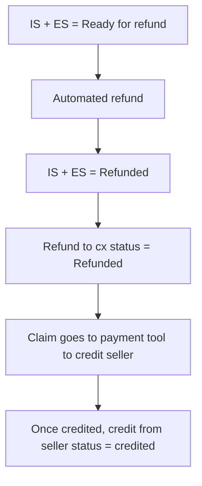

# Return flow — Change of mind

> Source: `docs/change_of_mind.drawio`. This doc is a faithful transcription of the operational flow as drawn. Frozen — update both this doc and the .drawio together if the flow changes.

## Overview

Entry point: customer creates a claim in My Account within 10 days of delivered date, providing Issue, Comment, Attachment and Refund method. Claim creation goes straight to "Pending collection" — no agent intake review. The diagram has two parallel collection/QC tracks driven by country (UAE / Others vs SA / ZA) that converge on seller-decision and repair-partner-decision branches. Terminal outcomes are "IS + ES = Delivered" (item back to customer after invalid-claim confirmation), "IS + ES = Cancelled" (customer didn't pay, customer doesn't want another AWB after a failed collection), and the refund chain ending in "Once credited, credit from seller status = credited". The distinguishing characteristic of change-of-mind vs Issue & Wrong device: change-of-mind splits routing on `Country` into three repair-supplier branches (Platinum repair / Golden specialist / Original supplier), and the seller-decision branch reaches "Ready for refund" through a credit-from-seller payment-tool step.

## Flow diagram

### Main path — claim intake and country routing

```mermaid
flowchart TD
  n1[Customer creates claim in my account] --> n2[Claim gets created]
  n2 --> n8[IS = Pending collection / ES = Pending collection]
  n8 --> n11{Country}
  n11 -->|ZA| n12[Repair supplier = Platinum repair]
  n11 -->|SA| n13[Repair supplier = Golden specialist]
  n11 -->|Other| n14[Repair supplier = Original supplier]
  n12 --> n15[AWB Gets created from cx to repair supplier by revibe &#40;auto&#41; — ZA/SA]
  n13 --> n15
  n14 --> n16[AWB Gets created from cx to repair supplier by revibe &#40;auto&#41; — Other]
```

### Collection sub-flow — ZA/SA track

```mermaid
flowchart TD
  n15[AWB Gets created from cx to repair supplier by revibe &#40;auto&#41; — ZA/SA] --> n17[IS + ES = Under collection — ZA/SA]
  n17 --> n18{collected?}
  n18 -->|Yes| n19[IS + ES = In transit — ZA/SA]
  n18 -->|No| n20[IS + ES = Collection failed — ZA/SA]
  n20 --> n21[Agent to confirm with customer if wants another AWB — ZA/SA]
  n21 --> n22{Customer wants?}
  n22 -->|Yes| n15
  n22 -->|No| n23((IS + ES = Cancelled — ZA/SA))
  n19 --> n24[AWB Delivered to seller]
  n24 --> n25[IS + ES = Under QC — ZA/SA]
  n25 --> n26{repair partner decision}
```

### Collection sub-flow — UAE/Other track

```mermaid
flowchart TD
  n16[AWB Gets created from cx to repair supplier by revibe &#40;auto&#41; — Other] --> n27[IS + ES = Under collection — Other]
  n27 --> n28{collected?}
  n28 -->|Yes| n29[IS + ES = In transit — Other]
  n28 -->|No| n30[IS + ES = Collection failed — Other]
  n30 --> n31[Agent to confirm with customer if wants another AWB — Other]
  n31 --> n32{Customer wants?}
  n32 -->|Yes| n16
  n32 -->|No| n33((IS + ES = Cancelled — Other))
  n29 --> n34[AWB Delivered]
  n34 --> n35[IS + ES = Under QC]
  n35 --> n36{Seller decision}
```

### Seller-decision branch — UAE/Other track

```mermaid
flowchart TD
  n36{Seller decision} -->|Valid claim| n37[IS + ES = Ready for refund]
  n36 -->|Invalid claim| n38[Seller puts proof of invalid]
  n38 --> n39[IS = Invalid claim / ES = Under QC]
  n39 --> n40[Agent review the seller proof]
  n40 --> n41{Agent decision}
  n41 -->|Valid claim| n42[Agent marks revibe confirmation = Valid claim]
  n42 --> n43[IS + ES = Under revision]
  n43 --> n36
  n41 -->|Invalid claim| n44[Agent marks revibe confirmation = Invalid claim]
  n44 --> n45[IS = Send to LAB / ES = Expert revision]
  n45 --> n46[Creates AWB from seller to Revibe]
  n46 --> n47[IS = Pending LAB collection / ES = Expert revision]
  n47 --> n48[AWB Collected]
  n48 --> n49[IS = In transit to LAB / ES = Expert revision]
  n49 --> n50[AWB Delivered]
  n50 --> n51[IS = LAB under QC / ES = Expert revision]
  n51 --> n52{LAB Inspector decision}
  n52 -->|Valid claim| n37
  n52 -->|Invalid claim| n53[IS + ES = Invalid claim confirmed]
  n53 --> n54[Agent asks customer to pay for shipping]
  n54 --> n55{Cusotmer paid?}
  n55 -->|Yes| n56[Credited from cx status = Credited]
  n56 --> n57[IS + ES = To ship back]
  n57 --> n58[AWB Created from Revibe to customer &#40;same AWB as pick up&#41;]
  n58 --> n59[IS + ES = Ship back under collection]
  n59 --> n60[AWB Collected]
  n60 --> n61[IS + ES = Shipped back]
  n61 --> n62[AWB Delivered]
  n62 --> n63((IS + ES = Delivered))
  n55 -->|No| n64[Agent marks cancel reason &quot;Customer didn't pay&quot;]
  n64 --> n65((IS + ES = Cancelled — UAE/Other didn't pay))
```

### Repair-partner-decision branch — ZA/SA track

```mermaid
flowchart TD
  n26{repair partner decision} -->|Valid claim| n66[IS + ES = Ready for refund — ZA/SA]
  n26 -->|Invalid claim| n67[partner puts proof of invalid]
  n67 --> n68[IS = Invalid claim / ES = Under QC — ZA/SA]
  n68 --> n69[Agent review the seller proof — ZA/SA]
  n69 --> n70{Agent decision — ZA/SA}
  n70 -->|Valid claim| n71[Agent marks revibe confirmation = Valid claim — ZA/SA]
  n71 --> n72[IS + ES = Under revision — ZA/SA]
  n72 --> n26
  n70 -->|Invalid claim| n73[Agent marks revibe confirmation = Invalid claim — ZA/SA]
  n73 --> n74{Cusotmer paid? — ZA/SA}
  n74 -->|Yes| n75[Credited from cx status = Credited — ZA/SA]
  n75 --> n76[IS + ES = To ship back — ZA/SA]
  n76 --> n77[AWB Created from Revibe to customer &#40;Same awb as quiqup&#41;]
  n77 --> n78[AWB Collected — ZA/SA]
  n78 --> n79[IS + ES = Shipped back — ZA/SA]
  n79 --> n80[AWB Delivered — ZA/SA]
  n80 --> n81((IS + ES = Delivered — ZA/SA))
  n74 -->|No| n82[Agent marks cancel reason &quot;Customer didn't pay&quot; — ZA/SA]
  n82 --> n83((IS + ES = Cancelled — ZA/SA didn't pay))
  n66 --> n84[Automated refund — ZA/SA]
  n84 --> n85[IS + ES = Refunded — ZA/SA]
  n85 --> n86[Refund to cx status = Refunded — ZA/SA]
```

### Refund chain — UAE/Other track (from n37)

## State catalog

| Node ID | IS (internal) | ES (customer-facing) | Actor | Terminal? |
|---------|---------------|----------------------|-------|-----------|
| n8 | Pending collection | Pending collection | System | N |
| n17 | Under collection | Under collection | System | N |
| n19 | In transit | In transit | System | N |
| n20 | Collection failed | Collection failed | System | N |
| n23 | Cancelled | Cancelled | System | Y |
| n25 | Under QC | Under QC | System | N |
| n27 | Under collection | Under collection | System | N |
| n29 | In transit | In transit | System | N |
| n30 | Collection failed | Collection failed | System | N |
| n33 | Cancelled | Cancelled | System | Y |
| n35 | Under QC | Under QC | System | N |
| n37 | Ready for refund | Ready for refund | System | N |
| n39 | Invalid claim | Under QC | System | N |
| n43 | Under revision | Under revision | System | N |
| n45 | Send to LAB | Expert revision | System | N |
| n47 | Pending LAB collection | Expert revision | System | N |
| n49 | In transit to LAB | Expert revision | System | N |
| n51 | LAB under QC | Expert revision | Lab | N |
| n53 | Invalid claim confirmed | Invalid claim confirmed | System | N |
| n57 | To ship back | To ship back | System | N |
| n59 | Ship back under collection | Ship back under collection | System | N |
| n61 | Shipped back | Shipped back | System | N |
| n63 | Delivered | Delivered | System | Y |
| n65 | Cancelled | Cancelled | System | Y |
| n66 | Ready for refund | Ready for refund | System | N |
| n68 | Invalid claim | Under QC | System | N |
| n72 | Under revision | Under revision | System | N |
| n76 | To ship back | To ship back | System | N |
| n79 | Shipped back | Shipped back | System | N |
| n81 | Delivered | Delivered | System | Y |
| n83 | Cancelled | Cancelled | System | Y |
| n85 | Refunded | Refunded | System | N |
| n88 | Refunded | Refunded | System | N |

## Decision points

| Node ID | Decision | Branches |
|---------|----------|----------|
| n11 | Country | ZA → Repair supplier = Platinum repair; SA → Repair supplier = Golden specialist; Other → Repair supplier = Original supplier |
| n18 | collected? (ZA/SA) | Yes → IS + ES = In transit; No → IS + ES = Collection failed |
| n22 | Customer wants? (ZA/SA) | Yes → AWB Gets created from cx to repair supplier by revibe (auto) — ZA/SA; No → IS + ES = Cancelled |
| n26 | repair partner decision | Valid claim → IS + ES = Ready for refund; Invalid claim → partner puts proof of invalid |
| n28 | collected? (Other) | Yes → IS + ES = In transit; No → IS + ES = Collection failed |
| n32 | Customer wants? (Other) | Yes → AWB Gets created from cx to repair supplier by revibe (auto) — Other; No → IS + ES = Cancelled |
| n36 | Seller decision | Valid claim → IS + ES = Ready for refund; Invalid claim → Seller puts proof of invalid |
| n41 | Agent decision | Valid claim → Agent marks revibe confirmation = Valid claim; Invalid claim → Agent marks revibe confirmation = Invalid claim |
| n52 | LAB Inspector decision | Valid claim → IS + ES = Ready for refund; Invalid claim → IS + ES = Invalid claim confirmed |
| n55 | Cusotmer paid? | Yes → Credited from cx status = Credited; No → Agent marks cancel reason "Customer didn't pay" |
| n70 | Agent decision (ZA/SA) | Valid claim → Agent marks revibe confirmation = Valid claim — ZA/SA; Invalid claim → Agent marks revibe confirmation = Invalid claim — ZA/SA |
| n74 | Cusotmer paid? (ZA/SA) | Yes → Credited from cx status = Credited — ZA/SA; No → Agent marks cancel reason "Customer didn't pay" — ZA/SA |

## Variants

- Country routing on `Country` decision splits into three repair-supplier states: ZA → Platinum repair; SA → Golden specialist; Other → Original supplier.
- After repair supplier selection, an AWB is auto-created by Revibe from customer to repair supplier on both branches.
- ZA/SA track proceeds through `repair partner decision`; UAE/Other track proceeds through `Seller decision`. The two branches use different `Agent decision` and `Cusotmer paid?` nodes; the ZA/SA Cusotmer-paid branch skips the "Ship back under collection" state present on the UAE/Other branch.
- The UAE/Other invalid-claim escalation routes through a LAB sub-flow (`Send to LAB → Pending LAB collection → In transit to LAB → LAB under QC → LAB Inspector decision`); the ZA/SA invalid-claim escalation does not include a LAB sub-flow and instead returns directly to `repair partner decision` via the agent's "Under revision" loop.

## Ambiguities

- n39 vs n68: both labelled "IS = Invalid claim / ES = Under QC" — duplicated across the two country tracks; kept distinct because they live on different sub-flows.
- n55 / n74 label "Cusotmer paid?" — typo preserved verbatim from source.
- n15 vs n16: source has two visually identical nodes both labelled "AWB Gets created from cx to repair supplier by revibe (auto)"; they sit on different country tracks and have distinct IDs in the .drawio (`CilRfxusAt-fk64VQiNZ-179` for ZA/SA and `CilRfxusAt-fk64VQiNZ-40` for UAE/Other), so transcribed as separate nodes with " — ZA/SA" / " — Other" suffixes for disambiguation.
- The agent-decision loop on the UAE/Other track ("Under revision" → Seller decision) and on the ZA/SA track ("Under revision" → repair partner decision) is drawn as a back-edge to the original decision node; transcribed as such.
