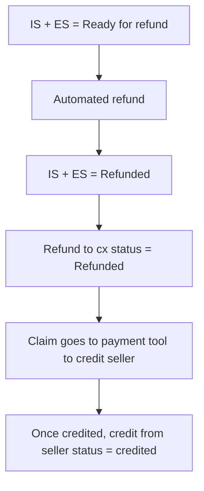

# Return flow — Issue & Wrong device

> Source: `docs/issue_returns.drawio`. This doc is a faithful transcription of the operational flow as drawn. Frozen — update both this doc and the .drawio together if the flow changes.

## Overview

Entry point: customer creates a claim in My Account within 10 days of delivered date, providing Issue, Comment, Attachment and Refund method. There is a single repair-supplier path (Original supplier) followed by a country-split on AWB creation (UAE auto-created by Revibe; Others / SA require the seller to manually input the AWB). Terminal outcomes are "IS + ES = Delivered" (after invalid-claim confirmation and return-to-customer chain), "IS + ES = Cancelled" (no info from customer, customer doesn't want another AWB, or customer didn't pay), and the refund chain ending at "Once credited, credit from seller status = credited". The distinguishing characteristic vs change-of-mind: a single `Repair supplier = Original supplier` route, AWB creation depends on `Country?` (auto for UAE, manual seller input for SA/Others), and there is one `Seller decision` / `Agent decision` / `Inspector decision` chain — no parallel ZA repair-partner branch.

## Flow diagram

### Main path — claim intake, country routing, collection

```mermaid
flowchart TD
  n1[Customer creates claim in my account] --> n2[Claim gets created]
  n2 --> n3[Agent review the claim]
  n3 --> n4{Information complete?}
  n4 -->|Yes| n5[Agent marks information complete]
  n4 -->|No| n6[Agent marks as missing documents and requests info to customer]
  n6 --> n7{Customer provides info?}
  n7 -->|Yes| n8[IS = Pending collection / ES = Pending collection]
  n7 -->|No| n9[Agent marks cancel reason &quot;Customer information not provided&quot;]
  n9 --> n10[IS + ES = Cancelled]
  n5 --> n8
  n8 --> n11[Repair supplier = Original supplier]
  n11 --> n12{Country?}
  n12 -->|Others| n13[AWB Gets created from cx to repair supplier UAE by revibe &#40;auto&#41;]
  n12 -->|SA| n14[Seller will manually input AWB]
  n13 --> n15[IS + ES = Under collection]
  n14 --> n15
  n15 --> n16{collected?}
  n16 -->|Yes| n17[IS + ES = In transit]
  n16 -->|No| n18[IS + ES = Collection failed]
  n18 --> n19[Agent to confirm with customer if wants another AWB]
  n19 --> n20{Customer wants?}
  n20 -->|Yes| n12
  n20 -->|No| n21((IS + ES = Cancelled — Customer wants no))
  n17 --> n22[AWB Delivered]
  n22 --> n23[IS + ES = Under QC]
  n23 --> n24{Seller decision}
```

### Seller-decision branch, LAB sub-flow, and ship-back

```mermaid
flowchart TD
  n24{Seller decision} -->|Valid claim| n25[IS + ES = Ready for refund]
  n24 -->|Invalid claim| n26[Seller puts proof of invalid]
  n26 --> n27[IS = Invalid claim / ES = Under QC]
  n27 --> n28[Agent review the seller proof]
  n28 --> n29{Agent decision}
  n29 -->|Valid claim| n30[Agent marks revibe confirmation = Valid claim]
  n30 --> n31[IS + ES = Under revision]
  n31 --> n24
  n29 -->|Invalid claim| n32[Agent marks revibe confirmation = Invalid claim]
  n32 --> n33[IS = Send to LAB / ES = Expert revision]
  n33 --> n34[Creates AWB from seller to Revibe]
  n34 --> n35[IS = Pending LAB collection / ES = Expert revision]
  n35 --> n36[AWB Collected]
  n36 --> n37[IS = In transit to LAB / ES = Expert revision]
  n37 --> n38[AWB Delivered &#40;LAB&#41;]
  n38 --> n39[IS = LAB under QC / ES = Expert revision]
  n39 --> n40{Inspector decision}
  n40 -->|Valid claim| n25
  n40 -->|Invalid claim| n41[IS + ES = Invalid claim confirmed]
  n41 --> n42[Agent asks customer to pay for shipping]
  n42 --> n43{Cusotmer paid?}
  n43 -->|Yes| n44[Credited from cx status = Credited]
  n44 --> n45[IS + ES = To ship back]
  n45 --> n46{Country? &#40;ship back&#41;}
  n46 -->|Others| n47[AWB Gets created from revibe to cx &#40;with same courier as pick up&#41;]
  n46 -->|SA| n48[Seller will manually input AWB — ship back]
  n47 --> n49[IS + ES = Ship back under collection]
  n48 --> n49
  n49 --> n50[AWB Collected — ship back]
  n50 --> n51[IS + ES = Shipped back]
  n51 --> n52[AWB Delivered — ship back]
  n52 --> n53((IS + ES = Delivered))
  n43 -->|No| n54[Agent marks cancel reason &quot;Customer didn't pay&quot;]
  n54 --> n55((IS + ES = Cancelled — didn't pay))
```

### Refund chain (from n25)

## State catalog

| Node ID | IS (internal) | ES (customer-facing) | Actor | Terminal? |
|---------|---------------|----------------------|-------|-----------|
| n8 | Pending collection | Pending collection | System | N |
| n10 | Cancelled | Cancelled | System | Y |
| n15 | Under collection | Under collection | System | N |
| n17 | In transit | In transit | System | N |
| n18 | Collection failed | Collection failed | System | N |
| n21 | Cancelled | Cancelled | System | Y |
| n23 | Under QC | Under QC | System | N |
| n25 | Ready for refund | Ready for refund | System | N |
| n27 | Invalid claim | Under QC | System | N |
| n31 | Under revision | Under revision | System | N |
| n33 | Send to LAB | Expert revision | System | N |
| n35 | Pending LAB collection | Expert revision | System | N |
| n37 | In transit to LAB | Expert revision | System | N |
| n39 | LAB under QC | Expert revision | Lab | N |
| n41 | Invalid claim confirmed | Invalid claim confirmed | System | N |
| n45 | To ship back | To ship back | System | N |
| n49 | Ship back under collection | Ship back under collection | System | N |
| n51 | Shipped back | Shipped back | System | N |
| n53 | Delivered | Delivered | System | Y |
| n55 | Cancelled | Cancelled | System | Y |
| n57 | Refunded | Refunded | System | N |

## Decision points

| Node ID | Decision | Branches |
|---------|----------|----------|
| n4 | Information complete? | Yes → Agent marks information complete; No → Agent marks as missing documents and requests info to customer |
| n7 | Customer provides info? | Yes → IS = Pending collection / ES = Pending collection; No → Agent marks cancel reason "Customer information not provided" |
| n12 | Country? | Others → AWB Gets created from cx to repair supplier UAE by revibe (auto); SA → Seller will manually input AWB |
| n16 | collected? | Yes → IS + ES = In transit; No → IS + ES = Collection failed |
| n20 | Customer wants? | Yes → Country?; No → IS + ES = Cancelled |
| n24 | Seller decision | Valid claim → IS + ES = Ready for refund; Invalid claim → Seller puts proof of invalid |
| n29 | Agent decision | Valid claim → Agent marks revibe confirmation = Valid claim; Invalid claim → Agent marks revibe confirmation = Invalid claim |
| n40 | Inspector decision | Valid claim → IS + ES = Ready for refund; Invalid claim → IS + ES = Invalid claim confirmed |
| n43 | Cusotmer paid? | Yes → Credited from cx status = Credited; No → Agent marks cancel reason "Customer didn't pay" |
| n46 | Country? (ship back) | Others → AWB Gets created from revibe to cx (with same courier as pick up); SA → Seller will manually input AWB |

## Variants

- Country routing on `Country?` (pick-up): UAE / Others → AWB auto-created by Revibe (the node literal is "AWB Gets created from cx to repair supplier UAE by revibe (auto)"); SA → seller manually inputs the AWB.
- Country routing on `Country?` (ship-back to customer): Others → AWB Gets created from revibe to cx (with same courier as pick up); SA → seller manually inputs the AWB.
- The `Customer wants?` "Yes" edge after a failed collection re-enters the upstream `Country?` decision rather than re-using a fixed AWB creation node, so retries route through country selection again.

## Ambiguities

- `axLYW14Gz247k99SE8-W-1` is a free-floating rectangle node labelled "For COM only AE orders will be managed by naif and for other flows Naif will handles orders from all regions". It has no incoming or outgoing edges in the source; treated as an annotation/note and omitted from the flow diagram, state catalog, and decision points.
- n43 label "Cusotmer paid?" — typo preserved verbatim from source.
- Both `Country?` decisions in the source carry the same label and use only the edge labels "Others" / "SA" to distinguish branches — disambiguated here as `n12` (pick-up) and `n46` (ship-back). Likewise both "Seller will manually input AWB" nodes (n14 and n48) are textually identical but live on the pick-up vs ship-back branches.
- The "AWB Delivered" label appears twice (one after In transit before Under QC, one after Shipped back at the end of the ship-back chain); transcribed as n22 and n52.
- The pick-up `Country?` decision has only two labelled outgoing branches ("Others" and "SA"); no edge labelled "UAE" exists in the source even though the supplier label references "repair supplier UAE".
