# Return flow — Warranty

> Source: not yet drawn. This doc is the operational source of truth for warranties until a `docs/warranty_returns.drawio` exists; once drawn, update both in lock-step.

## Overview

Entry point: customer creates a warranty claim in My Account within the device's warranty period (e.g., 1 year from delivered date), providing Issue, Comment and Attachment. There is no refund-method field — warranty outcomes are always ship-back of a device (repaired on valid, unrepaired on confirmed-invalid). Intake, country routing and collection mirror the Issue & Wrong device flow exactly: single `Repair supplier = Original supplier` route, AWB creation depends on `Country?` (auto-created by Revibe for UAE / Others; seller manually inputs the AWB for SA).

Terminal outcomes:
- **`IS + ES = Delivered` (repaired)** — Seller decision = Valid, or LAB Inspector decision = Valid: the device is repaired (by Seller or LAB respectively) and shipped back to the customer. No refund.
- **`IS + ES = Delivered` (unrepaired, customer paid)** — LAB Inspector decision = Invalid, customer pays return shipping: the original device is shipped back without repair.
- **`IS + ES = Cancelled`** — customer didn't provide info, customer didn't want another AWB after a failed collection, or customer didn't pay return shipping after invalid-claim confirmation.

The distinguishing characteristic vs Issue & Wrong device: warranty has **no refund chain at all**. The Issue-flow "Ready for refund → Automated refund → Refunded → credit-seller" tail is replaced by an `Under repair → Ready for ship back → ship-back chain → Delivered` tail on both the Seller-decision-Valid and Inspector-decision-Valid branches. The Inspector-decision-Invalid path is identical to the Issue flow (customer pays for shipping, device ships back unrepaired) except no refund is owed in the first place — the customer-paid ship-back is the only outcome, never a refund.

## Flow diagram

### Main path — claim intake, country routing, collection

```mermaid
flowchart TD
  n1[Customer creates warranty claim in my account] --> n2[Claim gets created]
  n2 --> n3[Agent review the claim]
  n3 --> n4{Information complete?}
  n4 -->|Yes| n5[Agent marks information complete]
  n4 -->|No| n6[Agent marks as missing documents and requests info to customer]
  n6 --> n7{Customer provides info?}
  n7 -->|Yes| n8[IS = Pending collection / ES = Pending collection]
  n7 -->|No| n9[Agent marks cancel reason &quot;Customer information not provided&quot;]
  n9 --> n10[IS + ES = Cancelled]
  n5 --> n8
  n8 --> n11[Repair supplier = Original supplier]
  n11 --> n12{Country?}
  n12 -->|Others| n13[AWB Gets created from cx to repair supplier UAE by revibe &#40;auto&#41;]
  n12 -->|SA| n14[Seller will manually input AWB]
  n13 --> n15[IS + ES = Under collection]
  n14 --> n15
  n15 --> n16{collected?}
  n16 -->|Yes| n17[IS + ES = In transit]
  n16 -->|No| n18[IS + ES = Collection failed]
  n18 --> n19[Agent to confirm with customer if wants another AWB]
  n19 --> n20{Customer wants?}
  n20 -->|Yes| n12
  n20 -->|No| n21((IS + ES = Cancelled — Customer wants no))
  n17 --> n22[AWB Delivered]
  n22 --> n23[IS + ES = Under QC]
  n23 --> n24{Seller decision}
```

### Valid path — seller repair and ship back to customer

```mermaid
flowchart TD
  n24{Seller decision} -->|Valid claim| n25[IS + ES = Under repair]
  n25 --> n26[Seller marks repair complete]
  n26 --> n27[IS + ES = Ready for ship back]
  n27 --> n28{Country? &#40;ship back&#41;}
  n28 -->|Others| n29[AWB Gets created from seller to cx by revibe &#40;auto&#41;]
  n28 -->|SA| n30[Seller will manually input AWB — ship back]
  n29 --> n31[IS + ES = Ship back under collection]
  n30 --> n31
  n31 --> n32[AWB Collected — ship back]
  n32 --> n33[IS + ES = Shipped back]
  n33 --> n34[AWB Delivered — ship back]
  n34 --> n35((IS + ES = Delivered — repaired by seller))
```

### Invalid path — seller proof, LAB sub-flow, LAB-repair ship back, invalid-confirmed customer-paid ship back

```mermaid
flowchart TD
  n24{Seller decision} -->|Invalid claim| n36[Seller puts proof of invalid]
  n36 --> n37[IS = Invalid claim / ES = Under QC]
  n37 --> n38[Agent review the seller proof]
  n38 --> n39{Agent decision}
  n39 -->|Valid claim| n40[Agent marks revibe confirmation = Valid claim]
  n40 --> n41[IS + ES = Under revision]
  n41 --> n24
  n39 -->|Invalid claim| n42[Agent marks revibe confirmation = Invalid claim]
  n42 --> n43[IS = Send to LAB / ES = Expert revision]
  n43 --> n44[Creates AWB from seller to Revibe]
  n44 --> n45[IS = Pending LAB collection / ES = Expert revision]
  n45 --> n46[AWB Collected]
  n46 --> n47[IS = In transit to LAB / ES = Expert revision]
  n47 --> n48[AWB Delivered &#40;LAB&#41;]
  n48 --> n49[IS = LAB under QC / ES = Expert revision]
  n49 --> n50{Inspector decision}
  n50 -->|Valid claim| n51[IS + ES = Under repair &#40;LAB&#41;]
  n51 --> n52[LAB marks repair complete]
  n52 --> n53[IS + ES = Ready for ship back &#40;LAB&#41;]
  n53 --> n54{Country? &#40;ship back from LAB&#41;}
  n54 -->|Others| n55[AWB Gets created from LAB to cx by revibe &#40;auto&#41;]
  n54 -->|SA| n56[Seller will manually input AWB — ship back from LAB]
  n55 --> n57[IS + ES = Ship back under collection &#40;LAB&#41;]
  n56 --> n57
  n57 --> n58[AWB Collected — ship back from LAB]
  n58 --> n59[IS + ES = Shipped back &#40;LAB&#41;]
  n59 --> n60[AWB Delivered — ship back from LAB]
  n60 --> n61((IS + ES = Delivered — repaired by LAB))
  n50 -->|Invalid claim| n62[IS + ES = Invalid claim confirmed]
  n62 --> n63[Agent asks customer to pay for shipping]
  n63 --> n64{Cusotmer paid?}
  n64 -->|Yes| n65[Credited from cx status = Credited]
  n65 --> n66[IS + ES = To ship back]
  n66 --> n67{Country? &#40;ship back unrepaired&#41;}
  n67 -->|Others| n68[AWB Gets created from revibe to cx &#40;with same courier as pick up&#41;]
  n67 -->|SA| n69[Seller will manually input AWB — ship back unrepaired]
  n68 --> n70[IS + ES = Ship back under collection — unrepaired]
  n69 --> n70
  n70 --> n71[AWB Collected — ship back unrepaired]
  n71 --> n72[IS + ES = Shipped back — unrepaired]
  n72 --> n73[AWB Delivered — ship back unrepaired]
  n73 --> n74((IS + ES = Delivered — unrepaired, customer paid))
  n64 -->|No| n75[Agent marks cancel reason &quot;Customer didn't pay&quot;]
  n75 --> n76((IS + ES = Cancelled — didn't pay))
```

## State catalog

| Node ID | IS (internal) | ES (customer-facing) | Actor | Terminal? |
|---------|---------------|----------------------|-------|-----------|
| n8 | Pending collection | Pending collection | System | N |
| n10 | Cancelled | Cancelled | System | Y |
| n15 | Under collection | Under collection | System | N |
| n17 | In transit | In transit | System | N |
| n18 | Collection failed | Collection failed | System | N |
| n21 | Cancelled | Cancelled | System | Y |
| n23 | Under QC | Under QC | System | N |
| n25 | Under repair | Under repair | Seller | N |
| n27 | Ready for ship back | Ready for ship back | System | N |
| n31 | Ship back under collection | Ship back under collection | System | N |
| n33 | Shipped back | Shipped back | System | N |
| n35 | Delivered | Delivered | System | Y |
| n37 | Invalid claim | Under QC | System | N |
| n41 | Under revision | Under revision | System | N |
| n43 | Send to LAB | Expert revision | System | N |
| n45 | Pending LAB collection | Expert revision | System | N |
| n47 | In transit to LAB | Expert revision | System | N |
| n49 | LAB under QC | Expert revision | Lab | N |
| n51 | Under repair (LAB) | Under repair | Lab | N |
| n53 | Ready for ship back (LAB) | Ready for ship back | System | N |
| n57 | Ship back under collection (LAB) | Ship back under collection | System | N |
| n59 | Shipped back (LAB) | Shipped back | System | N |
| n61 | Delivered | Delivered | System | Y |
| n62 | Invalid claim confirmed | Invalid claim confirmed | System | N |
| n66 | To ship back | To ship back | System | N |
| n70 | Ship back under collection | Ship back under collection | System | N |
| n72 | Shipped back | Shipped back | System | N |
| n74 | Delivered | Delivered | System | Y |
| n76 | Cancelled | Cancelled | System | Y |

## Decision points

| Node ID | Decision | Branches |
|---------|----------|----------|
| n4 | Information complete? | Yes → Agent marks information complete; No → Agent marks as missing documents and requests info to customer |
| n7 | Customer provides info? | Yes → IS = Pending collection / ES = Pending collection; No → Agent marks cancel reason "Customer information not provided" |
| n12 | Country? | Others → AWB Gets created from cx to repair supplier UAE by revibe (auto); SA → Seller will manually input AWB |
| n16 | collected? | Yes → IS + ES = In transit; No → IS + ES = Collection failed |
| n20 | Customer wants? | Yes → Country?; No → IS + ES = Cancelled |
| n24 | Seller decision | Valid claim → IS + ES = Under repair; Invalid claim → Seller puts proof of invalid |
| n28 | Country? (ship back) | Others → AWB Gets created from seller to cx by revibe (auto); SA → Seller will manually input AWB |
| n39 | Agent decision | Valid claim → Agent marks revibe confirmation = Valid claim; Invalid claim → Agent marks revibe confirmation = Invalid claim |
| n50 | Inspector decision | Valid claim → IS + ES = Under repair (LAB); Invalid claim → IS + ES = Invalid claim confirmed |
| n54 | Country? (ship back from LAB) | Others → AWB Gets created from LAB to cx by revibe (auto); SA → Seller will manually input AWB |
| n64 | Cusotmer paid? | Yes → Credited from cx status = Credited; No → Agent marks cancel reason "Customer didn't pay" |
| n67 | Country? (ship back unrepaired) | Others → AWB Gets created from revibe to cx (with same courier as pick up); SA → Seller will manually input AWB |

## Variants

- **Eligibility window** is the device's warranty period (e.g., 1 year from delivered date), not the 10-day issue-claim window. Intake form drops the `Refund method` field since no warranty outcome is a refund.
- **Country routing on pick-up** (`n12`): UAE / Others → AWB auto-created by Revibe; SA → seller manually inputs the AWB. Mirrors the Issue flow exactly.
- **Country routing on ship-back** appears on three separate decision nodes — one per ship-back chain:
  - `n28` (seller-repair ship-back): Others → Revibe auto-creates AWB from seller to customer; SA → seller manual.
  - `n54` (LAB-repair ship-back): Others → Revibe auto-creates AWB from LAB to customer; SA → seller manual.
  - `n67` (invalid-confirmed unrepaired ship-back): Others → Revibe auto-creates AWB with the same courier as pick-up; SA → seller manual.
- **No refund chain.** The Issue-flow `Ready for refund → Automated refund → Refunded → Refund to cx status = Refunded → Claim goes to payment tool to credit seller → credit from seller status = credited` chain does not exist on warranty. Both `Seller decision = Valid` and `Inspector decision = Valid` flow into an `Under repair → Ready for ship back → ship-back chain → Delivered` tail instead.
- **Two repair actors.** Repair is performed by the **Seller** on the `n24 = Valid` branch (`n25` Under repair) and by the **LAB** on the `n50 = Valid` branch (`n51` Under repair (LAB)). The LAB-valid branch does not return the device to the seller — the LAB ships directly to the customer (`n55` AWB from LAB to cx).
- **`Under revision` loop** on `n39 = Valid` returns to `n24` (Seller decision), identical to the Issue flow.

## Ambiguities

- **No drawio source yet.** This doc is freshly drafted from the product spec; until a `.drawio` source is created, this file is the operational source of truth. The `Frozen — update both in lock-step` posture from the other two input docs only kicks in once the drawio exists.
- **Customer "Credited from cx status = Credited" on the invalid-confirmed branch (`n65`)** — preserved from the Issue flow verbatim. In the Issue flow this represents the customer paying for the unrepaired ship-back. The same semantics apply here; the label is intentionally identical for consistency with the Issue flow's payment-tool wording.
- **`n64` label "Cusotmer paid?"** — typo preserved verbatim to match the Issue flow source (`return_flow_issue.md` n43).
- **SA ship-back from LAB (`n56`)** — the convention "Seller will manually input AWB" is preserved even though the physical pick-up location is the LAB rather than the seller. This mirrors the Issue flow's posture (SA shipments are seller-coordinated regardless of source), but should be confirmed with ops before the drawio is drawn: if SA ship-backs from the LAB are actually Revibe-coordinated rather than seller-managed, the branch needs to change.
- **`Repair complete` events (`n26`, `n52`)** are drawn as explicit transition nodes rather than implicit edges to make the seller's / LAB's repair-completion action observable in the state machine. If ops would rather treat the transition out of `Under repair` as implicit (no explicit "marks complete" action), these two nodes can collapse into their downstream `Ready for ship back` states.
- **Warranty period itself is not encoded in the state machine.** Eligibility is enforced at intake (`n1`); the rest of the flow doesn't reference the warranty window. If warranty period varies per device / per seller, that's an intake-side concern, not a flow-side one.
