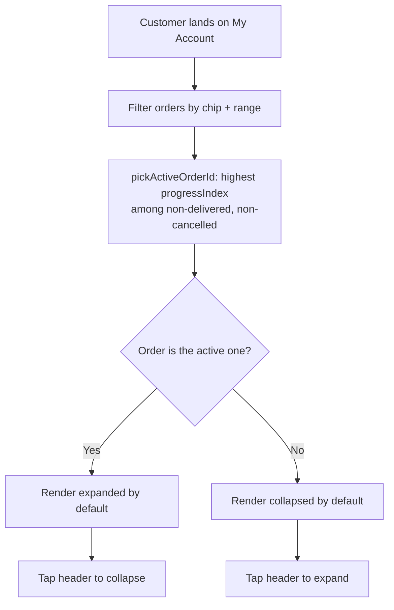
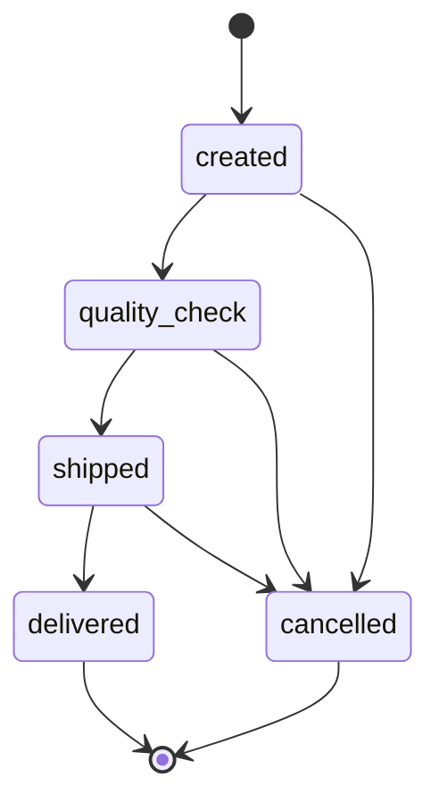
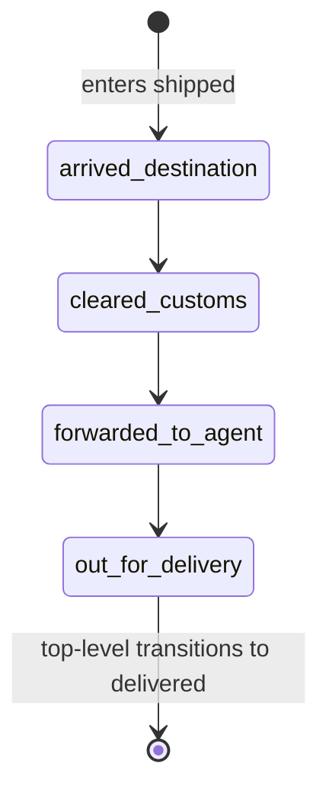
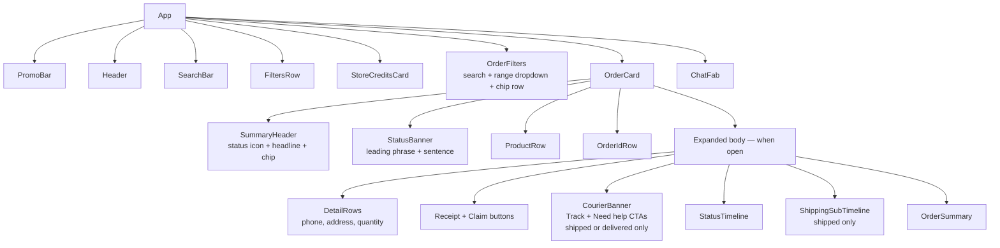

# My Account — Orders Flow

> **Living document.** Update this when the order shape, status model,
> auto-collapse rules, or component structure changes. See
> [`CHANGELOG.md`](../CHANGELOG.md) for the change history.

This document describes how the orders area of the My Account page works in the
prototype. It is written for both product and engineering. Shared context is up
front; deeper architecture sits in the later sections — skim or skip as needed.

---

## 1. Overview

The orders area lives inside the customer's My Account page. It shows every
order the customer has placed, communicates the current shipment status at a
glance, and lets the customer drill into a single order for full details and
post-purchase actions (download receipt, raise a claim, change address while
the order is still actionable, track the parcel via the courier).

This prototype is intentionally narrow: only the orders list and the
expand/collapse interactions are functional. Everything around it (search,
filters, store credits, profile menu, language toggle) is decorative — present
for visual fidelity but not wired up.

**In scope**

- Order list with five demo orders, one per top-level state plus a cancelled order.
- Per-order collapsed summary card with status banner.
- Per-order expanded view with full timeline, courier banner, sub-timeline, and order summary.
- Auto-expand rule: only the single most in-flight order is expanded by default; the rest collapse.
- Status chip row that filters the list (`All / In progress / Delivered / Cancelled`).
- Status banner with `delayed` and `statusMessage` overrides.

**Out of scope (faked or stubbed)**

- Authentication, real backend, real customer data.
- Site-wide search and the in-list "Find items" search field.
- Date-range dropdown effect on the list (logic is wired but all mock orders fall inside every range).
- The store-credits card (purely visual; the gradient amount and clipboard icon are decorative).
- Right-to-left and Arabic localisation.
- Receipt-download flow and claims flow.
- Real courier tracking — the "Track order" button hardcodes a known-good DHL Express test shipment so the demo always lands on a real tracking page.

---

## 2. User flow

### 2.1 What the customer sees

A vertical list of orders, newest first. Each order is rendered as a card. The
card always shows a compact summary header so the customer can scan the list
and understand the state of each order without expanding anything.

When a card is **collapsed**, the customer sees:

- A status icon + headline (e.g. "Out for delivery", "At quality check", "Delivered", "Cancelled").
- A subline with the most relevant timestamp (forward-looking ETA when DHL provides one, otherwise the most recent status timestamp).
- A state chip on the right when relevant. Delivered orders carry a green "Delivered" chip (overrides the data's `state: 'close'`); cancelled orders carry a red "Cancelled" chip.
- A tinted **status banner** with a leading condition phrase and a descriptive sentence (see §3, "Status banner").
- The product image, name, and variant.
- The amount paid.
- The order ID.

When a card is **expanded**, everything above remains visible at the top, and
below it the customer sees:

- For created / quality_check orders, the four-step **Full timeline** comes first — there is no in-card dot timeline above the product strip for these states, so the expanded timeline is the only one shown. For shipped orders the in-card dot timeline stays and the Full timeline sits at the very bottom of the expanded view (kept for parity).
- The status banner (long form), the **Shipping progress** sub-timeline (shipped only), and the courier card with the "Track" link.
- The **Order details** collapse with phone, address, order date, and "Change address" / "Change phone number" actions while the order is in any in-progress state (`created` or `quality_check`).
- The action row:
  - `created` / `quality_check`: `Cancel order` + `Change order details` (the latter programmatically opens the Order details collapse via ref so the change-address / change-phone pills are immediately visible).
  - shipped: `Receipt` + `Get help`.

Past-order cards (delivered, cancelled) are a separate, simpler component
(`PastOrderCard`):

- **Delivered** carries two pill actions, right-aligned: `Download receipt` + `Raise a claim`.
- **Cancelled** carries no action row — the bottom border + button are removed entirely.

The **hero card** (active in-flight order, currently the out-for-delivery
order) carries two stacked rows of full-width buttons beneath the headline,
ETA subtitle, product strip, and dot timeline:

- Row 1: `Track package` (filled white, brand-coloured text — only filled CTA in the app) + `Get help` (ghost, headphones icon).
- Row 2: `Cancel order` + `Raise a claim` (both ghost, same size as row 1).

Tapping `Cancel order` toggles a small dark tooltip centered above the button
— *"You cannot cancel the order at this stage"* — dismissing on outside-click.
The cancellation rule is prototype-only (production should derive eligibility
from `statusId`). The `Delivery by [date]` line under the headline reads
from `order.estimatedDelivery` and only renders when present.

### 2.2 Auto-expand rule



Every card collapses by default. `pickActiveOrderId(orders)` returns the id
of the single most-in-flight order — the one with the highest pipeline
progress (`progressIndex × 10 + subProgressIndex`, in-flight only) — and
`App.jsx` passes `defaultExpanded` only to that card. The rule operates on
the *filtered* list, so picking the "Delivered" chip auto-expands nothing
(no order is in flight), while "All" or "In progress" auto-expands the most
progressed open order. Once the customer taps a card, their state sticks
across filter changes (state lives in `OrderCard`, not derived from
`activeId`).

### 2.3 Top-level state machine



`cancelled` is modelled as a separate **state** on the order, not a top-level
status — see §4.2. This is so a cancelled order can carry the status it was in
when cancellation happened, which informs the timeline rendering.

### 2.4 Shipping sub-state machine

While the top-level status is `shipped`, the order also carries a
**sub-status** describing where the parcel is in DHL's pipeline:



There is intentionally no `delivered` sub-status. When the parcel is delivered,
the order's top-level status moves to `delivered` and the sub-status is no
longer relevant. This avoids having "delivered" in two places at once.

### 2.5 Per-state behaviour cheat sheet

| Top-level state | Auto-expanded | Headline copy | Status banner lead | Banner tone | Header chip | Courier banner | Sub-timeline |
|---|---|---|---|---|---|---|---|
| created | If most in-flight | "Order placed" | "On track" | brand | none | No | No |
| quality_check | If most in-flight | "At quality check" | "On track" (or "Taking longer than expected" if `delayed`) | brand / warn | none | No | No |
| shipped (sub-status drives headline) | If most in-flight | sub-status label (e.g. "Out for delivery") | "On track" / "Arriving today" (out_for_delivery) | brand | none | Yes | Yes |
| delivered | Never | "Delivered" | "All done" | success | green "Delivered" | Yes (with completed copy) | No |
| cancelled (any prior status) | Never | "Cancelled" | "Refund in progress" | danger | red "Cancelled" | No | No |

---

## 3. UX decisions and rationale

These decisions came out of phase-2 review and are worth preserving so future
contributors understand why the prototype looks the way it does.

**Two-tier status model.** We considered flattening the four shipping
sub-statuses into the top-level timeline, which would have produced a
nine-step horizontal timeline. On a 430px-wide mobile column this is
unreadable. Instead the top timeline always shows the four high-level stages
(created → quality check → shipped → delivered), and the shipping sub-statuses
are exposed as a vertical sub-timeline that only appears when relevant.

**Courier banner elevated out of the order summary.** Previously the courier
name was a small hyperlink buried inside the summary table. It is now a
dedicated banner with explanatory copy ("Have a question about your delivery?
Contact the courier directly...") and a primary "Track order" CTA. The CTA is
the only filled brand-purple button in the app — a deliberate departure from
the otherwise-outlined button language, because we wanted the action to read
as a primary call-to-action.

**Auto-expand the active order, not the terminal ones.** Every card collapses
by default; only the single most in-flight order auto-expands. This keeps the
list scannable while still surfacing the order most likely to need attention.
Earlier the rule was the inverse (collapse only delivered/cancelled), which
left three or four orders open at once and pushed everything below the fold.

**Status banner sits in the always-visible card header.** Each card carries a
tinted banner with a colored leading phrase + descriptive sentence. The
leading phrase describes *condition* (`On track`, `Arriving today`, `All done`,
`Refund in progress`, `Taking longer than expected`) — never the process step,
since the headline already shows that. Tone resolution: `state === 'cancelled'`
→ red, `delayed === true` → orange, otherwise the per-status default (brand
purple for in-flight, green for delivered). `order.statusMessage` overrides
the body string in any branch — that's the production hook for ad-hoc
backend-injected updates without changing status.

**Delivered chip overrides the data's `state: 'close'`.** Delivered orders carry
`state: 'close'` in the data, but customers see a green "Delivered" pill instead
of the orange "Close" pill. The override lives in `OrderCard`'s `SummaryHeader`
so the data shape stays unchanged.

**Filled brand-purple horizontal timeline for reached stages.** Reached
stages and the connectors between them are filled with brand purple, not
gray. The current step's label is bold so it remains identifiable without
changing the dot treatment. Future stages stay outlined and gray.

**Forward-looking subline when ETA is available.** DHL provides an estimated
delivery date sometimes, not always. When present, the collapsed-card subline
reads "Delivery by [date]" — a customer-facing, future-tense answer to "when
is it coming." When absent it falls back to "Updated [timestamp]".

**Whole header is the tap target.** The chevron is decorative — tapping
anywhere on the collapsed-card header expands the card. Larger tap targets
are friendlier on mobile, and there is currently no rival action competing
for the same area.

---

## 4. Data model

The orders array (`src/data/orders.js`) is mock data today. Production will
swap it for an API response of the same shape.

### 4.1 Top-level fields

Each order object carries:

- **`id`** — the human-readable order number shown in the header (string).
- **`phone`** — the customer's phone number on the order (string).
- **`address`** — the delivery address on the order (string, free text).
- **`placedAt`** — the order timestamp shown on the summary screen (string, formatted).
- **`quantity`** — number of items in the order (integer).
- **`total`** — total amount paid (number, no currency symbol).
- **`currency`** — three-letter currency code (string, e.g. "AED").
- **`customerName`** — the recipient's full name (string).

### 4.2 Status fields

Two parallel fields describe where the order is.

- **`statusId`** drives the four-step progression timeline. Valid values: `created`, `quality_check`, `shipped`, `delivered`.
- **`subStatusId`** is only meaningful while `statusId` is `shipped`. Valid values: `arrived_destination`, `cleared_customs`, `forwarded_to_agent`, `out_for_delivery`. May be omitted on a shipped order if DHL has not yet returned a sub-status.
- **`state`** is a parallel "header state" used for chips and filter classification. Valid values: `open` (default), `close`, `cancelled`. State is independent of progression — for example, a cancelled order keeps the `statusId` it had at cancellation.
- **`delayed`** *(optional, boolean)* — when true, the status banner switches to the warn (orange) tone with a delay-flavored body keyed by `statusId`.
- **`statusMessage`** *(optional, string)* — overrides the status banner's body text. The leading phrase and tone are still computed from `state` / `delayed` / `statusId`. Production hook for ad-hoc backend-injected notes.

### 4.3 Tracking and courier fields (only present once shipped)

- **`courier`** — name of the carrier shown in the banner (string). Today this is always `"DHL"`; the field exists so we can support multiple carriers later.
- **`trackingNumber`** — courier-issued tracking number, shown in the order summary (string).
- **`trackingUrl`** — gates whether the "Track order" CTA renders (truthy → render). The CTA's `href` itself is **hardcoded** to a known-good DHL Express test shipment so the demo always lands on a real tracking page; the per-order URL is ignored. Production should template `tracking-id` on `order.trackingNumber`.
- **`estimatedDelivery`** — DHL's forward-looking ETA, used as the collapsed-card subline when present (string, free-text date). **Optional** — DHL doesn't always communicate this. Code paths must handle absence gracefully.

### 4.4 Timeline fields

Two related objects record when each milestone happened.

- **`timeline`** is keyed by top-level status id. It carries the timestamp at which the order entered each top-level stage. Keys are populated as the order progresses, not all at once. A `created` order will have only `timeline.created`; a delivered order will have all four.
- **`subTimeline`** is keyed by sub-status id. It carries the timestamp at which the parcel entered each sub-stage during the shipped phase. Only present on shipped (and later delivered) orders, and only as DHL emits each sub-status.

### 4.5 Product fields

Today an order has one product. The `product` object carries:

- **`name`** — display name (string).
- **`variant`** — variant string (e.g. "Black / 32 GB / Good").
- **`image`** — path to the product image asset.

Multi-item orders are out of scope for the prototype.

---

## 5. Component architecture

### 5.1 File layout

```
src/
├── App.jsx                       Page composition; owns filter state + active-id wiring
├── main.jsx                      Vite entry point
├── index.css                     Tailwind directives + base styles
├── data/
│   └── orders.js                 Mock orders array
├── lib/
│   └── statuses.js               Top-level + sub-status definitions, status-banner copy + tone, pickActiveOrderId, helpers
└── components/
    ├── PromoBar.jsx              Magenta promo strip at the top
    ├── Header.jsx                Logo, language, profile, wishlist, bag
    ├── SearchBar.jsx             Site-wide search field (decorative)
    ├── FiltersRow.jsx            Filters icon + profile chip
    ├── StoreCreditsCard.jsx      Wallet balance card (gradient amount + clipboard icon; decorative)
    ├── OrderFilters.jsx          Search field + range dropdown + status chip row (controlled)
    ├── OrderCard.jsx             The expandable order card
    ├── StatusBanner.jsx          Tinted status banner with leading phrase + sentence
    ├── StatusTimeline.jsx        Horizontal 4-step timeline
    ├── ShippingSubTimeline.jsx   Vertical sub-status timeline
    ├── CourierBanner.jsx         Tracking banner with "Track order" + "Need help with delivery?" CTAs
    ├── OrderSummary.jsx          Summary table inside the expanded card
    └── ChatFab.jsx               Floating chat-with-support button
```

### 5.2 Component tree



`SummaryHeader`, `ProductRow`, and `OrderIdRow` are inner sub-components of
`OrderCard` (defined in the same file) — they are not separately exported.

### 5.3 Where API integration lands

When the backend is ready, the swap is small. `App.jsx` currently imports
the static `ORDERS` array from `src/data/orders.js`. Replace that import
with a fetch (or a hook) that returns an array of objects matching the shape
in §4. No component below `App` needs to change as long as the response shape
is preserved.

The auto-expand decision is centralised in `pickActiveOrderId(orders)`
(`src/lib/statuses.js`). `App.jsx` calls it on the *filtered* list and passes
`defaultExpanded={order.id === activeId}` to each card.

---

## 6. Extension points

These are the common changes a future contributor will want to make. Each is
intentionally cheap to do.

**Add a new top-level status.** Add an entry to the `STATUSES` array in
`src/lib/statuses.js`. The horizontal `StatusTimeline` is data-driven and will
render the new step automatically. Update `statusHeadline` and
`statusIconFor` to give the new status a customer-facing label and icon.

**Add a new shipping sub-status.** Add an entry to `SHIPPING_SUB_STATUSES` in
the same file. Pick a Lucide icon and import it next to the existing ones.
The vertical `ShippingSubTimeline` will render the new row automatically.

**Add a new order state.** Extend `ORDER_STATES` with a key, label, chip
treatment, and summary text class. The chip will appear in the collapsed-card
header and the order summary will pick up the colour treatment.

**Add a new courier.** Set `order.courier` to the new name and provide
`trackingUrl`. The `CourierBanner` displays whatever name the order carries.
If the courier needs different copy, branch on `order.courier` inside
`CourierBanner.jsx`.

**Change the auto-expand rule.** Edit `pickActiveOrderId` in
`src/lib/statuses.js`. One source of truth — `App.jsx` calls this helper on
the filtered list.

**Change status banner copy or tone.** Edit `STATUS_DESCRIPTIONS` and
`DELAYED_BODY` in `src/lib/statuses.js`. The leading phrase should describe
*condition* (`On track`, `Arriving today`, etc.), not the process step. To
add a new tone, also extend the `TONES` map in `src/components/StatusBanner.jsx`.

---

## 7. Mocked vs production gap

What looks real in the prototype but is faked:

- **Order data.** Five hand-written orders in `src/data/orders.js`. Production needs a fetch endpoint returning the same shape.
- **Authentication.** No login, no session, no per-customer scoping.
- **DHL integration.** "Track order" hardcodes a known-good DHL Express test shipment (`tracking-id=3392654392`) so the demo always lands on a real tracking page. Production should template `tracking-id` on `order.trackingNumber`. "Need help with delivery?" links to DHL's generic customer-service page.
- **`delayed` is a static flag.** In the prototype it's hand-set on `orders.js`. Production should derive lateness from comparing `estimatedDelivery` (or step ETAs) against current time / SLA. The `statusMessage` field is the production hook for ad-hoc backend-injected updates.
- **`estimatedDelivery` format.** Currently a freeform string (`"Wed, 29 Apr 2026"`). DHL's real shape may include time windows and structured data; we'll need to revisit when integrating.
- **Single carrier.** Code is generalised but mock data uses DHL only. Adding a second carrier requires no code change.
- **Single-item orders.** The product object is a single entry. Multi-item orders need a `products[]` array and a layout adjustment.
- **Download receipt, Raise a claim.** Buttons are present but do nothing. Each needs its own flow / page.
- **Site-wide search, in-list "Find items" search, store-credits card.** Visual placeholders, no logic. The store credits voucher code "copy" icon doesn't actually copy.
- **Date-range dropdown.** Logic is wired (parses `placedAt`, filters by cutoff) but visibly inert because all five mock orders fall inside every range. Status chips do filter the list.
- **Inter font.** Production is Graphik; we substituted Inter via Google Fonts because Graphik is licensed.
- **Brand assets.** Local copies in `public/` rather than CDN-served.
- **No analytics or instrumentation.** No event tracking on expand/collapse, track-clicks, etc.

---

## 8. Open questions and future work

Items deliberately parked rather than built.

- **Domestic vs international sub-status branching.** All shipped orders show all four sub-statuses (arrived in destination country → cleared customs → forwarded to third-party agent → out for delivery). For a domestic UAE shipment, "cleared customs" doesn't apply. Worth adding an `isInternational` flag and conditionally rendering.
- **Real DHL ETA shape.** Today `estimatedDelivery` is a freeform string. Real DHL responses may carry structured date + time windows + multiple datapoints; the helper `statusSubline` and the collapsed-card UI will need updating.
- **Derive `delayed` from data, not a flag.** Today `delayed: true` is hand-set in `orders.js`. Production should compare timestamps against an SLA contract and set the warn-tone banner automatically.
- **Make the date-range dropdown visibly affect the demo.** Either backdate one of the mock orders past 30 days, or add a `Today` preset that excludes the older ones.
- **Hook the in-list "Find items" search and the global search bar to anything.** Both are decorative.
- **"Copy voucher code" actually copies.** The clipboard icon is decorative.
- **Returned and refunded states.** Not modelled. Likely additions to `ORDER_STATES` plus their own banner copy.
- **Re-order CTA on delivered orders.** Common pattern; not currently present.
- **Forward-looking ETA inside `CourierBanner`.** Currently the banner copy is generic; the ETA shows in the collapsed-card subline only. Could surface in both places.
- **Claim flow, receipt download.** Each is a stubbed button today.
- **Multi-item orders.** Layout change needed to render multiple `ProductRow`s.
- **Order list grouping ("In progress" / "Completed" sections).** Considered, set aside in favour of the chip-based filter. Worth revisiting if the list gets long.

---

## 9. How to keep this doc current

This is a living document. When making one of the changes below, update the
named section here as part of the same commit:

- Adding/removing a status or sub-status → §2.3, §2.4, §4.2, §6.
- Changing the order shape (including new optional fields like `delayed`, `statusMessage`) → §4.
- Changing the auto-expand rule, banner visibility, status-banner copy/tone, or chip override rules → §2.5, §3.
- Adding or removing a component → §5.1, §5.2.
- Resolving an item from §8 → move it out of §8 and integrate the description into the relevant earlier section.

Reference [`CHANGELOG.md`](../CHANGELOG.md) for change history; this document
describes only the current state of the prototype.
