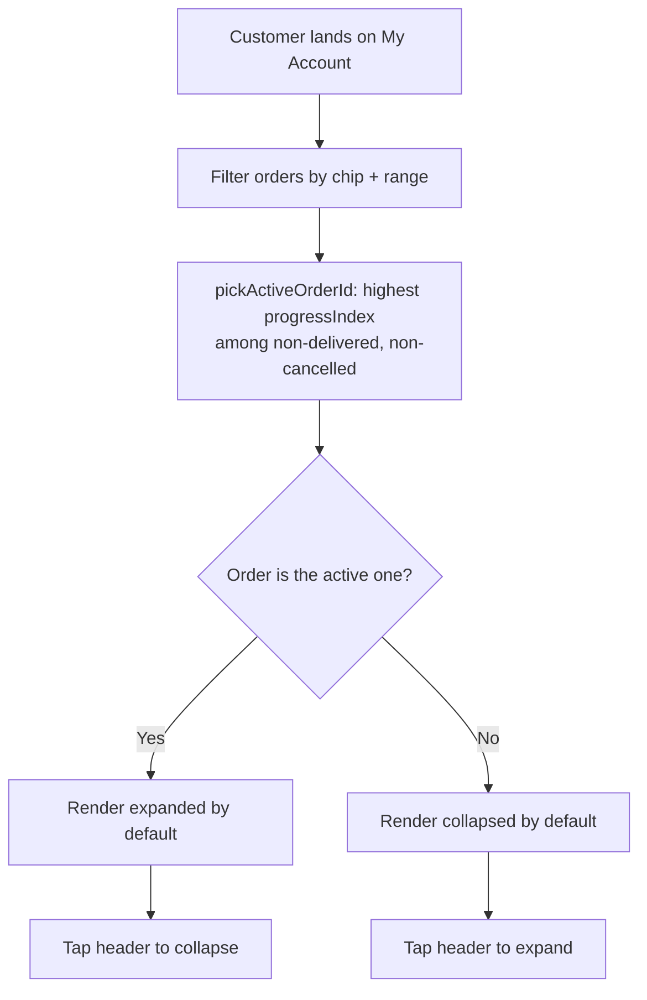
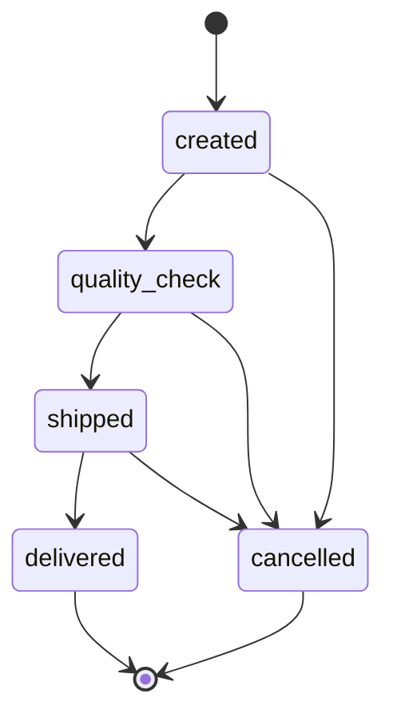
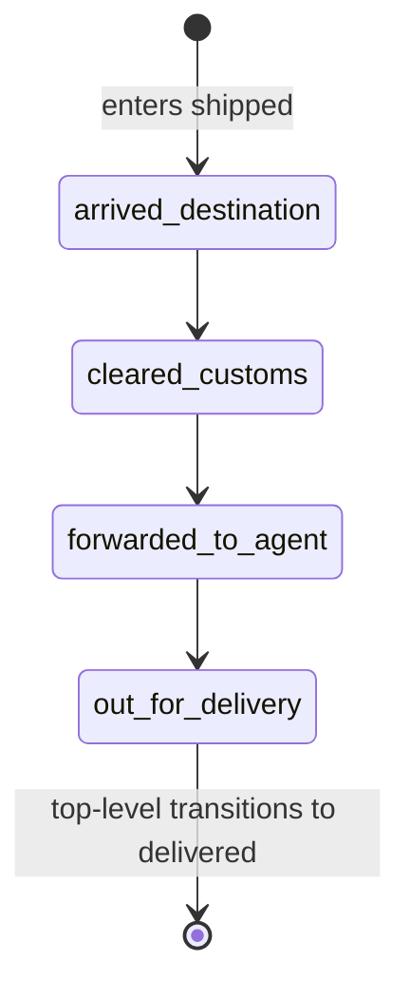
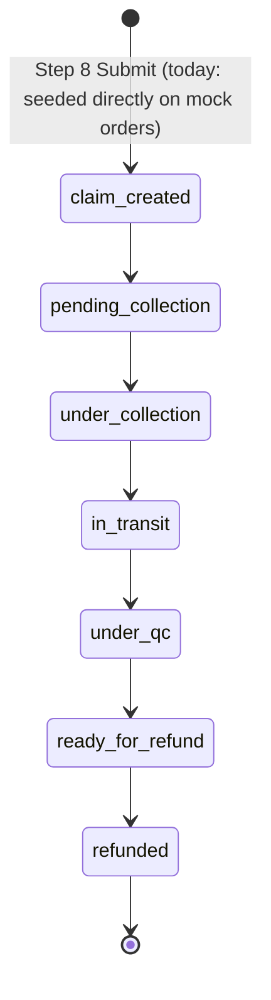
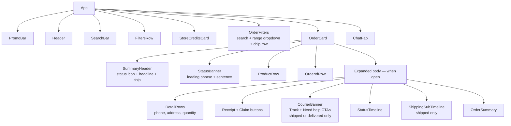

# My Account — Orders Flow

> **Living document.** Update this when the order shape, status model,
> auto-collapse rules, or component structure changes. See
> [`CHANGELOG.md`](../CHANGELOG.md) for the change history.

This document describes how the orders area of the My Account page works in the
prototype. It is written for both product and engineering. Shared context is up
front; deeper architecture sits in the later sections — skim or skip as needed.

---

## 1. Overview

The orders area lives inside the customer's My Account page. It shows every
order the customer has placed, communicates the current shipment status at a
glance, and lets the customer drill into a single order for full details and
post-purchase actions (download receipt, raise a claim, change address while
the order is still actionable, track the parcel via the courier).

This prototype is intentionally narrow: only the orders list and the
expand/collapse interactions are functional. Everything around it (search,
filters, the Revibe Wallet pill, profile menu, language toggle) is decorative
— present for visual fidelity but not wired up.

**In scope**

- Order list with eight demo orders, covering every top-level state plus a cancelled-past order and one delivered order carrying an in-flight return claim.
- Per-order collapsed summary card with status banner.
- Per-order expanded view with full timeline, courier banner, sub-timeline, and order summary.
- Auto-expand rule: only the single most in-flight order is expanded by default; the rest collapse.
- Status chip row that filters the list (`All / In progress / Delivered / Cancelled`).
- Status banner with `delayed` and `statusMessage` overrides.
- **Change-of-mind returns flow** — 9-step mobile overlay launched from the `Raise a claim` button on delivered past orders (see §2.7). Other claim types (faulty / damaged / missing / other) are stubbed on the entry screen.
- **Claim card** — a fourth card type (`ClaimCard`) that tracks a submitted return through seven states (claim created → pending collection → under collection → in transit → under quality check → ready for refund → refunded). Replaces the delivered card for any order carrying a `claim` field. See §2.8.

**Out of scope (faked or stubbed)**

- Authentication, real backend, real customer data.
- Site-wide search and the in-list "Find items" search field.
- Date-range dropdown effect on the list (logic is wired but all mock orders fall inside every range).
- The Revibe Wallet pill in `GreetRow` (purely visual; the balance is a hardcoded prop and the info tooltip is the only interactive part).
- Right-to-left and Arabic localisation.
- Receipt-download flow. Claims flow exists for change-of-mind returns only (see §2.7); other claim types are stubbed.
- Real courier tracking — the "Track order" button hardcodes a known-good DHL Express test shipment so the demo always lands on a real tracking page.
- Return-claim submission — Step 8's Submit advances to a confirmation screen with a generated ref number but does not persist anything.

---

## 2. User flow

### 2.1 What the customer sees

A vertical list of orders, newest first. Each order is rendered as a card.
There are now **four card components** — `InProgressCard`, `OrderCard`,
`PastOrderCard`, and `ClaimCard` — chosen by `App.jsx` based on `statusId`
+ `state` + the presence of an `order.claim` field. All share the same
chrome family (left accent strip, `Order · #{id}` eyebrow, state pill,
tinted hero block, compact product row) so the list reads as one
consistent set; they differ in what the hero leads with and which actions
hang off the bottom.

| Card | Used for | Hero leads with | Expandable? |
|---|---|---|---|
| `InProgressCard` | non-cancelled `created` / `quality_check` | `Delivery by` + ETA | yes |
| `OrderCard` | non-cancelled `shipped`; in-flight cancellations mid-fulfilment | status icon + headline + ETA | yes |
| `PastOrderCard` (delivered) | `statusId === 'delivered'` (non-cancelled, no claim attached) | `Delivered on` + date | no |
| `PastOrderCard` (cancelled past) | `state === 'cancelled' && cancellationStatusId === 'refunded'` (and the refund-hero variant for `requested` / `refund_pending` while in the open list) | `Refund of` / `Refunded` + amount | yes |
| `ClaimCard` | any order carrying an `order.claim` field — replaces the delivered card. Lives in **In progress** while the claim is active; drops to **Past orders** once `claimStatusId === 'refunded'` | `Claim` + status label + claim ref + expected refund | yes |

#### Created and quality_check (`InProgressCard`)

When **collapsed**, the customer sees:

- A small `Order · #{id}` eyebrow at the very top.
- The state pill (`Order placed` for `created`, `Quality check` for `quality_check`) with a `Package` / `ShieldCheck` icon, on its own row beneath the eyebrow. Constant brand-purple tone regardless of `delayed`.
- A brand-purple gradient hero block (`from-brand-bg to-brand-bg2`) carrying `Delivery by` eyebrow on the left + an `On track` tag (with `Zap` icon) on the right; a `text-[26px]` headline using `order.estimatedDeliveryLong || order.estimatedDelivery`; the body sentence from `statusDescription(order).body` underneath; and a `Delivering to [Home]` chip below. When `order.delayed === true` the right-side tag swaps to `Clock` icon + `Taking longer than expected` (still brand-purple, not warn — see §3, "Delayed quality_check stays brand"), and the body sentence pulls the delay-flavored copy from `DELAYED_BODY[statusId]`.
- A compact product row (image / name / variant / `Revibe Care +{currency} {amount}` line / total / chevron). The chevron is decorative; the whole header is one tap target.

When **expanded**, everything above remains visible and below it appears:

- A horizontal `Timeline` dot row (Placed → QC → Shipped → Delivered). Each reached / current step renders the date and time it entered that stage on two lines below the label, sourced from `order.timeline[stepId]`; upcoming steps render the label only. The vertical "Full timeline" that lived in the previous chrome is gone — its content is folded into the dates-under-dots row.
- The `Order details` collapse with delivery address, phone, and order date, plus `Change address` and `Change phone number` pills. The `Change details` action programmatically opens the collapse via ref so the pills are immediately visible.
- A two-action footer: `Cancel order` (danger outline) + `Change details` (brand outline). On `created`, `Cancel order` opens the cancellation bottom sheet (see §2.6); on `quality_check` it's currently a visual stub.

#### Shipped, in-flight cancellations mid-fulfilment (`OrderCard`)

`OrderCard` is the older chrome retained for shipped orders and for
in-flight cancellations that are still mid-fulfilment with
`state === 'cancelled'`. When **collapsed**, the customer sees:

- A small `ORDER · #{id}` eyebrow at the very top of the card so the order number is always visible without expanding (mirrors the hero card's `Active order · #{id}` eyebrow). The order ID is intentionally **not** repeated inside the product strip subtitle — keeping it in the eyebrow lets the product strip read as a clean Product → Revibe Care → Total breakdown.
- A status icon + headline (e.g. "Out for delivery", "Cancelled").
- A subline with the most relevant timestamp (forward-looking ETA when DHL provides one, otherwise the most recent status timestamp).
- A state chip on the right when relevant. Cancelled orders carry a red "Cancelled" chip.
- A horizontal four-step **dot timeline** above the product strip.
- The product image, name, variant, `Revibe Care +{currency} {amount}` line (when the order carries a Revibe Care add-on, prefixed with the small Revibe Care RE_CARE logo), and an uppercase `TOTAL` caption above the bold amount on the right.

When **expanded**, everything above remains visible and below it the customer sees:

- The status banner (long form), the **Shipping progress** sub-timeline (shipped only), and the courier card with the "Track" link.
- The **Order details** collapse with phone, address, and order date.
- The action row: shipped → `Receipt` + `Get help`; in-flight cancelled → `Get help`.
- The four-step **Full timeline** at the very bottom.

#### Delivered (`PastOrderCard` → `DeliveredOrderCard`)

The delivered card is **not expandable** — there is no chevron and no
expanded body. It carries the same chrome family as the in-progress and
refunded cards but with success-green tones and a date-led hero:

- A `w-1` left success-green strip.
- A `Order · #{id}` eyebrow.
- A success-tinted `Delivered` state pill (`PackageCheck` icon).
- A success gradient hero block (`from-success-bg to-[#d4f0e3]`) carrying `Delivered on` eyebrow + `Complete` tag with checkmark; a `text-[26px]` headline using `order.deliveredOnLong` (or the date part of `order.timeline.delivered` as a fallback); a `Delivered to [Home]` chip below.
- A compact product row that surfaces image / name / variant / `Revibe Care +{currency} {amount}` line / total. The Revibe Care line and total are deliberately retained on this card (the refunded card omits both, since its hero already carries the money story) — they're the obvious differentiation between "this finished happily" and "this got refunded".
- The existing right-aligned chip-style footer with `Download receipt` + `Raise a claim`, separated by a top dashed border.

#### Past cancelled (`PastOrderCard` → `CancelledOrderCard`)

The refund-hero card leads with the **refund** as the visual hero rather
than the fulfilment journey. A `w-1` left accent strip carries the phase
tone (warn amber for `requested`, brand purple for `refund_pending`,
success green for `refunded`). A small uppercase `Order · #{id}` eyebrow
sits at the very top; the phase pill sits on its own row below; then a
tinted hero block with the refund amount (`text-[28px]` tabular-nums) and
a destination chip — wallet destinations get a brand→accent gradient chip
(echoes the `GreetRow` credits pill); card destinations get a neutral
chip. Refunded orders surface a `fundsAvailable` sub-copy line ("Available
now in your wallet"); the two earlier phases make no ETA promise.

Expanded reveals a 3-step numbered dot stepper for refund progress
(created-path cancellations skip the `requested` step, mirroring
`cancellationStepsFor` in `statuses.js`). Each reached/current step
carries the timestamp it entered that phase underneath its label (sourced
from `order.cancellationTimeline[step.id]`); upcoming steps render the
label only. Then a dimmed fulfilment trace ending in a red ✕ at the
cancel point, and a two-action footer (`View refund details` + icon-only
`Download receipt`). Tapping `View refund details` opens the
`RefundDetailsSheet` bottom sheet, which is the canonical surface for the
line-item breakdown (product + Revibe Care line items → subtotal → fee
(card refunds only) → total refund). Always collapsed by default; no
auto-expand.

The full `OrderCard` chrome (status banner, sub-timeline, courier banner,
order summary) is no longer rendered for cancelled past orders.
`CancellationSubTimeline` is retained for in-flight orders that are
mid-fulfilment with `state === 'cancelled'`.

The **hero card** (active in-flight order, currently the out-for-delivery
order) carries two stacked rows of full-width buttons beneath the headline,
ETA subtitle, product strip, and dot timeline:

- Row 1: `Track package` (filled white, brand-coloured text — only filled CTA in the app) + `Get help` (ghost, headphones icon).
- Row 2: `Cancel order` + `Raise a claim` (both ghost, same size as row 1).

Tapping `Cancel order` toggles a small dark tooltip centered above the button
— *"You cannot cancel the order at this stage"* — dismissing on outside-click.
The cancellation rule is prototype-only (production should derive eligibility
from `statusId`). The `Delivery by [date]` line under the headline reads
from `order.estimatedDelivery` and only renders when present.

### 2.2 Auto-expand rule



Every card collapses by default. `pickActiveOrderId(orders)` returns the id
of the single most-in-flight order — the one with the highest pipeline
progress (`progressIndex × 10 + subProgressIndex`, in-flight only) — and
`App.jsx` passes `defaultExpanded` only to that card. The rule operates on
the *filtered* list, so picking the "Delivered" chip auto-expands nothing
(no order is in flight), while "All" or "In progress" auto-expands the most
progressed open order. Once the customer taps a card, their state sticks
across filter changes (state lives in `OrderCard`, not derived from
`activeId`).

### 2.3 Top-level state machine



`cancelled` is modelled as a separate **state** on the order, not a top-level
status — see §4.2. This is so a cancelled order can carry the status it was in
when cancellation happened, which informs the timeline rendering.

### 2.4 Shipping sub-state machine

While the top-level status is `shipped`, the order also carries a
**sub-status** describing where the parcel is in DHL's pipeline:



There is intentionally no `delivered` sub-status. When the parcel is delivered,
the order's top-level status moves to `delivered` and the sub-status is no
longer relevant. This avoids having "delivered" in two places at once.

### 2.5 Per-state behaviour cheat sheet

| Top-level state | Card | Auto-expanded | Hero / headline | Tone | Hero tag | Footer actions |
|---|---|---|---|---|---|---|
| created | `InProgressCard` | If most in-flight | `Delivery by` + ETA (`estimatedDeliveryLong`) | brand | "On track" (Zap) | `Cancel order` + `Change details` |
| quality_check | `InProgressCard` | If most in-flight | `Delivery by` + ETA | brand (always — even when `delayed`, see §3) | "On track" (Zap) or "Taking longer than expected" (Clock) when `delayed` | `Cancel order` + `Change details` |
| shipped (sub-status drives headline) | `OrderCard` | If most in-flight | status icon + sub-status label (e.g. "Out for delivery") + `Delivery by` ETA subtitle | brand | banner-driven ("On track" / "Arriving today") | `Receipt` + `Get help` |
| delivered | `PastOrderCard` (delivered branch) | Never (no expand) | `Delivered on` + `deliveredOnLong` | success | "Complete" (Check) | `Download receipt` + `Raise a claim` |
| cancelled — in flight (`state === 'cancelled'` + non-terminal `statusId`) | `OrderCard` | Never | "Cancelled" + status banner | danger | n/a | `Get help` |
| cancelled — past order | `PastOrderCard` (cancelled branch) | Never | `Refund of` / `Refunded` + amount | warn / brand / success per phase | "Requested" / "Processing" / "Complete" | `View refund details` + icon-only `Download receipt` |

### 2.6 Cancellation flow (created stage)

`Cancel order` on a `created` order opens a bottom sheet (`CancelOrderSheet`)
with a max-height of 92vh, a black-45% scrim, and a slide-up entrance.
Dismissible by tapping the scrim, the X icon, or pressing `Escape`.

The flow is two steps for the wallet path and three steps for the
original-payment path. The extra middle step is a take-rate-protection
"dissuade" screen that fires only when both conditions hold:
`method === 'original'` **and** `statusId === 'created'`.

```
              Select
                │
                │  method === 'original' && statusId === 'created'
                ├──────────────────────────────► Dissuade ──► Confirm
                │                                   ▲ back       │
                │                                   │            │
                └──── wallet or other paths ──────► Confirm ─────┴──► close
```

**Step 1 — Choose your refund.** Header (`Cancel order` + `#id`), then an
order-summary card with the product strip and a line-item breakdown
(`Product` + `Revibe Care` if present + `Total`), then two refund options as
radio cards:

- **Revibe Wallet** (wallet icon + tap-toggle info `i`, success-tone detail
  line) — full refund of the order total, available instantly. The
  recommendation is no longer signalled with a `Recommended` pill; instead
  the "Full refund · available instantly" detail line is rendered in
  `text-success font-semibold` so the concrete benefit carries the emphasis.
  The `i` opens a tooltip explaining that wallet credits can be used on any
  product and are combinable with any payment method, with a placeholder
  `terms & conditions` link. Same tooltip surfaces wherever "Revibe Wallet"
  is named (credits pill in `GreetRow`, confirm-step destination line) — all
  driven by the shared `WalletInfoTooltip` component.
- **Original payment method** — total minus a 5% processing fee, refunded
  to the card in 5–10 business days. The amount line names the actual card
  the money is going back to (`{currency} {amount} back to {brand} •• {last4}`,
  e.g. `AED 806.55 back to Visa •• 4242`), driven by `order.paymentMethod`.
  When the order has no `paymentMethod` the line falls back to a generic
  `back to your card`. The fee is shown explicitly as a negative line under
  the amount (e.g. `−AED 42.45 (5% processing fee)`).

The `Continue` CTA is disabled until a method is picked. `Keep order` closes
the sheet without changes. `Continue` routes to **Dissuade** when the
original-payment + created gate fires, otherwise straight to **Confirm**.

**Step 2 (original + created only) — Cancel this order?** A retention screen
designed to give the user a reason to wait rather than cancel. Three blocks
stacked in a single-column body:

1. A centered hero card with the delivery promise: *"You're on track to
   receive your {product name} by"* + a large weekday-formatted
   `estimatedDelivery` (e.g. `Monday, 4 May`). The weekday is computed in
   `formatDeliveryDate(estimatedDelivery, placedAt)`, which parses the
   short form (`"May 4"`) using the year from `placedAt` and emits
   `weekday, day month` via `Intl.DateTimeFormat`.
2. A neutral info-tone strip warning that the item *may not be available to
   reorder later*. Scarcity, not "this is irreversible" — the cancellation
   itself is fully reversible at `created`; the real risk is item supply.
3. A soft-green success-tone strip with `ShieldCheck` icon framing the
   protection: *"If we don't deliver by {order.estimatedDeliveryLong}, the
   {currency} {fee} processing fee is waived."* Anchored on the **delivery**
   date the user is staring at on the hero one line above — same date, same
   commitment, no extra concept to introduce. Earlier drafts anchored this
   on the ship deadline (`shipDeadlineFull`) because Revibe controls ship
   time directly; that's still legible as a business defence but reads as
   procedural to the customer, who only cares about when the box lands.
   Falls back to `estimatedDelivery` (short form) when the long form is
   absent. The `shipDeadline*` fields are kept in the data shape but are no
   longer read by this UI.

Footer has two equal-height chunky buttons (52px, `rounded-[12px]`,
`text-[14.5px]`): a brand-filled `Keep my order` and an outlined
`Continue to cancel` that turns red on hover (`hover:bg-danger-bg
hover:text-danger hover:border-danger`). The earlier draft had a third
muted text link with the same label and an extra `Switch to Revibe Wallet`
button — both were dropped. The wallet switch overrode the user's earlier
method choice (paternalistic) and the muted Continue link buried the
forward path; promoting it to a real button with a red hover state is
clearer about consequence without alarming the default state.

The dissuade step does not show the refund amount or breakdown — those
live one screen later on Confirm, which keeps Dissuade emotional/decisional
and Confirm transactional. `Back` returns to Select; the `X` and `Keep my
order` both close the sheet.

**Step 3 — Confirm cancellation.** A back arrow returns to the previous step
(Dissuade if the user came through it, otherwise Select). Body shows a
centered amount block (`You'll receive` / amount / destination / ETA copy).
On the wallet path the destination line reads `back to your [wallet icon]
Revibe Wallet [i]`, with the same shared info tooltip. On `Original payment
method` the block also carries a muted breakdown line (e.g. `Total AED 849 ·
−AED 42.45 fee`) between the headline figure and the destination, and the
destination line names the same card as Step 1 — `back to your {brand} ••
{last4}` (e.g. `back to your Visa •• 4242`), falling back to `back to your
your card` when `order.paymentMethod` is absent.

Beneath the amount block sits a neutral info-tone strip with method-specific
copy. `Revibe Wallet`: *"Revibe Wallet credit stays on Revibe. It won't be
paid out to your bank account."* `Original payment method`: *"You're giving
up {fee} to the processing fee."* The original-payment copy is intentionally
trimmed to a pure fee reminder — the earlier wallet pitch (*"Choose Revibe
Wallet for the full amount, instantly."*) was removed when Dissuade was
introduced, because doing the wallet upsell twice in a row in the same flow
felt like the company was reluctant to let the user leave. Footer: `Back` +
a danger-filled `Cancel order` CTA. This is the only step on the
original-payment path where the destructive action carries danger styling —
the order of escalation now matches the order of finality.

The current prototype does **not** persist cancellation: tapping the final
`Cancel order` simply closes the sheet (the order keeps its `created` state).
Wiring this to flip `state` to `cancelled` and vary the cancelled-state banner
copy by chosen refund method is a future step.

The 5% fee, the success-tone recommendation styling, and the line-item split
are all prototype-only — production will need to read the eligibility window,
fee rate, recommendation policy, and per-line-item amounts from the backend
per order. The dissuade step fires for both `created` and `quality_check`
orders (`DISSUADE_STATUSES = new Set(['created', 'quality_check'])` inside
`CancelOrderSheet.jsx`); both in-flight demo orders (`89712`, `89510`) carry
`subtotal`, `warranty`, `estimatedDeliveryLong`, and `paymentMethod`, so the
full flow exercises end-to-end on either. Orders past quality_check
(`shipped`, `delivered`) don't surface a `Cancel order` button and never
enter this sheet.

### 2.6.1 Keep-my-order undo (in-flight cancellations)

Once an order has been cancelled but the refund hasn't landed yet (so the
card lives in the `In progress` section as a `PastOrderCard` refund-hero
variant — `cancellationStatusId` is `requested` or `refund_pending`), the
expanded view carries a primary brand-purple `I want to keep my order`
button stacked **above** the existing `View refund details` + icon-only
`Download receipt` row. The button is gated on those two cancellation
states only; on `refunded` (past-orders section) the affordance disappears,
because the money has already left the company and reversing is no longer
a simple cancel-the-cancellation operation.

Tapping it opens `KeepOrderSheet` (`src/components/KeepOrderSheet.jsx`),
a single-step confirm sheet:

- Header: `Keep your order?` + `#id`, X to dismiss.
- Hero card: brand-tinted `RotateCcw` icon over the line *"Your {product}
  will continue through fulfilment as if it was never cancelled."*
- On `refund_pending` only, a neutral info strip names the pending refund
  that will be cancelled: *"Your pending refund of {amount} will be
  cancelled — no money will be returned to your {destination}."* On
  `requested` this strip is suppressed (no refund has been issued yet, so
  there's nothing to retract).
- Footer: outlined `No, continue cancellation` and brand-filled
  `Yes, keep my order`.

Submit is a stub: both footer buttons just close the sheet. See §7 — the
order shape today has no transition to flip `state` back from `cancelled`
to `open` and to clean up `cancellationStatusId` / `cancellationTimeline`.

### 2.7 Change-of-mind returns flow

The `Raise a claim` button on the delivered `PastOrderCard` launches a
nine-step full-screen overlay (`src/components/ClaimFlow/ClaimFlow.jsx`)
for raising a change-of-mind return. Other claim types (faulty / damaged
/ missing / other) appear on the entry screen but route to a placeholder
note rather than their own flows — out of scope for this build.

The flow's visual chrome is deliberately distinct from the order-card
family: white surface, segmented top progress bar (`bg-brand` for reached
segments, `bg-line` for upcoming) + `Step X of 9` caption, sticky bottom
action bar with the only filled brand-purple `Continue` button, and
line-bordered cards that gain a `border-brand bg-brand-bg/30` treatment
when selected. Tinted hero blocks are reserved for one place — the Step 5
device-prep warn callout — so the user can feel the visual shift between
"informational" (account cards) and "doing a task" (the flow) without
leaving the design system.

**Mount + state.** `App.jsx` owns `claimFlowOrderId`. The overlay is
rendered conditionally (`{claimFlowOrderId !== null && <ClaimFlow ... />}`),
so closing it unmounts the reducer state — the brief explicitly forbids
session persistence. The reducer (`flowReducer.js`) takes the entry
`orderId` as its initialiser argument: when launched from a specific
order, `initialState(initialOrderId)` pre-seeds `claimType:
'change_of_mind'`, `orderId`, and `step: 2` so the user lands on the
order picker with that order pre-selected and can back-step to Step 1 if
they want to confirm the claim type. Launching with `null` (e.g. from a
hypothetical top-level entry) starts at Step 1.

**Step-by-step.**

1. **Claim type.** Five vertical option rows. Selecting `Return an item
   (change of mind)` advances. The four out-of-scope options show an
   inline note explaining they aren't part of this build.
2. **Order selection.** `groupOrdersByEligibility(ORDERS)` (see §4.7)
   splits the list into eligible (full-colour, tappable) and ineligible
   (collapsed below, greyed, not tappable). Eligible cards show
   `Eligible to return until {date}` in a success-tone chip; ineligible
   cards show the reason inline (`Cancelled before delivery`, `Delivered
   more than 10 days ago`, `Already refunded`, `Not yet delivered`).
3. **Product & quantity.** Single-product card with a stepper bounded by
   `order.quantity`. When `quantity === 1` the stepper is suppressed and
   the card shows `Returning 1 of 1` — spec asks for an explicit
   pre-confirm rather than a noop control.
4. **Reason (optional).** Five radio options. `Other` reveals a 200-char
   `textarea`. The sticky bar renders a `Skip` button alongside
   `Continue` — both advance, since the step is optional.
5. **Device preparation (gated).** Two stacked radio cards. Option A
   (`I've factory reset the device`, recommended pill) carries an
   `iPhone` / `Android` OS-tabs control, a collapsible numbered reset
   instructions list per OS, and a required confirmation checkbox.
   Option B (`Provide unlock credentials`) carries the same OS tabs, an
   email field, a password field with show/hide toggle, and the
   encryption-disclosure note. `canAdvance` returns false until one
   complete option is filled. A `If you leave this flow, you'll need to
   start over` hint sits below.
6. **Return method.** Three placeholder options (Courier pickup,
   Drop-off, In-store) with timeline + cost notes. Courier pickup
   reveals an inline `Pickup address` textarea; the address must be
   non-empty before Continue enables.
7. **Refund method.** Two stacked refund cards built off
   `refundBreakdown(order, units, method)` (see §4.7). Wallet card:
   `recommended` success pill + full amount + wallet-info tooltip
   reusing the shared `WalletInfoTooltip` + `REVIBE_WALLET_ICON`.
   Original-payment card: net amount with the gross shown struck-through
   and the 10% restocking fee broken out explicitly. The card label uses
   `order.paymentMethod.brand` + `last4`.
8. **Review & submit.** Sectioned summary with an inline `Edit` link per
   section dispatching `GO_TO_STEP` to jump back to the originating
   step. Device-prep is masked to `Factory reset confirmed` /
   `Credentials provided` — credentials are never displayed in plain
   text. The refund block shows the final net the user receives. The
   sticky bar swaps `Continue` for a success-tone `Submit return
   request`.
9. **Confirmation.** `generateClaimRef()` produces a `RET-XXXXXXXX`
   reference shown with a `Copy` button. Next-steps list:
   `Check your inbox` (email instructions stub), `Expected refund`
   (amount + destination + method-keyed timeline), `Device preparation`
   (reinforcement of the commitment from Step 5). Two footer buttons:
   `Track this return` (stub) + `Back to my account` (closes overlay).

**Eligibility logic** (`eligibilityFor(order, today)` in
`src/lib/returns.js`):

1. `state === 'cancelled'` → ineligible. `cancellationStatusId ===
   'refunded'` → "Already refunded"; otherwise → "Cancelled before
   delivery".
2. `statusId !== 'delivered'` → "Not yet delivered".
3. Delivery date unknown (no `deliveredOn` and no parseable
   `timeline.delivered`) → "Delivery date unknown".
4. `now > deliveredOn + 10 days` → "Delivered more than 10 days ago".
5. `order.returnedAt` set (future hook, not populated today) → "Already
   returned".
6. Otherwise → eligible, with `untilDate = deliveredOn + 10 days`.

The eligibility check prefers the new `deliveredOn` ISO field
(`'2026-05-08'`) and falls back to parsing the date portion of
`timeline.delivered` against the year from `placedAt`.

**Refund math** (`refundBreakdown(order, units, method)`):

- `unitPrice` from `order.unitPrice` (falls back to `subtotal`, then
  `total`).
- `gross = unitPrice * units`.
- Wallet: `fee = 0`, `net = gross`.
- Original payment: `fee = round(gross * 0.10)`, `net = gross - fee`.

**Submission is a stub.** Step 8's submit calls
`dispatch({ type: 'SUBMIT', value: generateClaimRef() })` which just
advances to Step 9. No persistence, no API call. The flow has no
backend hook today.

### 2.8 Claim card (return tracking)

Once a return claim exists for an order, the delivered `PastOrderCard` is
replaced by `ClaimCard` — a fourth card type that tracks the claim
through seven states and surfaces the summary captured during the
returns flow.

**State machine.**



The seven states live in `CLAIM_STATUSES` inside `src/lib/claims.js` —
add, rename, or reorder steps there and the card picks them up. The
prototype today renders one mock claim, seeded on order `89219` in the
`under_qc` state (see §4.8); rebuilding additional mock claims for
design review is a matter of attaching extra `claim` objects to other
delivered orders.

**Tone progression.** The card's left accent strip, state pill, hero
block, and 7-step progress dots all share a tone driven by
`claimToneFor(claimStatusId)`:

- `claim_created` → `pending_collection` → `under_collection` → `in_transit` → `under_qc` → **warn (amber)** — the unit is leaving the customer or undergoing verification, an unresolved state.
- `ready_for_refund` → **brand (purple)** — the payout is being staged, which is the same "active processing" tone the refund-hero card uses for `refund_pending`.
- `refunded` → **success (green)** — terminal, the money has moved.

This piggybacks the existing `warn` / `brand` / `success` tokens — no
new colour was added — and matches the convention `PastOrderCard` uses
for its cancelled-past variants, so the language reads as one system.

**Collapsed view.**

- Left accent strip (tone-driven).
- `Order · #{id}` eyebrow.
- State pill with the current status's `headline` and a tone-coloured dot (`Pending collection`, `Under Quality Check`, etc.).
- A tinted hero block carrying: `Claim` eyebrow on the left + a tone-coloured phase tag on the right (icon + label — `Submitted` / `Awaiting pickup` / `Collected` / `On the way` / `In review` / `Processing` / `Complete`); the status headline as a `text-[22px]` headline in the tone colour; a sub-line with the `claim.claimRef` (tabular-nums) and the most recent timeline timestamp; then, separated by a faint divider, an `Expected refund` (or `Refunded` once terminal) eyebrow + destination chip on the left and the net refund amount in `text-[22px]` tabular-nums on the right. The destination chip reuses the brand→accent gradient treatment when the refund is wallet-bound (echoes the `GreetRow` credits pill) and a neutral chip when the refund goes back to the original card.
- A compact product row (image / name / variant / `Revibe Care +{currency} {amount}` line / total / chevron). The chevron is decorative; the whole header is one tap target.

**Expanded view.**

1. A 7-step horizontal dot timeline using `CLAIM_STATUSES`. Reached/current dots are filled in the tone colour with the same `shadow-[0_0_0_4px_rgb(255,242,221)]` glow on the current step that `InProgressCard` uses for its top-level timeline. Each reached step renders its date and time on two lines below the label, sourced from `claim.timeline[step.id]`.
2. A small `Original order — Delivered {date}` trace line (the underlying order's `deliveredOnLong`, or the date part of `timeline.delivered`) so the customer keeps context that the delivery itself was completed.
3. A two-action footer: `View claim details` (opens `ClaimDetailsSheet`) + icon-only `Download receipt` (decorative).

**Claim details sheet.** `ClaimDetailsSheet`
(`src/components/ClaimDetailsSheet.jsx`) is a bottom sheet mirroring
`RefundDetailsSheet`'s chrome (`bg-black/45` scrim, slide-up panel,
`Escape` to close, body-scroll lock). It carries two cards:

- **Summary** — the read-only set of choices captured during the returns flow: reason (mapped via `REASON_LABELS`; falls back to the free-text `otherText` when the user picked `Other`), units (e.g. `1 of 1`), device preparation (masked to `Factory reset confirmed` / `Credentials provided` — never plain credentials), return method (with the pickup address shown underneath when the method is `courier`), refund destination (wallet icon or card chip + `Includes 10% restocking fee` sub-copy when method is `original`), and `Submitted` timestamp.
- **Refund** — `Expected refund` (or `Refunded` once terminal) row with the net amount in `text-[18px]` tabular-nums. Original-payment refunds also show a small `Gross ... · Restocking fee − ...` line so the math is visible.

The summary content used to live inline inside the expanded card; it
was pulled into the sheet so the expanded body stays focused on
progress and the underlying order context, with the full breakdown one
tap away.

**Section placement.** `App.jsx` routes orders based on claim state:

- `hasActiveClaim(order)` returns true when an order has a `claim` field whose `claimStatusId !== 'refunded'`. Such orders are included in `isOpen` and surface in the **In progress** section, regardless of the underlying order's `statusId` (which stays `delivered`).
- `isClaimRefunded(order)` returns true for refunded claims; these surface in the **Past orders** section.

Filter counts reflect the same rules — an in-flight claim counts toward
the `in_progress` chip and is excluded from `delivered`; a refunded
claim counts toward `delivered` (the underlying order was delivered and
the journey is complete). No new filter chip was added for claims;
revisit when more than one or two claim cards routinely show at once.

**Auto-expand rule.** `ClaimCard` does not currently participate in
`pickActiveOrderId`. Fulfilment in-flight orders still win the
auto-expand slot when both are present; claim cards collapse by
default. If a customer-research pass shows users want their active
claim opened on land, extend the rank function in `src/lib/statuses.js`
to consider `claimProgressIndex` from `src/lib/claims.js`.

**Source of truth.** `src/lib/claims.js` owns the status list, tone
mapping, progress index, phase tag, headline + sub-line resolution, and
the summary-label maps (`REASON_LABELS`, `RETURN_METHOD_LABELS`,
`reasonText`, `devicePrepText`, `refundMethodLabel`). Edit copy or add a
new claim state here, not in the components. Submission persistence is
still out of scope — Step 9 of `ClaimFlow` generates a claim ref and
ends, and the prototype's `order.claim` data is hand-seeded.

---

## 3. UX decisions and rationale

These decisions came out of phase-2 review and are worth preserving so future
contributors understand why the prototype looks the way it does.

**Two-tier status model.** We considered flattening the four shipping
sub-statuses into the top-level timeline, which would have produced a
nine-step horizontal timeline. On a 430px-wide mobile column this is
unreadable. Instead the top timeline always shows the four high-level stages
(created → quality check → shipped → delivered), and the shipping sub-statuses
are exposed as a vertical sub-timeline that only appears when relevant.

**Courier banner elevated out of the order summary.** Previously the courier
name was a small hyperlink buried inside the summary table. It is now a
dedicated banner with explanatory copy ("Have a question about your delivery?
Contact the courier directly...") and a primary "Track order" CTA. The CTA is
the only filled brand-purple button in the app — a deliberate departure from
the otherwise-outlined button language, because we wanted the action to read
as a primary call-to-action.

**Auto-expand the active order, not the terminal ones.** Every card collapses
by default; only the single most in-flight order auto-expands. This keeps the
list scannable while still surfacing the order most likely to need attention.
Earlier the rule was the inverse (collapse only delivered/cancelled), which
left three or four orders open at once and pushed everything below the fold.

**Status banner sits in the always-visible card header.** Each card carries a
tinted banner with a colored leading phrase + descriptive sentence. The
leading phrase describes *condition* (`On track`, `Arriving today`, `All done`,
`Refund in progress`, `Taking longer than expected`) — never the process step,
since the headline already shows that. Tone resolution: `state === 'cancelled'`
→ red, `delayed === true` → orange, otherwise the per-status default (brand
purple for in-flight, green for delivered). `order.statusMessage` overrides
the body string in any branch — that's the production hook for ad-hoc
backend-injected updates without changing status.

**Delayed quality_check stays brand.** `InProgressCard` deliberately ignores
`statusDescription`'s warn tone for the in-progress hero — even when
`delayed: true`, the hero gradient, headline color, accent strip, and state
pill stay brand-purple. The delay signal is preserved in two subtler ways:
the right-side tag swaps `Zap`/"On track" for `Clock`/"Taking longer than
expected" (still brand-coloured), and the body sentence pulls the
delay-flavored copy from `DELAYED_BODY[statusId]`. This was a product
decision — the warn-amber treatment felt overly alarming for a normal QC
slowdown and broke visual cohesion with the other in-progress cards. The
full warn-amber treatment still exists for `OrderCard`'s shipped cards via
`statusDescription`.

**Delivered chip overrides the data's `state: 'close'`.** Delivered orders carry
`state: 'close'` in the data, but customers see a green "Delivered" pill instead
of the orange "Close" pill. The override lives in `OrderCard`'s `SummaryHeader`
so the data shape stays unchanged.

**Filled brand-purple horizontal timeline for reached stages.** Reached
stages and the connectors between them are filled with brand purple, not
gray. The current step's label is bold so it remains identifiable without
changing the dot treatment. Future stages stay outlined and gray.

**Forward-looking subline when ETA is available.** DHL provides an estimated
delivery date sometimes, not always. When present, the collapsed-card subline
reads "Delivery by [date]" — a customer-facing, future-tense answer to "when
is it coming." When absent it falls back to "Updated [timestamp]".

**Whole header is the tap target.** The chevron is decorative — tapping
anywhere on the collapsed-card header expands the card. Larger tap targets
are friendlier on mobile, and there is currently no rival action competing
for the same area.

---

## 4. Data model

The orders array (`src/data/orders.js`) is mock data today. Production will
swap it for an API response of the same shape.

### 4.1 Top-level fields

Each order object carries:

- **`id`** — the human-readable order number shown in the header (string).
- **`phone`** — the customer's phone number on the order (string).
- **`address`** — the delivery address on the order (string, free text).
- **`placedAt`** — the order timestamp shown on the summary screen (string, formatted).
- **`quantity`** — number of items in the order (integer).
- **`subtotal`** *(optional)* — product-only amount, no currency symbol. Used to render the line-item breakdown inside the cancellation sheet. When absent the sheet falls back to `subtotal = total`. Populated on every demo order today.
- **`warranty`** *(optional)* — Revibe Care add-on amount, no currency symbol. The field name is kept as `warranty` for backwards compatibility with the order shape; only the user-facing copy changed. When present it renders as a `Revibe Care +{amount}` line (prefixed with the Revibe Care logo) on the OrderCard / HeroCard / PastOrderCard product strip and as a `Revibe Care` row in the cancellation sheet's breakdown; all of these are omitted when the field is absent. Populated on every demo order today (varied amounts so the pattern is visible across the list).
- **`total`** — total amount paid (number, no currency symbol). When `subtotal` and `warranty` are both present, `total` should equal their sum.
- **`currency`** — three-letter currency code (string, e.g. "AED").
- **`customerName`** — the recipient's full name (string).

### 4.2 Status fields

Two parallel fields describe where the order is.

- **`statusId`** drives the four-step progression timeline. Valid values: `created`, `quality_check`, `shipped`, `delivered`.
- **`subStatusId`** is only meaningful while `statusId` is `shipped`. Valid values: `arrived_destination`, `cleared_customs`, `forwarded_to_agent`, `out_for_delivery`. May be omitted on a shipped order if DHL has not yet returned a sub-status.
- **`state`** is a parallel "header state" used for chips and filter classification. Valid values: `open` (default), `close`, `cancelled`. State is independent of progression — for example, a cancelled order keeps the `statusId` it had at cancellation.
- **`delayed`** *(optional, boolean)* — when true, the status banner switches to the warn (orange) tone with a delay-flavored body keyed by `statusId`.
- **`statusMessage`** *(optional, string)* — overrides the status banner's body text. The leading phrase and tone are still computed from `state` / `delayed` / `statusId`. Production hook for ad-hoc backend-injected notes.

### 4.3 Tracking and courier fields (only present once shipped)

- **`courier`** — name of the carrier shown in the banner (string). Today this is always `"DHL"`; the field exists so we can support multiple carriers later.
- **`trackingNumber`** — courier-issued tracking number, shown in the order summary (string).
- **`trackingUrl`** — gates whether the "Track order" CTA renders (truthy → render). The CTA's `href` itself is **hardcoded** to a known-good DHL Express test shipment so the demo always lands on a real tracking page; the per-order URL is ignored. Production should template `tracking-id` on `order.trackingNumber`.
- **`estimatedDelivery`** — DHL's forward-looking ETA, used as the collapsed-card subline when present (string, free-text date). **Optional** — DHL doesn't always communicate this. Code paths must handle absence gracefully.
- **`estimatedDeliveryLong`** *(optional, string)* — the human-readable long form of `estimatedDelivery` (e.g. `"Monday, 4 May"`), used as the big `text-[26px]` headline inside `InProgressCard`'s hero block. Mirrors the `placedAt` / `placedAtFull` and `shipDeadline` / `shipDeadlineFull` pattern: a short machine-ish form and a pre-formatted long form, so the component never has to do weekday arithmetic. The hero falls back to `estimatedDelivery` (short form) when this is absent. Populated today on `89712` and `89510`.
- **`deliveredOnLong`** *(optional, string)* — long-form delivery date (e.g. `"Wednesday, 15 April"`) used as the big headline inside the redesigned delivered card's hero block. Falls back to the date part of `order.timeline.delivered` (split on ` · `) when absent. Populated today on `89657`.
- **`shipDeadline`** *(optional, string)* — the latest shipping date allowed by the Revibe 1–3 working-day ship SLA, short form (e.g. `"May 1"`). Surfaced only on the dissuade step of the cancellation flow (see §2.6). Today only populated on `89712` (the `created` order) because dissuade only fires at `created`.
- **`shipDeadlineFull`** *(optional, string)* — the human-readable long form of `shipDeadline` (e.g. `"Friday, 1 May"`), embedded into the fee-waiver copy on the dissuade step. The pair mirrors the `placedAt` / `placedAtFull` pattern: a short machine-ish form and a pre-formatted long form, so the component never has to do working-day arithmetic.

### 4.4 Timeline fields

Two related objects record when each milestone happened.

- **`timeline`** is keyed by top-level status id. It carries the timestamp at which the order entered each top-level stage. Keys are populated as the order progresses, not all at once. A `created` order will have only `timeline.created`; a delivered order will have all four.
- **`subTimeline`** is keyed by sub-status id. It carries the timestamp at which the parcel entered each sub-stage during the shipped phase. Only present on shipped (and later delivered) orders, and only as DHL emits each sub-status.

### 4.5 Refund fields (cancelled past orders only)

Cancelled past orders carry a `refund` object that drives `PastOrderCard`'s
refund-hero treatment. In-flight cancelled orders (still mid-fulfilment) and
non-cancelled orders do not need this field.

- **`refund.subtotal`** — pre-fee refund amount, no currency symbol (number). Sum of `refund.breakdown` line items.
- **`refund.fee`** *(optional, object)* — `{ label, rate, amount }`. Present only on card refunds (5% processing fee applied at cancellation per the `CancelOrderSheet` policy). Absent on wallet refunds. `rate` is the decimal (e.g. `0.05` → rendered as `(5%)` next to the label); `amount` is the currency value subtracted from `subtotal` to arrive at `amount`.
- **`refund.amount`** — **net** refund amount actually sent to the destination (number). Equals `subtotal - fee.amount` when a fee is present, otherwise `subtotal`. This is what the hero displays.
- **`refund.destination`** — where the refund is going. `{ kind: 'wallet', label: 'Revibe Wallet' }` for wallet refunds; `{ kind: 'card', label, last4 }` for card refunds.
- **`refund.breakdown`** — array of `{ label, amount }` line items summing to `refund.subtotal`. Rendered inside `RefundDetailsSheet`.
- **`refund.fundsAvailable`** *(optional, string)* — short status copy shown under the hero amount. Only surfaced on `refunded` orders today; future card-refund ETAs ("Expected by 22 May") could also populate it.

### 4.6 Product fields

Today an order has one product. The `product` object carries:

- **`name`** — display name (string).
- **`variant`** — variant string (e.g. "Black / 32 GB / Good").
- **`image`** — path to the product image asset.

Multi-item orders are out of scope for the prototype.

### 4.7 Returns-flow fields (delivered orders only)

Optional fields populated only on the demo order that's wired up as
eligible for change-of-mind return today (`89657`). Other orders fall
back to `subtotal`/`total` for refund math and render as ineligible in
the order picker, so absence is benign.

- **`deliveredOn`** *(optional, string)* — ISO date (`'2026-05-08'`) used as the canonical delivery date for the 10-day return-window check in `eligibilityFor`. Code falls back to parsing `timeline.delivered` when absent (less robust — only present-year dates resolve correctly).
- **`unitPrice`** *(optional, number)* — per-unit price used by `refundBreakdown` to compute `gross = unitPrice * units` for partial returns. Falls back to `subtotal` (then `total`) when absent, which means single-unit orders compute correctly without the field but multi-unit returns will over-refund unless `unitPrice` is set.
- **`paymentMethod`** *(optional, object)* — `{ type, brand, last4 }`. Originally introduced for the returns flow (Step 7's `Visa •• 4242` label on the original-payment refund card, plus Steps 8 & 9), now also consumed by `CancelOrderSheet`'s `Original payment method` option on Step 1 and the destination line on Step 3 — see §2.6. Populated today on the delivered `89657` (Visa 4242) plus the two in-flight `89712` (Visa 4242) and `89510` (Mastercard 8210); the third in-flight demo order, `89499`, is already cancelled so the cancel flow never opens for it. When absent the labels fall back to a generic `your card` (cancel flow) / `Card •• 0000` (returns flow).
- **`deviceOs`** *(optional, string, `'ios' | 'android'`)* — seeds Step 5's OS-tabs control (factory-reset instructions + credentials field labels). Defaults to `'ios'` when absent.
- **`returnedAt`** *(future hook, not populated today)* — when set, makes the order ineligible for change-of-mind return with reason `Already returned`.

### 4.8 Claim fields (orders with an active or completed return)

Optional object populated on a delivered order to drive `ClaimCard` (§2.8).
Today only `89219` carries one (`under_qc` state) for design review.
Production will write this object when the returns flow's Step 8 submit is
wired up to persist.

- **`claim.claimRef`** — `RET-XXXXXXXX` reference shown on the card hero and in the details sheet header. Generated by `generateClaimRef()` in `src/lib/returns.js`.
- **`claim.claimStatusId`** — one of `claim_created`, `pending_collection`, `under_collection`, `in_transit`, `under_qc`, `ready_for_refund`, `refunded`. Drives the tone, hero copy, progress dot index, and section routing in `App.jsx`.
- **`claim.type`** — claim type id (today only `change_of_mind`).
- **`claim.submittedAt`** — human-readable timestamp for the `Submitted` row in `ClaimDetailsSheet`.
- **`claim.units`** — integer; matches the value chosen at Step 3 of the returns flow.
- **`claim.reason`** — `{ value, otherText }` where `value` is one of the keys of `REASON_LABELS` (`no_fit`, `better_option`, `changed_mind`, `mistake`, `other`); `otherText` is populated only when `value === 'other'`.
- **`claim.devicePrep`** — `{ option, os }` where `option` is `'reset'` or `'credentials'` and `os` is `'ios'` or `'android'`. Surfaced as the masked `Factory reset confirmed` / `Credentials provided` row; raw credentials are intentionally not persisted.
- **`claim.returnMethod`** — `{ id, address }` where `id` is one of the keys of `RETURN_METHOD_LABELS` (`courier`, `dropoff`, `store`). `address` is the pickup address typed at Step 6 when `id === 'courier'`; empty string otherwise.
- **`claim.refundMethod`** — `'wallet'` or `'original'`. Drives the destination chip on the hero and the `Includes 10% restocking fee` sub-copy in the details sheet when `original`.
- **`claim.expectedRefund`** — `{ gross, fee, net, rate }`, pre-computed at submission time so the card doesn't re-run `refundBreakdown` on every render. `net` is what the hero displays. `fee` is `0` on wallet refunds; on original-payment refunds it's `gross * 0.10` per the 10% restocking-fee rule in `src/lib/returns.js`.
- **`claim.timeline`** — map keyed by `claimStatusId` carrying the timestamp at which the claim entered each phase. Populated progressively as the claim moves; the card renders the date/time under each reached dot.

---

## 5. Component architecture

### 5.1 File layout

```
src/
├── App.jsx                       Page composition; owns filter state + active-id wiring + claimFlowOrderId
├── main.jsx                      Vite entry point
├── index.css                     Tailwind directives + base styles
├── data/
│   └── orders.js                 Mock orders array
├── lib/
│   ├── statuses.js               Top-level + sub-status definitions, status-banner copy + tone, pickActiveOrderId, helpers
│   ├── returns.js                Return-eligibility logic, refund math, formatting helpers, claim-ref generator
│   └── claims.js                 Claim-state list, tone map, progress index, headline/sub-line, summary-label maps for ClaimCard
└── components/
    ├── PromoBar.jsx              Magenta promo strip at the top
    ├── Header.jsx                Logo, language, profile, wishlist, bag
    ├── SearchBar.jsx             Site-wide search field (decorative)
    ├── FiltersRow.jsx            Filters icon + profile chip
    ├── StoreCreditsCard.jsx      Wallet balance card (gradient amount + clipboard icon; decorative)
    ├── OrderFilters.jsx          Search field + range dropdown + status chip row (controlled)
    ├── OrderCard.jsx             Expandable order card; today only renders shipped + in-flight cancelled mid-fulfilment
    ├── InProgressCard.jsx        Expandable card for non-cancelled created/quality_check (refund-hero chrome family)
    ├── PastOrderCard.jsx         Past-orders card; branches on `order.state` into delivered (no expand) and cancelled-past variants
    ├── ClaimCard.jsx             Expandable card for orders carrying a `claim` field — tracks the 7-state return journey
    ├── ClaimDetailsSheet.jsx     Bottom sheet opened by ClaimCard's `View claim details` action — Summary + Refund cards
    ├── CancelOrderSheet.jsx      Two- or three-step bottom sheet for cancelling a created / quality_check order
    ├── KeepOrderSheet.jsx        Single-step confirm sheet for reversing an in-flight cancellation
    ├── RefundDetailsSheet.jsx    Bottom sheet for the past cancelled card's `View refund details` action
    ├── StatusBanner.jsx          Tinted status banner with leading phrase + sentence
    ├── StatusTimeline.jsx        Horizontal 4-step timeline
    ├── ShippingSubTimeline.jsx   Vertical sub-status timeline
    ├── CourierBanner.jsx         Tracking banner with "Track order" + "Need help with delivery?" CTAs
    ├── OrderSummary.jsx          Summary table inside the expanded card
    ├── ChatFab.jsx               Floating chat-with-support button
    └── ClaimFlow/                Change-of-mind returns flow (see §2.7)
        ├── ClaimFlow.jsx         Overlay shell: useReducer, sticky header + progress, step router, sticky action bar
        ├── flowReducer.js        State shape, action creators, canAdvance(state, order) per-step validation
        ├── ProgressBar.jsx       Segmented 9-step progress bar + "Step X of 9" caption
        ├── StickyActionBar.jsx   Sticky bottom button bar (Continue / Submit / optional secondary)
        ├── StepHeading.jsx       Shared 24px step heading + 13.5px muted subtitle
        ├── Step1ClaimType.jsx    Five claim-type options; only "change of mind" advances
        ├── Step2OrderSelection.jsx Eligible cards + collapsible ineligible group with reasons
        ├── Step3ProductQuantity.jsx Product card + quantity stepper (or "Returning 1 of 1" when quantity is 1)
        ├── Step4Reason.jsx       Optional reason radio + free-text reveal on "Other"
        ├── Step5DevicePrep.jsx   Gated: factory-reset path (OS tabs + instructions + checkbox) or credentials path
        ├── Step6ReturnMethod.jsx Return method radios with conditional address textarea
        ├── Step7RefundMethod.jsx Wallet vs original-payment refund cards with the 10% fee broken out
        ├── Step8Review.jsx       Sectioned summary with per-section Edit links jumping to that step
        └── Step9Confirmation.jsx Success state with claim ref + Copy + next-steps list
```

### 5.2 Component tree



`SummaryHeader`, `ProductRow`, and `OrderIdRow` are inner sub-components of
`OrderCard` (defined in the same file) — they are not separately exported.

### 5.3 Where API integration lands

When the backend is ready, the swap is small. `App.jsx` currently imports
the static `ORDERS` array from `src/data/orders.js`. Replace that import
with a fetch (or a hook) that returns an array of objects matching the shape
in §4. No component below `App` needs to change as long as the response shape
is preserved.

The auto-expand decision is centralised in `pickActiveOrderId(orders)`
(`src/lib/statuses.js`). `App.jsx` calls it on the *filtered* list and passes
`defaultExpanded={order.id === activeId}` to each card.

---

## 6. Extension points

These are the common changes a future contributor will want to make. Each is
intentionally cheap to do.

**Add a new top-level status.** Add an entry to the `STATUSES` array in
`src/lib/statuses.js`. The horizontal `StatusTimeline` is data-driven and will
render the new step automatically. Update `statusHeadline` and
`statusIconFor` to give the new status a customer-facing label and icon.

**Add a new shipping sub-status.** Add an entry to `SHIPPING_SUB_STATUSES` in
the same file. Pick a Lucide icon and import it next to the existing ones.
The vertical `ShippingSubTimeline` will render the new row automatically.

**Add a new order state.** Extend `ORDER_STATES` with a key, label, chip
treatment, and summary text class. The chip will appear in the collapsed-card
header and the order summary will pick up the colour treatment.

**Add a new courier.** Set `order.courier` to the new name and provide
`trackingUrl`. The `CourierBanner` displays whatever name the order carries.
If the courier needs different copy, branch on `order.courier` inside
`CourierBanner.jsx`.

**Change the auto-expand rule.** Edit `pickActiveOrderId` in
`src/lib/statuses.js`. One source of truth — `App.jsx` calls this helper on
the filtered list.

**Change status banner copy or tone.** Edit `STATUS_DESCRIPTIONS` and
`DELAYED_BODY` in `src/lib/statuses.js`. The leading phrase should describe
*condition* (`On track`, `Arriving today`, etc.), not the process step. To
add a new tone, also extend the `TONES` map in `src/components/StatusBanner.jsx`.

---

## 7. Mocked vs production gap

What looks real in the prototype but is faked:

- **Order data.** Five hand-written orders in `src/data/orders.js`. Production needs a fetch endpoint returning the same shape.
- **Authentication.** No login, no session, no per-customer scoping.
- **DHL integration.** "Track order" hardcodes a known-good DHL Express test shipment (`tracking-id=3392654392`) so the demo always lands on a real tracking page. Production should template `tracking-id` on `order.trackingNumber`. "Need help with delivery?" links to DHL's generic customer-service page.
- **`delayed` is a static flag.** In the prototype it's hand-set on `orders.js`. Production should derive lateness from comparing `estimatedDelivery` (or step ETAs) against current time / SLA. The `statusMessage` field is the production hook for ad-hoc backend-injected updates.
- **`estimatedDelivery` format.** Currently a freeform string (`"Wed, 29 Apr 2026"`). DHL's real shape may include time windows and structured data; we'll need to revisit when integrating.
- **Single carrier.** Code is generalised but mock data uses DHL only. Adding a second carrier requires no code change.
- **Single-item orders.** The product object is a single entry. Multi-item orders need a `products[]` array and a layout adjustment.
- **Download receipt.** Buttons are present but do nothing. Production needs a receipt-render endpoint.
- **Raise a claim** on delivered orders launches the change-of-mind returns flow (§2.7). The flow is fully interactive end-to-end but does not persist submissions — Step 8's submit advances to Step 9 with a client-generated `RET-XXXXXXXX` reference. Production needs the submission endpoint, real return-shipping rules, the 4 non-change-of-mind claim branches, and a `returnedAt` flag on the order so a returned item drops out of the eligibility picker.
- **`ClaimCard` is data-only** (§2.8). The card renders entirely off the `order.claim` object — one mock claim is hand-seeded on order `89219` for design review. Step 9 of `ClaimFlow` still does not persist, so submitting a return through the flow does not create a `ClaimCard` in the list. Production needs: (a) the submission endpoint writing the `claim` object back to the order; (b) a webhook or polling mechanism to move the claim through the 7 states as the warehouse handles the unit; (c) the `View claim details` and icon-only `Download receipt` buttons wired (today both are decorative); (d) a `Cancel claim` action — currently no in-flight cancellation affordance exists for a submitted return.
- **`I want to keep my order` on in-flight cancelled cards** (§2.6.1) opens `KeepOrderSheet`'s confirm step; tapping `Yes, keep my order` just closes the sheet — `state` stays `cancelled` and the `cancellationStatusId` / `cancellationTimeline` are untouched. Production needs a reverse-cancellation endpoint, the rules for which cancellation phases are still reversible (e.g. refund_pending becomes irreversible the moment funds are released to the processor), and a state-machine transition that lifts the order back to its pre-cancellation `state` while clearing the cancellation fields cleanly.
- **Site-wide search, in-list "Find items" search, Revibe Wallet pill.** Visual placeholders, no logic. The wallet balance is a hardcoded prop; the wallet info tooltip's `terms & conditions` link goes nowhere (`href="#"`).
- **Date-range dropdown.** Logic is wired (parses `placedAt`, filters by cutoff) but visibly inert because all five mock orders fall inside every range. Status chips do filter the list.
- **Inter font.** Production is Graphik; we substituted Inter via Google Fonts because Graphik is licensed.
- **Brand assets.** Local copies in `public/` rather than CDN-served.
- **No analytics or instrumentation.** No event tracking on expand/collapse, track-clicks, etc.

---

## 8. Open questions and future work

Items deliberately parked rather than built.

- **Domestic vs international sub-status branching.** All shipped orders show all four sub-statuses (arrived in destination country → cleared customs → forwarded to third-party agent → out for delivery). For a domestic UAE shipment, "cleared customs" doesn't apply. Worth adding an `isInternational` flag and conditionally rendering.
- **Real DHL ETA shape.** Today `estimatedDelivery` is a freeform string. Real DHL responses may carry structured date + time windows + multiple datapoints; the helper `statusSubline` and the collapsed-card UI will need updating.
- **Derive `delayed` from data, not a flag.** Today `delayed: true` is hand-set in `orders.js`. Production should compare timestamps against an SLA contract and set the warn-tone banner automatically.
- **Make the date-range dropdown visibly affect the demo.** Either backdate one of the mock orders past 30 days, or add a `Today` preset that excludes the older ones.
- **Hook the in-list "Find items" search and the global search bar to anything.** Both are decorative.
- **"Copy voucher code" actually copies.** The clipboard icon is decorative.
- **Returned and refunded states.** Not modelled. Likely additions to `ORDER_STATES` plus their own banner copy.
- **Re-order CTA on delivered orders.** Common pattern; not currently present.
- **Forward-looking ETA inside `CourierBanner`.** Currently the banner copy is generic; the ETA shows in the collapsed-card subline only. Could surface in both places.
- **Receipt download.** Stubbed button today; the returns flow is built (see §2.7).
- **Returns flow — branches beyond change-of-mind.** Faulty / damaged / missing / other are stubbed on Step 1 with an inline note. Each needs its own diagnostic path before reaching the device-prep + return-method + refund stages.
- **Returns flow — submission persistence.** Step 8's submit is a no-op. Wire it to an endpoint that creates a real claim and links the `returnedAt` flag on the order so the picker hides it next time.
- **Returns flow — top-level entry.** Today the only entry point is the delivered card's `Raise a claim`. A "Return an item" entry from My Account (passing `null` as `initialOrderId`) lands the user at Step 1 with no order pre-selected — the reducer's `initialState(null)` branch already supports this.
- **Multi-item orders.** Layout change needed to render multiple `ProductRow`s. The returns flow already accommodates partial returns via `Step3ProductQuantity`'s stepper, but the underlying order shape carries a single `product` — multi-product orders will need a `products[]` array and per-line selection in Step 3.
- **Order list grouping ("In progress" / "Completed" sections).** Considered, set aside in favour of the chip-based filter. Worth revisiting if the list gets long.

---

## 9. How to keep this doc current

This is a living document. When making one of the changes below, update the
named section here as part of the same commit:

- Adding/removing a status or sub-status → §2.3, §2.4, §4.2, §6.
- Changing the order shape (including new optional fields like `delayed`, `statusMessage`) → §4.
- Changing the auto-expand rule, banner visibility, status-banner copy/tone, or chip override rules → §2.5, §3.
- Adding or removing a component → §5.1, §5.2.
- Changing the returns flow (eligibility rules, refund math, the step sequence, device-prep gating, entry-point wiring) → §2.7, §4.7. New optional fields used by the returns flow also go in §4.7.
- Changing claim-state behavior (the 7 states, tone mapping, hero copy, summary fields, section routing) → §2.8, §4.8. Edit data in `src/lib/claims.js`, not in `ClaimCard.jsx`.
- Resolving an item from §8 → move it out of §8 and integrate the description into the relevant earlier section.

Reference [`CHANGELOG.md`](../CHANGELOG.md) for change history; this document
describes only the current state of the prototype.
