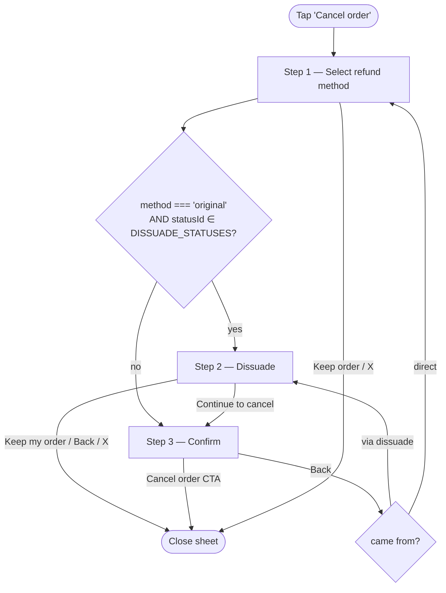
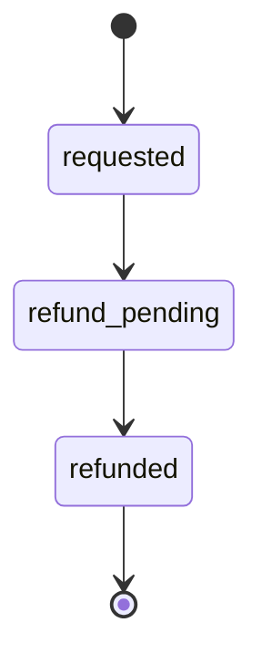

# Cancellations

> Customer-facing cancellation surface inside My Account. Covers the `Cancel order` bottom sheet (with the take-rate-protection "dissuade" step), the `Keep my order` undo flow on in-flight cancellations, the refund-hero variant of `PastOrderCard` that represents a cancelled order on the list, and the rejected-cancellation chip that survives into later cards. The four-card-routing decision tree lives in [orders.md](./orders.md) §2.

## 1. Overview

Customers can cancel orders themselves from the `created` and `quality_check` states; once an order is `shipped` they have to contact support. Cancellation has two surfaces:

- A **forward** flow — the `Cancel order` bottom sheet (`CancelOrderSheet`) opened from `InProgressCard`. Two- or three-step depending on refund method.
- A **reverse** flow — the `I want to keep my order` button on the refund-hero variant of `PastOrderCard`, shown only while the cancellation is still at `requested` (before the refund is accepted). Opens a single-step `KeepOrderSheet` confirm.

Cancelled orders flip the order's `state` to `cancelled` and add a parallel `cancellationStatusId` / `cancellationTimeline` chain. The `statusId` is **not** changed — a cancelled order keeps the `statusId` it had at cancellation, so the timeline still renders where the order was when the customer pulled the plug.

There are **two cancellation worlds**, discriminated by `cancellationInitiator`. **Customer-initiated** (default / absent / `'customer'`) is everything in §2–§5 below — the refund-hero `CancelledOrderCard`. **Revibe-initiated** (`'revibe'`) is the inverse case: Revibe had to cancel and the customer never asked. It renders a separate sibling card (`RevibeCancellationCard`, §11) that leads with an apology + a re-buy discount instead of a refund receipt.

The **stage at cancellation changes the refund path** (modelled in the `cancellation` journey, `src/data/journey.js`). Cancelling **before QC** (`created`) skips supplier review entirely: nothing is packed yet, so the request lands straight on `refund_pending` — a `requested` timestamp is still stamped so the stepper reads Requested ✓ → Pending. Cancelling **at QC** (`quality_check`) waits on an ops review that can be accepted or declined, since the unit may already be packed.

Refund math + the 5% processing fee + the success-tone wallet recommendation are prototype-only; production will read the eligibility window, fee rate, recommendation policy, and per-line-item amounts from the backend.

## 2. Cancel order flow (`CancelOrderSheet`)

`Cancel order` on a `created` or `quality_check` order opens a bottom sheet with a `max-height: 92vh`, a `black/45` scrim, and a slide-up entrance. Dismissible by tapping the scrim, the X icon, or pressing `Escape`.

The flow is two steps for the wallet path and three steps for the original-payment path. The extra middle step is a take-rate-protection "dissuade" screen that fires only when both conditions hold: `method === 'original'` **and** `statusId ∈ DISSUADE_STATUSES` (currently `created`, `quality_check`).

### 2.1 Branching



### 2.2 Step 1 — Choose your refund

Header (`Cancel order` + `#id`), then an order-summary card with the product strip and a line-item breakdown (`Product` + `Revibe Care` if present + `Total`), then two refund options as radio cards:

- **Revibe Wallet** (wallet icon + tap-toggle info `i`, success-tone detail line) — full refund of the order total, available instantly. The recommendation is signalled by rendering the "Full refund · available instantly" detail line in `text-success font-semibold` rather than a `Recommended` pill. The `i` opens a tooltip explaining wallet credits can be used on any product and are combinable with any payment method, with a placeholder `terms & conditions` link. Same tooltip surfaces wherever "Revibe Wallet" is named (credits pill in `GreetRow`, confirm-step destination line) — all driven by the shared `WalletInfoTooltip`.
- **Original payment method** — total minus a 5% processing fee, refunded to the card in 5–10 business days. The amount line names the actual card the money is going back to (`{currency} {amount} back to {brand} •• {last4}` — e.g. `AED 806.55 back to Visa •• 4242`), driven by `order.paymentMethod`. The fee is shown explicitly as a negative line under the amount (e.g. `−AED 42.45 (5% processing fee)`).
  - **Split-paid orders** (`order.paymentSplit`, see [orders.md](./orders.md) §7.1): the amount line reads `back to your original payment` and a `RefundSplitRows` block lists the post-fee refund split proportionally across the two sources (card portion → card label, gift-card portion → `Gift card`), closing with a `Total refund` row that sums back to the net. The Wallet option is unaffected (whole refund to Wallet, fee waived).

The `Continue` CTA is disabled until a method is picked. `Keep order` closes the sheet without changes. `Continue` routes to **Dissuade** when the gate fires, otherwise straight to **Confirm**.

### 2.3 Step 2 (original-payment only) — Cancel this order?

A retention screen designed to give the user a reason to wait rather than cancel. Three blocks in a single-column body:

1. **Centered hero card with the delivery promise** — *"You're on track to receive your {product name} by"* + a large weekday-formatted `estimatedDelivery` (e.g. `Monday, 4 May`). Weekday computed in `formatDeliveryDate(estimatedDelivery, placedAt)`, which parses the short form using the year from `placedAt` and emits `weekday, day month` via `Intl.DateTimeFormat`.
2. **Neutral info-tone strip** warning that the item *may not be available to reorder later*. Scarcity, not "this is irreversible" — the cancellation itself is fully reversible at `created`; the real risk is item supply.
3. **Soft-green success-tone strip with `ShieldCheck` icon** — *"If we don't deliver by {order.estimatedDeliveryLong}, the {currency} {fee} processing fee is waived."* Anchored on the **delivery** date the user is staring at on the hero one line above. Earlier drafts anchored this on the ship deadline (`shipDeadlineFull`); that's legible as a business defence but reads as procedural to the customer. Falls back to `estimatedDelivery` (short form) when the long form is absent. `shipDeadline*` fields are kept in the data shape but no longer read by this UI.

Footer has two equal-height chunky buttons (52px, `rounded-[12px]`, `text-[14.5px]`): a brand-filled `Keep my order` and an outlined `Continue to cancel` that turns red on hover (`hover:bg-danger-bg hover:text-danger hover:border-danger`). Earlier drafts had a third muted text link with the same label and an extra `Switch to Revibe Wallet` button — both were dropped (the wallet switch overrode the user's earlier method choice, and the muted Continue link buried the forward path).

The dissuade step does not show the refund amount or breakdown — those live one screen later on Confirm, which keeps Dissuade emotional/decisional and Confirm transactional. `Back` returns to Select; the `X` and `Keep my order` both close the sheet.

### 2.4 Step 3 — Confirm cancellation

A back arrow returns to the previous step (Dissuade if the user came through it, otherwise Select). Body shows a centered amount block (`You'll receive` / amount / destination / ETA copy):

- **Wallet path** — destination line reads `back to your [wallet icon] Revibe Wallet [i]`, same shared info tooltip.
- **Original-payment path** — block also carries a muted breakdown line (e.g. `Total AED 849 · −AED 42.45 fee`) between the headline figure and the destination; destination names the same card as Step 1 — `back to your {brand} •• {last4}` (e.g. `back to your Visa •• 4242`), falling back to `back to your your card` when `order.paymentMethod` is absent. **Split-paid:** destination reads `back to your original payment` and a `RefundSplitRows` block (with the `Total refund` row) shows the per-source split below the destination line.

Beneath the amount block sits a neutral info-tone strip with method-specific copy:

- **Wallet:** *"Revibe Wallet credit stays on Revibe. It won't be paid out to your bank account."*
- **Original payment:** *"You're giving up {fee} to the processing fee."*

The original-payment copy is intentionally trimmed to a pure fee reminder — the earlier wallet pitch was removed when Dissuade was introduced, because doing the wallet upsell twice in a row felt like the company was reluctant to let the user leave.

Footer: `Back` + a danger-filled `Cancel order` CTA. This is the only step on the original-payment path where the destructive action carries danger styling — the order of escalation now matches the order of finality.

The current prototype does **not** persist cancellation: tapping the final `Cancel order` simply closes the sheet (the order keeps its `created` state). Wiring this to flip `state` to `cancelled` and vary the cancelled-state banner copy by chosen refund method is a future step.

### 2.5 Late + past-promise branch (fee waived + Wallet bonus)

When an order has **blown its SLA at the current stage and is past the initial delivery promise** (the EDD the customer saw at checkout) while still at `created` / `quality_check`, the cancellation terms change: there's no longer a fee to argue about — the promise is already broken. This is signalled by a single order flag `promiseBreached` (see §7.4). `CancelOrderSheet` reads it (`breached = order.promiseBreached === true`) and adjusts all three steps:

- **Original payment** — the 5% processing fee is **waived**. Select-step amount shows the full total back to the card with a `No cancellation fee · 5–10 business days` detail line (no `−fee` line); Confirm shows the full amount, no fee breakdown, and an info strip reading *"No cancellation fee — you're getting the full amount back."*
- **Revibe Wallet** — full refund **+ a flat AED 100 bonus** (`LATE_PROMISE_WALLET_BONUS`, the cancellation analogue of the issue claim's `ISSUE_WALLET_BONUS`). The Select-step Wallet option renders the bonus as the **same purple `accent` pill** the issue/wrong-device claim uses (`bg-accent/15 text-accent`, `Sparkles` icon, `+AED 100 bonus`) above a success-tone `Full refund + bonus · available instantly` line; Confirm shows `total + 100` with a `Total {total} · +{bonus} bonus` sub-line and a bonus-acknowledging info strip.
- **Dissuade step (repurposed)** — the standard "if we don't deliver by {date}, the fee is waived" retention screen is moot once the promise is broken, so on the original-payment path the middle step becomes an **apology + Keep-my-order** screen: title *"We missed our delivery estimate"*, a success strip (*"No cancellation fee. You'll get a full refund whichever way you choose."*), and a brand-tinted strip nudging Wallet (*"…take Revibe Wallet credit and we'll add AED 100 on top, as an apology."*). Footer keeps the brand `Keep my order` + outlined `Continue to cancel`. The gating is unchanged (fires on the original-payment path only); the Wallet path stays two steps. Non-breached orders keep the original fee-waiver dissuade copy untouched.

The bonus is **Wallet-only** — the card path is a full refund with no bonus, exactly like the issue claim.

## 3. Refund-hero card (`PastOrderCard` — cancelled branch)

The refund-hero card leads with the **refund** as the visual hero rather than the fulfilment journey. The whole card is wrapped in `OrderClaimLink` (§10 of [claim_tracking.md](./returns/claim_tracking.md)) so a cancelled order, like a claim, gets the paired order half (a neutral `PreCancellationOrderCard`, since the order never arrived) + connector rail; tapping either compact row flips the accordion between the order and the cancellation half. A `w-1` left accent strip carries the phase tone (warn amber for `requested`, brand purple for `refund_pending`, success green for `refunded`). The top eyebrow now reads `#{cancellationRef}` (the cancellation ref — `Cancellation` when absent), since the wrapper's strip already owns the `Order #{id}`; the phase pill sits on its own row below, wrapped in a `StatusExplainer` that shows an inline "ⓘ Learn more" accordion with a plain-language stage definition (copy from `STATUS_EXPLANATIONS` in `lib/statuses.js` under the `cancellation_<cancellationStatusId>` namespace — one entry per phase); then a tinted hero block whose internal eyebrow reads simply `Cancellation` (the ref moved up to the card eyebrow) — parallel to `ClaimCard`'s `Claim · {type}` eyebrow. Below that, a smaller `Refund of` / `Refunded` label sits above the refund amount (`text-[28px]` tabular-nums) and a destination chip — wallet destinations get a brand→accent gradient chip (echoes the `GreetRow` credits pill) that, when an `onOpenWallet` handler is threaded, is a tappable button (chevron, `stopPropagation`) opening the `WalletSheet` ledger (see [wallet.md](./wallet.md)); card destinations get a neutral chip. BNPL destinations (`refund.destination.kind === 'bnpl'`) render the same neutral chip but with just the provider brand as the label (no `•• last4`), and an inline `BnplDisclaimerTooltip` Info-icon (`stopPropagation` because the header is the tap target) opens a popover: "{provider} may charge additional fees on refunded purchases. Check your {provider} account for details." Refunded orders surface a `fundsAvailable` sub-copy line ("Available now in your wallet"); the two earlier phases make no ETA promise. When the refund carries a late-promise Wallet bonus (`refund.bonus > 0`, see §2.5), a success-tone *"Includes AED 100 Wallet bonus"* line (`Sparkles`) renders under the hero amount on every phase. `RefundDetailsSheet` shows the bonus as a `Subtotal` → `Revibe Wallet bonus +AED 100` (success tone) block parallel to the card-refund fee block, with `Total refund` = `subtotal + bonus`.

**Split-paid cancellations** (`order.paymentSplit`, see [orders.md](./orders.md) §7.1) refunded to the original payment (`refund.destination.kind !== 'wallet'`): the single destination chip is replaced by a `RefundSplitRows` block listing the card and gift-card portions of `refund.amount` (kept proportional to the original split), and `RefundDetailsSheet` appends the same split under its `Total refund`. The gift-card portion also lands in the Wallet ledger ([wallet.md](./wallet.md) §3). Wallet-destination cancellations are unaffected.

Expanded reveals a 3-step numbered dot stepper titled "Cancellation progress" (mirrors `ClaimCard`'s "Claim progress" header for symmetry). Both cancellation paths render the same three steps (`Requested` / `Pending` / `Refunded`); the difference is timing — on the created-stage path the `requested` step ticks over instantly (no supplier check needed), while on the `quality_check` path it waits on supplier confirmation. Each reached/current step carries the timestamp it entered that phase underneath its label (sourced from `order.cancellationTimeline[step.id]`); upcoming steps render the label only.

Below the hero sits the shared `ProductSummary` row ([orders.md](./orders.md) §3.0) — device + Revibe Care callout + **Total paid** (the original order total), reusing the order's own `product` / `warranty` / `subtotal` / `total` fields (no per-card duplication; the cancelled order carries these from `INITIAL_ORDER` in journey mode and from its static mock otherwise). It complements the hero rather than repeating it: the hero is the **refund** amount, the row is what was **paid** — distinct whenever a cancellation fee applies. The card's expand chevron lives on the `#{cancellationRef}` header line (not inside the row).

Followed by a single-action footer: a full-width `View refund details` button. Tapping it opens the `RefundDetailsSheet` bottom sheet, which is the canonical surface for the line-item breakdown (product + Revibe Care line items → subtotal → fee (card refunds only) → total refund). Always collapsed by default; no auto-expand.

The full `OrderCard` chrome (status banner, sub-timeline, courier banner, order summary) is no longer rendered for cancelled past orders. The in-flight cancellation sub-timeline (mid-fulfilment, `state === 'cancelled'` on `OrderCard`) is rendered by the shared `Timeline` (vertical) with a per-step `toneForStep` = danger chain → success `refunded` terminal; the past/refunded card's horizontal cancellation strip uses the same `Timeline` (`complete` once refunded). See `docs/handoff/timeline/design.md`.

### 3.1 Phase tone progression



| `cancellationStatusId` | Tone | Section | Hero amount label | Auto-expand |
|---|---|---|---|---|
| `requested` | warn amber | In progress | `Refund of` | No |
| `refund_pending` | brand purple | In progress | `Refund of` | No |
| `refunded` | success green | Past orders | `Refunded` | No |

`requested` and `refund_pending` keep the order in the **In progress** section because the money hasn't landed yet; only `refunded` drops the card down to **Past orders**.

## 4. Keep-my-order undo (`KeepOrderSheet`)

Once an order has been cancelled but the refund hasn't been accepted yet (so the card lives in **In progress** as a `PastOrderCard` refund-hero variant — `cancellationStatusId` is `requested`), the expanded view carries a primary brand-purple `I want to keep my order` button stacked **above** the existing `View refund details` button. The button is gated on `requested` only (`canKeep`): once the refund is accepted (`refund_pending`) or credited (`refunded`) the affordance disappears, because the cancellation is committed and reversing it is no longer a simple cancel-the-cancellation operation.

Tapping it opens `KeepOrderSheet` (`src/components/KeepOrderSheet.jsx`), a single-step confirm sheet:

- Header: `Keep your order?` + `#id`, X to dismiss.
- Hero card: brand-tinted `RotateCcw` icon over *"Your {product} will continue through fulfilment as if it was never cancelled."*
- Footer: outlined `No, continue cancellation` and brand-filled `Yes, keep my order`.

(The sheet still carries a `refund_pending` info strip — *"Your pending refund of {amount} will be cancelled…"* — but with the window narrowed to `requested` it no longer renders; it's retained as defensive copy in case the window widens.)

**Behaviour.** `Yes, keep my order` calls the `onKeep` prop threaded from `App.jsx` (`PastOrderCard` → `CancelledOrderCard` → `KeepOrderSheet`). In **journey mode** `handleKeepOrder` advances the `cancellation_kept` node, which flips `state` back to `open`, voids the in-flight `refund`, clears `cancellationStatusId`, and leaves `statusId` (`quality_check`) untouched so the order resumes fulfilment exactly where it paused — then re-merges into the shipping chain through to delivery. A `cancellationTimeline.reverted` timestamp + `cancellationReversal` marker survive (see §7.3), so a neutral `Cancellation reversed` chip surfaces in the `HistoryThread` once the order is delivered. Outside journey mode `onKeep` is absent, so confirm just closes the sheet (no static state transition exists).

## 5. Rejected cancellations

When an order's cancellation request is rejected (the order had already shipped, for example), the rejection survives as a past event on whatever card the order eventually routes to — most commonly a `ClaimCard` once the customer raised a post-delivery return. The rejection is represented inside the expanded body's `HistoryThread` as a neutral `Cancel rejected` row in the vertical timeline; tapping it expands a detail panel that names the rejection ref and the reason copy from `order.cancellationRejection`.

History thread on cancelled refund cards: all three cancelled phases (`requested`, `refund_pending`, `refunded`) render the `HistoryThread` in the expanded body. In `requested` the cancellation itself is the active hero, so the thread carries just `Order placed`. Once the order moves past `requested`, the thread also carries `Cancellation requested` as a second past event. Driven by `getHistoryEvents(order, 'cancellation')` in `src/lib/events.js`.

A **reversed** cancellation (the customer used *Keep my order*) leaves the same kind of trace: `cancellationTimeline.reverted` flips `buildCancellationEvent` to emit a neutral `Cancellation reversed` chip (ref + reason from `order.cancellationReversal`). Because the kept order resumes to delivery, the `delivered` mode of `getHistoryEvents` now also surfaces this cancellation trace (it previously returned only `Order placed`) — so both reversed and declined cancellations read honestly on the eventual `DeliveredOrderCard`.

## 6. UX decisions

**Wallet recommendation lives in detail copy, not a "Recommended" pill.** Earlier drafts pinned a `Recommended` pill to the wallet card. Removed because the success-toned `Full refund · available instantly` detail line carries the concrete benefit; a generic recommendation pill on top duplicated the message and reduced trust.

**Dissuade only fires at `created` + `quality_check`.** Once the order is `shipped` the cancel sheet doesn't open at all (no `Cancel order` button). Once it's `delivered` cancellation isn't a concept — returns take over.

**Original-payment path is the only one with three steps.** The wallet path is two screens. Adding the dissuade step felt symmetric at first but it creates an information dead-zone for the wallet path (no fee to argue about, no reason to dissuade). The asymmetry is intentional.

**Confirm step is the only place on the original-payment path where the destructive button is filled red.** Step 1's `Continue` is brand-purple; Step 2's `Continue to cancel` is an outlined button that turns red on hover. The escalation tracks finality — the user has had two chances to back out by the time they see the red filled button.

**Wallet upsell on Confirm was removed.** Earlier drafts carried a *"Choose Revibe Wallet for the full amount, instantly"* line on the original-payment Confirm step. Removed when Dissuade was introduced — doing the wallet upsell twice in a row felt like the company was reluctant to let the user leave.

**Refund-hero is its own card variant, not a banner on `OrderCard`.** Once cancelled, the order's *story* is no longer "is it coming?" — it's "where is my money going?". Leading the card with the refund amount + destination matches the customer's actual question; the fulfilment timeline that's now obsolete is hidden.

## 7. Data model

Cancellation- and refund-specific fields. Top-level order fields, status fields, and product fields live in [orders.md](./orders.md) §7. Claim fields live in [returns/claim_tracking.md](./returns/claim_tracking.md).

### 7.1 Cancellation state fields

| Field | Type | Notes |
|---|---|---|
| `state` | enum | Set to `cancelled` when the cancellation is committed. `statusId` is **not** changed — a cancelled order keeps the `statusId` it had at cancellation. |
| `cancellationRef` *(optional)* | string | Customer-facing cancellation reference (e.g. `CXL-7P4w2x`). Surfaced in the hero eyebrow (`Cancellation · #{cancellationRef}`). |
| `cancellationStatusId` *(optional)* | enum | One of `requested`, `refund_pending`, `refunded`. Drives the refund-hero card's phase tone, section routing (In progress vs Past orders), and the 3-step Cancellation progress stepper. |
| `cancellationTimeline` *(optional)* | map | Keyed by `cancellationStatusId` (`requested`, `refund_pending`, `refunded`), each entry is a human-readable timestamp at which the cancellation entered that phase. Populated progressively. Also accepts optional `rejected` / `reverted` keys — see §7.3. |

### 7.2 Refund object (cancelled past orders only)

Carried under `order.refund`. In-flight cancelled orders (still mid-fulfilment) and non-cancelled orders do not need this field.

| Field | Type | Notes |
|---|---|---|
| `refund.subtotal` | number, no currency | Pre-fee refund amount. Sum of `refund.breakdown` line items. |
| `refund.fee` *(optional)* | `{ label, rate, amount }` | Present only on card refunds (5% processing fee applied at cancellation per the `CancelOrderSheet` policy). Absent on wallet refunds and on **late + past-promise** card refunds (fee waived — see §2.5). `rate` is decimal (`0.05` → `(5%)` next to the label); `amount` is the currency value subtracted from `subtotal`. |
| `refund.bonus` *(optional)* | number, no currency | Flat Wallet bonus added on the **late + past-promise** store-credit path (§2.5), today always `100`. Present only on wallet refunds. Mutually exclusive with `fee` (wallet vs card). Surfaces as a hero sub-line + a `RefundDetailsSheet` bonus row; `amount` includes it. |
| `refund.amount` | number, no currency | **Net** refund amount actually sent to the destination. Equals `subtotal - fee.amount` when a fee is present, `subtotal + bonus` when a bonus is present, otherwise `subtotal`. This is what the hero displays. |
| `refund.destination` | object | `{ kind: 'wallet', label: 'Revibe Wallet' }` for wallet refunds; `{ kind: 'card', label, last4 }` for card refunds; `{ kind: 'bnpl', label, provider }` for BNPL refunds (Tabby / Tamara — triggers the `BnplDisclaimerTooltip` inside the destination chip). |
| `refund.breakdown` | array of `{ label, amount }` | Line items summing to `refund.subtotal`. Rendered inside `RefundDetailsSheet`. |
| `refund.fundsAvailable` *(optional)* | string | Short status copy shown under the hero amount. Only surfaced on `refunded` orders today; future card-refund ETAs ("Expected by 22 May") could also populate it. |

### 7.3 Rejection / reversal fields (optional)

Set only when an earlier cancellation request was rejected (see §5) or reversed by the customer (see §4).

| Field | Type | Notes |
|---|---|---|
| `cancellationTimeline.rejected` *(optional)* | string | Human-readable timestamp at which the cancellation was rejected. Presence of this key changes the `HistoryThread` chip's label from `Cancel requested` to `Cancel rejected` (tone stays neutral). |
| `cancellationRejection` *(optional)* | `{ ref, reason }` | `ref` is the rejection reference (e.g. `CXL-4BTb2x`) shown in the chip's expanded detail eyebrow; `reason` is the customer-facing explanation rendered inside the detail panel's tinted message bubble. |
| `cancellationTimeline.reverted` *(optional)* | string | Human-readable timestamp at which the customer reversed the cancellation via *Keep my order*. Presence of this key makes `buildCancellationEvent` emit a `Cancellation reversed` chip (tone neutral). Takes precedence over `rejected` / `requested` in the builder. |
| `cancellationReversal` *(optional)* | `{ ref, reason }` | Parallel to `cancellationRejection`: `ref` shown in the chip's expanded eyebrow, `reason` in the detail bubble. Set when the order is reverted; `state` returns to `open`, `cancellationStatusId` clears, and `refund` is voided. |

### 7.4 Late + past-promise flag

| Field | Type | Notes |
|---|---|---|
| `promiseBreached` *(optional)* | boolean | When `true` on a `created` / `quality_check` order, the cancel sheet waives the card processing fee and adds the `LATE_PROMISE_WALLET_BONUS` (AED 100) on the Wallet path (see §2.5). In the prototype it's a stamped flag (journey nodes `order_late` / `qc_late`; static mocks `89720` / `89205`). **Production** derives it from the EDD model — current-stage SLA is late **and** `today > initialPromise` (`src/lib/edd.js` → `orderStatus`). Usually paired with `delayed: true` + a `statusBanner` so `InProgressCard` shows the amber "Taking longer than usual" treatment (same as the Dynamic EDD sandbox's `order_late` / `qc_late`). |

### 7.5 Revibe-initiated cancellation fields (optional)

Set only on Revibe-initiated cancellations (§11). On these, `cancellationStatusId` is always `refunded` (the refund is full + instant) and the `refund` object carries **no `fee`** (Revibe waives it — the 5% fee is customer-initiated only).

| Field | Type | Notes |
|---|---|---|
| `cancellationInitiator` | `'customer'` \| `'revibe'` | The discriminator. Absent / `'customer'` ⇒ refund-hero `CancelledOrderCard` (§3). `'revibe'` ⇒ `RevibeCancellationCard` (§11). |
| `cancellationReason` | `'item_unavailable'` \| `'price_error'` \| `'undeliverable_address'` | Revibe-initiated only. Drives the apology icon + explanatory line. `undeliverable_address` also surfaces the delivery address (`DeliveryAddressPill`). |
| `reBuyOffer` | `{ amount, code, expiresAt, label? }` | The fixed-amount re-buy credit. `amount` is in `order.currency`; `code` is the copyable discount code; `expiresAt` is a human-readable date. Rendered in the offer block. |

### 7.6 Fields read by the cancel sheet

For reference — these fields live on the order itself (see [orders.md](./orders.md) §7) but the cancel sheet's behaviour depends on them:

- `subtotal` — used to render the line-item breakdown when present; falls back to `subtotal = total` when absent.
- `warranty` — renders the `Revibe Care` row in the breakdown when present.
- `paymentMethod` — drives the original-payment card's `{brand} •• {last4}` label on Steps 1 and 3.
- `estimatedDelivery` — parsed for the weekday-formatted hero on the dissuade step.
- `estimatedDeliveryLong` — embedded into the fee-waiver copy on the dissuade step.

## 8. Component map

```
src/
├── components/
│   ├── CancelOrderSheet.jsx          Two- or three-step bottom sheet (Select → Dissuade? → Confirm)
│   ├── KeepOrderSheet.jsx            Single-step confirm sheet for reversing an in-flight cancellation
│   ├── PastOrderCard.jsx             Branches on order.state — cancelled-past variant is the refund-hero card; exports DestinationChip
│   ├── RevibeCancellationCard.jsx    Revibe-initiated cancelled card (§11) — apology + re-buy offer + no-fee refund strip
│   ├── RefundDetailsSheet.jsx        Bottom sheet for the past cancelled card's `View refund details` action
│   ├── Timeline.jsx                  Unified timeline (in-flight cancellation sub-timeline + past refund strip)
│   ├── HistoryThread.jsx             Drives the Cancel rejected chip on layered cards
│   └── WalletInfoTooltip.jsx         Shared anywhere "Revibe Wallet" is named
└── lib/
    └── events.js                     getHistoryEvents(order, 'cancellation' | 'delivered') — builds the refund-hero + delivered history thread (incl. Cancellation reversed / rejected chips)
```

`CancelOrderSheet` carries the constant `DISSUADE_STATUSES = new Set(['created', 'quality_check'])` that decides whether the middle step renders, plus `LATE_PROMISE_WALLET_BONUS = 100` (the §2.5 Wallet bonus, hardcoded in the sheet; the 5% fee rate is imported as `CANCELLATION_FEE_RATE` from `src/lib/returns.js`). Both in-flight demo orders (`89712`, `89510`) carry `subtotal`, `warranty`, `estimatedDeliveryLong`, and `paymentMethod`, so the full flow exercises end-to-end on either. Static order `89720` (late-at-QC, `promiseBreached: true`) exercises the breached sheet copy; `89205` (settled wallet refund with `refund.bonus`) exercises the refund-hero + `RefundDetailsSheet` bonus rendering that a static cancel-sheet stub can't reach.

## 9. Mocked vs production

- **Cancellation is a stub outside journey mode.** In the static showcase, tapping the final `Cancel order` just closes the sheet — the order keeps its state. In **journey mode** it's wired: `handleCancelOrder` advances the cancellation request node, picking `cancel_before_qc_*` before QC (straight to refund pending) or `cancellation_requested_*` at QC, by refund method — and the late-promise variants `cancel_late_before_qc_*` / `cancellation_late_requested_*` when the journey is on the `order_late` / `qc_late` node (§2.5). `validNext()` gates which one fires, so the candidate list is order-insensitive. Production should flip `state` to `cancelled` and vary the cancelled-state banner copy by chosen refund method.
- **`I want to keep my order` is a stub outside journey mode.** In the static showcase confirm just closes the sheet. In **journey mode** `onKeep` → `handleKeepOrder` advances the `cancellation_kept` node (reverts to open, voids the refund, resumes fulfilment, leaves a reversed trace). The window is `requested`-only — production still needs a reverse-cancellation endpoint and the rule for the wider window (e.g. whether `refund_pending` is ever reversible, irreversible the moment funds are released to the processor).
- **5% fee is a hardcoded constant.** `CANCELLATION_FEE_RATE = 0.05` lives in `src/lib/returns.js`, imported by `CancelOrderSheet`. Production should read it from a backend config per order.
- **Late + past-promise terms are flag-driven, AED 100 bonus is hardcoded.** The §2.5 fee waiver + Wallet bonus key off a stamped `order.promiseBreached` boolean and the local `LATE_PROMISE_WALLET_BONUS` constant. Production should (a) compute `promiseBreached` from the EDD model (`orderStatus`: current-stage late **and** `today > initialPromise`) rather than stamping it, and (b) read the bonus amount + the waiver policy from backend config (same as the issue-claim `ISSUE_WALLET_BONUS`). The bonus is wired into the journey nodes (`order_late` / `qc_late` and their `cancel_late_*` branches) and two static mocks (`89720` / `89205`).
- **Wallet recommendation styling is hardcoded.** The success-tone detail line is statically positioned on the wallet card. Production should accept a per-order policy flag.
- **Per-line-item amounts are hand-derived.** The breakdown today is `Product` (= `subtotal`) + `Revibe Care` (= `warranty`) + `Total` (= `total`). Production needs real per-line-item amounts from the backend.

## 10. Open questions

- **Reversing `refund_pending` cleanly.** The prototype now draws the line at `requested` (keep is hidden once the refund is accepted). Open production decision: is `refund_pending` ever reversible? The natural cutoff is "the moment funds are released to the processor" — if production wants a wider window than `requested`, the UI needs a separate flag (or a `cancellationStatusId === 'irreversible'` sub-state) to know when to hide the `I want to keep my order` button.
- **Banner copy for cancelled state by refund method.** Once cancellation is wired up, the cancelled-state status banner should vary copy by chosen method (wallet vs original payment) — currently a single placeholder.
- **Show a "Cancellation history" chip on the refund-hero card.** Today rejected-cancellation chips only appear on layered claim cards. A self-referential cancel-rejected chip on the refund hero would be redundant in normal flow but useful when a customer's first cancel request was rejected and a later one succeeded.
- **In-flight `Cancel claim` on submitted returns.** Currently no affordance exists for cancelling an in-flight return claim. Likely lives in [returns/claim_tracking.md](./returns/claim_tracking.md) once introduced.

## 11. Revibe-initiated cancellation card (`RevibeCancellationCard`)

The inverse of §3: Revibe had to cancel the order and the customer never asked. The job flips from a refund receipt to an **apology + a reason to come back** — so it's a separate sibling card (`src/components/RevibeCancellationCard.jsx`), not a `PastOrderCard` branch. Discriminated by `cancellationInitiator: 'revibe'` (§7.5); routed in `App.jsx`'s Past-orders cancelled branch **instead of** `CancelledOrderCard`. It's a **terminal** state — full + instant no-fee refund, no `requested → pending` journey, no "keep my order" reversal — so it lives only in **Past orders** (`cancellationStatusId` is always `refunded`). Full design + redlines: [`docs/handoff/revibe-cancellation/design.md`](../handoff/revibe-cancellation/design.md).

### 11.1 Layout (top → bottom)

A single `article` with a 4px **magenta (`accent`) left strip** (one settled tone, ties to the offer). Content is a vertical flex, in order:

1. **Eyebrow** — `Order · #{id}` (same treatment as every card). No header chevron — the card is always-visible; only the refund strip collapses.
2. **State pill** — neutral "Cancelled by Revibe" (`bg-line-2` / `text-ink-2`, dot). Informational, **not** `danger`.
3. **Apology block** (net-new) — light-lilac (`#faf8fd`) tile, brand-tinted icon tile, headline "We had to cancel your order", and a reason line closing in a bold **"you've been fully refunded."** The reason drives the icon + lead clause only (§11.2). On `undeliverable_address` it also renders the delivery address via the reused `DeliveryAddressPill`.
4. **Offer block** (net-new, **subtle** variant) — light `brand-bg` tile on the `accent` promo vocabulary: a "A little something to make it right" eyebrow, the `{currency} {amount} off your next order` headline, a dashed code row with a **copy-to-clipboard** button (swaps to "Copied ✓" for 1800ms), and an `Expires {expiresAt}` line. This + the CTA form the focal forward zone.
5. **CTA** — full-width **white·magenta** "Browse similar devices" (white fill, 1.5px `accent` border, magenta label + `ArrowRight`). Carries a magenta **glow pulse + shine sweep + arrow nudge** (keyframes `ctaGlow` / `ctaShine` / `ctaNudge` in `tailwind.config.js`), all suppressed under `motion-reduce`. Visual placeholder — no real catalogue route.
6. **Product row** — reused `ProductSummary` (`tone="light"`) under a "What we cancelled" eyebrow. Unchanged: thumbnail, name, variant, Revibe Care callout, Total paid.
7. **Refund strip** — collapsible green (`success`) reassurance. Always-visible teaser "{currency} {amount} fully refunded · **no fee**"; expands to a "Sent to" row with the reused `DestinationChip` (`card` → neutral chip; `wallet` → brand→accent gradient) + a "View refund details" button opening `RefundDetailsSheet`. No fee row in the sheet — `refund` carries no `fee`.

### 11.2 Reason → apology copy

The single unified card varies only the icon + lead clause by `cancellationReason`; layout, offer, and CTA are constant. All three close with "This wasn't your fault — **you've been fully refunded.**"

| `cancellationReason` | Icon | Lead clause |
|---|---|---|
| `item_unavailable` | `PackageX` | "The seller no longer has this item in stock." |
| `price_error` | `Tag` | "This item was listed at the wrong price, so we had to cancel the order." |
| `undeliverable_address` | `Truck` | "Our courier partner can't deliver to your address." (+ delivery-address pill) |

### 11.3 Component reuse

`OrderEyebrow` / `StatePill` treatments mirror `PastOrderCard` (the shapes are tiny and inlined, not imported); `DestinationChip` is **imported** from `PastOrderCard` (now exported); `ProductSummary`, `DeliveryAddressPill`, and `RefundDetailsSheet` are reused as-is. Net-new are only the apology block, the offer/code block, and the CTA's motion CSS.

### 11.4 Mocked vs production

- **Three static mocks** in `src/data/orders/baseline.js`: `89640` (`item_unavailable`, card refund), `89641` (`price_error`, wallet refund), `89642` (`undeliverable_address`, card refund + address). One per reason so the single layout is exercised across all three.
- **Wired into the Cancellation journey.** Three terminal nodes (`revibe_cancel_unavailable` / `revibe_cancel_price` / `revibe_cancel_address`) in `src/data/journeys/cancellation.js` are reachable from both `placed` (created stage) and `qc_started` (quality_check stage) — the two stages an order can be cancelled by Revibe. They're stage-agnostic (set only the cancellation fields, never `statusId`/`timeline`), terminal, and always `refunded` (full + no fee; `price_error` refunds to Wallet, the others to card). `JourneyDevPanel` surfaces them through a grouped **"Cancelled by Revibe"** dev-panel button (keyed on each node's `revibe: { reason, label }` tag) that expands the three reason options, rather than as plain Next buttons. Replay it via `?journey=cancellation`. Spec: `journey_backend_spec.md`.
- **Notification is silent.** The journey event `order.cancellation.revibe_initiated` has no comm copy (resolves to the silent placeholder in `JourneyNotificationPanel`). Authoring an apology email/WhatsApp preview is a future step.
- **Discount engine + catalogue route are placeholders.** `reBuyOffer` is hand-set data; "Browse similar devices" and "Copy" are decorative (no real route/engine), like Search and "Download receipt". Production reads the offer (amount/code/expiry) from a promo backend and the refund (full, no fee) from the cancellation record.
