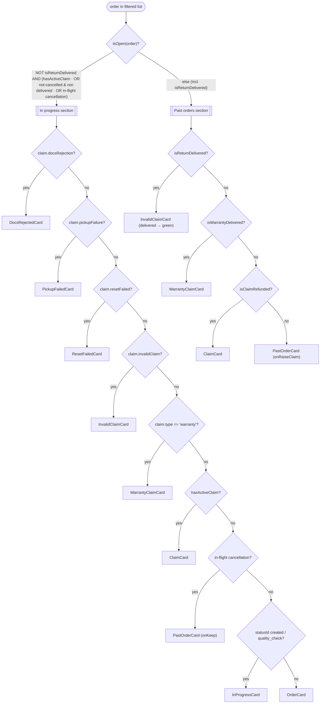
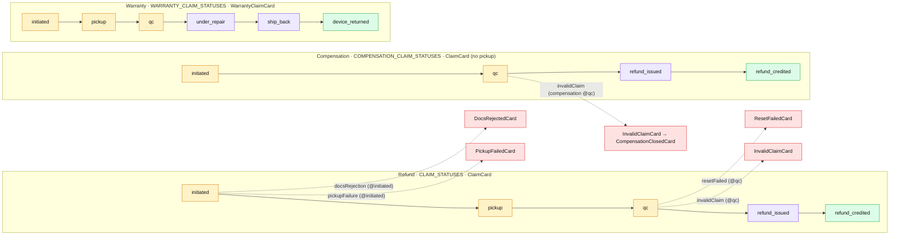
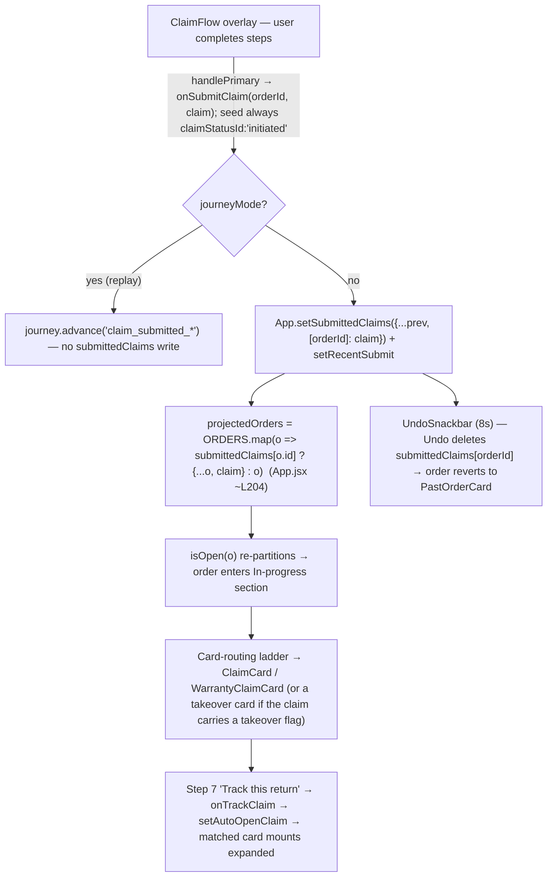

# Cross-cutting diagrams

> The **connective** diagrams — the control flow that spans more than one component or flow and so can't be read off a single file. Read the relevant one *before* planning a change that crosses flows; one diagram read replaces reconstructing the path from `App.jsx` + `lib/claims.js` + the data files. Per-flow diagrams live in their own feature docs ([orders.md](./orders.md), [returns/](./returns/), [warranties_compensations.md](./warranties_compensations.md)); this doc only carries the cross-cutting set. Linked from [`../code_map.md`](../code_map.md).

These are hand-maintained — there's no generator. When routing precedence, a claim pipeline, or the submit→render path changes, update the matching diagram here (see the doc-update protocol in [`../../CLAUDE.md`](../../CLAUDE.md)).

---

## Card routing

**Read before:** touching the routing precedence in `App.jsx`, adding a card variant, or adding a takeover flag. **Source:** `src/App.jsx` — `isOpen` L50–56, in-progress ladder L289–350, past ladder L359–389.

`App.jsx` routes in **two stages**, not one flat precedence list. First `isOpen(order)` partitions the filtered orders into the *In progress* and *Past* sections; then a precedence ladder inside each section picks the card. In journey mode the list is a single replayed order (`projectedOrders = [activeOrderFromJourney]`) routed through the *same* ladder. Each takeover branch in code is guarded by `hasActiveClaim(o) && o.claim?.X` — a takeover claim is always active, so what matters is the ladder order.

The first four in-progress branches are the **takeover cards** — they supersede `ClaimCard` / `WarrantyClaimCard` while the claim is blocked on a single customer action, ordered chronologically in the pipeline. Full prose tree: [orders.md](./orders.md) §2.

---

## Claim lifecycle

**Read before:** changing a claim pipeline, adding a claim state, or wiring a new takeover. **Source:** `src/lib/claims.js` — `CLAIM_STATUSES`·18, `COMPENSATION_CLAIM_STATUSES`·64, `WARRANTY_CLAIM_STATUSES`·201, terminal predicates `hasActiveClaim`·137 / `isClaimRefunded`·145 / `isWarrantyDelivered`·151. Takeover seeded states: `src/data/orders/claims.js`.

All four pipelines on one canvas, tone-classed **warn → brand → success** (matching the card tone helpers), with the four takeover detours annotated by trigger flag + the claim state they're seeded at.

Notes:
- **In progress vs Past.** `hasActiveClaim` keeps a claim in the *In progress* section until its terminal state — `refund_credited` (refund/compensation) or `device_returned` (warranty) — which flips it to *Past* via `isClaimRefunded` / `isWarrantyDelivered`.
- **Compensation reuses the refund status ids** (`initiated` / `qc` / `refund_issued` / `refund_credited`) minus the pickup leg, so the tone/phase helpers apply unchanged.
- **Projection invariant.** A freshly-submitted claim always lands on `initiated` (see [Returns data-flow](#returns-data-flow)). Every post-`initiated` state and all four takeovers are reachable only via hand-seeded mocks in `data/orders/*` — see each `docs/output/*.md` "Mocked vs production" list. Spec: [returns/claim_tracking.md](./returns/claim_tracking.md), [warranties_compensations.md](./warranties_compensations.md).

---

## Returns data-flow

**Read before:** changing how a submitted claim reaches a card, the undo, or the track-to-expand behaviour. **Source:** `src/App.jsx` — `handleSubmitClaim`·171, projection·199–207, `UndoSnackbar` wiring·417, `handleTrackClaim`·193; `src/components/ClaimFlow/ClaimFlow.jsx` (`onSubmitClaim`).

The coupling here is a **runtime projection**, not an import: the seeded claim is stitched onto the order at render time. This is the path most likely to confuse, because no import edge connects `ClaimFlow` to the card that ends up rendering.

`submittedClaims` is in-session only (cleared on refresh — there's no backend). Card selection at node **F** follows the [Card routing](#card-routing) ladder.
