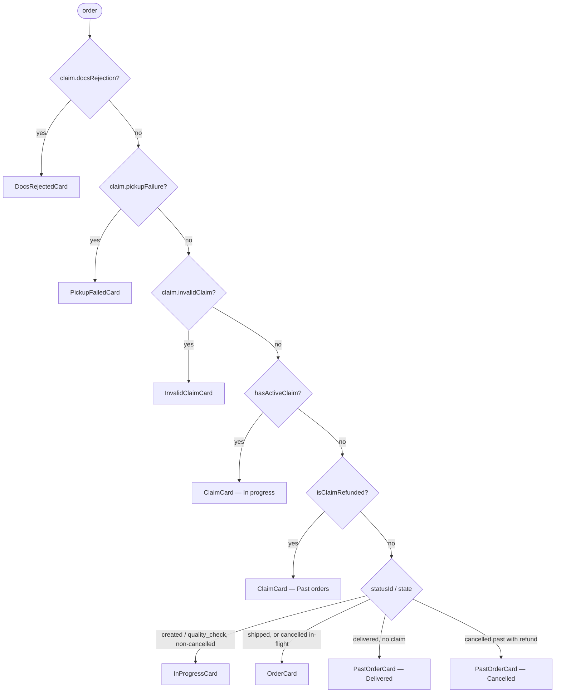
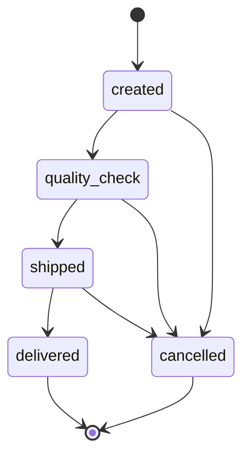
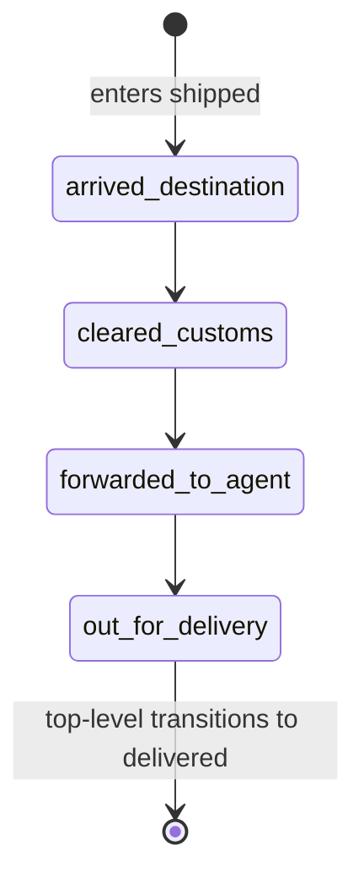
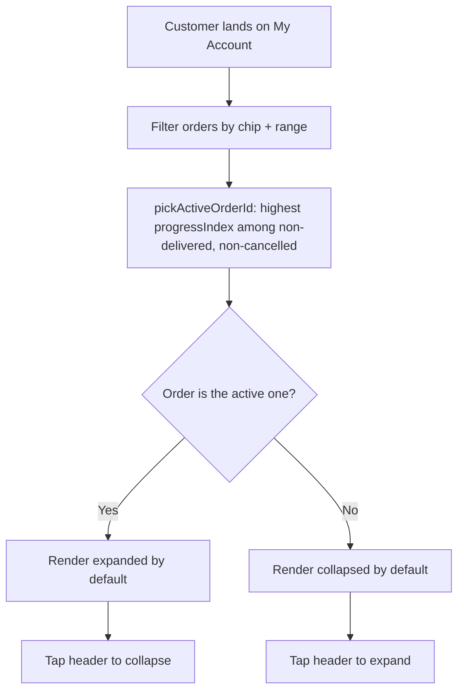

# Orders

> Customer-facing surface for browsing past and in-flight orders inside My Account. This doc covers the order list, the four card types and their baseline chrome, the auto-expand rule, the status models, the filters, and the history thread. Cancellation behaviour is in [cancellations.md](./cancellations.md); the returns flow and claim tracking are in [returns/](./returns/).

## 1. Overview

The orders area lives inside the customer's My Account page. It shows every order the customer has placed, communicates the current shipment status at a glance, and lets the customer drill into a single order for full details and post-purchase actions (download receipt, raise a claim, change address while the order is still actionable, track the parcel via the courier).

This prototype is intentionally narrow: only the orders list and the expand/collapse interactions are functional. Everything around it (search, filters, the Revibe Wallet pill, profile menu, language toggle) is decorative — present for visual fidelity but not wired up.

**In scope**

- Order list with eight demo orders covering every top-level state plus a cancelled-past order and orders carrying in-flight return claims.
- Per-order collapsed summary card with status banner.
- Per-order expanded view with full timeline, courier banner, sub-timeline, and order summary.
- Auto-expand rule: only the single most in-flight order is expanded by default; the rest collapse.
- Status chip row filtering the list (`All / In progress / Delivered / Cancelled`).
- Status banner with `delayed` and `statusMessage` overrides.
- Four order-card baselines (`InProgressCard`, `OrderCard`, `PastOrderCard`, `ClaimCard`) — the last two are documented in detail in their own feature docs but share the chrome family described here.

**Out of scope (faked or stubbed)**

- Authentication, real backend, real customer data.
- Site-wide search and the in-list "Find items" search field.
- Date-range dropdown effect on the list (logic wired but all mock orders fall inside every range).
- Revibe Wallet pill balance and most of the page chrome around the list.
- Right-to-left and Arabic localisation.
- Real courier tracking — the "Track order" button hardcodes a known-good DHL Express test shipment so the demo always lands on a real tracking page.

## 2. Card routing

`App.jsx` picks the card to render per order in a specific precedence order. The first three branches are claim takeovers (see [returns/claim_tracking.md](./returns/claim_tracking.md)); the rest fall through to the order surfaces documented in §3.



The four baseline cards (`InProgressCard`, `OrderCard`, `PastOrderCard`, `ClaimCard`) share the same chrome family: left accent strip, `Order · #{id}` eyebrow, state pill, tinted hero block, compact product row. They differ in what the hero leads with and which actions hang off the bottom. The three claim takeover cards (`DocsRejectedCard`, `PickupFailedCard`, `InvalidClaimCard`) replace `ClaimCard`'s surface while the claim is blocked on a single customer action; full spec in [returns/claim_tracking.md](./returns/claim_tracking.md).

| Card | Used for | Hero leads with | Expandable? |
|---|---|---|---|
| `InProgressCard` | non-cancelled `created` / `quality_check` | `Delivery by` + ETA | yes |
| `OrderCard` | non-cancelled `shipped`; in-flight cancellations mid-fulfilment | status icon + headline + ETA | yes |
| `PastOrderCard` (delivered) | `statusId === 'delivered'` (non-cancelled, no claim attached) | `Delivered on` + date | no |
| `PastOrderCard` (cancelled past) | `state === 'cancelled' && cancellationStatusId === 'refunded'` (and the refund-hero variant for `requested` / `refund_pending` while in the open list) | `Cancellation · #{cancellationRef}` eyebrow + refund amount | yes |
| `ClaimCard` | any order carrying an `order.claim` field — replaces the delivered card. Lives in **In progress** while the claim is active; drops to **Past orders** once `claimStatusId === 'refund_credited'` | `Claim` + status label + claim ref + expected refund | yes |

## 3. Order surfaces

### 3.1 InProgressCard (`created`, `quality_check`)

**Collapsed:**

- Small `Order · #{id}` eyebrow at the very top.
- State pill (`Order placed` for `created`, `Quality check` for `quality_check`) with a `Package` / `ShieldCheck` icon, on its own row beneath the eyebrow. Constant brand-purple tone regardless of `delayed`.
- A brand-purple gradient hero block (`from-brand-bg to-brand-bg2`) carrying `Delivery by` eyebrow + an `On track` tag (`Zap` icon) on the right; a `text-[26px]` headline using `order.estimatedDeliveryLong || order.estimatedDelivery`; the body sentence from `statusDescription(order).body`; and a `Delivering to [Home]` chip below.
- When `order.delayed === true` the right-side tag swaps to `Clock` + `Taking longer than expected` (still brand-purple — see §8 "Delayed quality_check stays brand"), and the body pulls the delay-flavoured copy from `DELAYED_BODY[statusId]`.
- A compact product row (image / name / variant / `Revibe Care +{currency} {amount}` line / total / chevron). Chevron is decorative; the whole header is one tap target.

**Expanded:**

- Horizontal `Timeline` dot row (Placed → QC → Shipped → Delivered). Each reached / current step renders the date and time on two lines below the label, sourced from `order.timeline[stepId]`; upcoming steps render the label only.
- `Order details` collapse with delivery address, phone, and order date, plus `Change address` and `Change phone number` pills. `Change details` programmatically opens the collapse via ref.
- Two-action footer: `Cancel order` (danger outline) + `Change details` (brand outline). On `created`, `Cancel order` opens the cancellation bottom sheet — see [cancellations.md](./cancellations.md). On `quality_check` it's a visual stub.

### 3.2 OrderCard (`shipped`, in-flight cancellations)

`OrderCard` is the older chrome retained for shipped orders and for in-flight cancellations still mid-fulfilment with `state === 'cancelled'`.

**Collapsed:**

- `ORDER · #{id}` eyebrow at the top so the order number is always visible.
- Status icon + headline (e.g. "Out for delivery", "Cancelled").
- Subline with the most relevant timestamp (forward-looking ETA when DHL provides one, otherwise the most recent status timestamp).
- State chip on the right when relevant. Cancelled orders carry a red "Cancelled" chip.
- Horizontal four-step dot timeline above the product strip.
- Product image, name, variant, `Revibe Care +{currency} {amount}` line, uppercase `TOTAL` caption above the bold amount.

**Expanded:**

- Status banner (long form), the **Shipping progress** sub-timeline (shipped only), and the courier card with the "Track" link.
- `Order details` collapse with phone, address, and order date.
- Action row: shipped → `Receipt` + `Get help`; in-flight cancelled → `Get help`.
- Four-step **Full timeline** at the bottom.

### 3.3 PastOrderCard — Delivered (`statusId === 'delivered'`)

The delivered card is **not expandable** — there is no chevron and no expanded body. It carries the same chrome family but with success-green tones and a date-led hero:

- `w-1` left success-green strip.
- `Order · #{id}` eyebrow.
- Success-tinted `Delivered` state pill (`PackageCheck` icon).
- Success gradient hero block (`from-success-bg to-[#d4f0e3]`) carrying `Delivered on` eyebrow + `Complete` tag with checkmark; a `text-[26px]` headline using `order.deliveredOnLong` (falls back to the date part of `order.timeline.delivered`); a `Delivered to [Home]` chip below.
- Compact product row that surfaces image / name / variant / `Revibe Care +{currency} {amount}` line / total. The Revibe Care line and total are deliberately retained on this card (the refunded card omits both, since its hero already carries the money story).
- Right-aligned chip-style footer with `Download receipt` + `Raise a claim`, separated by a top dashed border. `Raise a claim` is the entry point to the returns flow — see [returns/change_of_mind.md](./returns/change_of_mind.md) / [returns/issue.md](./returns/issue.md).

A single-row `HistoryThread` (mode `'delivered'`) carrying just the `Order placed` event sits between the product row and the footer buttons, collapsed by default. Delivery is the active hero so it is intentionally absent from the thread.

### 3.4 Other surfaces

- **`PastOrderCard` — cancelled past:** documented in [cancellations.md](./cancellations.md) (refund-hero card variants).
- **`ClaimCard` + takeover cards:** documented in [returns/claim_tracking.md](./returns/claim_tracking.md).
- **HeroCard:** the active in-flight order (currently the out-for-delivery one) has two stacked rows of full-width buttons beneath the headline — `Track package` (filled white, brand text — the only filled CTA in the app), `Get help` (ghost), `Cancel order` + `Raise a claim` (ghost). `Cancel order` toggles a small dark tooltip — *"You cannot cancel the order at this stage"* — the cancellation rule is prototype-only.

## 4. State models

### 4.1 Top-level state machine

`statusId` drives the horizontal timeline. Valid values: `created`, `quality_check`, `shipped`, `delivered`.



`cancelled` is modelled as a separate **state** on the order, not a top-level status (see §4.3). A cancelled order keeps the `statusId` it had at cancellation, which informs the timeline rendering.

### 4.2 Shipping sub-state machine

While the top-level status is `shipped`, the order also carries a `subStatusId` describing where the parcel is in DHL's pipeline.



There is intentionally no `delivered` sub-status. When the parcel is delivered, the order's top-level status moves to `delivered` and the sub-status is no longer relevant.

### 4.3 `state` is parallel to `statusId`

`state` (`open`/`close`/`cancelled`) controls header chips, independent of progression. Cancelled orders keep the `statusId` they had at cancellation. Override: `delivered` always renders a green Delivered chip regardless of `state`.

### 4.4 Per-state behaviour cheat sheet

| Top-level state | Card | Auto-expanded | Hero / headline | Tone | Hero tag | Footer actions |
|---|---|---|---|---|---|---|
| `created` | `InProgressCard` | If most in-flight | `Delivery by` + ETA (`estimatedDeliveryLong`) | brand | "On track" (Zap) | `Cancel order` + `Change details` |
| `quality_check` | `InProgressCard` | If most in-flight | `Delivery by` + ETA | brand (always — even when `delayed`, see §8) | "On track" (Zap) or "Taking longer than expected" (Clock) when `delayed` | `Cancel order` + `Change details` |
| `shipped` (sub-status drives headline) | `OrderCard` | If most in-flight | status icon + sub-status label (e.g. "Out for delivery") + `Delivery by` ETA subtitle | brand | banner-driven ("On track" / "Arriving today") | `Receipt` + `Get help` |
| `delivered` | `PastOrderCard` (delivered branch) | Never (no expand) | `Delivered on` + `deliveredOnLong` | success | "Complete" (Check) | `Download receipt` + `Raise a claim` |
| `cancelled` — in flight (`state === 'cancelled'` + non-terminal `statusId`) | `OrderCard` | Never | "Cancelled" + status banner | danger | n/a | `Get help` |
| `cancelled` — past order | `PastOrderCard` (cancelled branch) | Never | `Refund of` / `Refunded` + amount | warn / brand / success per phase | "Requested" / "Processing" / "Complete" | `View refund details` + icon-only `Download receipt` |

### 4.5 Status banner tone resolution

`statusDescription(order)` resolves in this order:

1. `state === 'cancelled'` → red "Refund in progress"
2. `delayed === true` → orange "Taking longer than expected" (`OrderCard` only — `InProgressCard` keeps brand-purple for delayed QC, intentional product decision)
3. otherwise → `STATUS_DESCRIPTIONS[statusId]` (or `shipped:{subStatusId}`)
4. `statusMessage` overrides body only

## 5. Filters & auto-expand

### 5.1 Filter chip row

`OrderFilters` exposes a controlled chip row: `All / In progress / Delivered / Cancelled`. Filter logic lives in `App.jsx`; counts are derived from the same predicates that route cards (claim-carrying orders count toward `in_progress` while the claim is active; refunded claims count toward `delivered`).

A date-range dropdown is plumbed in but currently inert because every mock order falls inside every range.

### 5.2 Auto-expand rule



Every card collapses by default. `pickActiveOrderId(orders)` returns the id of the single most-in-flight order — the one with the highest pipeline progress (`progressIndex × 10 + subProgressIndex`, in-flight only) — and `App.jsx` passes `defaultExpanded` only to that card. The rule operates on the *filtered* list, so picking the "Delivered" chip auto-expands nothing.

Once the customer taps a card, their state sticks across filter changes (state lives in the card component, not derived from `activeId`).

`ClaimCard` does **not** currently participate in `pickActiveOrderId`. Fulfilment in-flight orders win the auto-expand slot when both are present; claim cards collapse by default.

**Exception — `created` / `quality_check`.** Even when one of these is the active order, neither the `HeroCard` nor auto-expansion of the `InProgressCard` is triggered. The hero is built around courier and ETA data that doesn't exist yet at those states, so `App.jsx` excludes them from `showHero`; `InProgressCard` is rendered without `defaultExpanded` so it stays collapsed until the user opens it manually. This is invisible in the normal demo (the active order is always at `shipped`) but matters in journey mode (`?journey=1`), where the single journey order is the active one at every step.

## 6. History thread

On layered cards — `ClaimCard`, cancelled `PastOrderCard` in `refund_pending` / `refunded`, and the `DeliveredOrderCard` — past events render as compact chips under the active hero; tapping a chip expands its detail inline (one open at a time). Derived in `src/lib/events.js` from `timeline` / `cancellationTimeline` / `cancellationRejection`.

The active event lives in the hero and is excluded from the thread. Chip click handlers `stopPropagation` because the card header is one big tap target.

The trace is built per-mode by `getHistoryEvents(order, mode)`:

- `mode: 'delivered'` — `Order placed` only.
- `mode: 'cancellation'` — `Order placed`, plus `Cancellation requested` once the order moves past `requested`.
- `mode: 'claim'` — `Order placed`, `Delivered`, optional `Cancel rejected` (when `cancellationRejection` is set), optional `Evidence resubmitted` (when `claim.proofResubmission` is set).

## 7. Data model

The orders array (`src/data/orders.js`) is mock data today. Production will swap it for an API response of the same shape. Fields are grouped by purpose; cancellation, returns-flow, and claim fields live in their respective feature docs.

### 7.1 Top-level fields

| Field | Type | Notes |
|---|---|---|
| `id` | string | Human-readable order number shown in the header. |
| `phone` | string | Customer's phone number on the order. |
| `email` | string | Customer's email. Seeded into the returns flow's Step 4 pickup contact. |
| `address` | string (free text) | Delivery address. |
| `placedAt` | string (formatted) | Order timestamp shown on the summary screen. |
| `placedAtFull` *(optional)* | string | Pre-formatted long form (e.g. `Monday, 4 May`) — keeps components out of weekday arithmetic. |
| `quantity` | integer | Number of items in the order. |
| `subtotal` *(optional)* | number, no currency | Product-only amount. Used by the cancellation sheet's line-item breakdown. Falls back to `total` when absent. |
| `warranty` *(optional)* | number, no currency | Revibe Care add-on amount. Field name kept as `warranty` for backwards compatibility. Renders as `Revibe Care +{amount}` on product strips and in cancellation/return breakdowns; omitted when absent. |
| `total` | number, no currency | Total amount paid. Should equal `subtotal + warranty` when both are present. |
| `currency` | string | Three-letter currency code (e.g. `"AED"`). |
| `customerName` | string | Recipient's full name. |
| `country` *(optional, default `'AE'`)* | string | Two-letter country code. Today no UI branches on it; kept for future country-aware behaviour (e.g. the ZA/SA repair-partner returns track in `returns/change_of_mind.md`). |

### 7.2 Status fields

| Field | Type | Notes |
|---|---|---|
| `statusId` | enum | Drives the four-step progression timeline. Values: `created`, `quality_check`, `shipped`, `delivered`. |
| `subStatusId` *(optional)* | enum | Only meaningful while `statusId === 'shipped'`. Values: `arrived_destination`, `cleared_customs`, `forwarded_to_agent`, `out_for_delivery`. May be omitted on a shipped order if DHL has not yet returned a sub-status. |
| `state` | enum | Parallel header state for chips/filters. Values: `open` (default), `close`, `cancelled`. Independent of progression — a cancelled order keeps the `statusId` it had at cancellation. |
| `delayed` *(optional)* | boolean | When true, the status banner switches to warn (orange) tone with delay-flavoured body keyed by `statusId`. |
| `statusMessage` *(optional)* | string | Overrides the status banner's body text. Leading phrase and tone still computed from `state` / `delayed` / `statusId`. Production hook for ad-hoc backend-injected notes. |

### 7.3 Tracking & courier fields (only once shipped)

| Field | Type | Notes |
|---|---|---|
| `courier` | string | Carrier name shown in the banner. Today always `"DHL"`; field exists for future multi-carrier support. |
| `trackingNumber` | string | Courier-issued tracking number. |
| `trackingUrl` | string | Gates whether the "Track order" CTA renders (truthy → render). The CTA's `href` itself is **hardcoded** to a known-good DHL Express test shipment (`tracking-id=3392654392`) so the demo always lands on a real tracking page; the per-order URL is ignored. Production should template `tracking-id` on `order.trackingNumber`. |
| `estimatedDelivery` | string (free-text date) | DHL's forward-looking ETA used as the collapsed-card subline when present. **Optional** — DHL doesn't always communicate this. |
| `estimatedDeliveryLong` *(optional)* | string | Long form (e.g. `"Monday, 4 May"`) used as the big `text-[26px]` hero headline inside `InProgressCard`. Falls back to `estimatedDelivery` when absent. |
| `deliveredOnLong` *(optional)* | string | Long-form delivery date (e.g. `"Wednesday, 15 April"`) used as the delivered card's hero headline. Falls back to the date part of `order.timeline.delivered`. |
| `shipDeadline` *(optional)* | string | Latest shipping date allowed by the 1–3 working-day ship SLA (short form). Surfaced on the cancellation dissuade step — see [cancellations.md](./cancellations.md). |
| `shipDeadlineFull` *(optional)* | string | Long-form pair to `shipDeadline`. |

### 7.4 Timeline fields

| Field | Type | Notes |
|---|---|---|
| `timeline` | map keyed by `statusId` | Timestamp at which the order entered each top-level stage. Populated progressively (a `created` order has only `timeline.created`; a delivered order has all four). |
| `subTimeline` | map keyed by `subStatusId` | Timestamp at which the parcel entered each sub-stage during the shipped phase. Only present on shipped (and later delivered) orders. |

### 7.5 Product fields

Today an order has one product. The `product` object carries:

| Field | Type | Notes |
|---|---|---|
| `name` | string | Display name. |
| `variant` | string | Variant string (e.g. `"Black / 32 GB / Good"`). |
| `image` | string | Path to the product image asset. |

Multi-item orders are out of scope for the prototype (see §11).

## 8. UX decisions

These decisions came out of phase-2 review and inform later phases; future contributors should know why the prototype looks the way it does.

**Two-tier status model.** We considered flattening the four shipping sub-statuses into the top-level timeline, which would have produced a nine-step horizontal timeline. On a 430px-wide mobile column this is unreadable. Instead the top timeline always shows the four high-level stages, and the shipping sub-statuses are exposed as a vertical sub-timeline that only appears when relevant.

**Courier banner elevated out of the order summary.** Previously the courier name was a small hyperlink buried inside the summary table. It is now a dedicated banner with explanatory copy ("Have a question about your delivery?..."). The "Track order" CTA is the **only filled brand-purple button in the app** — a deliberate departure from the otherwise-outlined button language.

**Auto-expand the active order, not the terminal ones.** Every card collapses by default; only the single most in-flight order auto-expands. This keeps the list scannable while still surfacing the order most likely to need attention. Earlier the rule was the inverse (collapse only delivered/cancelled), which left three or four orders open at once and pushed everything below the fold.

**Status banner sits in the always-visible card header.** Tinted banner with a coloured leading phrase + descriptive sentence. The leading phrase describes *condition* (`On track`, `Arriving today`, `All done`, `Refund in progress`, `Taking longer than expected`) — never the process step, since the headline already shows that. Tone resolution and overrides: see §4.5.

**Delayed `quality_check` stays brand.** `InProgressCard` deliberately ignores `statusDescription`'s warn tone for the in-progress hero — even when `delayed: true`, the hero gradient, headline colour, accent strip, and state pill stay brand-purple. The delay signal is preserved subtler: the right-side tag swaps `Zap`/"On track" for `Clock`/"Taking longer than expected" (still brand-coloured), and the body pulls delay-flavoured copy from `DELAYED_BODY[statusId]`. The warn-amber treatment felt overly alarming for a normal QC slowdown and broke visual cohesion with the other in-progress cards. The full warn-amber treatment still exists for `OrderCard`'s shipped cards via `statusDescription`.

**Delivered chip overrides `state: 'close'`.** Delivered orders carry `state: 'close'` in the data, but customers see a green "Delivered" pill instead of the orange "Close" pill. The override lives in `OrderCard`'s `SummaryHeader` so the data shape stays unchanged.

**Filled brand-purple horizontal timeline for reached stages.** Reached stages and the connectors between them are filled with brand purple, not grey. The current step's label is bold so it remains identifiable without changing the dot treatment. Future stages stay outlined and grey.

**Forward-looking subline when ETA is available.** DHL provides an estimated delivery date sometimes, not always. When present, the collapsed-card subline reads "Delivery by [date]" — a customer-facing, future-tense answer to "when is it coming". When absent it falls back to "Updated [timestamp]".

**Whole header is the tap target.** The chevron is decorative — tapping anywhere on the collapsed-card header expands the card. Larger tap targets are friendlier on mobile, and there is no rival action competing for the same area.

## 9. Component map

Order-list surfaces only. Cancellation, returns-flow, and claim-tracking components live in their respective feature docs.

```
src/
├── App.jsx                       Page composition; owns filter state + active-id wiring + claimFlowOrderId
├── lib/
│   ├── statuses.js               STATUSES, SHIPPING_SUB_STATUSES, STATUS_DESCRIPTIONS, DELAYED_BODY, pickActiveOrderId, statusDescription, statusHeadline, statusIconFor
│   └── events.js                 getHistoryEvents(order, mode) — drives HistoryThread on layered cards
└── components/
    ├── PromoBar.jsx              Magenta promo strip at the top
    ├── Header.jsx                Logo, language, profile, wishlist, bag
    ├── SearchBar.jsx             Site-wide search field (decorative)
    ├── FiltersRow.jsx            Filters icon + profile chip
    ├── GreetRow.jsx              Greeting row + Revibe Wallet pill
    ├── StoreCreditsCard.jsx      Wallet balance card (decorative)
    ├── OrderFilters.jsx          Search field + range dropdown + chip row (controlled)
    ├── InProgressCard.jsx        Expandable card for non-cancelled created/quality_check
    ├── OrderCard.jsx             Expandable card for shipped + in-flight cancellations mid-fulfilment
    ├── HeroCard.jsx              Active order's hero variant of OrderCard
    ├── PastOrderCard.jsx         Branches on `order.state` into delivered (no expand) and cancelled-past variants
    ├── StatusTimeline.jsx        Horizontal 4-step timeline
    ├── ShippingSubTimeline.jsx   Vertical sub-status timeline
    ├── CancellationSubTimeline.jsx Vertical sub-timeline retained for in-flight cancellations
    ├── HistoryThread.jsx         Compact chip thread for past events on layered cards
    ├── WalletInfoTooltip.jsx     Shared anywhere "Revibe Wallet" is named (also exports REVIBE_WALLET_ICON)
    └── ChatFab.jsx               Floating chat-with-support button
```

When the backend lands, the swap is small: `App.jsx` currently imports the static `ORDERS` array from `src/data/orders.js`. Replace that with a fetch (or hook) that returns objects matching the shape in §7. No component below `App` needs to change as long as the response shape is preserved.

`pickActiveOrderId(orders)` in `src/lib/statuses.js` is the single source of truth for auto-expand. `App.jsx` calls it on the *filtered* list and passes `defaultExpanded={order.id === activeId}` to each card.

## 10. Mocked vs production

- **Order data.** Eight hand-written orders in `src/data/orders.js`. Production needs a fetch endpoint returning the same shape.
- **Authentication.** No login, no session, no per-customer scoping.
- **DHL integration.** "Track order" hardcodes `tracking-id=3392654392` so the demo always lands on a real tracking page. Production should template on `order.trackingNumber`. "Need help with delivery?" links to DHL's generic customer-service page.
- **`delayed` is a static flag.** Hand-set in `orders.js` today. Production should derive lateness from comparing `estimatedDelivery` (or step ETAs) against current time / SLA. `statusMessage` is the production hook for ad-hoc backend-injected updates.
- **`estimatedDelivery` format.** Currently a freeform string (`"Wed, 29 Apr 2026"`). DHL's real shape may include time windows and structured data — revisit when integrating.
- **Single carrier.** Code is generalised but mock data uses DHL only. Adding a second carrier requires no code change.
- **Single-item orders.** The product object is a single entry; multi-item orders need a `products[]` array and a layout adjustment.
- **Download receipt.** Buttons are present but do nothing.
- **Site-wide search, in-list "Find items" search, Revibe Wallet pill.** Visual placeholders, no logic. The wallet balance is a hardcoded prop; the wallet info tooltip's `terms & conditions` link goes nowhere.
- **Date-range dropdown.** Logic wired but visibly inert because every mock order falls inside every range. Status chips do filter the list.
- **Inter font.** Production is Graphik; substituted Inter via Google Fonts because Graphik is licensed.
- **Brand assets.** Local copies in `public/` rather than CDN-served.
- **No analytics or instrumentation.** No event tracking on expand/collapse, track-clicks, etc.

Cancellation, returns-flow, and claim-tracking mocked-vs-prod items live in their feature docs.

## 11. Open questions

- **Domestic vs international sub-status branching.** All shipped orders show all four sub-statuses (arrived in destination country → cleared customs → forwarded to third-party agent → out for delivery). For a domestic UAE shipment, "cleared customs" doesn't apply. Worth adding an `isInternational` flag.
- **Real DHL ETA shape.** Today `estimatedDelivery` is a freeform string. Real responses may carry structured date + time windows; `statusSubline` and the collapsed-card UI will need updating.
- **Derive `delayed` from data, not a flag.** Compare timestamps against an SLA contract and set the warn-tone banner automatically.
- **Make the date-range dropdown visibly affect the demo.** Either backdate one of the mock orders past 30 days, or add a `Today` preset.
- **Hook the in-list "Find items" search and the global search bar to anything.** Both are decorative.
- **Returned and refunded states.** Not modelled as top-level statuses. Likely additions to `ORDER_STATES` plus their own banner copy.
- **Re-order CTA on delivered orders.** Common pattern; not currently present.
- **Multi-item orders.** Today the order shape carries a single `product` and the delivered card represents that one product line. Multi-product orders will need a `products[]` array and one delivered card per product line.
- **Order list grouping ("In progress" / "Completed" sections).** Considered, set aside in favour of the chip-based filter. Worth revisiting if the list gets long.
- **Auto-expand for claims.** `ClaimCard` is not in `pickActiveOrderId` today. If customer research shows users want their active claim opened on land, extend the rank function in `src/lib/statuses.js` to consider `claimProgressIndex` from `src/lib/claims.js`.
