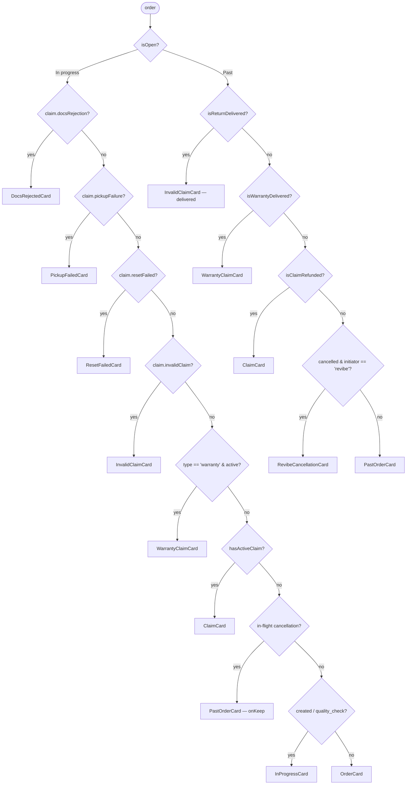
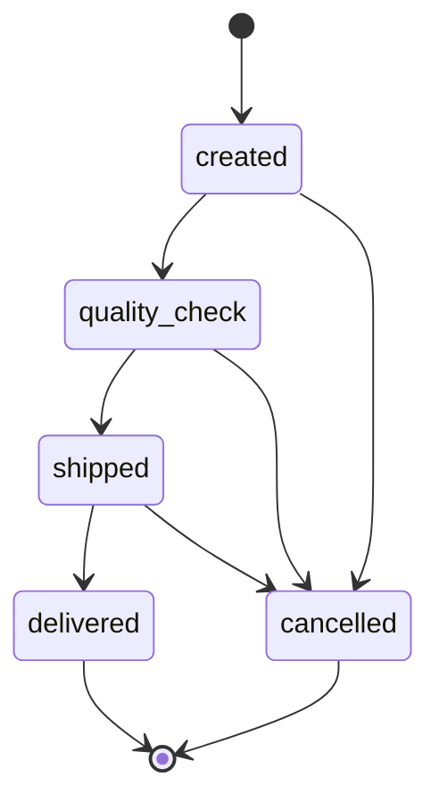
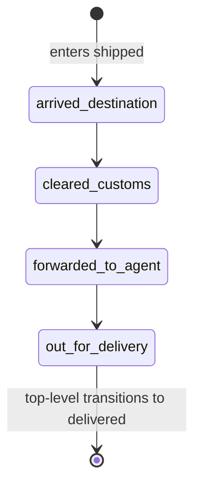
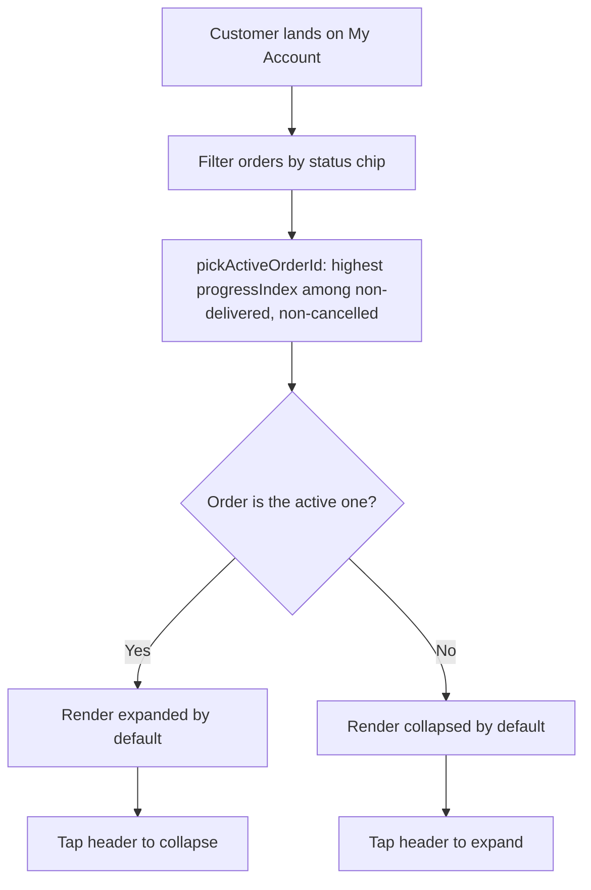

# Orders

> Customer-facing surface for browsing past and in-flight orders inside My Account. This doc covers the order list, the four card types and their baseline chrome, the auto-expand rule, the status models, the filters, and the history thread. Cancellation behaviour is in [cancellations.md](./cancellations.md); the returns flow and claim tracking are in [returns/](./returns/).

## 1. Overview

The orders area lives inside the customer's My Account page. It shows every order the customer has placed, communicates the current shipment status at a glance, and lets the customer drill into a single order for full details and post-purchase actions (download receipt, raise a claim, change address while the order is still actionable, track the parcel via the courier).

This prototype is intentionally narrow: only the orders list and the expand/collapse interactions are functional. Everything around it (search, filters, the Revibe Wallet pill, profile menu, language toggle) is decorative — present for visual fidelity but not wired up.

**In scope**

- Order list with eight demo orders covering every top-level state plus a cancelled-past order and orders carrying in-flight return claims.
- Per-order collapsed summary card with status banner.
- Per-order expanded view with full timeline, courier banner, sub-timeline, and order summary.
- Auto-expand rule: only the single most in-flight order is expanded by default; the rest collapse.
- Status chip row filtering the list (`All / In progress / Delivered / Cancelled`).
- Status banner with `delayed` and `statusMessage` overrides.
- Four order-card baselines (`InProgressCard`, `OrderCard`, `PastOrderCard`, `ClaimCard`) — the last two are documented in detail in their own feature docs but share the chrome family described here.

**Out of scope (faked or stubbed)**

- Authentication, real backend, real customer data.
- Site-wide search and the in-list "Find an order or item" search field.
- Revibe Wallet pill balance and most of the page chrome around the list.
- Right-to-left and Arabic localisation.
- Real courier tracking — the "Track order" button hardcodes a known-good DHL Express test shipment so the demo always lands on a real tracking page.

## 2. Card routing

`App.jsx` routes in **two stages**: `isOpen(order)` partitions orders into the *In progress* and *Past* sections, then a precedence ladder inside each section picks the card. The first four in-progress branches are claim takeovers (see [returns/claim_tracking.md](./returns/claim_tracking.md)); the rest fall through to the order surfaces documented in §3. (Canonical copy of this tree, kept in lock-step with `App.jsx`: [diagrams.md](./diagrams.md#card-routing).)



The four baseline cards (`InProgressCard`, `OrderCard`, `PastOrderCard`, `ClaimCard`) share the same chrome family: left accent strip, `Order · #{id}` eyebrow, state pill, tinted hero block, and the shared `ProductSummary` line-item (§3.0). They differ in what the hero leads with and which actions hang off the bottom. The five claim takeover cards (`DocsRejectedCard`, `AwbFailedCard`, `PickupFailedCard`, `ResetFailedCard`, `InvalidClaimCard`) replace `ClaimCard`'s surface while the claim is blocked on a single customer action; `WarrantyClaimCard` is a sibling card for warranty claims and `RevibeCancellationCard` covers Revibe-initiated cancellations in the Past section. Full specs in [returns/claim_tracking.md](./returns/claim_tracking.md) and [cancellations.md](./cancellations.md).

| Card | Used for | Hero leads with | Expandable? |
|---|---|---|---|
| `InProgressCard` | non-cancelled `created` / `quality_check` | `Delivery by` + ETA | yes |
| `OrderCard` | non-cancelled `shipped`; in-flight cancellations mid-fulfilment | status icon + headline + ETA | yes |
| `PastOrderCard` (delivered) | `statusId === 'delivered'` (non-cancelled, no claim attached) | `Delivered on` + date | no |
| `PastOrderCard` (cancelled past) | `state === 'cancelled' && cancellationStatusId === 'refunded'` (and the refund-hero variant for `requested` / `refund_pending` while in the open list) | `Cancellation · #{cancellationRef}` eyebrow + refund amount | yes |
| `ClaimCard` | any order carrying an `order.claim` field — replaces the delivered card. Lives in **In progress** while the claim is active; drops to **Past orders** once `claimStatusId === 'refund_credited'` | `Claim` + status label + claim ref + expected refund | yes |

## 3. Order surfaces

### 3.0 ProductSummary — the shared product line-item

Every order/claim card renders the "what you bought + what you paid" row through one shared component, `src/components/ProductSummary.jsx` (design: `docs/handoff/product-summary/design.md`, "Direction C — Elevated Care"). It replaced ten near-identical inline copies and exports the single `REVIBE_CARE_ICON` constant (mirroring `WalletInfoTooltip`'s `REVIBE_WALLET_ICON`); the cancellation/refund breakdown surfaces (`CancelOrderSheet`, `Step5RefundMethod`) import that constant rather than re-declaring it.

API: `<ProductSummary order={order} tone="light" | "hero" afterRow={node} />`. The component owns the thumbnail, name, variant, the Revibe Care callout, and the price breakdown — but **not** the expand chevron (the card owns the tap target + chevron). `afterRow` (optional) slots caller-supplied content in a `mt-2.5` block under the top row and above the Care callout — the card owns what goes there; the delivered card uses it for the NSYS condition-report link (§3.3).

Layout (with warranty):

- **Top row** — 98×98 thumbnail, image fill-zoomed inside an `overflow-hidden` tile to kill the dead margin (Direction C §6 follow-up). A `CUTOUT_ART` flag in `ProductSummary.jsx` switches two image realities from one code path: with transparent cut-out art (current — `order.product.image` is `/iphone-cutout.png`) the device floats on a brand-tint media well (`brand-bg`→`brand-bg2` radial; faint `white/.10` wash on hero) at `scale(1.04)`; with the legacy white-bg placeholder it's a clean `surface` + `line` tile (`white/.96` no border on hero) at `scale(1.3)`. Then product name (16px/700), variant (12.5px/muted), and a right-aligned `Device` eyebrow over the `order.subtotal` price (falls back to `order.total`).
- **Revibe Care callout** — a dedicated block carrying the **hero gradient** (magenta/violet radial glow + white icon chip holding `REVIBE_CARE_ICON`), the "Revibe Care" title, an "extended warranty" subline, and `+{currency} {warranty}`. This is the brand moment on an otherwise calm light card. On the dark `HeroCard` the gradient can't sit on the gradient, so the callout **inverts to a frosted-white panel** (`white/.12`); the white chip keeps the Care identity.
- **Total row** — a top divider, `Total paid` label, and the bold `order.total` (19px/800). This makes `subtotal + Revibe Care = total` read with no mental math.

Layout (no warranty, `order.warranty == null`): the Care callout **and** the Total row are both omitted (subtotal === total, so a breakdown would just repeat one number). The row collapses to product + a single right-aligned `Total` eyebrow over the bold total — no empty gap, no leftover divider.

`ProductSummary` is used on **every** card that carries an order, including the cancelled refund-hero card (§3.4 / [cancellations.md](./cancellations.md)). There it sits below the `RefundHero`: the hero states the **refund** amount + destination, while `ProductSummary` states the device + Revibe Care + **Total paid** (the original price) — distinct numbers (they differ by any cancellation fee), so the two read as paid-vs-refunded rather than a repeat.

### 3.0.1 DeliveryAddressPill — the shared "Delivering to / Delivered to" address row

The hero's destination line is one shared component, `src/components/DeliveryAddressPill.jsx` (props `{ label, address }`), used by four heroes: `InProgressCard` (`Delivering to`), `PastOrderCard` (`Delivered to`), `WarrantyClaimCard`'s ship-back, and `InvalidClaimCard`'s paid return (both `Delivering to`). It replaced the old static `[🏠 Home]` chip with the real `order.address`.

The component owns the whole block (label + pill + reveal). The label and a `rounded-full` pill stay pinned on one line; the pill shows a `MapPin` icon + the **first comma-separated segment** of the address (`address.split(',')[0]`, e.g. `Ontario Tower`) + a `ChevronDown`. Tapping the pill reveals the **full address** on a muted line directly below the row (chevron rotates) — the label never reflows. When the address has no second segment (`full === short`) the chevron and reveal are suppressed and the pill is inert. Falls back to `Home` when `address` is absent.

### 3.1 InProgressCard (`created`, `quality_check`)

**Collapsed:**

- Small `Order · #{id}` eyebrow at the very top.
- State pill (`Order placed` for `created`, `Quality check` for `quality_check`) with a `Package` / `ShieldCheck` icon, on its own row beneath the eyebrow. Constant brand-purple tone regardless of `delayed`.
- A brand-purple gradient hero block (`from-brand-bg to-brand-bg2`) carrying `Delivery by` eyebrow + an `On track` tag (`Zap` icon) on the right; a `text-[26px]` headline using `order.estimatedDeliveryLong || order.estimatedDelivery`; the body sentence from `statusDescription(order).body`; and a `Delivering to [📍 …]` address pill below (shared `DeliveryAddressPill`, §3.0.1).
- When `order.delayed === true` the right-side tag swaps to `Clock` + `Taking longer than expected` and turns **amber** (`text-amber-600`) — the rest of the hero (gradient, ETA headline, state pill) stays brand-purple (see §8 "Delayed in-progress accent"). The body pulls the delay-flavoured copy from `DELAYED_BODY[statusId]`.
- The shared `ProductSummary` row (§3.0). The decorative expand chevron now sits on the `Order · #{id}` eyebrow line (relocated out of the row); the whole header is one tap target.

**Expanded:**

- Horizontal `Timeline` dot row (Placed → QC → Shipped → Delivered). Each reached / current step renders the date and time on two lines below the label, sourced from `order.timeline[stepId]`; upcoming steps render the label only.
- `Order details` collapse with delivery address, phone, and order date, plus `Change address` and `Change phone number` pills. `Change details` programmatically opens the collapse via ref.
- Two-action footer: `Cancel order` (danger outline) + `Change details` (brand outline). On `created`, `Cancel order` opens the cancellation bottom sheet — see [cancellations.md](./cancellations.md). On `quality_check` it's a visual stub.

### 3.2 OrderCard (`shipped`, in-flight cancellations)

`OrderCard` is the older chrome retained for shipped orders and for in-flight cancellations still mid-fulfilment with `state === 'cancelled'`.

**Collapsed:**

- `ORDER · #{id}` eyebrow at the top so the order number is always visible.
- Status icon + headline (e.g. "Out for delivery", "Cancelled").
- Subline with the most relevant timestamp (forward-looking ETA when DHL provides one, otherwise the most recent status timestamp).
- State chip on the right when relevant. Cancelled orders carry a red "Cancelled" chip.
- Horizontal four-step dot timeline above the product strip.
- The shared `ProductSummary` row (§3.0). Chevron lives in the status summary header, not the row.

**Expanded:**

- Status banner (long form), the **Shipping progress** sub-timeline (shipped only, and **country-gated** — hidden when `countryConfig(order).detailedTracking` is false, i.e. `SA`/`Others`; see `country_split.md`), and the courier card with the "Track" link (always shown — top-level tracking, not detailed).
- `Order details` collapse with phone, address, and order date.
- Action row: shipped → `Receipt` + `Get help`; in-flight cancelled → `Get help`.
- Four-step **Full timeline** at the bottom.

### 3.3 PastOrderCard — Delivered (`statusId === 'delivered'`)

The delivered card is **not expandable** — there is no chevron and no expanded body. It carries the same chrome family but with success-green tones and a date-led hero:

- `w-1` left success-green strip.
- `Order · #{id}` eyebrow.
- Success-tinted `Delivered` state pill (`PackageCheck` icon).
- Success gradient hero block (`from-success-bg to-[#d4f0e3]`) carrying `Delivered on` eyebrow + `Complete` tag with checkmark; a `text-[26px]` headline using `order.deliveredOnLong` (falls back to the date part of `order.timeline.delivered`); a `Delivered to [📍 …]` address pill below (shared `DeliveryAddressPill`, §3.0.1).
- The shared `ProductSummary` row (§3.0). The cancelled refund-hero card (§3.4) also uses `ProductSummary` — the `RefundHero` carries the refund amount, the row carries the device + Revibe Care + Total paid.
- **NSYS condition-report link** — when `order.conditionReport?.url` is present, a quiet, borderless inline link ("Verified by NSYS" with the NSYS mark + an external-link glyph) renders in `ProductSummary`'s `afterRow` slot, directly under the product row. It's a `text-muted → text-ink` hover link, deliberately subordinate to the Revibe Care block and the `I need help` CTA, and opens the third-party NSYS-hosted device condition report in a new tab. The chip is the shared **`ConditionReportChip`** (`src/components/ConditionReportChip.jsx`) — extracted out of `PastOrderCard` so the returned-device surfaces can re-show it (`WarrantyClaimCard`'s `device_returned` hero + `InvalidClaimCard`'s delivered paid-return, resolving a fresh return-leg report first; see [returns/claim_tracking.md](./returns/claim_tracking.md) §3.3, [warranties_compensations.md](./warranties_compensations.md) §2.3.2). The card decides *when* to show it and *which* report to pass. The URL is a decorative placeholder today (like the DHL tracking link — see §10). Field shape: §7.5.
- Stacked footer separated by a top border: a full-width brand-tinted `I need help with this device` button (the relabelled `Raise a claim` CTA — entry point to the returns flow, see [returns/change_of_mind.md](./returns/change_of_mind.md) / [returns/issue.md](./returns/issue.md)) above a right-aligned, quiet `Download receipt`. `PastButton` takes a `tone` (`brand` / `muted` / `quiet`) + `full` to drive this.

A single-row `HistoryThread` (mode `'delivered'`) carrying just the `Order placed` event sits between the product row and the footer buttons, collapsed by default. Delivery is the active hero so it is intentionally absent from the thread.

### 3.4 Other surfaces

- **`PastOrderCard` — cancelled past:** documented in [cancellations.md](./cancellations.md) (refund-hero card variants).
- **`RevibeCancellationCard` — Revibe-initiated cancellation:** the Past-section card for orders cancelled by Revibe (`state === 'cancelled' && cancellationInitiator === 'revibe'`); documented in [cancellations.md](./cancellations.md).
- **`ClaimCard` + takeover cards (incl. `ResetFailedCard`) + `WarrantyClaimCard`:** documented in [returns/claim_tracking.md](./returns/claim_tracking.md) and [warranties_compensations.md](./warranties_compensations.md).
- **HeroCard:** the active in-flight order (currently the out-for-delivery one) has stacked buttons beneath the headline — a `Track package` / `Get help` row (`Track package` filled white, brand text — the only filled CTA in the app; `Get help` ghost), then a full-width translucent-white `I need help with this device` button (the relabelled claim CTA), then a `Cancel order` row. `Cancel order` toggles a small dark tooltip — *"You cannot cancel the order at this stage"* — the cancellation rule is prototype-only.

## 4. State models

### 4.1 Top-level state machine

`statusId` drives the horizontal timeline. Valid values: `created`, `quality_check`, `shipped`, `delivered`.



`cancelled` is modelled as a separate **state** on the order, not a top-level status (see §4.3). A cancelled order keeps the `statusId` it had at cancellation, which informs the timeline rendering.

### 4.2 Shipping sub-state machine

While the top-level status is `shipped`, the order also carries a `subStatusId` describing where the parcel is in DHL's pipeline.



There is intentionally no `delivered` sub-status. When the parcel is delivered, the order's top-level status moves to `delivered` and the sub-status is no longer relevant.

### 4.3 `state` is parallel to `statusId`

`state` (`open`/`close`/`cancelled`) controls header chips, independent of progression. Cancelled orders keep the `statusId` they had at cancellation. Override: `delivered` always renders a green Delivered chip regardless of `state`.

### 4.4 Per-state behaviour cheat sheet

| Top-level state | Card | Auto-expanded | Hero / headline | Tone | Hero tag | Footer actions |
|---|---|---|---|---|---|---|
| `created` | `InProgressCard` | If most in-flight | `Delivery by` + ETA (`estimatedDeliveryLong`) | brand | "On track" (Zap) | `Cancel order` + `Change details` |
| `quality_check` | `InProgressCard` | If most in-flight | `Delivery by` + ETA | brand hero; amber tag when `delayed` (see §8) | "On track" (Zap) or amber "Taking longer than expected" (Clock) when `delayed` | `Cancel order` + `Change details` |
| `shipped` (sub-status drives headline) | `OrderCard` | If most in-flight | status icon + sub-status label (e.g. "Out for delivery") + `Delivery by` ETA subtitle | brand | banner-driven ("On track" / "Arriving today") | `Receipt` + `Get help` |
| `delivered` | `PastOrderCard` (delivered branch) | Never (no expand) | `Delivered on` + `deliveredOnLong` | success | "Complete" (Check) | full-width `I need help with this device` (brand) + quiet `Download receipt` |
| `cancelled` — in flight (`state === 'cancelled'` + non-terminal `statusId`) | `OrderCard` | Never | "Cancelled" + status banner | danger | n/a | `Get help` |
| `cancelled` — past order | `PastOrderCard` (cancelled branch) | Never | `Refund of` / `Refunded` + amount | warn / brand / success per phase | "Requested" / "Processing" / "Complete" | `View refund details` + icon-only `Download receipt` |

A past cancelled order whose `cancellationInitiator === 'revibe'` routes instead to `RevibeCancellationCard` (Revibe-initiated cancellation, ahead of the customer `PastOrderCard` fallback) — see [cancellations.md](./cancellations.md).

### 4.5 Status banner tone resolution

`statusDescription(order)` resolves in this order:

1. `state === 'cancelled'` → red "Refund in progress"
2. `delayed === true` → orange "Taking longer than expected". On `OrderCard` (shipped) the full warn-amber banner applies; on `InProgressCard` (created/QC) the hero body still uses the delay copy but only the `Clock` tag accent turns amber — the hero gradient/headline/pill stay brand-purple (see §8)
3. otherwise → `STATUS_DESCRIPTIONS[statusId]` (or `shipped:{subStatusId}` — **but only when `countryConfig(order).detailedTracking` is true**; `SA`/`Others` collapse to the single `shipped` message so no destination-country / customs copy shows, see `country_split.md` §4)
4. `statusMessage` overrides body only

### 4.6 Status explainer ("Learn more")

A `StatusExplainer` (`src/components/StatusExplainer.jsx`) renders an inline `ⓘ Learn more` link **on the same row as the status pill**; tapping reveals a full-width plain-language *stage definition* below the chip, then taps shut (it `stopPropagation`s so it never toggles the card header). This is distinct in voice from the §4.5 condition banner — the banner says "On track · your device is undergoing inspection"; the explainer answers "what does Quality check mean?". Copy is data-driven: `STATUS_EXPLANATIONS` + `statusExplanation(order)` in `lib/statuses.js`, defined only for the stages that route through the explainer — `created` / `quality_check` (keyed by `statusId`) and `cancellation_{id}`. `shipped` / `delivered` are deliberately absent (those surfaces explain themselves), so the resolver returns null and nothing renders there.

It appears only where the card header doesn't already define the stage: **`InProgressCard`** (`created`/`quality_check`) and the cancelled **`PastOrderCard`** (the `cancellation_refund_pending` copy clarifies the cancellation was *accepted* and the order won't ship — the prior gap). It is intentionally **absent** from the delivered `PastOrderCard`, `HeroCard`, and the shipped/delivered `OrderCard` (already carries `StatusBannerInline`), all of which are self-explaining. Claim/warranty equivalents: `claim_tracking.md` §2.2.1, `warranties_compensations.md` §2.3.6.

## 5. Filters & auto-expand

### 5.1 Filter chip row

`OrderFilters` exposes a controlled chip row: `All / In progress / Delivered / Cancelled`. Filter logic lives in `App.jsx`; counts are derived from the same predicates that route cards (claim-carrying orders count toward `in_progress` while the claim is active; refunded claims count toward `delivered`). Above the chips sits a full-width (decorative) search field.

### 5.2 Auto-expand rule



Every card collapses by default. `pickActiveOrderId(orders)` returns the id of the single most-in-flight order — the one with the highest pipeline progress (`progressIndex × 10 + subProgressIndex`, in-flight only) — and `App.jsx` passes `defaultExpanded` only to that card. The rule operates on the *filtered* list, so picking the "Delivered" chip auto-expands nothing.

Once the customer taps a card, their state sticks across filter changes (state lives in the card component, not derived from `activeId`).

`ClaimCard` does **not** currently participate in `pickActiveOrderId`. Fulfilment in-flight orders win the auto-expand slot when both are present; claim cards collapse by default.

**Exception — `created` / `quality_check`.** Even when one of these is the active order, neither the `HeroCard` nor auto-expansion of the `InProgressCard` is triggered. The hero is built around courier and ETA data that doesn't exist yet at those states, so `App.jsx` excludes them from `showHero`; `InProgressCard` is rendered without `defaultExpanded` so it stays collapsed until the user opens it manually. This is invisible in the normal demo (the active order is always at `shipped`) but matters in journey mode (`?journey=1`), where the single journey order is the active one at every step.

## 6. History thread

On layered cards — `ClaimCard`, cancelled `PastOrderCard` in `refund_pending` / `refunded`, and the delivered variant of `PastOrderCard` — past events render as compact chips under the active hero; tapping a chip expands its detail inline (one open at a time). Derived in `src/lib/events.js` from `timeline` / `cancellationTimeline` / `cancellationRejection`.

The active event lives in the hero and is excluded from the thread. Chip click handlers `stopPropagation` because the card header is one big tap target.

The trace is built per-mode by `getHistoryEvents(order, mode)`:

- `mode: 'delivered'` — `Order placed` only.
- `mode: 'cancellation'` — `Order placed`, plus `Cancellation requested` once the order moves past `requested`.
- `mode: 'claim'` — `Order placed`, `Delivered`, optional `Cancel rejected` (when `cancellationRejection` is set), optional `Evidence resubmitted` (when `claim.proofResubmission` is set).

## 7. Data model

The orders array (`src/data/orders.js`) is mock data today. Production will swap it for an API response of the same shape. Fields are grouped by purpose; cancellation, returns-flow, and claim fields live in their respective feature docs.

### 7.1 Top-level fields

| Field | Type | Notes |
|---|---|---|
| `id` | string | Human-readable order number shown in the header. |
| `phone` | string | Customer's phone number on the order. |
| `email` | string | Customer's email. Seeded into the returns flow's Step 4 pickup contact. |
| `address` | string (free text) | Delivery address. |
| `placedAt` | string (formatted) | Order timestamp shown on the summary screen. |
| `placedAtFull` *(optional)* | string | Pre-formatted long form (e.g. `Monday, 4 May`) — keeps components out of weekday arithmetic. |
| `quantity` | integer | Number of items in the order. |
| `subtotal` *(optional)* | number, no currency | Product-only amount. Shown as the `Device` price in the `ProductSummary` breakdown (§3.0) and the cancellation sheet's line-item breakdown. Falls back to `total` when absent. |
| `warranty` *(optional)* | number, no currency | Revibe Care add-on amount. Field name kept as `warranty` for backwards compatibility. Drives the gradient Revibe Care callout in `ProductSummary` (§3.0) and renders as a `Revibe Care +{amount}` line in cancellation/return breakdowns; `null`/absent omits the callout and the Total row. |
| `total` | number, no currency | Total amount paid. Should equal `subtotal + warranty` when both are present. |
| `unitPrice` *(optional)* | number, no currency | Per-unit device price used by the returns flow's `refundBreakdown` (`gross = unitPrice * units`). Falls back to `subtotal`, then `total`. |
| `paymentMethod` *(optional)* | `{ type: 'card', brand, last4 }` or `{ type: 'bnpl', provider, brand }` | Payment instrument. Drives the original-payment card label on the cancellation sheet + returns refund step; BNPL collapses the label to the provider brand and adds `BnplDisclaimerTooltip`. Falls back to a generic `Card •• 0000`. |
| `paymentSplit` *(optional)* | `{ card, giftCard }` (numbers summing to the paid gross) | Marks the order as **split-paid** — settled with both a bank card and a gift card (store credit). On the **original-payment** refund path the refund is paid back along the same ratio (`refundDestinations` in `lib/returns.js` splits the post-fee `net` proportionally; card portion → card, gift-card portion → Wallet) and rendered via the shared `RefundSplitRows`. When the split rows show, they **replace** (not augment) the single "Going to / Sent to <destination>" summary chip — `RefundSplitRows` takes that wording via its `caption` prop instead. For a **BNPL** split-paid order the `BnplDisclaimerTooltip` rides on the card-portion split row (via the component's own `labelAfter`); the standalone BNPL tooltip is suppressed on every surface that renders the split (`ClaimCard`, `ClaimDetailsSheet`, `Step5RefundMethod`/`Step6Review`/`Step7Confirmation`) so it's never shown twice. Absent / single-source → today's single-destination display. `paymentMethod` still carries the card-portion label. See [cancellations.md](./cancellations.md), [returns/change_of_mind.md](./returns/change_of_mind.md), [wallet.md](./wallet.md). |
| `deviceOs` *(optional, `'ios' | 'android'`)* | string | Guided-reset OS fallback used only when `product.category_name` is absent; defaults to `'ios'`. See [returns/guided_reset.md](./returns/guided_reset.md). |
| `currency` | string | Three-letter currency code (e.g. `"AED"`). |
| `customerName` | string | Recipient's full name. |
| `country` *(optional, default `'AE'`)* | string | Country code (`AE` / `ZA` / `SA` / `Others`). Drives the **country split** — `countryConfig(order).detailedTracking` (`lib/countries.js`) gates the `HeroCard` `See detailed tracking` dropdown (`SA`/`Others` → hidden). Injected on the replayed order from the dev-panel CountryPicker / `?country=` param in journey mode. Model + future-difference recipe: `docs/output/country_split.md`. |

### 7.2 Status fields

| Field | Type | Notes |
|---|---|---|
| `statusId` | enum | Drives the four-step progression timeline. Values: `created`, `quality_check`, `shipped`, `delivered`. |
| `subStatusId` *(optional)* | enum | Only meaningful while `statusId === 'shipped'`. Values: `arrived_destination`, `cleared_customs`, `forwarded_to_agent`, `out_for_delivery`. May be omitted on a shipped order if DHL has not yet returned a sub-status. |
| `state` | enum | Parallel header state for chips/filters. Values: `open` (default), `close`, `cancelled`. Independent of progression — a cancelled order keeps the `statusId` it had at cancellation. |
| `delayed` *(optional)* | boolean | When true, the status banner switches to warn (orange) tone with delay-flavoured body keyed by `statusId`. |
| `statusMessage` *(optional)* | string | Overrides the status banner's body text. Leading phrase and tone still computed from `state` / `delayed` / `statusId`. Production hook for ad-hoc backend-injected notes. |

### 7.3 Tracking & courier fields (only once shipped)

| Field | Type | Notes |
|---|---|---|
| `courier` | string | Carrier name shown in the banner. Today always `"DHL"`; field exists for future multi-carrier support. |
| `trackingNumber` | string | Courier-issued tracking number. |
| `trackingUrl` | string | Gates whether the "Track order" CTA renders (truthy → render). The CTA's `href` itself is **hardcoded** to a known-good DHL Express test shipment (`tracking-id=3392654392`) so the demo always lands on a real tracking page; the per-order URL is ignored. Production should template `tracking-id` on `order.trackingNumber`. |
| `estimatedDelivery` | string (free-text date) | DHL's forward-looking ETA used as the collapsed-card subline when present. **Optional** — DHL doesn't always communicate this. |
| `estimatedDeliveryLong` *(optional)* | string | Long form (e.g. `"Monday, 4 May"`) used as the big `text-[26px]` hero headline inside `InProgressCard`. Falls back to `estimatedDelivery` when absent. |
| `deliveredOnLong` *(optional)* | string | Long-form delivery date (e.g. `"Wednesday, 15 April"`) used as the delivered card's hero headline. Falls back to the date part of `order.timeline.delivered`. |
| `shipDeadline` *(optional)* | string | Latest shipping date allowed by the 1–3 working-day ship SLA (short form). Surfaced on the cancellation dissuade step — see [cancellations.md](./cancellations.md). |
| `shipDeadlineFull` *(optional)* | string | Long-form pair to `shipDeadline`. |

### 7.4 Timeline fields

| Field | Type | Notes |
|---|---|---|
| `timeline` | map keyed by `statusId` | Timestamp at which the order entered each top-level stage. Populated progressively (a `created` order has only `timeline.created`; a delivered order has all four). |
| `subTimeline` | map keyed by `subStatusId` | Timestamp at which the parcel entered each sub-stage during the shipped phase. Only present on shipped (and later delivered) orders. |

### 7.5 Product fields

Today an order has one product. The `product` object carries:

| Field | Type | Notes |
|---|---|---|
| `name` | string | Display name. |
| `variant` | string | Variant string (e.g. `"Black / 32 GB / Good"`). The last `·`/`/`-separated segment is the condition grade read by the returns battery check (`conditionGradeOf`). |
| `image` | string | Path to the product image asset. |
| `category_name` *(optional)* | string | Product category (e.g. `'Tablet'`, `'Macbook'`, `'Samsung phone'`). Canonical driver of the guided-reset variant via `deviceTypeForOrder` / `deviceOsForOrder`. See [returns/guided_reset.md](./returns/guided_reset.md). |

Multi-item orders are out of scope for the prototype (see §11).

One related **order-level** (not `product`-nested) field carries device provenance:

| Field | Type | Notes |
|---|---|---|
| `conditionReport` *(optional)* | `{ url, reportId }` | Third-party (NSYS) device condition report. When `url` is present, the delivered `PastOrderCard` renders the quiet "Verified by NSYS" link under the product row (§3.3). `reportId` is the NSYS report reference (e.g. `NSYS-89657-A7C3`). `url` is a decorative placeholder today (§10). Only seeded on delivered orders. |

## 8. UX decisions

These decisions came out of phase-2 review and inform later phases; future contributors should know why the prototype looks the way it does.

**Two-tier status model.** We considered flattening the four shipping sub-statuses into the top-level timeline, which would have produced a nine-step horizontal timeline. On a 430px-wide mobile column this is unreadable. Instead the top timeline always shows the four high-level stages, and the shipping sub-statuses are exposed as a vertical sub-timeline that only appears when relevant.

**Courier banner elevated out of the order summary.** Previously the courier name was a small hyperlink buried inside the summary table. It is now a dedicated banner with explanatory copy ("Have a question about your delivery?..."). The "Track order" CTA is the **only filled brand-purple button in the app** — a deliberate departure from the otherwise-outlined button language.

**Auto-expand the active order, not the terminal ones.** Every card collapses by default; only the single most in-flight order auto-expands. This keeps the list scannable while still surfacing the order most likely to need attention. Earlier the rule was the inverse (collapse only delivered/cancelled), which left three or four orders open at once and pushed everything below the fold.

**Status banner sits in the always-visible card header.** Tinted banner with a coloured leading phrase + descriptive sentence. The leading phrase describes *condition* (`On track`, `Arriving today`, `All done`, `Refund in progress`, `Taking longer than expected`) — never the process step, since the headline already shows that. Tone resolution and overrides: see §4.5.

**Delayed in-progress accent (amber tag, brand hero).** `InProgressCard` still ignores `statusDescription`'s warn tone for the *body* of the in-progress hero — when `delayed: true`, the hero gradient, headline colour, accent strip, and state pill stay brand-purple, preserving visual cohesion with the other in-progress cards. The delay signal is carried by the right-side tag only: it swaps `Zap`/"On track" for `Clock`/"Taking longer than expected" and turns **amber** (`text-amber-600`), and the body pulls delay-flavoured copy from `DELAYED_BODY[statusId]`. This is an "accents only" treatment — earlier the tag stayed brand-purple too (a full warn-amber hero was rejected as overly alarming for a normal QC slowdown), but an amber accent alone reads as the intended "heads up" without flooding the card. The full warn-amber banner treatment still exists for `OrderCard`'s shipped cards via `statusDescription`. The shared `warn` token is deliberately untouched — the hero amber is a local `text-amber-600`, kept distinct from the `warn` tone so `OrderCard`'s late banner and the `Close` chip are unaffected.

**Delivered chip overrides `state: 'close'`.** Delivered orders carry `state: 'close'` in the data, but customers see a green "Delivered" pill instead of the orange "Close" pill. The override lives in `OrderCard`'s `SummaryHeader` so the data shape stays unchanged.

**Unified `Timeline` dot treatment.** Completed stages are filled brand dots with a white check and a 100% brand connector; the current stage is a hollow brand ring (pulsing glow) whose outgoing connector fills ¾ ("in transit"); future stages stay grey-outlined with a grey connector. The current label is the tone colour + bold. Reaching the final stage renders it completed (filled check, no pulse). The same component/treatment is used across the collapsed cards, the hero (white `onDark` palette), and the expanded full timeline — see `docs/handoff/timeline/design.md`.

**Forward-looking subline when ETA is available.** DHL provides an estimated delivery date sometimes, not always. When present, the collapsed-card subline reads "Delivery by [date]" — a customer-facing, future-tense answer to "when is it coming". When absent it falls back to "Updated [timestamp]".

**Whole header is the tap target.** The chevron is decorative — tapping anywhere on the collapsed-card header expands the card. Larger tap targets are friendlier on mobile, and there is no rival action competing for the same area.

## 9. Component map

Order-list surfaces only. Cancellation, returns-flow, and claim-tracking components live in their respective feature docs.

```
src/
├── App.jsx                       Page composition; owns filter state + active-id wiring + claimFlowOrderId
├── lib/
│   ├── statuses.js               STATUSES, SHIPPING_SUB_STATUSES, STATUS_DESCRIPTIONS, DELAYED_BODY, pickActiveOrderId, statusDescription, statusHeadline, statusIconFor
│   └── events.js                 getHistoryEvents(order, mode) — drives HistoryThread on layered cards
└── components/
    ├── PromoBar.jsx              Magenta promo strip at the top
    ├── Header.jsx                Logo, language, profile, wishlist, bag
    ├── SearchBar.jsx             Site-wide search field (decorative)
    ├── FiltersRow.jsx            Filters icon + profile chip
    ├── GreetRow.jsx              Greeting row + Revibe Wallet pill
    ├── StoreCreditsCard.jsx      Wallet balance card (decorative)
    ├── OrderFilters.jsx          Full-width search field + status chip row (controlled)
    ├── ProductSummary.jsx        Shared product line-item (thumbnail · name · variant · Revibe Care callout · price breakdown); exports REVIBE_CARE_ICON (§3.0)
    ├── DeliveryAddressPill.jsx   Shared "Delivering to / Delivered to" address row used by four heroes (§3.0.1)
    ├── InProgressCard.jsx        Expandable card for non-cancelled created/quality_check
    ├── OrderCard.jsx             Expandable card for shipped + in-flight cancellations mid-fulfilment
    ├── HeroCard.jsx              Active order's hero variant of OrderCard
    ├── PastOrderCard.jsx         Branches on `order.state` into delivered (no expand) and cancelled-past variants
    ├── RevibeCancellationCard.jsx Past-section card for Revibe-initiated cancellations (detailed in cancellations.md)
    ├── Timeline.jsx              Unified timeline — every dot strip (horizontal/vertical · 4 tones · onDark/dense/complete/frozen)
    ├── HistoryThread.jsx         Compact chip thread for past events on layered cards
    ├── WalletInfoTooltip.jsx     Shared anywhere "Revibe Wallet" is named (also exports REVIBE_WALLET_ICON)
    └── ChatFab.jsx               Floating chat-with-support button
```

When the backend lands, the swap is small: `App.jsx` currently imports the static `ORDERS` array from `src/data/orders.js`. Replace that with a fetch (or hook) that returns objects matching the shape in §7. No component below `App` needs to change as long as the response shape is preserved.

`pickActiveOrderId(orders)` in `src/lib/statuses.js` is the single source of truth for auto-expand. `App.jsx` calls it on the *filtered* list and passes `defaultExpanded={order.id === activeId}` to each card.

## 10. Mocked vs production

- **Order data.** Eight hand-written orders in `src/data/orders.js`. Production needs a fetch endpoint returning the same shape.
- **Authentication.** No login, no session, no per-customer scoping.
- **DHL integration.** "Track order" hardcodes `tracking-id=3392654392` so the demo always lands on a real tracking page. Production should template on `order.trackingNumber`. "Need help with delivery?" links to DHL's generic customer-service page.
- **NSYS condition report.** The delivered card's "Verified by NSYS" link (`order.conditionReport.url`) points at the NSYS marketing site as a placeholder. Production should link to the actual NSYS-hosted per-device report keyed off `conditionReport.reportId`.
- **`delayed` is a static flag.** Hand-set in `orders.js` today. Production should derive lateness from comparing `estimatedDelivery` (or step ETAs) against current time / SLA. `statusMessage` is the production hook for ad-hoc backend-injected updates.
- **`estimatedDelivery` format.** Currently a freeform string (`"Wed, 29 Apr 2026"`). DHL's real shape may include time windows and structured data — revisit when integrating.
- **Single carrier.** Code is generalised but mock data uses DHL only. Adding a second carrier requires no code change.
- **Single-item orders.** The product object is a single entry; multi-item orders need a `products[]` array and a layout adjustment.
- **Download receipt.** Buttons are present but do nothing.
- **Site-wide search, in-list "Find an order or item" search.** Visual placeholders, no logic. (The Revibe Wallet pill is now live — see `wallet.md`.) The wallet info tooltip's `terms & conditions` link goes nowhere. Status chips do filter the list.
- **Inter font.** Production is Graphik; substituted Inter via Google Fonts because Graphik is licensed.
- **Brand assets.** Local copies in `public/` rather than CDN-served.
- **No analytics or instrumentation.** No event tracking on expand/collapse, track-clicks, etc.

Cancellation, returns-flow, and claim-tracking mocked-vs-prod items live in their feature docs.

## 11. Open questions

- **Domestic vs international sub-status branching.** When shown, all four sub-statuses appear (arrived in destination country → cleared customs → forwarded to third-party agent → out for delivery). For a domestic UAE shipment, "cleared customs" doesn't apply. Worth adding an `isInternational` flag — a natural fit for the country-split capability layer (`docs/output/country_split.md`). (The *whole* sub-timeline is already country-gated by `detailedTracking`; this is about which milestones show when it does.)
- **Real DHL ETA shape.** Today `estimatedDelivery` is a freeform string. Real responses may carry structured date + time windows; `statusSubline` and the collapsed-card UI will need updating.
- **Derive `delayed` from data, not a flag.** Compare timestamps against an SLA contract and set the warn-tone banner automatically.
- **Hook the in-list "Find an order or item" search and the global search bar to anything.** Both are decorative. (A date-range filter was previously plumbed alongside the search field but removed — all mock orders fell inside every range, so it never had a visible effect; the freed space went to the search bar.)
- **Returned and refunded states.** Not modelled as top-level statuses. Likely additions to `ORDER_STATES` plus their own banner copy.
- **Re-order CTA on delivered orders.** Common pattern; not currently present.
- **Multi-item orders.** Today the order shape carries a single `product` and the delivered card represents that one product line. Multi-product orders will need a `products[]` array and one delivered card per product line.
- **Order list grouping ("In progress" / "Completed" sections).** Considered, set aside in favour of the chip-based filter. Worth revisiting if the list gets long.
- **Auto-expand for claims.** `ClaimCard` is not in `pickActiveOrderId` today. If customer research shows users want their active claim opened on land, extend the rank function in `src/lib/statuses.js` to consider `claimProgressIndex` from `src/lib/claims.js`.
