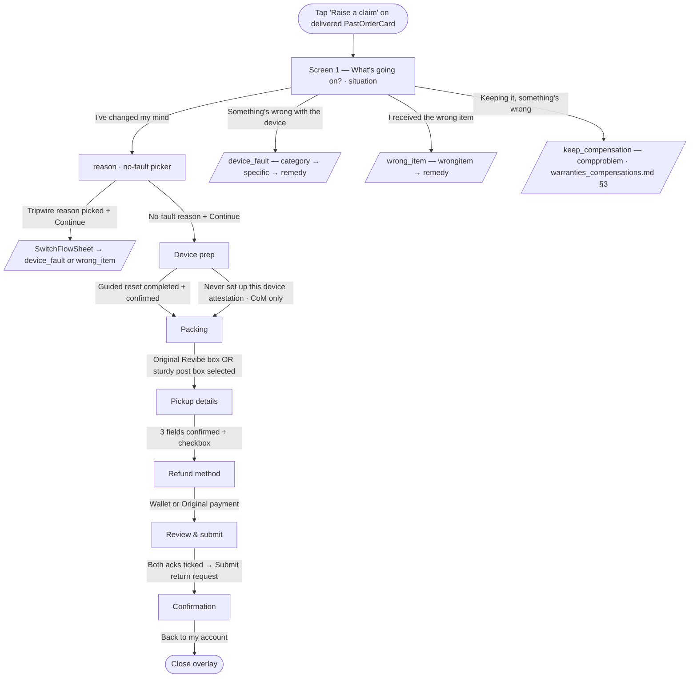

# Returns — Change of mind

> Customer-facing UI of the change-of-mind return branch, launched from `Raise a claim` on a delivered `PastOrderCard`. This doc is also the home of the **shared situation-first decision phase** (Screen 1 + the per-branch decision screens — §2.2–2.3.x) that all four branches walk before the shared out-of-scope steps; the issue / warranty / compensation docs defer here for it. The operational state machine (drawio transcription — country splits, repair-partner branches, LAB sub-flow) is documented separately in [`../../input/return_flow_change_of_mind.md`](../../input/return_flow_change_of_mind.md). Once submitted, the return appears on the customer's list as a `ClaimCard` — see [claim_tracking.md](./claim_tracking.md).

## 0. Situation-first decision phase (the redesign)

The first part of every return is now **situation-first**: Screen 1 asks *what happened* (`situation`), not which outcome the customer wants. The remedy — and with it the downstream `claimType` the rest of the app keys off — is **derived later** from the branch the customer walked. The four situations and how they resolve:

| Screen-1 situation | Branch screens after Screen 1 | Derived `claimType` |
|---|---|---|
| `changed_mind` — *I've changed my mind* | `reason` | `change_of_mind` (auto, no remedy screen) |
| `device_fault` — *Something's wrong with the device* | `category` → `specific` → `remedy` | `issue` (refund) **or** `warranty` (repair) — set on `remedy` |
| `wrong_item` — *I received the wrong item* | `wrongitem` → `remedy` | `issue` (refund **or** replacement) — `remedy` distinguishes |
| `keep_compensation` — *I'm keeping the device, but something's wrong* | `compproblem` | `compensation` (standalone, agent-reviewed) |

`claimType` stays the canonical contract for the shared-tail step sequences, `App.jsx` routing and `buildClaim`; `remedy` (`refund` / `repair` / `replacement`) only forks the tail (repair / replacement skip the refund-method step) and the confirmation copy. The derivation lives in `claimTypeFor(situation, remedy)` (`flowReducer.js`); it's `null` until the fork resolves on the remedy screen. The `Step1ClaimType` outcome-first picker, the old `Step2IssueDetails` mega-form, and `issueSubtypes.js` were deleted in this redesign; the new taxonomy lives in `issueTaxonomy.js`.

## 1. Overview

Change of mind is the entry point used when the customer doesn't want the device any more, with no fault on the seller's side. From the customer's perspective:

- Eligible for 10 days after delivery.
- The device is picked up by courier from the saved delivery address.
- Refund options: full amount to **Revibe Wallet** (instant once return is complete), or `gross − 10% restocking fee` to **original payment method** (5–10 business days).
- Revibe Care (warranty add-on) is refunded on top of the product amount.

Distinguishing characteristic vs the issue branch: change of mind always carries a 10% restocking fee on the original-payment path (issue carries no fee, plus a flat AED 100 Wallet bonus). After Screen 1 the change-of-mind branch shows one screen — a no-fault `reason` picker (§2.3) — then goes straight to the shared out-of-scope steps (device prep onwards), identical to the issue branch.

The flow's visual chrome is deliberately distinct from the order-card family: white surface, segmented top progress bar (`bg-brand` for reached segments, `bg-line` for upcoming) + `Step X of 8` caption, sticky bottom action bar with the only filled brand-purple `Continue` button, and line-bordered cards that gain a `border-brand bg-brand-bg/30` treatment when selected. Tinted hero blocks are reserved for one place — the Step 3 device-prep warn callout — so the user can feel the visual shift between "informational" (account cards) and "doing a task" (the flow) without leaving the design system.

## 2. UI flow



### 2.1 Mount & state

`App.jsx` owns `claimFlowOrderId`. The overlay is rendered conditionally (`{claimFlowOrderId !== null && <ClaimFlow ... />}`), so closing it unmounts the reducer state — the brief explicitly forbids session persistence. The reducer (`flowReducer.js`) takes the entry `orderId` as its initialiser argument and always starts on the `'situation'` step with `situation: null` / `claimType: null`; the user picks a situation every time. `orderId` is carried through so the order being returned is unambiguous from the entry point.

**Step model — situation-derived sequence (not a fixed index, no claimType lookup table).** `state.step` is a **string key**. The active sequence is **derived from the draft** by `sequenceFor(state)`: `DECISION_STEPS[situation]` (the branch's decision screens) followed by `tailSteps(situation, remedy)` (the shared out-of-scope tail). `NEXT` / `BACK` walk that derived list and `GO_TO_STEP` jumps to a key in it, so there's no per-step skip arithmetic to keep in sync. Before a situation is chosen the reducer falls back to `DEFAULT_SEQUENCE` (the longest path) so the progress bar has a sensible denominator on Screen 1.

The tail rules (in `tailSteps`): `keep_compensation` → `refund → review → confirm`; `changed_mind` → `deviceprep → packing → pickup → refund → review → confirm`; `device_fault` / `wrong_item` → `evidence → deviceprep → packing → pickup` then a `refund` step **only** when the remedy moves money (dropped for `repair` / `replacement`), then `review → confirm`.

| Situation → claimType | Decision screens | Shared tail | Visible macro steps |
|---|---|---|---|
| `changed_mind` → `change_of_mind` | situation → reason | deviceprep → packing → pickup → refund → review → confirm | 7 |
| `device_fault` + refund → `issue` | situation → category → specific → remedy | evidence → deviceprep → packing → pickup → refund → review → confirm | 7 |
| `device_fault` + repair → `warranty` | situation → category → specific → remedy | evidence → deviceprep → packing → pickup → review → confirm | 6 |
| `wrong_item` + refund → `issue` | situation → wrongitem → remedy | evidence → deviceprep → packing → pickup → refund → review → confirm | 7 |
| `wrong_item` + replacement → `issue` | situation → wrongitem → remedy | evidence → deviceprep → packing → pickup → review → confirm | 6 |
| `keep_compensation` → `compensation` | situation → compproblem | refund → review → confirm | 3 |

Note the file names predate the redesign: the orchestrator imports the decision screens under their old `StepN…` names (`Step1Situation`, `Step2Reason`, `StepIssueCategory`, `StepIssueSpecific`, `StepRemedy`, `StepWrongItem`, `StepEvidence`, `Step2Compensation`) but renders them by **step key**, not by number.

### 2.1.1 Soft validation (flow-wide contract)

**The `Continue` / `Submit` button is never disabled on any step.** Earlier the button hard-grayed via `!canAdvance(state)`; it now stays full-colour and clickable everywhere, and a premature click *teaches* the customer what's missing rather than presenting a dead button. The contract:

- **`stepError(state)`** (in `flowReducer.js`) is the single source of truth: it returns the **first** unmet requirement for the current step as a stable key (e.g. `situation`, `reason`, `category`, `subtype`, `remedy`, `description`, `attachment`, `resetGuide`, `resetConfirm`, `packing`, `address`, `email`, `phone`, `pickupConfirm`, `refundMethod`), or `null` when the step is complete. The order of the checks **is** the "one at a time" reveal order. (Tripwire selections — a fault/wrong reason, a fault-like wrong-item row, a change-of-mind issue category — are **never** gated: they're valid values that open the switch sheet from `ClaimFlow` rather than advancing.)
- **`ClaimFlow.handlePrimary`** calls `stepError(state)` on click. Non-null → it dispatches `ATTEMPT` (which sets `state.attempted: true`) and returns without advancing. Null → it dispatches `NEXT`.
- **`state.attempted`** is reducer-owned, not component-local. `ATTEMPT` sets it; **every step-changing action (`NEXT` / `BACK` / `GO_TO_STEP` / `SUBMIT`) clears it in the same dispatch.** This atomic reset is what prevents the next step from flashing its own errors for a frame before the user has tried to advance (an earlier `useEffect`-based reset ran one frame too late and produced exactly that flash).
- **`ClaimFlow`** computes `errorKey = state.attempted ? stepError(state) : null` and passes it as the `error` prop to whichever step is mounted. Each step matches the key against its inputs, turns the offending field's border `border-danger`, renders a shared **`InlineError`** message (`AlertCircle` + danger text, `animate-slideDown`), and `scrollIntoView({ block: 'center' })`s the target where it can sit below the fold (Steps 2, 3, 5).
- `canAdvance(state)` is retained as a plain validity predicate but no longer drives the button's disabled state.

The Review ack cards (§2.8) and the iOS reset-guide gate (§2.4) are the original instances of this pattern; they now share the same reducer flag.

### 2.2 Screen 1 — What's going on? (`situation`, shared entry)

`Step1Situation.jsx`. The single entry screen for every branch — *"What's going on?"* with four mutually-exclusive cards (icon coin + title + one-line subtitle + chevron), nothing pre-selected. It asks **what happened**, not which outcome the customer wants:

| `situation` id | Title | Subtitle |
|---|---|---|
| `changed_mind` | I've changed my mind | The device is fine, I just want to send it back |
| `device_fault` | Something's wrong with the device | Faulty, damaged, or not working right |
| `wrong_item` | I received the wrong item | Wrong colour, storage, specs, or model |
| `keep_compensation` | I'm keeping the device, but something's wrong | A missing or broken accessory, or a shipping charge to refund |

Tapping a card dispatches `SET_SITUATION`, which sets `situation`, derives `claimType` (`claimTypeFor(situation, null)` — non-null only for `changed_mind`/`keep_compensation`), and **resets any prior branch draft** via `resetBranchDraft` so a wrong-lane selection never carries over. `Continue` stays clickable with nothing picked; clicking dispatches `ATTEMPT` and surfaces an `InlineError` (`Pick an option to continue.`) above the cards (`stepError` key `situation`) — see §2.1.1.

The `keep_compensation` situation walks straight into the compensation problem screen — see [warranties_compensations.md](../warranties_compensations.md) §3. The `device_fault` / `wrong_item` branch screens are documented in [issue.md](./issue.md) §2.3 (and feed warranty via the `repair` remedy — [warranties_compensations.md](../warranties_compensations.md) §2).

### 2.2.1 The remedy screen (`StepRemedy.jsx`, device_fault / wrong_item only)

The redesigned "type of return" now sits **after** the issue is described (so the menu only shows eligible outcomes), and it's where the `device_fault` / `wrong_item` fork resolves the downstream `claimType`. `SET_REMEDY` writes `remedy` and recomputes `claimType` via `claimTypeFor`:

- `device_fault` → **Return for a refund** (`refund` → `issue`) or **Repair under warranty** (`repair` → `warranty`). Never compensation.
- `wrong_item` → **Return for a refund** (`refund` → `issue`) or **Get the correct item** (`replacement` → `issue`, distinguished by `remedy` for the tail + copy). Picking replacement reveals an inline stock disclaimer: *"Getting the correct item depends on our sellers' current stock. If it's not available, we'll refund you instead."*

Each option names the outcome, not the system process. `change_of_mind` and `keep_compensation` never reach this screen.

### 2.3 The `reason` screen (change-of-mind branch)

`Step2Reason.jsx`. The change-of-mind branch's only decision screen after Screen 1 — *"Why are you sending it back?"*, **required** (`stepError` key `reason`). It's now scoped to change of mind only (the old shared/router role is gone — routing is now decided up front on Screen 1). Six no-fault reasons (`REASONS`), analytics-grade only — they don't branch the flow, and a no-fault return goes straight to a refund:

| `value` | Label |
|---|---|
| `didnt_suit` | Didn't suit my needs |
| `not_expected` | Not what I expected |
| `found_better` | Found a better option |
| `no_longer_needed` | No longer need it |
| `ordered_mistake` | Ordered by mistake |
| `arrived_late` | Arrived too late |

Below an `or` divider sit two warn-toned, dashed **tripwires** (`REASON_TRIPWIRES`) — the two most common wrong-turns into this branch — each carrying a `↳ Switch` affordance:

- `trip_fault` — *It's faulty or not as described* → `device_fault` (pre-fills scope `not_working`).
- `trip_wrong` — *I got the wrong item* → `wrong_item` (pre-fills scope `wrong_device`).

Selecting a tripwire does **not** advance: `Continue` opens the smart `SwitchFlowSheet` (§2.3.2). `tripwireFor(reasonId)` maps a reason to its target situation+scope (null for genuine reasons); `REASON_LABELS` (reasons + tripwire labels) is the single source `Step6Review` reads for the change-of-mind reason copy. There's no `Other` free-text reason in the redesign.

(The seeded change-of-mind mocks still use a legacy `changed_mind` reason id; `lib/claims.js`'s own `REASON_LABELS` keeps it as an alias even though the picker no longer offers it — see §6.2.)

### 2.3.1 Tripwires across the decision phase

Three branches carry a visible tripwire to steer a mis-classified return out before it commits. Each is a sentinel value that `ClaimFlow.pendingSwitch` intercepts on `Continue` to open `SwitchFlowSheet` instead of advancing:

| Where | Sentinel | Target situation (+ scope) |
|---|---|---|
| `reason` (change of mind) | `trip_fault` / `trip_wrong` (`tripwireFor`) | `device_fault` (`not_working`) / `wrong_item` (`wrong_device`) |
| `wrongitem` (wrong item) | `WRONG_ITEM_FAULT_TRIP` (`StepWrongItem.jsx`) — *"It's faulty or damaged, not the wrong item"* | `device_fault` (`not_working`) |
| `category` (device fault) | `CATEGORY_COM_TRIP` (`StepIssueCategory.jsx`) — *"It works fine, it's just not good enough for me"* | `change_of_mind` |

### 2.3.2 The `SwitchFlowSheet` safety net

`SwitchFlowSheet.jsx`. A slide-up confirm sheet (scrim, `animate-slideUp`, Escape/backdrop/X to dismiss, body-scroll lock handled by the flow) keyed by the **target situation**. Rather than auto-navigating, it states the **benefit** of switching — a per-situation icon + tone (`device_fault`/`keep_compensation` warn, `wrong_item`/`change_of_mind` brand), a *"Sounds like…"* title + body, the `ProductSummary`, and a 2–3 line "why this path" benefits list. Two actions: a context-specific dismiss (`No, it's the wrong item` / `No, something's wrong with it` / `No, it's just a change of mind`, depending on the originating step) and a primary **"Yes, switch to that"**.

- **Confirm** → `ClaimFlow` dispatches `SWITCH_SITUATION` with the target situation (+ optional pre-filled scope). The reducer resets the branch draft, carries the scope, and jumps `step` to that situation's `BRANCH_ENTRY` (e.g. `device_fault` → `category`).
- **Dismiss** → clears the tripwire selection on the originating step (reason / wrongitem / category) and stays put, so the customer can pick a real option.

The sheet is authoritative — there is no "continue anyway"; a tripwire selection can only switch or be cleared. This is the redesign's replacement for the old `routeForReason` choice/single-switch modes.

### 2.4 `deviceprep` — Device preparation (shared, gated)

> The remaining sections (§2.4–2.9) are the **shared out-of-scope tail**, unchanged by the redesign. They're labelled by step key, since their position number now depends on the branch (see the §2.1 sequence table). The `wrong_item` → `replacement` and `device_fault` → `repair` paths skip `refund` (§2.7); compensation has its own shorter tail (§0).

A **single mandatory path**: run the guided reset, then tick a confirmation checkbox. There is no path choice — the "can't reset it" case (broken / won't power on / can't unlock) is now handled **inside** the guide via its remote route, so the old second option was removed (rationale in §5). Continue stays clickable; a premature click surfaces the step's gate inline (§2.1.1) — `resetGuide` (guide not yet completed) → then `resetConfirm` (checkbox unticked). A `If you leave this flow, you'll need to start over` hint sits below.

The screen layout ("Refined card" visual direction): the device-prep warn callout (circle warn-badge + `ShieldAlert`), an optional **tablet OS chooser** (see below), then a single prominent **hero launcher** — an elevated card with a gradient icon coin (`Sparkles`, with an inner highlight rim), decorative concentric brand rings, a `~10 min` + an N-step `{stepCount} simple steps` meta-chip row (3 for iPhone/iPad/Mac, 4 for Android), and a trailing `ArrowRight` affordance circle. Below the launcher sits a single collapsed **`Can't run the guided reset?`** disclosure (`ResetOffRamps`, `HelpCircle` + chevron) that folds away the two off-ramps from the on-device reset — a change-of-mind-only **"Never set up this device?"** attestation that skips the reset, and an informational **"Broken, or can't unlock it?"** row pointing at the guide's remote route; then the `SafetyNote` reassurance line (*"Worried about your photos?"* — `ShieldCheck`, success-toned, reads iCloud / Google backup by OS), and the confirmation gate. Full off-ramp + skip spec: [guided_reset.md](guided_reset.md) §4–§5.

**Platform is category-driven, with one scoped manual input.** The guide variant is resolved at flow init from the order's `category_name` via `deviceTypeForOrder` (`src/lib/devices.js`) into a `device` ∈ `iphone | ipad | mac | android` (plus the ambiguous `tablet`, below; the `TabletPicker` can also resolve the device to `android_tablet`), with a parallel `os` ∈ `ios | android` (`deviceOsForOrder`) driving the iCloud-vs-Google copy. Mapping: `iPhone` → `iphone`/`ios`; `Macbook` → `mac`/`ios`; `Samsung phone`/Android → `android`/`android`; `order.deviceOs` is a fallback only when `category_name` is absent. So a Samsung order only ever sees the Samsung guide. **The `Tablet` category is OS-ambiguous** — production has a single `Tablet` category covering both iPads and Android tablets — so it can't be pinned from the category alone (`deviceTypeForOrder` → `tablet`, `isOsAmbiguous` → true). The reducer **preselects iPad** (`device: 'ipad'`), and Step 3 shows a two-option segmented `TabletPicker` (**Apple** / **Android**, no sub-labels) above the launcher. Picking Apple keeps `device: 'ipad'`; picking **Android sets `device: 'android_tablet'` + `os: 'android'`** (a dedicated tablet variant of the Samsung guide — see below, *not* the `android` Samsung-phone guide). Either switch re-gates the confirm checkbox (`resetGuideSeen`/`resetConfirmed` reset), since a reset run on the other guide no longer counts. (The change-of-mind journey order is seeded as a `Samsung Galaxy S21`, `category_name: 'Samsung phone'`, to demo the Samsung guide end-to-end; the eight-card showcase carries seeded `Tablet` + `Macbook` delivered orders to demo the chooser and the Mac guide.)

The launcher's tone tracks state: brand-gradient default → success-gradient `done` (coin becomes `Check`, subtitle becomes a `RotateCcw` *"Tap to run through it again"*) → danger-gradient `error` (coin becomes `AlertTriangle`, card runs `animate-shakeX`). The launcher opens `ResetGuideSheet` — **device-parametrised** via a `device` prop: one shared shell (the phase machine, full-screen `createPortal` panel, progress bar, back chevron, slide transitions, trouble disclosures, `MockCarousel`, device frames + `Row`) with per-device step tables, copy, and mock screens. iPhone/iPad/Mac share the same intro route-chooser copy (*Yes, I can unlock it* / *No — it's broken or won't turn on*; Mac reads *log in* / *won't start up*); the intro hero differs per device (iPhone PNG; asset-free CSS iPad slab, MacBook laptop, or Galaxy slab), all under the same brand-bg glow.
  - **iPhone** — `ResetGuideSheet` with `device='iphone'`. **Device route (3 steps):** sign out of iCloud → erase all content → restart and check the Hello screen (`MiniPhone` mocks). **Remote route (2 steps):** `icloud.com/find` → **Remove This Device** (*not* Erase); then an alternative `account.apple.com` route framed as *Or unlink it from your account*, whose mock is a **four-screen swipeable carousel** (`makeAccountCarousel`): menu → **Devices** → pick this iPhone → scroll to **About** → **Remove from account** (glowing). Account-holder details on the mock are masked. Each step has a mock illustration, short lead, a brand/warn "why" callout, and a collapsible troubleshooting disclosure that can **escalate to the remote path**.
  - **iPad** — `ResetGuideSheet` with `device='ipad'`. iPadOS resets exactly like iOS, so the on-device steps reuse the iPhone screen content inside a wider **`MiniTablet`** shell (uniform slim bezel, top-edge camera, a true ~3:4 portrait-tablet width — `300×384` inner, no upscale — and the same 384-tall inner viewport so the shared content drops in without clipping), with iPad wording ("Transfer or Reset iPad"). The Apple remote path is shared with iPhone but rendered in the tablet frame and worded for iPad (`appleRemoteSteps('iPad', MiniTablet)`). Intro illustration is a CSS iPad slab. `MiniTablet` is shared with the Android-tablet variant below.
  - **Mac** — `ResetGuideSheet` with `device='mac'`. macOS differs from iOS, so the Mac guide has its own **`MiniLaptop`** shell (lid + keyboard-deck wedge, macOS menu bar) and screens. **Device route (3 steps):** sign out of your Apple Account in **System Settings** → **System Settings › General › Transfer or Reset › Erase All Content and Settings** (the Erase Assistant; trouble note covers older Intel / no-T2 Macs via Recovery + Disk Utility) → restart and check the **Setup Assistant** (globe / "Select Your Country or Region"). **Remote route (2 steps):** a Mac is unlinked from a desktop browser, so the screens render in the laptop shell with **Safari-window chrome** (`MacBrowserBar`) — `icloud.com/find` Find Devices (This Mac picked, **Remove This Device** glowing) → `account.apple.com` › Devices (the Mac's About panel, **Remove from account** glowing). Intro illustration is a CSS MacBook.
  - **Android (Samsung One UI)** — `ResetGuideSheet` with `device='android'`. Because Samsung devices carry **two** independent locks — Google's Factory Reset Protection (FRP) and Samsung's Reactivation Lock — both routes carry an extra account step vs iOS. **Device route (4 steps):** remove your Google account (Manage accounts → **Remove account** glowing, FRP) → sign out of Samsung + turn off Find My Mobile → remove the screen lock then **Factory data reset** (General management → Reset, glowing — *not* the preference-only resets above it) → restart and check the Samsung welcome screen shows no account prompt. Step 2's mock is a **two-screen swipeable carousel** (`SamsungSignOutCarousel` — same chrome as the iOS account carousel, numbered captions): the Find My Mobile toggle screen, then the Samsung account detail with **Sign out** glowing. **Remote route (2 steps):** remove it from your Google account (`myaccount.google.com` → ⋮ menu → **Sign out**, FRP) → remove it from your Samsung account (`account.samsung.com` → Devices → **Remove**, Reactivation Lock). Each step is grounded in a hand-built One UI mock (white rounded cards on light-gray, centered punch-hole camera, Samsung-blue toggles, brand-purple highlight) reusing the iOS `MiniPhone`/`Row`/carousel primitives. Trouble disclosures cover a forgotten Google password, One UI 6.1+ **Identity Check** biometrics, and post-reset account prompts — all able to escalate to the remote path. Source guide: `samsung-factory-reset-guide.md`.
  - **Android tablet (Samsung One UI)** — `ResetGuideSheet` with `device='android_tablet'`, reachable only via the `TabletPicker` (Android pick on the OS-ambiguous `Tablet` category). Same One UI step structure and trouble disclosures as the Samsung-phone guide, but with its own `COPY`/`DEVICE_STEPS`/`REMOTE_STEPS`/`DEVICE_LABEL` reworded for "tablet" ("Let's unlock your Samsung tablet", "this tablet", "Your tablet is ready to ship"). The six Samsung mocks are `Frame`-parametrised so the android-tablet wrappers render them in the wider **`MiniTablet`** shell; the two remote screens take a `tablet` flag that flips the device icon to `Tablet` and the copy to "This tablet" / "Galaxy Tab". The intro illustration reuses the Apple `IntroTablet` slab. The Google "Your devices" overflow menu (Manage / Sign out) is a full-width contained menu (matching the Apple iCloud Erase/Remove pattern) rather than a fixed-width right-floated popover, and the One UI mock text is explicitly left-aligned so it doesn't inherit the step container's `text-center` in the wider frame.
  - **Carousel steps auto-advance.** On any step whose mock is a carousel (a Mock carrying a `.screens` static — the iOS `account.apple.com` route, the Android Samsung sign-out step), the footer `I've done this` button walks the carousel one screen at a time and only advances to the next flow step once the **last** screen has been reached — the customer can't skip the sub-screens. Mid-carousel the label stays `I've done this →`; it becomes `— finish` only on the final screen of the final step. `MockCarousel` is **controlled** (the sheet owns `carouselIdx`, reset on every step/route change); the arrows, dots, and the footer all drive the same index, and the header back chevron steps the carousel backward before leaving the step.
  - Once the customer reaches the done screen and taps `Done`, `onDone` sets `devicePrep.resetGuideSeen`; the launcher card then flips to a success-toned `Guided reset completed` state.

**Confirm gate (both platforms).** The confirm checkbox (*"I confirm I've completed the guided reset — this device is unlinked and erased."*) is rendered as a **bordered card** whose border + fill track its state (locked → confirm-error → checked → default). It's locked until the customer has been through the guide — opened it **and** tapped `Done` (`devicePrep.resetGuideSeen`); while locked the checkbox shows a `Lock` glyph and the card sits muted. It's one slice of the flow-wide soft validation (§2.1.1): `stepError` returns `resetGuide` while the guide is unseen, so a premature `Continue` dispatches `ATTEMPT` and paints the hero launcher card red (`border-danger`, danger coin, `animate-shakeX`) with the message *"Run the guide above and tap Done to confirm."* under the gate (AlertTriangle + `animate-slideDown`) instead of advancing. Once the guide is completed the red state clears, the checkbox unlocks, and the gate falls to `resetConfirm` (confirm checkbox unticked → danger card border + `InlineError` *"Confirm you've completed the reset before continuing."*).

The reducer stores `devicePrep: { option, os, device, resetConfirmed, resetGuideSeen, neverSetUp }`, where `os` and `device` are initialised from `deviceOsForOrder(order)` / `deviceTypeForOrder(order)` (category-driven, see above — the ambiguous `Tablet` category preselects `device: 'ipad'`) and `option` is pinned to `'reset'` (the only remaining path) so the downstream Review / Confirmation summaries and `devicePrepText` keep rendering the reset branch. `neverSetUp` is the change-of-mind-only skip (see [guided_reset.md](guided_reset.md) §5); the previously-stored `resetGuideChecks` was removed alongside the guide's done-screen checklist. The old credentials path (a `'credentials'` option with an unlink toggle + 6-digit passcode) was removed; `accountUnlinked` / `passcode` are gone from flow state. A couple of seeded mock claims in `orders.js` still carry `option: 'credentials'`, so the dead `'credentials'` branches in `Step6Review` / `Step7Confirmation` / `devicePrepText` (masking to `Unlinked + passcode shared`) are retained for them.

### 2.5 `packing` — Packing (shared)

Top of the step is a **packing-demo video** (`PackingDemo`) — a brand-framed, full-width square (`/revibe_packing_guide.mp4`, 720×720, ~12s) that autoplays silently on loop (`autoPlay loop muted playsInline`) with a "Watch first" brand chip and a bottom gradient bar ("Packing demo · 12 sec" + "Tap to expand"). Tapping opens `DemoLightbox` — a `createPortal` dark-backdrop modal (Esc / backdrop / × to close, body-scroll locked) replaying the clip full-width with native `controls` (so the customer can scrub and unmute).

Below the demo, two stacked radio cards, each with a 9 mm brand-tinted icon tile (`Package` / `ShieldAlert`), title, and one-line subtitle. The selection is the gate (`stepError` key `packing`): a premature `Continue` reddens both cards' borders + shows `Pick a packing method to continue.` above them (§2.1.1). No ack checkbox on this step — the *"I have packed the device properly"* acknowledgment lives on the Review step (§2.8 `review`) so it's enforced right before submission.

- **Option A — `Use the original Revibe box`.** Re-use the device's original shipping box.
- **Option B — `Use any sturdy post box`.** Fallback when the original box is gone.

Under the options sits a single collapsible **Packing tips** disclosure (`PackingTips`) — a brand-tinted card with a filled-brand `Lightbulb` badge, collapsed by default. Open, it lists three general tips (`PACKING_TIPS`): nothing loose inside / seal all seams with tape / mark the box "Fragile". A muted footnote warns that poorly-packed devices may be returned at the customer's cost.

The reducer stores `packingMethod: 'original_box' | 'post_box'`. The chosen label is surfaced on Review's Packing summary card via `PACKING_LABELS` (exported from `Step4Packing.jsx`); the Review's edit link returns the user here.

### 2.6 `pickup` — Pickup details (shared)

Returns are always picked up by courier today, so the step skips the method selector and surfaces the three contact fields needed for the pickup:

- **Pickup address** — seeded from `order.address`.
- **Pickup email** — seeded from `order.email`.
- **Pickup phone** — seeded from `order.phone`.

State is pre-seeded so the user typically just confirms; tapping any row opens a single-field bottom sheet for editing.

Below the rows, a `What happens next` block surfaces an **`ExpectedByCard`**: CalendarClock-iconed eyebrow ("Expected refund by"), a bold long-form date computed by `expectedCompletionFor(claimType)` in `lib/claims.js` (sums `CLAIM_SLAS.expectedHours` across `CLAIM_STATUSES` and adds to `new Date()`), and a one-line subtitle ("Typical for return claims — exact dates confirmed at each step."). A brand-toned **`See detailed claim timeline`** button below it expands a pipeline-aware step list on tap — same `ProcessRow` chrome as the old always-open list (step headline + `expectedHours`-derived duration suffix `within 24h` / `same day` / `~7 days`, plus the "may take longer if expert inspection is needed" subline on QC). The step source switches automatically to `WARRANTY_CLAIM_STATUSES` on the warranty branch so the dropdown reads with the warranty pipeline (6 steps) — see [warranties_compensations.md](../warranties_compensations.md) §2.4.

A brand-toned confirmation checkbox card sits below the card (*"I confirm the pickup details above and understand the estimated timeline."*) and toggles `pickupConfirmed` on the flow reducer. The step gates on the three contact fields **and** `pickupConfirmed`, surfaced one at a time (§2.1.1): `stepError` order is `address` → `email` → `phone` (the empty row turns red + `InlineError` "Add your {field} to continue.") → `pickupConfirm` (checkbox reddens + "Confirm the pickup details to continue."). Since the contact fields are pre-seeded, the checkbox is usually the only one a customer hits. Visually mirrors the Review ack cards (§2.8).

### 2.7 `refund` — Refund method (shared chrome, change-of-mind math)

> Present only when the remedy moves money — i.e. **not** on `wrong_item` → `replacement` or `device_fault` → `repair` (`tailSteps` drops it). Those paths go `pickup → review` directly.

Two stacked refund cards built off `refundBreakdown(order, units, method, 'change_of_mind')` (see §3). Visually aligned with the cancellation sheet's refund picker (see [../cancellations.md](../cancellations.md) §2) so the two refund-choice surfaces feel like siblings.

- **Wallet card.** Full amount + wallet-info tooltip (`WalletInfoTooltip` + `REVIBE_WALLET_ICON`), with a success-green tagline `Full refund · instantly once return is complete`.
- **Original-payment card.** Net amount in the headline, then an inline breakdown table — `Product` + `Revibe Care` (when `order.warranty > 0`) + `Subtotal` + a red `Restocking fee (10%)` row — then a clock-icon ETA line `5–10 business days once return is complete`. The card label uses `order.paymentMethod.brand` + `last4` — except when `paymentMethod.type === 'bnpl'`, in which case it reads just the provider brand (`Tabby` / `Tamara`) with a `BnplDisclaimerTooltip` Info-icon to its right that opens a popover: "{provider} may charge additional fees on refunded purchases. Check your {provider} account for details." Same tooltip surfaces on Review & Confirmation next to the refund destination, and on the live `ClaimCard` / `ClaimDetailsSheet` after submit.
  - **Split-paid orders** (`order.paymentSplit`, see [../orders.md](../orders.md) §7.1): a `RefundSplitRows` block sits below the breakdown, splitting the net proportionally across the card and gift-card sources and closing with a `Total refund` row (= net). It carries through to Review (under the refund figure) and Confirmation (under the destination), shown only on the `original` path. The gift-card portion lands in the Wallet once the refund credits ([wallet.md](../wallet.md) §3).

Both cards keep `whitespace-nowrap` on anchor lines.

### 2.8 `review` — Review & submit (shared)

Sectioned summary with an inline `Edit` link per section dispatching `GO_TO_STEP` to jump back to the originating step key. A read-only `Item` block at the top shows the product + order ID (not editable — the item is fixed by the entry point).

The order of sections in Review is deliberate — each ack checkbox sits directly under the section it's confirming:

1. **Item** (read-only).
2. **Reason** (change-of-mind) / **Issue** / **Fault** (issue / warranty) / **What happened** (compensation) — Edit jumps to the originating decision screen: change-of-mind → `reason`; issue/warranty → `specific` (or `wrongitem` when `situation === 'wrong_item'`); compensation → `compproblem`.
3. **Device preparation** — Edit → `deviceprep`. Shows `Factory reset confirmed` (the default live path), or `Not set up — no reset needed` when the never-set-up skip was taken (§2.4); `Unlinked + passcode shared` survives only for the seeded credentials mocks.
4. **☑︎ I have factory reset my device** — soft-validated ack card; see below.
5. **Packing** — Edit → `packing`. Shows the chosen method label (`Original Revibe box` / `Sturdy post box`).
6. **☑︎ I have packed the device properly** — soft-validated ack card.
7. **Pickup** — Edit → `pickup`. Three rows (address / email / phone).
8. **Refund** — Edit → `refund`. Final net + an explanatory line: `Includes 10% restocking fee` when method is `original`. For Wallet, no extra line (wallet has no fee on change of mind). (Absent on replacement / repair / compensation paths.)

The compensation and replacement/repair flows skip the factory-reset / packing acks: `ClaimFlow.handlePrimary` only gates them when `claimType !== 'compensation'` (compensation keeps the device), and the device-prep / packing sections don't render for those paths. The Submit label tracks the path — `Submit warranty claim` / `Submit compensation request` / `Submit replacement request` / `Submit return request`.

**Soft validation on the two ack cards.** Review is one instance of the flow-wide soft-validation contract (§2.1.1). The `Submit return request` button stays clickable; `ClaimFlow.handlePrimary` intercepts the click and, if `factoryResetConfirmed` or `packingConfirmed` is false, dispatches `ATTEMPT` (setting `state.attempted`) and returns without dispatching `SUBMIT`. Both ack cards re-render via the shared `AckCard` component — when `error === true` the card switches to a danger-toned border + bg + an `AlertCircle` helper line ("Please confirm before submitting your return."). The first error card also calls `scrollIntoView({ block: 'center' })` so it always lands in view; the parent passes `scrollOnError` to make sure only the topmost error scrolls (factory-reset wins; packing scrolls only when factory-reset is already checked). (Review keeps its own `factoryResetConfirmed`/`packingConfirmed` checks rather than going through `stepError` — its two acks aren't a single ordered list the way the other steps' inputs are.)

The sticky bar swaps `Continue` for a success-tone `Submit return request`.

### 2.9 `confirm` — Confirmation (shared)

`generateClaimRef()` produces a `RET-XXXXXXXX` reference shown with a `Copy` button. Next-steps list:

- `Check your inbox` — email instructions stub (copy keyed by path: return / warranty claim / replacement / compensation).
- `Expected refund` — amount + destination + method-keyed timeline. On a **replacement** path this becomes a `What you'll get back` row — *"The correct item"* + a no-refund explainer + the seller-stock disclaimer; the type badge reads `Replacement` and the track button `Track this replacement`.
- `Device preparation` — reinforcement of the reset commitment from the `deviceprep` step.

**Feedback survey (`NpsSurvey`).** Below the next-steps list, above the footer, sits an inline experience survey — a mock standing in for a future Typeform embed (no network). A soft brand-tinted card (`bg-brand-bg` / `border-brand/30`) asks *"How was your experience in raising a claim with Revibe?"* over a 1–5 scale (Poor → Excellent); tapping a score flips the card to a local *"Thanks for the feedback — you rated us N/5"* success state. It renders for **every** claim type (mounted outside the `!isCompensation` guard) and is purely client-side. The swap-in point for the real Typeform `<Widget id=… hidden={{ claim_ref, claim_type }} />` is marked in `src/components/NpsSurvey.jsx`.

Two footer buttons:

- `Track this return` — closes the overlay **and** signals the just-seeded `ClaimCard` to mount expanded via the one-shot `openSignal` prop (bumped `n` keyed by `orderId` in `App.jsx`'s `autoOpenClaim` state). Calls `onTrackClaim(order.id)` (forwarded through `ClaimFlow`'s `onTrackClaim` prop); falls back to `onClose` if no callback is provided. The same wiring serves the warranty flow's `Track this claim` button.
- `Back to my account` — closes the overlay only. The claim card mounts collapsed (its `openSignal` prop reads `0` for this order, so the bump-only effect doesn't fire). Subsequent flow opens that end on Back also leave the card untouched — bump-based one-shot means only fresh Track clicks re-trigger expansion.

On close (either button), `ClaimFlow.handlePrimary` has already called `onSubmitClaim(orderId, claim)` so `App.jsx` has the seeded claim in `submittedClaims[orderId]`; the order now renders as a `ClaimCard` in the **In progress** section. The `UndoSnackbar` slides up over the orders list so the demo can be reverted — see §8.

## 3. Eligibility & refund math

### 3.1 Eligibility (`eligibilityFor(order, today)` in `src/lib/returns.js`)


The check prefers the new `deliveredOn` ISO field (`'2026-05-08'`) and falls back to parsing the date portion of `timeline.delivered` against the year from `placedAt`.

### 3.2 Refund math (`refundBreakdown(order, units, method, 'change_of_mind')`)

| Step | Formula |
|---|---|
| `unitPrice` | `order.unitPrice` (falls back to `subtotal`, then `total`) |
| `itemTotal` | `unitPrice * units` |
| `warranty` | `order.warranty ?? 0` (Revibe Care refunded on both branches) |
| `gross` | `itemTotal + warranty` |
| **Wallet** | `fee = 0`, `bonus = 0`, `net = gross` |
| **Original payment** | `fee = round(gross * 0.10)`, `bonus = 0`, `net = gross - fee` |

The returned shape is `{ itemTotal, warranty, gross, fee, bonus, net, rate }`. Step 6 uses `itemTotal` / `warranty` to render the line-by-line breakdown on the original-payment card; `bonus` is always present (0 here) so consumers don't need null-guards.

`ISSUE_WALLET_BONUS` (the AED 100 issue-branch bonus) is **not applied** on the change-of-mind branch.

## 4. Operational flow (backend / agent / supplier)

The customer-facing UI above stops at submission. Backend state — pending collection, country routing, repair-partner inspection, LAB sub-flow, refund chain — is described in the operational flow doc.

→ [`../../input/return_flow_change_of_mind.md`](../../input/return_flow_change_of_mind.md)

That doc carries:

- Mermaid diagrams of the full state machine (intake → country routing → collection → seller/repair-partner decision → LAB invalid-claim sub-flow → refund chain).
- Country splits (ZA → Platinum repair; SA → Golden specialist; Other → Original supplier).
- IS (internal) vs ES (customer-facing) state catalog.
- Decision points and their branches.
- Source-doc ambiguities preserved verbatim.

How the customer-facing UI surfaces backend state:

- `claim.claimStatusId` drives the 5-state main timeline on `ClaimCard`. See [claim_tracking.md](./claim_tracking.md) §2.
- `claim.subStatusId` (e.g. `expert_revision`, `collection_failed`, `awaiting_payment`) is recorded but is not currently surfaced inline by `ClaimCard`; specific values drive routing into takeover cards. See [claim_tracking.md](./claim_tracking.md) §4.
- The LAB sub-flow (operational nodes n45–n51 for UAE/Other, omitted for ZA/SA) is tracked via `expert_revision` but does not currently surface on `ClaimCard`; the long wait is implicit in the parent `qc` step.

## 5. UX decisions

**Situation-first, not outcome-first.** The old Screen 1 (`Step1ClaimType`) asked the customer to pick the *remedy* — change of mind / return for refund / use my warranty / request compensation — before they'd described what happened. That front-loaded a decision they often can't make correctly (refund vs warranty repair is a remedy choice, not a description of the problem). The redesign flips it: Screen 1 asks **what happened** (`situation`), the customer describes the issue, and only then does a `remedy` screen offer the **eligible** outcomes for that branch. `claimType` is *derived* from `situation` + `remedy` rather than picked, so the rest of the app's contract is unchanged while the customer never has to reason about pipelines.

**Reason is required, analytics-only, and no longer the router.** In the previous redesign the `reason` step doubled as the authoritative router (`routeForReason` + a multi-mode `SwitchFlowSheet`). Now that routing happens up front on Screen 1, the reason step is change-of-mind-only and its six options are purely analytics-grade — they don't branch the flow. The mis-routing safety net survives as **tripwires** (§2.3.1): two visible warn-toned rows on the reason step, plus one each on the device-fault `category` and wrong-item screens, each opening the simplified single-target `SwitchFlowSheet`. Catching a mis-classified return early still matters (a faulty device on the no-fault track means delays), but it's now done with a small number of high-signal escape hatches rather than a 12-row catch-reason list.

**Remedy menu shows only eligible outcomes.** Because the remedy screen sits *after* the issue is described, it can list just the outcomes that make sense: `device_fault` → refund or repair (never replacement or compensation); `wrong_item` → refund or get-the-correct-item. No `Recommended` badge / auto-pick from the Revibe Care add-on — the customer picks plainly from the eligible set. "Get the correct item" (a `wrong_item` → `replacement`) rides the issue pipeline but skips the refund step and carries replacement-specific Review/Confirmation copy + a seller-stock disclaimer (*"if it's not available, we'll refund you instead"*). Repair (`device_fault` → `warranty`) likewise skips refund — the device returns, no money moves (see [warranties_compensations.md](../warranties_compensations.md) §2.1).

**Restocking fee shown as a red line, not folded into the headline.** The original-payment card's headline is the net amount (`gross − fee`), but the breakdown table renders the `Restocking fee (10%)` row in red so the customer sees explicitly what they're giving up. Earlier drafts hid the fee inside a tooltip — felt cagey.

**Device prep gate before pickup, not after submission.** Originally Step 3 was a confirmation modal that fired after the customer hit Submit. We moved it forward so the customer can't get to the refund-method picker without committing to reset the device — gives them an exit ramp earlier in the flow if they're not ready.

**Single device-prep path, not a reset-vs-credentials choice.** Step 3 used to offer two options: factory reset the device, or — if you can't — hand over a 6-digit passcode + unlink confirmation so a technician wipes it for you. That second path duplicated work the guided reset already does better: the guide's own remote route walks the customer through erasing the device from iCloud / Google when it's broken, won't power on, or can't be unlocked. Collapsing to one path removes a decision the customer shouldn't have to reason about, drops a sensitive passcode-handover surface from the happy path, and makes the guided reset the single thing to do. The "can't reset it" escape hatch still exists — it just lives inside the guide (and the remote-path helper line points at it), not as a parallel top-level option.

**`What happens next` lives on the Pickup step (now Step 5), not on Review, and collapsed by default.** The customer should see the multi-step return process *before* committing the pickup details, not on the final review screen. Review's job is to be transactional; the Pickup step's job is to set expectations. The block was originally an always-open 5-row vertical timeline; it now leads with the single computed expected-by date and tucks the per-step list behind a `See detailed claim timeline` dropdown — the headline is enough information for most customers, the dropdown is there for the ones who want to see the breakdown.

**No grayed-out buttons anywhere — every step is soft-validated.** The `Continue`/`Submit` button is always clickable; a premature click surfaces the first missing input inline rather than presenting a dead button (full contract in §2.1.1). This started as a Review-only treatment for the two ack cards (factory-reset + packed-properly) plus the iOS reset-guide gate, then generalised to all six gated steps so the customer never has to guess *why* the button looks inert. The rationale that drove the Review version still holds: a hard-disabled button felt cagey and gave the customer nothing to act on. Splitting the two Review acks under their respective sections (Device preparation → factory-reset card; Packing summary → packed-properly card) keeps each confirmation adjacent to the thing it's confirming.

**Dedicated packing step instead of a trailing checkbox.** Step 4 was added so the customer reads packing instructions (Revibe box vs sturdy post box with bubble wrap) *before* booking the pickup window, not as a fine-print ack on Review. The selection itself (`packingMethod`) is the gate to leave the step — the *acknowledgment* that they've actually done it now lives on Review where it's enforced right before submission.

**Submit copy is `Submit return request`, not `Confirm`.** Communicates that this isn't an instant confirmation — Revibe still has to inspect the device.

## 6. Data model

### 6.1 Order fields read by the flow (delivered orders only)

Populated on demo order `89657` today; other orders fall back to `subtotal`/`total` and render as ineligible in the order picker.

| Field | Type | Notes |
|---|---|---|
| `deliveredOn` *(optional)* | ISO date | Canonical delivery date for the 10-day return-window check. Falls back to parsing `timeline.delivered` when absent. |
| `unitPrice` *(optional)* | number | Per-unit price used by `refundBreakdown` to compute `gross = unitPrice * units`. Falls back to `subtotal` (then `total`). Today the flow always passes `units: 1`. |
| `paymentMethod` *(optional)* | `{ type, brand, last4 }` or `{ type: 'bnpl', provider, brand }` | Drives the `Visa •• 4242` label on Step 6's original-payment card and Steps 7 & 8. Also consumed by `CancelOrderSheet`. Falls back to a generic `Card •• 0000`. When `type === 'bnpl'`, label collapses to just `provider` brand (`Tabby` / `Tamara`) and triggers a `BnplDisclaimerTooltip` warning the customer that their BNPL provider may levy refund fees. |
| `product.category_name` *(optional)* | string | Canonical driver of Step 3's guide variant via `deviceTypeForOrder` / `deviceOsForOrder` (`iPhone` → iPhone, `Macbook` → Mac, `Tablet` → ambiguous iPad/Android chooser, `Samsung phone`/Android → Samsung). |
| `deviceOs` *(optional, `'ios' | 'android'`)* | string | Fallback for Step 3's guide OS only when `category_name` is absent. Defaults to `'ios'`. |
| `returnedAt` *(future hook)* | string | When set, makes the order ineligible with reason `Already returned`. |

### 6.2 Claim object written by Step 7 (change-of-mind shape)

Step 7's submit builds this object in `ClaimFlow.jsx`'s `buildClaim` helper and bubbles it up to `App.jsx` via `onSubmitClaim`. Persistence is in-memory only (cleared on refresh, revertable via the `UndoSnackbar`). Selected delivered mocks also hand-seed a claim for the post-submission demo state. The full claim-object reference (including issue-branch fields, warranty fields, and takeover-card extensions) lives in [claim_tracking.md](./claim_tracking.md) §5.

| Field | Type | Notes |
|---|---|---|
| `claim.claimRef` | `RET-XXXXXXXX` | Generated by `generateClaimRef()`. |
| `claim.type` | `'change_of_mind'` | Constant for this branch. |
| `claim.claimStatusId` | enum | One of the 5 main states (see claim_tracking.md). |
| `claim.submittedAt` | string | Human-readable submission timestamp. |
| `claim.units` | integer | Today always `1`. |
| `claim.reason` | `{ value, otherText }` | `value` is one of the six no-fault reason keys (`didnt_suit` / `not_expected` / `found_better` / `no_longer_needed` / `ordered_mistake` / `arrived_late`) — tripwire reasons can't persist (they switch to another branch). `otherText` is retained on the shape but unused (no `Other` reason in the redesign). Seeded change-of-mind mocks may carry the legacy `changed_mind` value, kept as an alias in `lib/claims.js`'s `REASON_LABELS`. |
| `claim.devicePrep` | `{ option, os, device, neverSetUp }` | `option` is always `'reset'` from the live flow (`'credentials'` only on seeded mocks); `os` is `'ios'` or `'android'`. `neverSetUp: true` when the customer attested the device was never set up (change-of-mind skip, §2.4) — flips the device-prep summary to "Not set up — no reset needed". |
| `claim.pickupDetails` | `{ address, email, phone }` | Three contact fields captured on the `pickup` step. |
| `claim.refundMethod` | `'wallet' | 'original'` | Drives the destination chip on the hero and the `Includes 10% restocking fee` sub-copy in details. |
| `claim.expectedRefund` | `{ gross, fee, bonus, net, rate }` | Pre-computed at submission so the card doesn't re-run `refundBreakdown` every render. |
| `claim.timeline` | map keyed by `claimStatusId` | Timestamps populated progressively as the claim moves. |

## 7. Component map

File names predate the redesign — the orchestrator renders by **step key**, not the `StepN` in the filename. Decision-phase screens (the redesigned surface) first, then the shared tail:

```
src/
├── lib/
│   └── returns.js                         eligibilityFor, refundBreakdown (defaults to change_of_mind), generateClaimRef
└── components/
    └── ClaimFlow/
        ├── ClaimFlow.jsx                  Overlay shell: useReducer, sticky header + progress, key-based step router, pendingSwitch + SwitchFlowSheet wiring, buildClaim (situation/remedy → claim shape)
        ├── flowReducer.js                 State shape (situation/remedy/issueCategory), DECISION_STEPS + tailSteps → sequenceFor, claimTypeFor, progressFor (macro steps), SET_SITUATION/SWITCH_SITUATION/SET_REMEDY/SET_CATEGORY, stepError, canAdvance
        ├── ProgressBar.jsx                Macro-step bar — decision phase is one "Step 1" with sub-fill; segment count from progressFor (no hardcoded total)
        ├── InlineError.jsx                Shared red AlertCircle + message rendered by every step when its input is missing
        ├── StickyActionBar.jsx            Sticky bottom button bar (Continue / Submit / optional secondary — never disabled)
        ├── StepHeading.jsx                Shared 24px step heading + 13.5px muted subtitle
        ├── Step1Situation.jsx             Screen 1 — four situation cards (changed_mind / device_fault / wrong_item / keep_compensation); SET_SITUATION
        ├── Step2Reason.jsx                change-of-mind reason picker — six no-fault reasons + two tripwires; exports REASONS / REASON_TRIPWIRES / REASON_LABELS / tripwireFor
        ├── StepIssueCategory.jsx          device_fault screen 1 — six categories + CATEGORY_COM_TRIP change-of-mind tripwire
        ├── StepIssueSpecific.jsx          device_fault screen 2 — specific issue (≤5 per category), or a free-text capture on the 'Something else' category
        ├── StepWrongItem.jsx              wrong_item screen — wrong colour/storage/specs/region + WRONG_ITEM_FAULT_TRIP fault tripwire
        ├── StepRemedy.jsx                 remedy fork (device_fault: refund|repair · wrong_item: refund|replacement); SET_REMEDY resolves claimType + replacement stock disclaimer
        ├── StepEvidence.jsx               issue/warranty proof step — IssueEvidence (resolved via evidenceSubFor) + optional battery check + description
        ├── issueTaxonomy.js               ISSUE_CATEGORIES (6) + WRONG_ITEM_DETAILS (4); findSpecificIssue / scopeForIssue / visibleIssuesFor (S Pen Samsung-only) / labelForIssue + resolveNeed (iCloud/Google account-lock copy)
        ├── SwitchFlowSheet.jsx            Single-target "Sounds like…" benefit sheet keyed by target situation; SWITCH_SITUATION on confirm, clears the tripwire on dismiss
        ├── Step2Compensation.jsx          compproblem screen — three problems (accessory missing/broken, shipping refund) + agent-review banner + evidence
        ├── Step3DevicePrep.jsx            Single guided-reset path — tablet OS chooser (ambiguous only) + launcher card + confirm checkbox
        ├── Step4Packing.jsx               Packing-demo video + original-box vs post-box radio cards + collapsible tips; exports PACKING_LABELS
        ├── Step4PickupDetails.jsx         Pickup fields + 'Expected by' headline + collapsible detailed-timeline dropdown + confirmation checkbox
        ├── Step5RefundMethod.jsx          Wallet vs original-payment refund cards (skipped on repair / replacement / compensation)
        ├── Step6Review.jsx                Read-only item block + sectioned summary with per-section Edit links; acks gated only when claimType !== compensation
        └── Step7Confirmation.jsx          Success state with claim ref + Copy + path-keyed next-steps (refund / warranty / replacement / compensation)
```

## 8. Mocked vs production

- **Step 7 submit seeds an in-session claim.** `ClaimFlow.handlePrimary` calls `onSubmitClaim(orderId, claim)` (from `App.jsx`) with a `buildClaim` output — `claimStatusId: 'initiated'`, seeded `scheduledPickup` (DHL Express, tomorrow's date, 10 AM–12 PM slot), timestamp from `new Date()`. No persistence: the claim lives in `App.jsx`'s `submittedClaims` map and is cleared on refresh. The `UndoSnackbar` lets the demo revert. Production needs a real backend write.
- **10% restocking fee is hardcoded** in `refundBreakdown`. Production should read from a backend config.
- **`Expected by` headline + detailed-timeline SLA placeholders.** `CLAIM_SLAS` in `lib/claims.js` carries hand-guessed `expectedHours` values per step (covering refund and warranty pipelines). Ops to revise — see [claim_tracking.md](./claim_tracking.md) §4.
- **Reason isn't validated.** No length cap on the textarea beyond 200 chars; no profanity filter.
- **Address edit is a single-field bottom sheet.** No address validation, no autocomplete.
- **No 10-day window enforcement at submit time.** Eligibility is checked on the order picker but not re-checked at Step 7 submission.
- **`returnedAt` is a future hook.** No order today sets it, so the picker doesn't yet hide returned items.

## 9. Open questions

- **Multi-product returns.** Today the order shape carries a single `product` and the delivered card represents that one product line. Multi-product orders will need a `products[]` array and one delivered card per product line, so each `Raise a claim` entry remains unambiguous.
- **Partial-quantity returns.** Returning 2 of 3 of the same product line is not currently supported. Would need a quantity step or a per-card unit picker. The reducer already carries `units` as an integer.
- **Top-level "Return an item" entry.** Today the only entry is the delivered card's `Raise a claim` button, which seeds a specific `orderId`. A top-level entry would need to either pick a product card first (recommended — matches the entry-point assumption baked into Step 7's read-only `Item` block) or reintroduce an order/product picker as a pre-Step-1 picker.
- **Cancel a submitted return.** No in-flight cancellation affordance exists for a submitted change-of-mind return. Once added, lives in [claim_tracking.md](./claim_tracking.md).
- **Country-aware refund timing.** The "5–10 business days once return is complete" copy on the original-payment card is generic; payment-processor SLAs vary by country.
