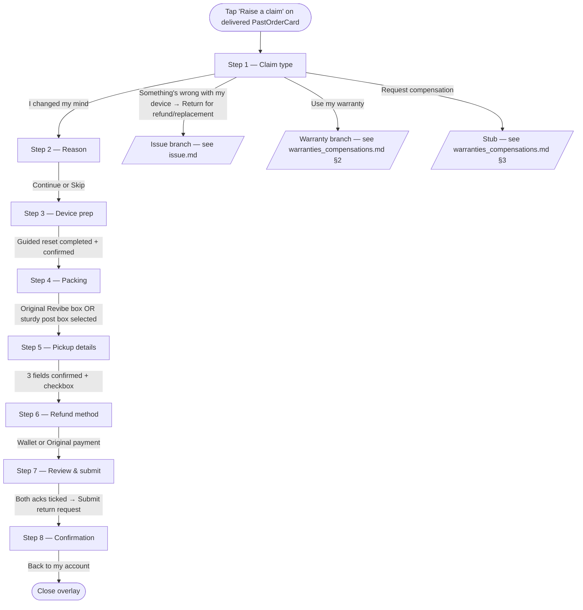

# Returns — Change of mind

> Customer-facing UI of the change-of-mind return branch, launched from `Raise a claim` on a delivered `PastOrderCard`. Covers Steps 1 (shared), 2 (change-of-mind branch), and 3–7 (shared with the issue branch). The operational state machine (drawio transcription — country splits, repair-partner branches, LAB sub-flow) is documented separately in [`../../input/return_flow_change_of_mind.md`](../../input/return_flow_change_of_mind.md). Once submitted, the return appears on the customer's list as a `ClaimCard` — see [claim_tracking.md](./claim_tracking.md).

## 1. Overview

Change of mind is the entry point used when the customer doesn't want the device any more, with no fault on the seller's side. From the customer's perspective:

- Eligible for 10 days after delivery.
- The device is picked up by courier from the saved delivery address.
- Refund options: full amount to **Revibe Wallet** (instant once return is complete), or `gross − 10% restocking fee` to **original payment method** (5–10 business days).
- Revibe Care (warranty add-on) is refunded on top of the product amount.

Distinguishing characteristic vs the issue branch: change of mind always carries a 10% restocking fee on the original-payment path (issue carries no fee, plus a flat AED 100 Wallet bonus). The Step 2 of the flow is a 5-option reason picker; Step 3 onwards is identical to the issue branch.

The flow's visual chrome is deliberately distinct from the order-card family: white surface, segmented top progress bar (`bg-brand` for reached segments, `bg-line` for upcoming) + `Step X of 8` caption, sticky bottom action bar with the only filled brand-purple `Continue` button, and line-bordered cards that gain a `border-brand bg-brand-bg/30` treatment when selected. Tinted hero blocks are reserved for one place — the Step 3 device-prep warn callout — so the user can feel the visual shift between "informational" (account cards) and "doing a task" (the flow) without leaving the design system.

## 2. UI flow



### 2.1 Mount & state

`App.jsx` owns `claimFlowOrderId`. The overlay is rendered conditionally (`{claimFlowOrderId !== null && <ClaimFlow ... />}`), so closing it unmounts the reducer state — the brief explicitly forbids session persistence. The reducer (`flowReducer.js`) takes the entry `orderId` as its initialiser argument and always starts at Step 1 with `claimType: null`; the user picks change of mind or issue every time. `orderId` is carried through so the order being returned is unambiguous from the entry point.

### 2.1.1 Soft validation (flow-wide contract)

**The `Continue` / `Submit` button is never disabled on any step.** Earlier the button hard-grayed via `!canAdvance(state)`; it now stays full-colour and clickable everywhere, and a premature click *teaches* the customer what's missing rather than presenting a dead button. The contract:

- **`stepError(state)`** (in `flowReducer.js`) is the single source of truth: it returns the **first** unmet requirement for the current step as a stable key (e.g. `claimType`, `subtype`, `description`, `attachment`, `resetGuide`, `resetConfirm`, `packing`, `address`, `email`, `phone`, `pickupConfirm`, `refundMethod`), or `null` when the step is complete. The order of the checks **is** the "one at a time" reveal order.
- **`ClaimFlow.handlePrimary`** calls `stepError(state)` on click. Non-null → it dispatches `ATTEMPT` (which sets `state.attempted: true`) and returns without advancing. Null → it dispatches `NEXT`.
- **`state.attempted`** is reducer-owned, not component-local. `ATTEMPT` sets it; **every step-changing action (`NEXT` / `BACK` / `GO_TO_STEP` / `SUBMIT`) clears it in the same dispatch.** This atomic reset is what prevents the next step from flashing its own errors for a frame before the user has tried to advance (an earlier `useEffect`-based reset ran one frame too late and produced exactly that flash).
- **`ClaimFlow`** computes `errorKey = state.attempted ? stepError(state) : null` and passes it as the `error` prop to whichever step is mounted. Each step matches the key against its inputs, turns the offending field's border `border-danger`, renders a shared **`InlineError`** message (`AlertCircle` + danger text, `animate-slideDown`), and `scrollIntoView({ block: 'center' })`s the target where it can sit below the fold (Steps 2, 3, 5).
- `canAdvance(state)` is retained as a plain validity predicate but no longer drives the button's disabled state.

The Step 7 ack cards (§2.8) and the iOS reset-guide gate (§2.4) are the original instances of this pattern; they now share the same reducer flag.

### 2.2 Step 1 — Claim type (shared)

Three top-level cards; nothing pre-selected:

- `I changed my mind` → `claimType: 'change_of_mind'`. Sets the type and exposes `Continue`.
- `Something's wrong with my device` → no claim type set on tap. Expands an inline accordion that reveals two nested sub-cards: `Return for a refund or replacement` → `claimType: 'issue'`, and `Use my warranty` → `claimType: 'warranty'` (warranty branch — see [warranties_compensations.md](../warranties_compensations.md) §2).
- `Request compensation` (shipping refund or faulty accessory — keep the item) — third primary card; stubbed.

The compensation entry now sets `claimType: 'compensation'` (see [warranties_compensations.md](../warranties_compensations.md) §3). Continue stays clickable with nothing picked; clicking dispatches `ATTEMPT` and surfaces an `InlineError` (`Pick an option to continue.`) above the option list (`stepError` key `claimType`) — see §2.1.1.

### 2.3 Step 2 — Reason (change-of-mind branch, optional)

Five radio options:

| `value` | Label |
|---|---|
| `no_fit` | Doesn't fit |
| `better_option` | Found a better option |
| `changed_mind` | Just changed my mind |
| `mistake` | Ordered by mistake |
| `other` | Other |

`Other` reveals a 200-char textarea. The sticky bar renders a `Skip` alongside `Continue`; both advance. The reason is purely informational — eligibility and refund math don't branch on it.

### 2.4 Step 3 — Device preparation (shared, gated)

A **single mandatory path**: run the guided reset, then tick a confirmation checkbox. There is no path choice — the "can't reset it" case (broken / won't power on / can't unlock) is now handled **inside** the guide via its remote route, so the old second option was removed (rationale in §5). Continue stays clickable; a premature click surfaces the step's gate inline (§2.1.1) — `resetGuide` (guide not yet completed) → then `resetConfirm` (checkbox unticked). A `If you leave this flow, you'll need to start over` hint sits below.

The screen layout ("Refined card" visual direction): the device-prep warn callout (circle warn-badge + `ShieldAlert`), an `iPhone` / `Android` OS-tabs control, then a single prominent **hero launcher** — an elevated card with a gradient icon coin (`Sparkles`, with an inner highlight rim), decorative concentric brand rings, a `~10 min` + `3 simple steps` meta-chip row, and a trailing `ArrowRight` affordance circle. Below it sits a `SafetyNote` reassurance line (*"Worried about your photos?"* — `ShieldCheck`, success-toned, reads iCloud / Google backup by OS), then the `Can't unlock or power on the device?` helper line (WifiOff icon) pointing at the guide's remote route, and the confirmation gate below. The launcher's tone tracks state: brand-gradient default → success-gradient `done` (coin becomes `Check`, subtitle becomes a `RotateCcw` *"Tap to run through it again"*) → danger-gradient `error` (coin becomes `AlertTriangle`, card runs `animate-shakeX`). The launcher opens `ResetGuideSheet` — **OS-parametrised** via an `os` prop: one shared shell (the phase machine, full-screen `createPortal` panel, progress bar, back chevron, slide transitions, trouble disclosures, `MockCarousel`, `MiniPhone`/`Row`) with per-platform step tables, copy, and mock screens. The intro route-chooser copy is identical on both (*Yes, I can unlock it* / *No — it's broken or won't turn on*); only the hero differs (iOS PNG vs an asset-free CSS Galaxy slab on Android), both under the same brand-bg glow.
  - **iOS** — `ResetGuideSheet` with `os='ios'`. **Device route (3 steps):** sign out of iCloud → erase all content → restart and check the Hello screen. **Remote route (2 steps):** `icloud.com/find` → **Remove This Device** (*not* Erase); then an alternative `account.apple.com` route framed as *Or unlink it from your account*, whose mock is a **four-screen swipeable carousel** (`AccountRemoveCarousel`): menu → **Devices** → pick this iPhone → scroll to **About** → **Remove from account** (glowing). Account-holder details on the mock are masked. Each step has a mock illustration, short lead, a brand/warn "why" callout, and a collapsible troubleshooting disclosure that can **escalate to the remote path**. Done-screen final-touches checklist: SIM, Apple Watch, IMEI photo, order number (persisted in `devicePrep.resetGuideChecks`).
  - **Android (Samsung One UI)** — `ResetGuideSheet` with `os='android'`. Because Samsung devices carry **two** independent locks — Google's Factory Reset Protection (FRP) and Samsung's Reactivation Lock — both routes carry an extra account step vs iOS. **Device route (4 steps):** remove your Google account (Manage accounts → **Remove account** glowing, FRP) → sign out of Samsung + turn off Find My Mobile → remove the screen lock then **Factory data reset** (General management → Reset, glowing — *not* the preference-only resets above it) → restart and check the Samsung welcome screen shows no account prompt. Step 2's mock is a **two-screen swipeable carousel** (`SamsungSignOutCarousel` — same chrome as the iOS account carousel, numbered captions): the Find My Mobile toggle screen, then the Samsung account detail with **Sign out** glowing. **Remote route (2 steps):** remove it from your Google account (`myaccount.google.com` → ⋮ menu → **Sign out**, FRP) → remove it from your Samsung account (`account.samsung.com` → Devices → **Remove**, Reactivation Lock). Each step is grounded in a hand-built One UI mock (white rounded cards on light-gray, centered punch-hole camera, Samsung-blue toggles, brand-purple highlight) reusing the iOS `MiniPhone`/`Row`/carousel primitives. Trouble disclosures cover a forgotten Google password, One UI 6.1+ **Identity Check** biometrics, and post-reset account prompts — all able to escalate to the remote path. Done-screen final-touches checklist adds **microSD card** and **Galaxy Watch/Buds** to the SIM/IMEI/order-number items. Source guide: `samsung-factory-reset-guide.md`.
  - **Carousel steps auto-advance.** On any step whose mock is a carousel (a Mock carrying a `.screens` static — the iOS `account.apple.com` route, the Android Samsung sign-out step), the footer `I've done this` button walks the carousel one screen at a time and only advances to the next flow step once the **last** screen has been reached — the customer can't skip the sub-screens. Mid-carousel the label stays `I've done this →`; it becomes `— finish` only on the final screen of the final step. `MockCarousel` is **controlled** (the sheet owns `carouselIdx`, reset on every step/route change); the arrows, dots, and the footer all drive the same index, and the header back chevron steps the carousel backward before leaving the step.
  - Once the customer reaches the done screen and taps `Done`, `onDone` sets `devicePrep.resetGuideSeen`; the launcher card then flips to a success-toned `Guided reset completed` state.

**Confirm gate (both platforms).** The confirm checkbox (*"I confirm I've completed the guided reset — this device is unlinked and erased."*) is rendered as a **bordered card** whose border + fill track its state (locked → confirm-error → checked → default). It's locked until the customer has been through the guide — opened it **and** tapped `Done` (`devicePrep.resetGuideSeen`); while locked the checkbox shows a `Lock` glyph and the card sits muted. It's one slice of the flow-wide soft validation (§2.1.1): `stepError` returns `resetGuide` while the guide is unseen, so a premature `Continue` dispatches `ATTEMPT` and paints the hero launcher card red (`border-danger`, danger coin, `animate-shakeX`) with the message *"Run the guide above and tap Done to confirm."* under the gate (AlertTriangle + `animate-slideDown`) instead of advancing. Once the guide is completed the red state clears, the checkbox unlocks, and the gate falls to `resetConfirm` (confirm checkbox unticked → danger card border + `InlineError` *"Confirm you've completed the reset before continuing."*).

The reducer stores `devicePrep: { option, os, resetConfirmed, resetGuideChecks, resetGuideSeen }`, where `option` is pinned to `'reset'` (the only remaining path) so the downstream Review / Confirmation summaries and `devicePrepText` keep rendering the reset branch. The old credentials path (a `'credentials'` option with an unlink toggle + 6-digit passcode) was removed; `accountUnlinked` / `passcode` are gone from flow state. A couple of seeded mock claims in `orders.js` still carry `option: 'credentials'`, so the dead `'credentials'` branches in `Step6Review` / `Step7Confirmation` / `devicePrepText` (masking to `Credentials provided`) are retained for them.

### 2.5 Step 4 — Packing (shared)

Top of the step is a **packing-demo video** (`PackingDemo`) — a brand-framed, full-width square (`/revibe_packing_guide.mp4`, 720×720, ~12s) that autoplays silently on loop (`autoPlay loop muted playsInline`) with a "Watch first" brand chip and a bottom gradient bar ("Packing demo · 12 sec" + "Tap to expand"). Tapping opens `DemoLightbox` — a `createPortal` dark-backdrop modal (Esc / backdrop / × to close, body-scroll locked) replaying the clip full-width with native `controls` (so the customer can scrub and unmute).

Below the demo, two stacked radio cards, each with a 9 mm brand-tinted icon tile (`Package` / `ShieldAlert`), title, and one-line subtitle. The selection is the gate (`stepError` key `packing`): a premature `Continue` reddens both cards' borders + shows `Pick a packing method to continue.` above them (§2.1.1). No ack checkbox on this step — the *"I have packed the device properly"* acknowledgment lives on the Review step (§2.8) so it's enforced right before submission.

- **Option A — `Use the original Revibe box`.** Re-use the device's original shipping box.
- **Option B — `Use any sturdy post box`.** Fallback when the original box is gone.

Under the options sits a single collapsible **Packing tips** disclosure (`PackingTips`) — a brand-tinted card with a filled-brand `Lightbulb` badge, collapsed by default. Open, it lists three general tips (`PACKING_TIPS`): nothing loose inside / seal all seams with tape / mark the box "Fragile". A muted footnote warns that poorly-packed devices may be returned at the customer's cost.

The reducer stores `packingMethod: 'original_box' | 'post_box'`. The chosen label is surfaced on Review's Packing summary card via `PACKING_LABELS` (exported from `Step4Packing.jsx`); the Review's edit link returns the user here.

### 2.6 Step 5 — Pickup details (shared)

Returns are always picked up by courier today, so the step skips the method selector and surfaces the three contact fields needed for the pickup:

- **Pickup address** — seeded from `order.address`.
- **Pickup email** — seeded from `order.email`.
- **Pickup phone** — seeded from `order.phone`.

State is pre-seeded so the user typically just confirms; tapping any row opens a single-field bottom sheet for editing.

Below the rows, a `What happens next` block surfaces an **`ExpectedByCard`**: CalendarClock-iconed eyebrow ("Expected refund by"), a bold long-form date computed by `expectedCompletionFor(claimType)` in `lib/claims.js` (sums `CLAIM_SLAS.expectedHours` across `CLAIM_STATUSES` and adds to `new Date()`), and a one-line subtitle ("Typical for return claims — exact dates confirmed at each step."). A brand-toned **`See detailed claim timeline`** button below it expands a pipeline-aware step list on tap — same `ProcessRow` chrome as the old always-open list (step headline + `expectedHours`-derived duration suffix `within 24h` / `same day` / `~7 days`, plus the "may take longer if expert inspection is needed" subline on QC). The step source switches automatically to `WARRANTY_CLAIM_STATUSES` on the warranty branch so the dropdown reads with the warranty pipeline (6 steps) — see [warranties_compensations.md](../warranties_compensations.md) §2.4.

A brand-toned confirmation checkbox card sits below the card (*"I confirm the pickup details above and understand the estimated timeline."*) and toggles `pickupConfirmed` on the flow reducer. The step gates on the three contact fields **and** `pickupConfirmed`, surfaced one at a time (§2.1.1): `stepError` order is `address` → `email` → `phone` (the empty row turns red + `InlineError` "Add your {field} to continue.") → `pickupConfirm` (checkbox reddens + "Confirm the pickup details to continue."). Since the contact fields are pre-seeded, the checkbox is usually the only one a customer hits. Visually mirrors the Step 7 ack cards.

### 2.7 Step 6 — Refund method (shared chrome, change-of-mind math)

Two stacked refund cards built off `refundBreakdown(order, units, method, 'change_of_mind')` (see §3). Visually aligned with the cancellation sheet's refund picker (see [../cancellations.md](../cancellations.md) §2) so the two refund-choice surfaces feel like siblings.

- **Wallet card.** Full amount + wallet-info tooltip (`WalletInfoTooltip` + `REVIBE_WALLET_ICON`), with a success-green tagline `Full refund · instantly once return is complete`.
- **Original-payment card.** Net amount in the headline, then an inline breakdown table — `Product` + `Revibe Care` (when `order.warranty > 0`) + `Subtotal` + a red `Restocking fee (10%)` row — then a clock-icon ETA line `5–10 business days once return is complete`. The card label uses `order.paymentMethod.brand` + `last4` — except when `paymentMethod.type === 'bnpl'`, in which case it reads just the provider brand (`Tabby` / `Tamara`) with a `BnplDisclaimerTooltip` Info-icon to its right that opens a popover: "{provider} may charge additional fees on refunded purchases. Check your {provider} account for details." Same tooltip surfaces on Steps 7 & 8 next to the refund destination, and on the live `ClaimCard` / `ClaimDetailsSheet` after submit.

Both cards keep `whitespace-nowrap` on anchor lines.

### 2.8 Step 7 — Review & submit (shared)

Sectioned summary with an inline `Edit` link per section dispatching `GO_TO_STEP` to jump back to the originating step. A read-only `Item` block at the top shows the product + order ID (not editable — the item is fixed by the entry point).

The order of sections in Review is deliberate — each ack checkbox sits directly under the section it's confirming:

1. **Item** (read-only).
2. **Reason** (change-of-mind) / **Issue** (issue / warranty) — Edit → Step 2.
3. **Device preparation** — Edit → Step 3. Shows `Factory reset confirmed` (the only live path; `Credentials provided` survives only for the seeded credentials mocks).
4. **☑︎ I have factory reset my device** — soft-validated ack card; see below.
5. **Packing** — Edit → Step 4. Shows the chosen method label (`Original Revibe box` / `Sturdy post box`).
6. **☑︎ I have packed the device properly** — soft-validated ack card.
7. **Pickup** — Edit → Step 5. Three rows (address / email / phone).
8. **Refund** — Edit → Step 6. Final net + an explanatory line: `Includes 10% restocking fee` when method is `original`. For Wallet, no extra line (wallet has no fee on change of mind).

**Soft validation on the two ack cards.** Review is one instance of the flow-wide soft-validation contract (§2.1.1). The `Submit return request` button stays clickable; `ClaimFlow.handlePrimary` intercepts the click and, if `factoryResetConfirmed` or `packingConfirmed` is false, dispatches `ATTEMPT` (setting `state.attempted`) and returns without dispatching `SUBMIT`. Both ack cards re-render via the shared `AckCard` component — when `error === true` the card switches to a danger-toned border + bg + an `AlertCircle` helper line ("Please confirm before submitting your return."). The first error card also calls `scrollIntoView({ block: 'center' })` so it always lands in view; the parent passes `scrollOnError` to make sure only the topmost error scrolls (factory-reset wins; packing scrolls only when factory-reset is already checked). (Review keeps its own `factoryResetConfirmed`/`packingConfirmed` checks rather than going through `stepError` — its two acks aren't a single ordered list the way the other steps' inputs are.)

The sticky bar swaps `Continue` for a success-tone `Submit return request`.

### 2.9 Step 8 — Confirmation (shared)

`generateClaimRef()` produces a `RET-XXXXXXXX` reference shown with a `Copy` button. Next-steps list:

- `Check your inbox` — email instructions stub.
- `Expected refund` — amount + destination + method-keyed timeline.
- `Device preparation` — reinforcement of the commitment from Step 3.

Two footer buttons:

- `Track this return` — closes the overlay **and** signals the just-seeded `ClaimCard` to mount expanded via the one-shot `openSignal` prop (bumped `n` keyed by `orderId` in `App.jsx`'s `autoOpenClaim` state). Calls `onTrackClaim(order.id)` (forwarded through `ClaimFlow`'s `onTrackClaim` prop); falls back to `onClose` if no callback is provided. The same wiring serves the warranty flow's `Track this claim` button.
- `Back to my account` — closes the overlay only. The claim card mounts collapsed (its `openSignal` prop reads `0` for this order, so the bump-only effect doesn't fire). Subsequent flow opens that end on Back also leave the card untouched — bump-based one-shot means only fresh Track clicks re-trigger expansion.

On close (either button), `ClaimFlow.handlePrimary` has already called `onSubmitClaim(orderId, claim)` so `App.jsx` has the seeded claim in `submittedClaims[orderId]`; the order now renders as a `ClaimCard` in the **In progress** section. The `UndoSnackbar` slides up over the orders list so the demo can be reverted — see §8.

## 3. Eligibility & refund math

### 3.1 Eligibility (`eligibilityFor(order, today)` in `src/lib/returns.js`)


The check prefers the new `deliveredOn` ISO field (`'2026-05-08'`) and falls back to parsing the date portion of `timeline.delivered` against the year from `placedAt`.

### 3.2 Refund math (`refundBreakdown(order, units, method, 'change_of_mind')`)

| Step | Formula |
|---|---|
| `unitPrice` | `order.unitPrice` (falls back to `subtotal`, then `total`) |
| `itemTotal` | `unitPrice * units` |
| `warranty` | `order.warranty ?? 0` (Revibe Care refunded on both branches) |
| `gross` | `itemTotal + warranty` |
| **Wallet** | `fee = 0`, `bonus = 0`, `net = gross` |
| **Original payment** | `fee = round(gross * 0.10)`, `bonus = 0`, `net = gross - fee` |

The returned shape is `{ itemTotal, warranty, gross, fee, bonus, net, rate }`. Step 6 uses `itemTotal` / `warranty` to render the line-by-line breakdown on the original-payment card; `bonus` is always present (0 here) so consumers don't need null-guards.

`ISSUE_WALLET_BONUS` (the AED 100 issue-branch bonus) is **not applied** on the change-of-mind branch.

## 4. Operational flow (backend / agent / supplier)

The customer-facing UI above stops at submission. Backend state — pending collection, country routing, repair-partner inspection, LAB sub-flow, refund chain — is described in the operational flow doc.

→ [`../../input/return_flow_change_of_mind.md`](../../input/return_flow_change_of_mind.md)

That doc carries:

- Mermaid diagrams of the full state machine (intake → country routing → collection → seller/repair-partner decision → LAB invalid-claim sub-flow → refund chain).
- Country splits (ZA → Platinum repair; SA → Golden specialist; Other → Original supplier).
- IS (internal) vs ES (customer-facing) state catalog.
- Decision points and their branches.
- Source-doc ambiguities preserved verbatim.

How the customer-facing UI surfaces backend state:

- `claim.claimStatusId` drives the 5-state main timeline on `ClaimCard`. See [claim_tracking.md](./claim_tracking.md) §2.
- `claim.subStatusId` (e.g. `expert_revision`, `collection_failed`, `awaiting_payment`) is recorded but is not currently surfaced inline by `ClaimCard`; specific values drive routing into takeover cards. See [claim_tracking.md](./claim_tracking.md) §4.
- The LAB sub-flow (operational nodes n45–n51 for UAE/Other, omitted for ZA/SA) is tracked via `expert_revision` but does not currently surface on `ClaimCard`; the long wait is implicit in the parent `qc` step.

## 5. UX decisions

**Reason is optional.** Step 2's `Skip` is intentional — the customer's reason for changing their mind is interesting for analytics but isn't gating anything. Forcing a reason adds friction without changing the outcome.

**Restocking fee shown as a red line, not folded into the headline.** The original-payment card's headline is the net amount (`gross − fee`), but the breakdown table renders the `Restocking fee (10%)` row in red so the customer sees explicitly what they're giving up. Earlier drafts hid the fee inside a tooltip — felt cagey.

**Device prep gate before pickup, not after submission.** Originally Step 3 was a confirmation modal that fired after the customer hit Submit. We moved it forward so the customer can't get to the refund-method picker without committing to reset the device — gives them an exit ramp earlier in the flow if they're not ready.

**Single device-prep path, not a reset-vs-credentials choice.** Step 3 used to offer two options: factory reset the device, or — if you can't — hand over a 6-digit passcode + unlink confirmation so a technician wipes it for you. That second path duplicated work the guided reset already does better: the guide's own remote route walks the customer through erasing the device from iCloud / Google when it's broken, won't power on, or can't be unlocked. Collapsing to one path removes a decision the customer shouldn't have to reason about, drops a sensitive passcode-handover surface from the happy path, and makes the guided reset the single thing to do. The "can't reset it" escape hatch still exists — it just lives inside the guide (and the remote-path helper line points at it), not as a parallel top-level option.

**`What happens next` lives on the Pickup step (now Step 5), not on Review, and collapsed by default.** The customer should see the multi-step return process *before* committing the pickup details, not on the final review screen. Review's job is to be transactional; the Pickup step's job is to set expectations. The block was originally an always-open 5-row vertical timeline; it now leads with the single computed expected-by date and tucks the per-step list behind a `See detailed claim timeline` dropdown — the headline is enough information for most customers, the dropdown is there for the ones who want to see the breakdown.

**No grayed-out buttons anywhere — every step is soft-validated.** The `Continue`/`Submit` button is always clickable; a premature click surfaces the first missing input inline rather than presenting a dead button (full contract in §2.1.1). This started as a Review-only treatment for the two ack cards (factory-reset + packed-properly) plus the iOS reset-guide gate, then generalised to all six gated steps so the customer never has to guess *why* the button looks inert. The rationale that drove the Review version still holds: a hard-disabled button felt cagey and gave the customer nothing to act on. Splitting the two Review acks under their respective sections (Device preparation → factory-reset card; Packing summary → packed-properly card) keeps each confirmation adjacent to the thing it's confirming.

**Dedicated packing step instead of a trailing checkbox.** Step 4 was added so the customer reads packing instructions (Revibe box vs sturdy post box with bubble wrap) *before* booking the pickup window, not as a fine-print ack on Review. The selection itself (`packingMethod`) is the gate to leave the step — the *acknowledgment* that they've actually done it now lives on Review where it's enforced right before submission.

**Submit copy is `Submit return request`, not `Confirm`.** Communicates that this isn't an instant confirmation — Revibe still has to inspect the device.

## 6. Data model

### 6.1 Order fields read by the flow (delivered orders only)

Populated on demo order `89657` today; other orders fall back to `subtotal`/`total` and render as ineligible in the order picker.

| Field | Type | Notes |
|---|---|---|
| `deliveredOn` *(optional)* | ISO date | Canonical delivery date for the 10-day return-window check. Falls back to parsing `timeline.delivered` when absent. |
| `unitPrice` *(optional)* | number | Per-unit price used by `refundBreakdown` to compute `gross = unitPrice * units`. Falls back to `subtotal` (then `total`). Today the flow always passes `units: 1`. |
| `paymentMethod` *(optional)* | `{ type, brand, last4 }` or `{ type: 'bnpl', provider, brand }` | Drives the `Visa •• 4242` label on Step 6's original-payment card and Steps 7 & 8. Also consumed by `CancelOrderSheet`. Falls back to a generic `Card •• 0000`. When `type === 'bnpl'`, label collapses to just `provider` brand (`Tabby` / `Tamara`) and triggers a `BnplDisclaimerTooltip` warning the customer that their BNPL provider may levy refund fees. |
| `deviceOs` *(optional, `'ios' | 'android'`)* | string | Seeds Step 3's OS-tabs control. Defaults to `'ios'`. |
| `returnedAt` *(future hook)* | string | When set, makes the order ineligible with reason `Already returned`. |

### 6.2 Claim object written by Step 7 (change-of-mind shape)

Step 7's submit builds this object in `ClaimFlow.jsx`'s `buildClaim` helper and bubbles it up to `App.jsx` via `onSubmitClaim`. Persistence is in-memory only (cleared on refresh, revertable via the `UndoSnackbar`). Selected delivered mocks also hand-seed a claim for the post-submission demo state. The full claim-object reference (including issue-branch fields, warranty fields, and takeover-card extensions) lives in [claim_tracking.md](./claim_tracking.md) §5.

| Field | Type | Notes |
|---|---|---|
| `claim.claimRef` | `RET-XXXXXXXX` | Generated by `generateClaimRef()`. |
| `claim.type` | `'change_of_mind'` | Constant for this branch. |
| `claim.claimStatusId` | enum | One of the 5 main states (see claim_tracking.md). |
| `claim.submittedAt` | string | Human-readable submission timestamp. |
| `claim.units` | integer | Today always `1`. |
| `claim.reason` | `{ value, otherText }` | `value` is one of the 5 reason keys; `otherText` populated only when `value === 'other'`. |
| `claim.devicePrep` | `{ option, os }` | `option` is always `'reset'` from the live flow (`'credentials'` only on seeded mocks); `os` is `'ios'` or `'android'`. |
| `claim.pickupDetails` | `{ address, email, phone }` | Three contact fields captured at Step 5. |
| `claim.refundMethod` | `'wallet' | 'original'` | Drives the destination chip on the hero and the `Includes 10% restocking fee` sub-copy in details. |
| `claim.expectedRefund` | `{ gross, fee, bonus, net, rate }` | Pre-computed at submission so the card doesn't re-run `refundBreakdown` every render. |
| `claim.timeline` | map keyed by `claimStatusId` | Timestamps populated progressively as the claim moves. |

## 7. Component map

```
src/
├── lib/
│   └── returns.js                         eligibilityFor, refundBreakdown (defaults to change_of_mind), generateClaimRef
└── components/
    └── ClaimFlow/
        ├── ClaimFlow.jsx                  Overlay shell: useReducer, sticky header + progress, step router, sticky action bar
        ├── flowReducer.js                 State shape, actions (incl. ATTEMPT + state.attempted), stepError(state) first-unmet-input gate, legacy canAdvance(state)
        ├── ProgressBar.jsx                Segmented progress bar — 7 segments on refund flows, 6 on warranty (driven by visibleStepCount)
        ├── InlineError.jsx                Shared red AlertCircle + message rendered by every step when its input is missing
        ├── StickyActionBar.jsx            Sticky bottom button bar (Continue / Submit / optional secondary — never disabled)
        ├── StepHeading.jsx                Shared 24px step heading + 13.5px muted subtitle
        ├── Step1ClaimType.jsx             Claim-type options; CoM, issue and warranty advance, compensation still stub
        ├── Step2Reason.jsx                Change-of-mind branch — optional reason radio + free-text reveal on 'Other'
        ├── Step3DevicePrep.jsx            Single guided-reset path — OS tabs + launcher card + confirm checkbox
        ├── Step4PickupDetails.jsx         Pickup fields + 'Expected by' headline + collapsible detailed-timeline dropdown + confirmation checkbox
        ├── Step5RefundMethod.jsx          Wallet vs original-payment refund cards (skipped for warranty)
        ├── Step6Review.jsx                Read-only item block + sectioned summary with per-section Edit links (warranty hides Refund, shows 'What you'll get back')
        └── Step7Confirmation.jsx          Success state with claim ref + Copy + next-steps list (warranty swaps Expected refund for Expected back)
```

## 8. Mocked vs production

- **Step 7 submit seeds an in-session claim.** `ClaimFlow.handlePrimary` calls `onSubmitClaim(orderId, claim)` (from `App.jsx`) with a `buildClaim` output — `claimStatusId: 'initiated'`, seeded `scheduledPickup` (DHL Express, tomorrow's date, 10 AM–12 PM slot), timestamp from `new Date()`. No persistence: the claim lives in `App.jsx`'s `submittedClaims` map and is cleared on refresh. The `UndoSnackbar` lets the demo revert. Production needs a real backend write.
- **10% restocking fee is hardcoded** in `refundBreakdown`. Production should read from a backend config.
- **`Expected by` headline + detailed-timeline SLA placeholders.** `CLAIM_SLAS` in `lib/claims.js` carries hand-guessed `expectedHours` values per step (covering refund and warranty pipelines). Ops to revise — see [claim_tracking.md](./claim_tracking.md) §4.
- **Reason isn't validated.** No length cap on the textarea beyond 200 chars; no profanity filter.
- **Address edit is a single-field bottom sheet.** No address validation, no autocomplete.
- **No 10-day window enforcement at submit time.** Eligibility is checked on the order picker but not re-checked at Step 7 submission.
- **`returnedAt` is a future hook.** No order today sets it, so the picker doesn't yet hide returned items.

## 9. Open questions

- **Multi-product returns.** Today the order shape carries a single `product` and the delivered card represents that one product line. Multi-product orders will need a `products[]` array and one delivered card per product line, so each `Raise a claim` entry remains unambiguous.
- **Partial-quantity returns.** Returning 2 of 3 of the same product line is not currently supported. Would need a quantity step or a per-card unit picker. The reducer already carries `units` as an integer.
- **Top-level "Return an item" entry.** Today the only entry is the delivered card's `Raise a claim` button, which seeds a specific `orderId`. A top-level entry would need to either pick a product card first (recommended — matches the entry-point assumption baked into Step 7's read-only `Item` block) or reintroduce an order/product picker as a pre-Step-1 picker.
- **Cancel a submitted return.** No in-flight cancellation affordance exists for a submitted change-of-mind return. Once added, lives in [claim_tracking.md](./claim_tracking.md).
- **Country-aware refund timing.** The "5–10 business days once return is complete" copy on the original-payment card is generic; payment-processor SLAs vary by country.
