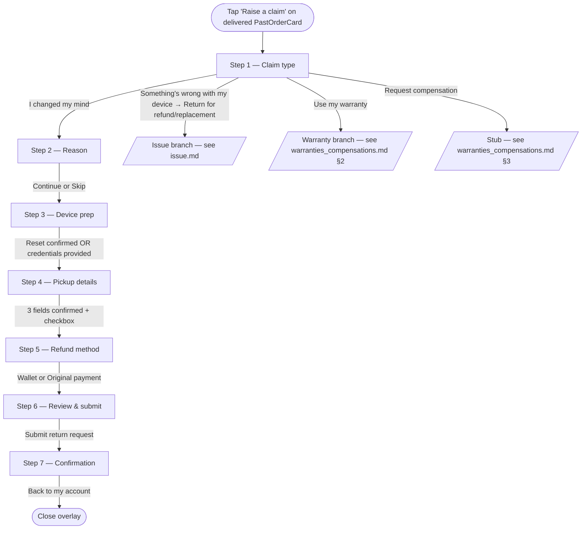
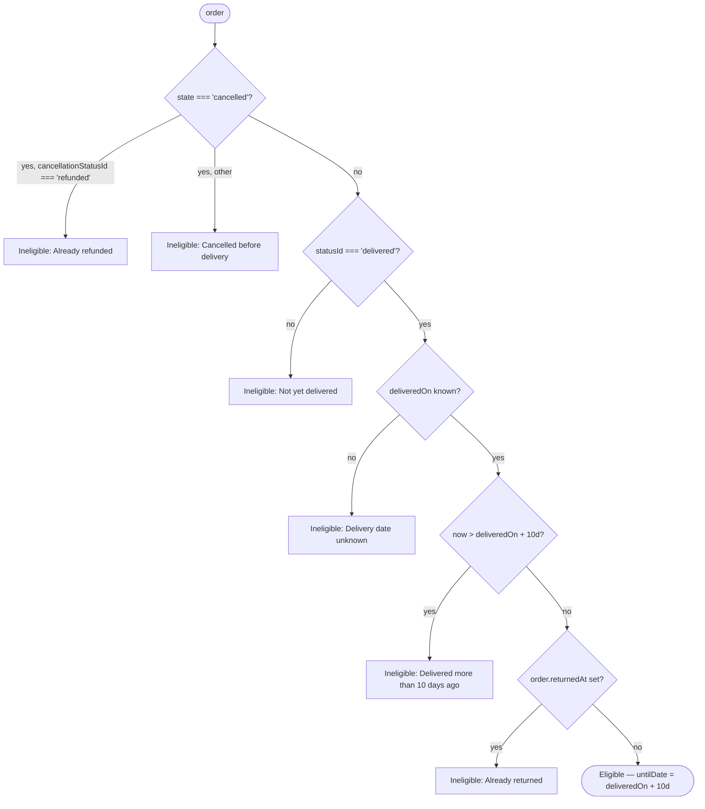

# Returns — Change of mind

> Customer-facing UI of the change-of-mind return branch, launched from `Raise a claim` on a delivered `PastOrderCard`. Covers Steps 1 (shared), 2 (change-of-mind branch), and 3–7 (shared with the issue branch). The operational state machine (drawio transcription — country splits, repair-partner branches, LAB sub-flow) is documented separately in [`../../input/return_flow_change_of_mind.md`](../../input/return_flow_change_of_mind.md). Once submitted, the return appears on the customer's list as a `ClaimCard` — see [claim_tracking.md](./claim_tracking.md).

## 1. Overview

Change of mind is the entry point used when the customer doesn't want the device any more, with no fault on the seller's side. From the customer's perspective:

- Eligible for 10 days after delivery.
- The device is picked up by courier from the saved delivery address.
- Refund options: full amount to **Revibe Wallet** (instant once return is complete), or `gross − 10% restocking fee` to **original payment method** (5–10 business days).
- Revibe Care (warranty add-on) is refunded on top of the product amount.

Distinguishing characteristic vs the issue branch: change of mind always carries a 10% restocking fee on the original-payment path (issue carries no fee, plus a flat AED 100 Wallet bonus). The Step 2 of the flow is a 5-option reason picker; Step 3 onwards is identical to the issue branch.

The flow's visual chrome is deliberately distinct from the order-card family: white surface, segmented top progress bar (`bg-brand` for reached segments, `bg-line` for upcoming) + `Step X of 7` caption, sticky bottom action bar with the only filled brand-purple `Continue` button, and line-bordered cards that gain a `border-brand bg-brand-bg/30` treatment when selected. Tinted hero blocks are reserved for one place — the Step 3 device-prep warn callout — so the user can feel the visual shift between "informational" (account cards) and "doing a task" (the flow) without leaving the design system.

## 2. UI flow



### 2.1 Mount & state

`App.jsx` owns `claimFlowOrderId`. The overlay is rendered conditionally (`{claimFlowOrderId !== null && <ClaimFlow ... />}`), so closing it unmounts the reducer state — the brief explicitly forbids session persistence. The reducer (`flowReducer.js`) takes the entry `orderId` as its initialiser argument and always starts at Step 1 with `claimType: null`; the user picks change of mind or issue every time. `orderId` is carried through so the order being returned is unambiguous from the entry point.

### 2.2 Step 1 — Claim type (shared)

Three top-level cards; nothing pre-selected:

- `I changed my mind` → `claimType: 'change_of_mind'`. Sets the type and exposes `Continue`.
- `Something's wrong with my device` → no claim type set on tap. Expands an inline accordion that reveals two nested sub-cards: `Return for a refund or replacement` → `claimType: 'issue'`, and `Use my warranty` → `claimType: 'warranty'` (warranty branch — see [warranties_compensations.md](../warranties_compensations.md) §2).
- `Request compensation` (shipping refund or faulty accessory — keep the item) — third primary card; stubbed.

The compensation entry renders an inline `not part of this build` note instead of setting a claim type. `canAdvance` requires `change_of_mind`, `issue`, or `warranty`.

### 2.3 Step 2 — Reason (change-of-mind branch, optional)

Five radio options:

| `value` | Label |
|---|---|
| `no_fit` | Doesn't fit |
| `better_option` | Found a better option |
| `changed_mind` | Just changed my mind |
| `mistake` | Ordered by mistake |
| `other` | Other |

`Other` reveals a 200-char textarea. The sticky bar renders a `Skip` alongside `Continue`; both advance. The reason is purely informational — eligibility and refund math don't branch on it.

### 2.4 Step 3 — Device preparation (shared, gated)

Two stacked radio cards. `canAdvance` returns false until one complete option is filled. A `If you leave this flow, you'll need to start over` hint sits below.

- **Option A — `I've factory reset the device`** (recommended pill). Carries an `iPhone` / `Android` OS-tabs control, a collapsible numbered reset instructions list per OS, and a required confirmation checkbox.
- **Option B — `Provide unlock credentials`**. Same OS tabs, an email field, a password field with show/hide toggle, and the encryption-disclosure note.

The reducer stores `devicePrep: { option, os }` and (for Option B) the credentials. Credentials are never persisted back into the claim object — they're masked to `Credentials provided` on Step 6 review and in the `ClaimDetailsSheet`.

### 2.5 Step 4 — Pickup details (shared)

Returns are always picked up by courier today, so the step skips the method selector and surfaces the three contact fields needed for the pickup:

- **Pickup address** — seeded from `order.address`.
- **Pickup email** — seeded from `order.email`.
- **Pickup phone** — seeded from `order.phone`.

State is pre-seeded so the user typically just confirms; tapping any row opens a single-field bottom sheet for editing.

Below the rows, a `What happens next` block surfaces an **`ExpectedByCard`**: CalendarClock-iconed eyebrow ("Expected refund by"), a bold long-form date computed by `expectedCompletionFor(claimType)` in `lib/claims.js` (sums `CLAIM_SLAS.expectedHours` across `CLAIM_STATUSES` and adds to `new Date()`), and a one-line subtitle ("Typical for return claims — exact dates confirmed at each step."). A brand-toned **`See detailed claim timeline`** button below it expands a pipeline-aware step list on tap — same `ProcessRow` chrome as the old always-open list (step headline + `expectedHours`-derived duration suffix `within 24h` / `same day` / `~7 days`, plus the "may take longer if expert inspection is needed" subline on QC). The step source switches automatically to `WARRANTY_CLAIM_STATUSES` on the warranty branch so the dropdown reads with the warranty pipeline (6 steps) — see [warranties_compensations.md](../warranties_compensations.md) §2.4.

A brand-toned confirmation checkbox card sits below the card (*"I confirm the pickup details above and understand the estimated timeline."*) and toggles `pickupConfirmed` on the flow reducer. `canAdvance` requires the three contact fields **and** `pickupConfirmed`. Visually mirrors the Step 6 packing-confirmation card.

### 2.6 Step 5 — Refund method (shared chrome, change-of-mind math)

Two stacked refund cards built off `refundBreakdown(order, units, method, 'change_of_mind')` (see §3). Visually aligned with the cancellation sheet's refund picker (see [../cancellations.md](../cancellations.md) §2) so the two refund-choice surfaces feel like siblings.

- **Wallet card.** Full amount + wallet-info tooltip (`WalletInfoTooltip` + `REVIBE_WALLET_ICON`), with a success-green tagline `Full refund · instantly once return is complete`.
- **Original-payment card.** Net amount in the headline, then an inline breakdown table — `Product` + `Revibe Care` (when `order.warranty > 0`) + `Subtotal` + a red `Restocking fee (10%)` row — then a clock-icon ETA line `5–10 business days once return is complete`. The card label uses `order.paymentMethod.brand` + `last4`.

Both cards keep `whitespace-nowrap` on anchor lines.

### 2.7 Step 6 — Review & submit (shared)

Sectioned summary with an inline `Edit` link per section dispatching `GO_TO_STEP` to jump back to the originating step. A read-only `Item` block at the top shows the product + order ID (not editable — the item is fixed by the entry point).

Change-of-mind-specific sections:

- **Reason** — text (mapped via `REASON_LABELS`) or "Not provided".

Shared:

- **Device prep** — masked to `Factory reset confirmed` / `Credentials provided`. Credentials never displayed in plain text.
- **Pickup** — three rows (address / email / phone).
- **Refund** — final net + an explanatory line: `Includes 10% restocking fee` when method is `original`. For Wallet, no extra line (wallet has no fee on change of mind).

A **packing confirmation** checkbox card sits below the Refund section and gates `canAdvance` — Submit stays disabled until the user confirms they've packed the device. Copy is the change-of-mind variant ("I've packed the device securely…"). The sticky bar swaps `Continue` for a success-tone `Submit return request`.

### 2.8 Step 7 — Confirmation (shared)

`generateClaimRef()` produces a `RET-XXXXXXXX` reference shown with a `Copy` button. Next-steps list:

- `Check your inbox` — email instructions stub.
- `Expected refund` — amount + destination + method-keyed timeline.
- `Device preparation` — reinforcement of the commitment from Step 3.

Two footer buttons: `Track this return` (stub) + `Back to my account` (closes overlay). On close, `ClaimFlow.handlePrimary` has already called `onSubmitClaim(orderId, claim)` so `App.jsx` has the seeded claim in `submittedClaims[orderId]`; the order now renders as a `ClaimCard` in the **In progress** section. The `UndoSnackbar` slides up over the orders list so the demo can be reverted — see §8.

## 3. Eligibility & refund math

### 3.1 Eligibility (`eligibilityFor(order, today)` in `src/lib/returns.js`)



The check prefers the new `deliveredOn` ISO field (`'2026-05-08'`) and falls back to parsing the date portion of `timeline.delivered` against the year from `placedAt`.

### 3.2 Refund math (`refundBreakdown(order, units, method, 'change_of_mind')`)

| Step | Formula |
|---|---|
| `unitPrice` | `order.unitPrice` (falls back to `subtotal`, then `total`) |
| `itemTotal` | `unitPrice * units` |
| `warranty` | `order.warranty ?? 0` (Revibe Care refunded on both branches) |
| `gross` | `itemTotal + warranty` |
| **Wallet** | `fee = 0`, `bonus = 0`, `net = gross` |
| **Original payment** | `fee = round(gross * 0.10)`, `bonus = 0`, `net = gross - fee` |

The returned shape is `{ itemTotal, warranty, gross, fee, bonus, net, rate }`. Step 5 uses `itemTotal` / `warranty` to render the line-by-line breakdown on the original-payment card; `bonus` is always present (0 here) so consumers don't need null-guards.

`ISSUE_WALLET_BONUS` (the AED 100 issue-branch bonus) is **not applied** on the change-of-mind branch.

## 4. Operational flow (backend / agent / supplier)

The customer-facing UI above stops at submission. Backend state — pending collection, country routing, repair-partner inspection, LAB sub-flow, refund chain — is described in the operational flow doc.

→ [`../../input/return_flow_change_of_mind.md`](../../input/return_flow_change_of_mind.md)

That doc carries:

- Mermaid diagrams of the full state machine (intake → country routing → collection → seller/repair-partner decision → LAB invalid-claim sub-flow → refund chain).
- Country splits (ZA → Platinum repair; SA → Golden specialist; Other → Original supplier).
- IS (internal) vs ES (customer-facing) state catalog.
- Decision points and their branches.
- Source-doc ambiguities preserved verbatim.

How the customer-facing UI surfaces backend state:

- `claim.claimStatusId` drives the 5-state main timeline on `ClaimCard`. See [claim_tracking.md](./claim_tracking.md) §2.
- `claim.subStatusId` (e.g. `expert_revision`, `collection_failed`, `awaiting_payment`) is recorded but is not currently surfaced inline by `ClaimCard`; specific values drive routing into takeover cards. See [claim_tracking.md](./claim_tracking.md) §4.
- The LAB sub-flow (operational nodes n45–n51 for UAE/Other, omitted for ZA/SA) is tracked via `expert_revision` but does not currently surface on `ClaimCard`; the long wait is implicit in the parent `qc` step.

## 5. UX decisions

**Reason is optional.** Step 2's `Skip` is intentional — the customer's reason for changing their mind is interesting for analytics but isn't gating anything. Forcing a reason adds friction without changing the outcome.

**Restocking fee shown as a red line, not folded into the headline.** The original-payment card's headline is the net amount (`gross − fee`), but the breakdown table renders the `Restocking fee (10%)` row in red so the customer sees explicitly what they're giving up. Earlier drafts hid the fee inside a tooltip — felt cagey.

**Device prep gate before pickup, not after submission.** Originally Step 3 was a confirmation modal that fired after the customer hit Submit. We moved it forward so the customer can't get to the refund-method picker without committing to reset the device — gives them an exit ramp earlier in the flow if they're not ready.

**`What happens next` on Step 4 not Step 6, and collapsed by default.** The customer should see the multi-step return process *before* committing the pickup details, not on the final review screen. Step 6's job is to be transactional; Step 4's job is to set expectations. The block was originally an always-open 5-row vertical timeline; it now leads with the single computed expected-by date and tucks the per-step list behind a `See detailed claim timeline` dropdown — the headline is enough information for most customers, the dropdown is there for the ones who want to see the breakdown.

**Two checkboxes (Step 4 pickup confirm, Step 6 packing confirm) for a deliberately heavy double-confirm.** Earlier drafts compressed these into a single confirmation on Step 6. Bringing the pickup confirm forward to Step 4 separates "I confirm the address" from "I've packed the device" — two distinct commitments, two distinct moments.

**Submit copy is `Submit return request`, not `Confirm`.** Communicates that this isn't an instant confirmation — Revibe still has to inspect the device.

## 6. Data model

### 6.1 Order fields read by the flow (delivered orders only)

Populated on demo order `89657` today; other orders fall back to `subtotal`/`total` and render as ineligible in the order picker.

| Field | Type | Notes |
|---|---|---|
| `deliveredOn` *(optional)* | ISO date | Canonical delivery date for the 10-day return-window check. Falls back to parsing `timeline.delivered` when absent. |
| `unitPrice` *(optional)* | number | Per-unit price used by `refundBreakdown` to compute `gross = unitPrice * units`. Falls back to `subtotal` (then `total`). Today the flow always passes `units: 1`. |
| `paymentMethod` *(optional)* | `{ type, brand, last4 }` | Drives the `Visa •• 4242` label on Step 5's original-payment card and Steps 6 & 7. Also consumed by `CancelOrderSheet`. Falls back to a generic `Card •• 0000`. |
| `deviceOs` *(optional, `'ios' | 'android'`)* | string | Seeds Step 3's OS-tabs control. Defaults to `'ios'`. |
| `returnedAt` *(future hook)* | string | When set, makes the order ineligible with reason `Already returned`. |

### 6.2 Claim object written by Step 6 (change-of-mind shape)

Step 6's submit builds this object in `ClaimFlow.jsx`'s `buildClaim` helper and bubbles it up to `App.jsx` via `onSubmitClaim`. Persistence is in-memory only (cleared on refresh, revertable via the `UndoSnackbar`). Selected delivered mocks also hand-seed a claim for the post-submission demo state. The full claim-object reference (including issue-branch fields, warranty fields, and takeover-card extensions) lives in [claim_tracking.md](./claim_tracking.md) §5.

| Field | Type | Notes |
|---|---|---|
| `claim.claimRef` | `RET-XXXXXXXX` | Generated by `generateClaimRef()`. |
| `claim.type` | `'change_of_mind'` | Constant for this branch. |
| `claim.claimStatusId` | enum | One of the 5 main states (see claim_tracking.md). |
| `claim.submittedAt` | string | Human-readable submission timestamp. |
| `claim.units` | integer | Today always `1`. |
| `claim.reason` | `{ value, otherText }` | `value` is one of the 5 reason keys; `otherText` populated only when `value === 'other'`. |
| `claim.devicePrep` | `{ option, os }` | `option` is `'reset'` or `'credentials'`; `os` is `'ios'` or `'android'`. Raw credentials intentionally not persisted. |
| `claim.pickupDetails` | `{ address, email, phone }` | Three contact fields captured at Step 4. |
| `claim.refundMethod` | `'wallet' | 'original'` | Drives the destination chip on the hero and the `Includes 10% restocking fee` sub-copy in details. |
| `claim.expectedRefund` | `{ gross, fee, bonus, net, rate }` | Pre-computed at submission so the card doesn't re-run `refundBreakdown` every render. |
| `claim.timeline` | map keyed by `claimStatusId` | Timestamps populated progressively as the claim moves. |

## 7. Component map

```
src/
├── lib/
│   └── returns.js                         eligibilityFor, refundBreakdown (defaults to change_of_mind), generateClaimRef
└── components/
    └── ClaimFlow/
        ├── ClaimFlow.jsx                  Overlay shell: useReducer, sticky header + progress, step router, sticky action bar
        ├── flowReducer.js                 State shape, action creators, canAdvance(state) per-step validation
        ├── ProgressBar.jsx                Segmented progress bar — 7 segments on refund flows, 6 on warranty (driven by visibleStepCount)
        ├── StickyActionBar.jsx            Sticky bottom button bar (Continue / Submit / optional secondary)
        ├── StepHeading.jsx                Shared 24px step heading + 13.5px muted subtitle
        ├── Step1ClaimType.jsx             Claim-type options; CoM, issue and warranty advance, compensation still stub
        ├── Step2Reason.jsx                Change-of-mind branch — optional reason radio + free-text reveal on 'Other'
        ├── Step3DevicePrep.jsx            Factory-reset path (OS tabs + checkbox) or credentials path
        ├── Step4PickupDetails.jsx         Pickup fields + 'Expected by' headline + collapsible detailed-timeline dropdown + confirmation checkbox
        ├── Step5RefundMethod.jsx          Wallet vs original-payment refund cards (skipped for warranty)
        ├── Step6Review.jsx                Read-only item block + sectioned summary with per-section Edit links (warranty hides Refund, shows 'What you'll get back')
        └── Step7Confirmation.jsx          Success state with claim ref + Copy + next-steps list (warranty swaps Expected refund for Expected back)
```

## 8. Mocked vs production

- **Step 6 submit seeds an in-session claim.** `ClaimFlow.handlePrimary` calls `onSubmitClaim(orderId, claim)` (from `App.jsx`) with a `buildClaim` output — `claimStatusId: 'initiated'`, seeded `scheduledPickup` (DHL Express, tomorrow's date, 10 AM–12 PM slot), timestamp from `new Date()`. No persistence: the claim lives in `App.jsx`'s `submittedClaims` map and is cleared on refresh. The `UndoSnackbar` lets the demo revert. Production needs a real backend write.
- **10% restocking fee is hardcoded** in `refundBreakdown`. Production should read from a backend config.
- **`Expected by` headline + detailed-timeline SLA placeholders.** `CLAIM_SLAS` in `lib/claims.js` carries hand-guessed `expectedHours` values per step (covering refund and warranty pipelines). Ops to revise — see [claim_tracking.md](./claim_tracking.md) §4.
- **Reason isn't validated.** No length cap on the textarea beyond 200 chars; no profanity filter.
- **Address edit is a single-field bottom sheet.** No address validation, no autocomplete.
- **No 10-day window enforcement at submit time.** Eligibility is checked on the order picker but not re-checked at Step 6 submission.
- **`returnedAt` is a future hook.** No order today sets it, so the picker doesn't yet hide returned items.

## 9. Open questions

- **Multi-product returns.** Today the order shape carries a single `product` and the delivered card represents that one product line. Multi-product orders will need a `products[]` array and one delivered card per product line, so each `Raise a claim` entry remains unambiguous.
- **Partial-quantity returns.** Returning 2 of 3 of the same product line is not currently supported. Would need a quantity step or a per-card unit picker. The reducer already carries `units` as an integer.
- **Top-level "Return an item" entry.** Today the only entry is the delivered card's `Raise a claim` button, which seeds a specific `orderId`. A top-level entry would need to either pick a product card first (recommended — matches the entry-point assumption baked into Step 6's read-only `Item` block) or reintroduce an order/product picker as a pre-Step-1 picker.
- **Cancel a submitted return.** No in-flight cancellation affordance exists for a submitted change-of-mind return. Once added, lives in [claim_tracking.md](./claim_tracking.md).
- **Country-aware refund timing.** The "5–10 business days once return is complete" copy on the original-payment card is generic; payment-processor SLAs vary by country.
