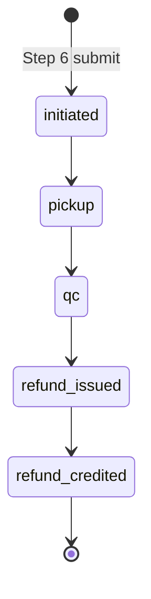
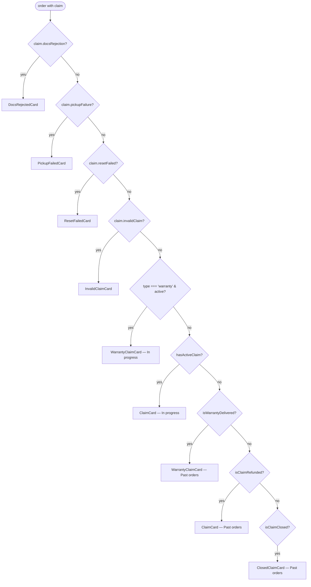
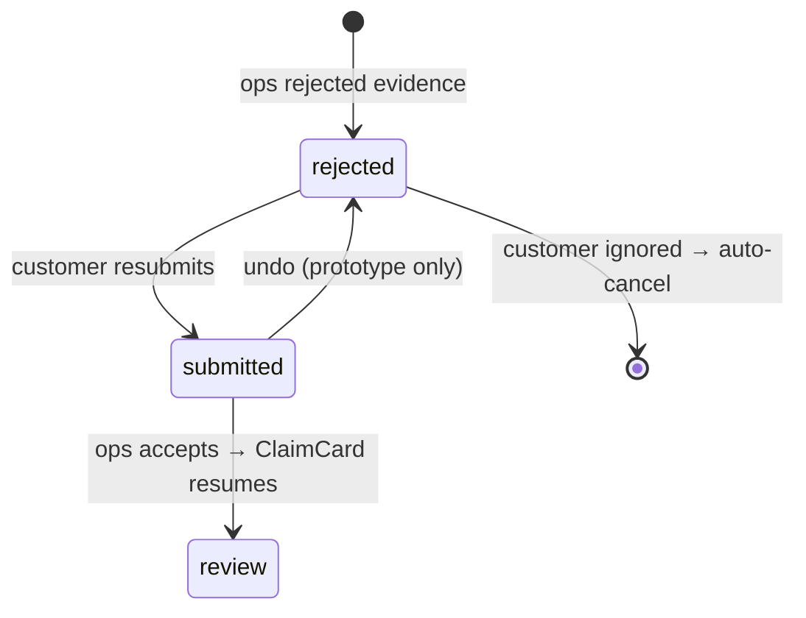
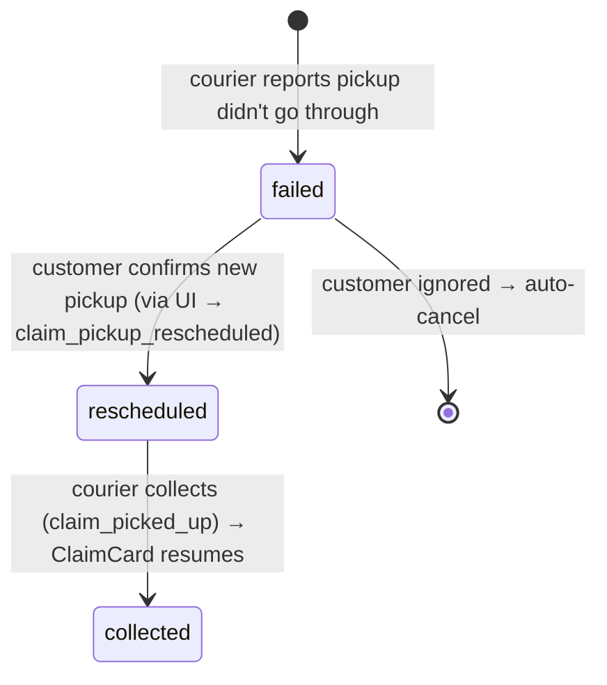
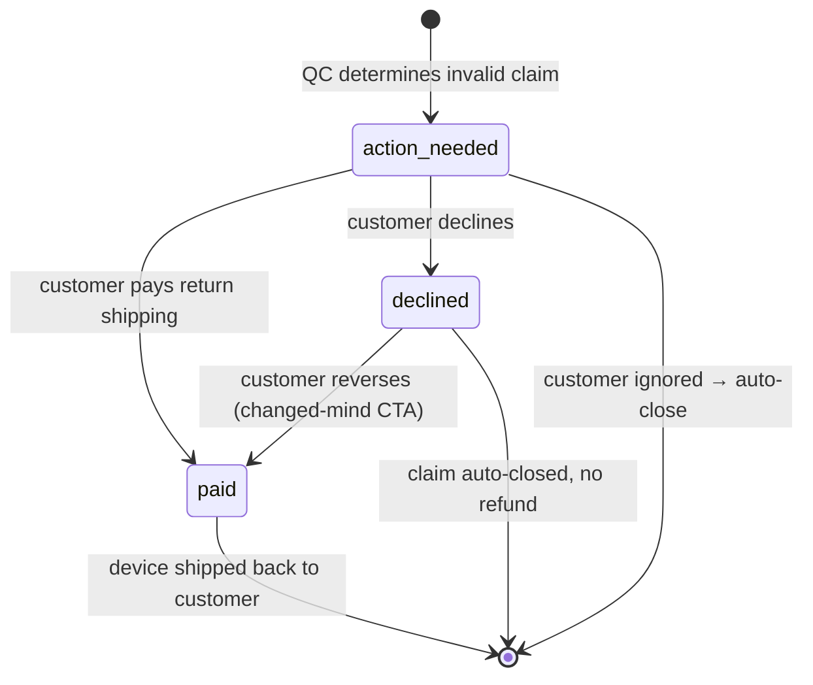
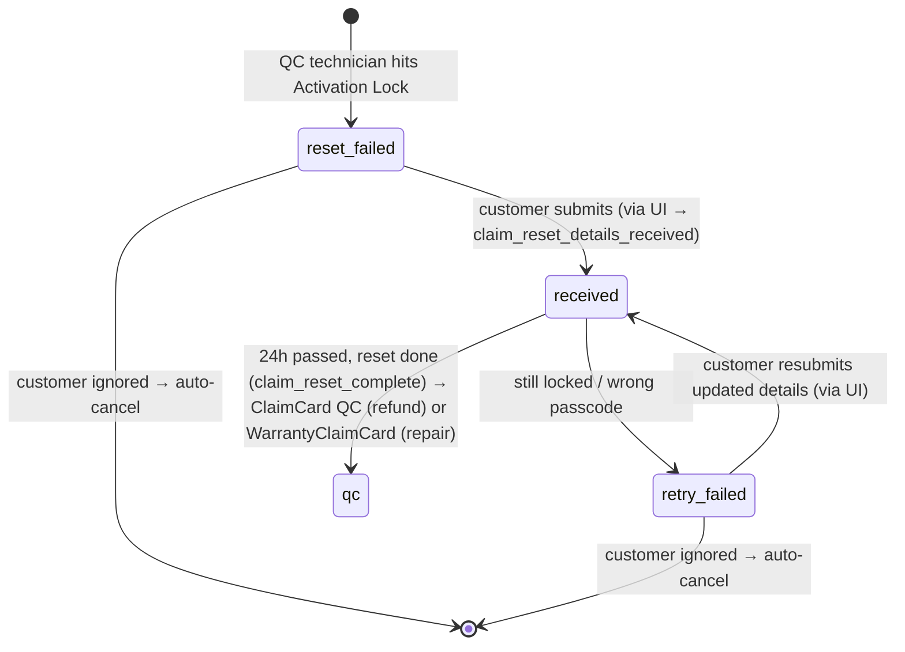

# Returns — Claim tracking

> Once a return claim is submitted, the customer's view of it lives on a new card type that replaces the delivered `PastOrderCard` for that order. This doc covers `ClaimCard` (the 5-state baseline) and the three takeover cards that supersede it when the claim is blocked on a single customer action: `DocsRejectedCard`, `PickupFailedCard`, `InvalidClaimCard`. Includes the canonical sub-status / action-gate / SLA reference tables.

## 1. Overview

A submitted return enters a 5-state customer-facing pipeline:



The five states live in `CLAIM_STATUSES` inside `src/lib/claims.js` — add, rename, or reorder steps there and the card picks them up. The pipeline was consolidated from 7 → 5 states in May 2026: `claim_created` + `pending_collection` folded into `initiated` (one bucket for "submitted, awaiting courier"), `under_collection` + `in_transit` folded into `pickup` (one bucket for "device in courier's hands"), and the terminal `refunded` was split into `refund_issued` (Revibe has triggered the payout) + `refund_credited` (money has landed in the customer's wallet/card).

`claim.subStatusId` (optional, see §4) carries finer-grained branching that hangs off these parents — `awaiting_documents` under `initiated`, `collection_failed` under `pickup`, the `reset_failed` / `under_revision` / `expert_revision` / `invalid_confirmed` / `awaiting_payment` / `ship_back_*` chain under `qc`. Today the card surfaces none of these inline; they're either kept in the registry for future use or drive the takeover-card routing in §3.

**Card routing precedence.** `App.jsx` checks claim takeovers first, then the warranty branch, then the refund baseline (see [../orders.md](../orders.md) §2). Order — chronological in the pipeline (docs at submit → pickup at collection → reset at QC wipe → invalid at QC verdict):



`isClaimClosed` (`claim.closure` set) is a sixth terminal beyond the refund pipeline — Revibe **rejected** the claim at review (see §3.6); it ranks below `isClaimRefunded` and above the cancellation branches.

The four takeover cards replace the baseline card's surface while the claim is blocked on a single customer action and auto-cancel (or auto-close) if ignored. They share a structural pattern (danger-toned hero with an ops/courier/quality message → action gate → customer commits → card flips to a warn-toned "submitted" state with an undo affordance). `WarrantyClaimCard` is a sibling card type for `claim.type === 'warranty'` — same chrome family as `ClaimCard`, different post-QC tail (repair-and-ship-back instead of refund). Spec at [`../warranties_compensations.md`](../warranties_compensations.md) §2.

## 2. ClaimCard (baseline)

The card carrying any order with an `order.claim` field whose `claimStatusId !== 'refund_credited'` is **In progress**; credited claims live in **Past orders**.

### 2.1 Tone progression

The card's left accent strip, state pill, hero block, and 5-step progress dots all share a tone driven by `claimToneFor(claimStatusId)`:

| `claimStatusId` | Tone | Rationale |
|---|---|---|
| `initiated`, `pickup`, `qc` | **warn (amber)** | The unit is leaving the customer or undergoing verification — an unresolved state. |
| `refund_issued` | **brand (purple)** | The payout has been triggered — same "active processing" tone the refund-hero card uses for `refund_pending`. |
| `refund_credited` | **success (green)** | Terminal — the money has landed. |

This piggybacks the existing `warn` / `brand` / `success` tokens — no new colour was added — and matches the convention `PastOrderCard` uses for its cancelled-past variants, so the language reads as one system.

### 2.2 Collapsed view

- Left accent strip (tone-driven).
- Typed claim ref eyebrow — `formatClaimRef(claim)` (e.g. `RET-IB4NP9`), replacing the earlier `Order · #{id}` eyebrow now that the parent order is surfaced by the `OrderClaimLink` order half above the card (see §10).
- State pill with the current status's `headline` and a tone-coloured dot (`Claim initiated`, `Under Quality Check`, etc.).
- A tinted hero block carrying:
  - `Claim · {type}` eyebrow on the left (e.g. `Claim · Change of mind` / `Claim · Issue`).
  - Tone-coloured phase tag on the right — icon + label (`Submitted` / `On the way` / `In review` / `Processing` / `Complete`).
  - Status headline as a `text-[22px]` headline in the tone colour.
  - Sub-line with the most recent timeline timestamp. (The `claimRef` was dropped from the hero sub-line once it became the card eyebrow.)
  - **Scheduled pickup strip** (only when `claim.claimStatusId === 'initiated'` and `claim.scheduledPickup` is set): a faint-divider-separated block carrying a `SCHEDULED PICKUP` eyebrow, a CalendarClock-iconed `{date} · {slot}` row in tone colour, and a MapPin-iconed truncated `{pickupDetails.address}` row beneath. Surfaces the courier date/slot Revibe assigned + the address the customer submitted, in one place, while the claim is still pre-collection. Hidden once the claim advances past `initiated`.
  - Separated by a faint divider: `Expected refund` (or `Refunded` once terminal) eyebrow + destination chip on the left and the net refund amount in `text-[22px]` tabular-nums on the right. The destination chip reuses the brand→accent gradient when wallet-bound (echoes the `GreetRow` credits pill) and a neutral chip when card-bound. When the original payment method is BNPL (`paymentMethod.type === 'bnpl'`) **and** `claim.refundMethod === 'original'`, the chip label collapses to just the provider brand (`Tabby` / `Tamara`) and a `BnplDisclaimerTooltip` Info-icon is appended inside the chip — `stopPropagation` so it doesn't toggle the card header. Same tooltip is rendered next to the refund destination row in `ClaimDetailsSheet`.
  - **Split-paid orders** (`order.paymentSplit`, see [../orders.md](../orders.md) §7.1) with `claim.refundMethod === 'original'`: a `RefundSplitRows` block is appended below the amount row, splitting the net proportionally across the card and gift-card sources (`ClaimDetailsSheet` shows the same under its Refund card). The net stays the hero figure; the split is the breakdown. The gift-card portion credits the Wallet once `refund_credited` ([wallet.md](../wallet.md) §3).
- A compact product row (image / name / variant / `Revibe Care +{currency} {amount}` line / total / chevron).

### 2.3 Expanded view

1. **Optional `ClaimActionBanner`** (`src/components/ClaimActionBanner.jsx`), rendered above the dot strip whenever `claim.actionRequired` is present. Warn-toned card with an alert glyph, headline, one-line body, deadline countdown copy (`claim.actionRequired.deadlineLabel`, e.g. "2 days left"), and a single primary CTA. Three gate kinds are wired today via `actionGateCopy()` in `src/lib/claims.js` — see §4.3. The CTA stops propagation so it doesn't toggle the card.
2. **5-step horizontal dot timeline** using `CLAIM_STATUSES`. Reached/current dots are filled in the tone colour with the same `shadow-[0_0_0_4px_rgb(255,242,221)]` glow on the current step that `InProgressCard` uses for its top-level timeline. Each reached step renders its date and time on two lines below the label, sourced from `claim.timeline[step.id]`.
3. **Optional `See detailed tracking` dropdown**, rendered between the dot strip and the history thread whenever `claim.transitSubTimeline?.picked_up` is set — i.e. once the courier has actually scanned the device. (Before that point the Initiated-state hero strip carries the scheduled-pickup info; afterwards the dropdown takes over as the courier-journey surface.) Mirrors the `HeroCard`'s outbound dropdown but in the light palette. It is now the **shared `TrackingDropdown`** (`src/components/ReturnShipmentTracking.jsx`) — the single source of truth for every courier leg in a claim — passed the inbound stop list `CLAIM_TRANSIT_SUB_STATUSES`, `transitSubProgressIndex(claim.transitSubStatusId)`, and `claim.transitSubTimeline` stamps. Tapping the button expands a panel containing the 4-step inverse-journey sub-timeline (`Picked up` → `Arrived at origin hub` → `In transit` → `Arrived at Revibe hub`) followed by a **Track package / Get Help action row** (Track package → the hardcoded DHL test shipment; Get Help is a styled, not-yet-wired placeholder). The earlier per-card courier strip (DHL chip + `order.courier` + `order.trackingNumber` + copy button) is gone — the action row replaces it.
4. **`History` thread** (`HistoryThread`) — a compact `History · N earlier events` toggle (chevron-rotated) that is **collapsed by default**. Expanding it reveals a vertical, minimalistic timeline of the order's past events (Placed → Cancellation requested / rejected → Delivered → Evidence resubmitted) derived in `src/lib/events.js` via `getHistoryEvents(order, 'claim')`. Rows render chronologically with the latest at the bottom; tapping a row opens a tone-tinted detail panel below the timeline (one open at a time). The active claim is the hero, so it never appears as a row.
5. **Two-action footer:** `View claim details` (opens `ClaimDetailsSheet`) + icon-only `Download receipt` (decorative).

### 2.4 Claim details sheet

`ClaimDetailsSheet` (`src/components/ClaimDetailsSheet.jsx`) is a bottom sheet mirroring `RefundDetailsSheet`'s chrome (`bg-black/45` scrim, slide-up panel, `Escape` to close, body-scroll lock). Two cards:

- **Summary** — read-only set of choices captured during the returns flow: reason (mapped via `REASON_LABELS`; falls back to the free-text `otherText` when the user picked `Other`), units (e.g. `1 of 1`), device preparation (masked to `Factory reset confirmed` / `Unlinked + passcode shared` — never plain credentials), pickup details broken out as three rows (`Pickup address`, `Pickup email`, `Pickup phone`), refund destination (wallet icon or card chip + `Includes 10% restocking fee` sub-copy when method is `original`), and `Submitted` timestamp.
- **Refund** — `Expected refund` (or `Refunded` once terminal) row with the net amount in `text-[18px]` tabular-nums. Original-payment refunds also show a small `Gross … · Restocking fee − …` line so the math is visible.

The summary content used to live inline inside the expanded card; it was pulled into the sheet so the expanded body stays focused on progress and the underlying order context, with the full breakdown one tap away.

### 2.5 Section placement

`hasActiveClaim(order)` returns true when an order has a `claim` field whose `claimStatusId !== 'refund_credited'`. Such orders are included in `isOpen` and surface in **In progress**, regardless of the underlying order's `statusId` (which stays `delivered`). `isClaimRefunded(order)` returns true for credited claims; these surface in **Past orders**.

Filter counts reflect the same rules — an in-flight claim counts toward the `in_progress` chip and is excluded from `delivered`; a refunded claim counts toward `delivered` (the underlying order was delivered and the journey is complete). No new filter chip was added for claims.

A claim whose device has been **shipped back and delivered** after an invalid / wrong-device verdict (or a post-collection cancel) is also terminal, even though its `claimStatusId` never reaches a refund state. `isReturnDelivered(order)` (`claim.invalidClaim.returnShipment.currentStatusId === 'delivered'`) flags it: `isOpen` returns false (so it drops to **Past orders**, where it still renders via `InvalidClaimCard`'s green delivered surface), and the shared `isDeliveredPast` helper in `App.jsx` counts it toward the `delivered` chip — parity with a delivered warranty (`isWarrantyDelivered`).

### 2.6 Auto-expand

`ClaimCard` does not participate in `pickActiveOrderId` (fulfilment in-flight orders win that slot when both are present), but it does carry a **one-shot `openSignal` prop** for the post-submit Track flow:

- Step 7's `Track this return` button calls `onTrackClaim(orderId)` (forwarded through `ClaimFlow`), which closes the flow and bumps `App.jsx`'s `autoOpenClaim = { orderId, n }` state.
- `ClaimCard` receives `openSignal={autoOpenClaim.orderId === o.id ? autoOpenClaim.n : 0}`. A side-effect-only `useEffect` calls `setExpanded(true)` whenever `openSignal > 0` and changes — so a fresh bump expands, but subsequent renders (e.g. flow re-opens that end on `Back to my account`) don't re-trigger the expand. `WarrantyClaimCard` uses the same prop for `Track this claim`.
- Card collapse remains user-controlled. Once the user manually collapses, no later non-Track event re-expands it.

`pickActiveOrderId` is the lever to pull if customer research shows the *list-level* should also auto-open active claims on land — extend the rank function in `src/lib/statuses.js` to consider `claimProgressIndex` from `src/lib/claims.js`. The one-shot signal stays orthogonal to that.

### 2.7 Source of truth

`src/lib/claims.js` owns:

- `CLAIM_STATUSES` — the 5-state list.
- `claimToneFor(claimStatusId)` — tone mapping.
- `claimProgressIndex` — auto-expand input (not yet wired into `pickActiveOrderId`).
- `claimPhaseTag(claimStatusId)` — phase tag icon + label.
- `CLAIM_TRANSIT_SUB_STATUSES` + `transitSubProgressIndex` — 4-stop inverse-journey sub-timeline rendered inside the `See detailed tracking` dropdown when `claim.transitSubTimeline.picked_up` is set.
- Headline + sub-line resolution.
- `SUB_STATUS_LABELS` — copy registry for sub-statuses (see §4.2). Not currently rendered by `ClaimCard`; kept as the source of truth for ops/internal references and any future surface that exposes one of these branches inline.
- `CLAIM_SLAS` — SLA placeholders for refund-flow steps and the warranty-tail steps (`under_repair`, `ship_back`). Used by the returns flow's Step 4 detailed-timeline dropdown and the `expectedCompletionFor(claimType)` helper that drives the Step 4 / Review / Confirmation "Expected by" headlines.
- `expectedCompletionFor(claimType, today?)` — sums SLA `expectedHours` across the claim-type's pipeline (refund: 5 steps; warranty: 6 steps), adds the total to `today`, and returns `{ short, long, hours, date }`. `long` is the "Monday, 14 May" form used by the Step 4 headline + warranty Step 6/7 surfaces; `short` mirrors the seeded `claim.repairWindow.expectedComplete` shape ("Mon, 14 May").
- `actionGateCopy()` — banner copy for the three action gates.
- Summary-label maps: `REASON_LABELS`, `RETURN_METHOD_LABELS`, `reasonText`, `devicePrepText`, `refundMethodLabel`.
- `hasActiveClaim`, `isClaimRefunded`, `canCancelClaim`.

Edit copy or add a new claim state here, not in the components.

### 2.8 Cancel claim

`ClaimCard` and `WarrantyClaimCard` carry a **persistent `Cancel claim`** affordance: a danger-tinted text button in a bordered footer strip that sits *below* the header, **outside** the expand block — so it's visible whether the card is collapsed or expanded. Gated on `canCancelClaim(claim) && onRequestCancelClaim` (the prop is threaded from `App.jsx`).

#### Window — `canCancelClaim(claim)`

`canCancelClaim` in `src/lib/claims.js` is the visibility rule: cancellable across the whole pre-completion window — `claimStatusId ∈ {initiated, pickup, qc}`. Locked once the refund is issued (`refund_issued` / `refund_credited`) or the warranty enters repair (`under_repair` onward). Compensation has no `pickup`, so it resolves to `initiated` / `qc`. The three **takeover** cards (`PickupFailedCard` / `DocsRejectedCard` / `ResetFailedCard`) expose `Cancel claim` regardless — they're already blocked / auto-cancelling states. `InvalidClaimCard` is out of scope (it's already the ship-back surface).

#### Two paths — `cancelNeedsShipBack(claim)`

The *behaviour* of a confirmed cancel forks on whether the device is physically with Revibe:

| Path | When (`cancelNeedsShipBack`) | Outcome |
|---|---|---|
| **Clean revert** | `false` — `initiated` device claims (device not yet collected) + **all** compensation (customer keeps the device) | The claim is dropped; the order reverts to its delivered `PastOrderCard` (re-raisable). |
| **Ship-back** | `true` — device claim at `pickup` / `qc` (unit already collected) | Hands off to the pay-return-shipping surface — the customer covers return shipping to get the device back. |

#### Confirmation sheet — `CancelClaimSheet`

Tapping `Cancel claim` opens `CancelClaimSheet` (`src/components/CancelClaimSheet.jsx`) — a bottom sheet reusing `CancelOrderSheet`'s chrome (scrim, slide-up panel, Escape-to-close, body-scroll lock). Copy is path-aware (reads `cancelNeedsShipBack`):

- **Clean:** "We'll cancel your return — no device pickup will be scheduled / no compensation will be paid. The order goes back to Delivered, nothing was charged." Primary `Cancel claim`.
- **Ship-back:** "Your device is already with us. To cancel and get it back, you'll cover return shipping ({amount})." Primary **`Continue to payment`** → step 2 (the pay surface). The confusing "no pickup will happen" line is gone.

#### Clean-revert result

Confirm adds the orderId to `App.jsx`'s `cancelledClaims` map; the projection strips the claim (winning over `submittedClaims` and any hand-seeded claim), reverting the order to its delivered `PastOrderCard`. The generalized `UndoSnackbar` surfaces "Claim cancelled" — Undo clears the flag, restoring the claim.

#### Ship-back result — reuse of `InvalidClaimCard`

Confirm overlays `claim.invalidClaim = cancelReturnGate(order)` (`reason: 'cancelled'`) via `App.jsx`'s `shipBackCancels` map — clearing any takeover flag (`resetFailed` etc.) so routing lands on `InvalidClaimCard` rather than the original takeover. That card renders the **same** pay-return-shipping → paid → return-shipment-tracking machinery as an invalid verdict, with copy switched by `reason` (see §3.3) and the secondary action swapped from `Decline` to **`Keep claim`** (`onKeepClaim` → clears the gate, claim resumes). No undo snackbar — `Keep claim` is the back-out. This is the **generic** post-collection-cancel mechanism: any future surface that needs "cancel while the device is already returned" sets the same gate.

#### Journey mode

Cancellation is modelled as real terminal nodes:

- **`claim_cancelled`** (clean) — wired into the `claim_submitted_*` nodes across all four journeys + compensation's `claim_under_review`. `apply()` strips the claim → delivered.
- **`claim_cancelled_shipback`** (device journeys only — CoM / issue / warranty) — wired into the QC-phase nodes (`claim_qc_started`, `claim_reset_failed`). Sets the `reason: 'cancelled'` gate (clearing takeover flags) and points into the **existing** `claim_return_shipping_paid → return sub-statuses → delivered` chain — near-total reuse. `Keep claim` here calls `journey.back()`.

Confirming the sheet advances whichever node is in `validNext` (also a dev-panel button). Post-collection nodes that aren't wired (pickup/transit, reset-retry) fall back to the in-session `shipBackCancels` overlay, cleared on the next node change so the flow stays repeatable. See [journey_backend_spec.md](../journey_backend_spec.md).

## 3. Takeover cards

When the claim is blocked on a single customer action, the card flips out of `ClaimCard` chrome into a dedicated takeover. All four follow the same structural pattern:

| Aspect | Pattern |
|---|---|
| Tone (initial) | danger red — the claim is blocked on the customer |
| Tone (post-commit) | warn amber for re-upload / reschedule (live, awaiting verdict); brand purple for paid-and-shipping (forward motion) |
| Hero | Eyebrow `Order · #{id} · Claim RET-{ref}` → `Action needed` pill → `Tap to fix` CTA button (solid danger, shared `TapToFixCta`) when collapsed |
| Ops message | Avatar + name + role + timestamp + free-text reason (expanded view) |
| Action gate | Single primary CTA, danger-red filled |
| Auto-resolve | `autoCancelAt` (or `autoCloseAt`) — claim auto-cancels/closes if ignored |
| Replay | No in-card undo — the post-commit state is replayed via journey mode (`JourneyDevPanel` Back/Next walks the takeover nodes) |

### 3.1 DocsRejectedCard — faulty-product evidence re-upload

Trigger: `claim.docsRejection` is set. The Revibe Quality team has rejected the evidence batch attached to a faulty-product claim. Whole-batch rejection only — no per-document accept/reject. The customer has 3 days to re-upload before the claim auto-cancels.



**Collapsed (rejected state).** Danger-toned left accent strip; eyebrow as above; `Action needed` pill; tinted hero with `Documents rejected` label, headline `We need a few photos re-shot`, one-line truncated ops quote, countdown strip (`2 days, 14 hours left to re-upload · Claim auto-cancels {autoCancelAt}`); compact product row; `Tap to fix` CTA button (solid danger, shared `TapToFixCta`).

**Expanded (rejected state).** Same hero but the ops message expands into a full attributed block (avatar with `opsName` initial, name + role, rejection timestamp, full free-text message). Below the header:

1. **`Your last attempt`** — collapsed row that opens a horizontal dimmed thumbnail strip of the previously submitted files, each tagged with the ops reason (`Glare` / `Blurry` / `Too short`) so the customer sees exactly which file was the problem.
2. **`Re-upload your evidence`** — single combined drop zone (no per-category split — ops rejects the whole batch). Taps append fake files; once at least one file is present, the zone becomes `Add more evidence` and a 3-column thumbnail grid renders with × to remove and a `+` tile.
3. **`Note for Revibe Quality`** — optional 280-char free-text textarea; counter goes amber past 90%.
4. **Footer** — `Cancel claim` (visual stub) + `Resubmit for review`. Resubmit is gated: shows `Add evidence to resubmit` in disabled grey until at least one file is added, then flips to a solid danger-red primary action.

**Submitted state.** Tapping `Resubmit` flips the card in place to a warn-toned variant: amber accent strip, pulsing `Back under review` pill, `Resubmitted` phase tag, `Thanks — we've got your new evidence` headline, body that recaps what the customer sent (3-col grid of the same thumbnails + the quoted note when one was written).

**After the claim moves on.** Once Quality has accepted the new evidence and the claim progresses (e.g., to `pickup` or `qc`), the order leaves `DocsRejectedCard` and returns to the regular `ClaimCard`. The resubmission survives as an `Evidence resubmitted` chip inside the `HistoryThread` — a one-line recap (`N new files sent · {date}`) rather than re-surfacing the rejected items or the original ops note. Driven by `claim.proofResubmission`.

### 3.2 PickupFailedCard — collection failed → reschedule

Trigger: `claim.pickupFailure` is set. The courier attempted the pickup and it didn't happen (no answer at the address, couldn't reach the customer, etc.). Same shape as docs-rejected — claim auto-cancels if the customer doesn't act before `autoCancelAt`.



**Collapsed (failed state).** Danger-toned left accent strip; eyebrow; `Action needed` pill; tinted hero with `Pickup failed` label, headline `Pickup didn't go through`, one-line truncated courier quote, countdown strip (`3 days, 18 hours left to reschedule · Claim auto-cancels {autoCancelAt}`); compact product row; `Tap to fix` CTA button (solid danger, shared `TapToFixCta`).

**Expanded (failed state).** Same hero but the courier message expands into a full attributed block (avatar with `opsName` initial — typically the courier's first name). Below the header:

1. **`Pickup address` card** — address + phone + email block carrying the saved values from `claim.pickupDetails`. Read-only by default; when the customer taps the `Change pickup address` button below it, the card flips into an inline edit mode (three input fields stacked with Save / Cancel beneath). Save commits the next values back to local component state and exits edit mode; Cancel discards the draft. Local state only — the change does not propagate back to the order data. Mirrors `InvalidClaimCard`'s `Delivery details` card.
2. **`Change pickup address` button** — solid border-brand outline, Settings2 glyph. Hidden while the pickup-address card is in edit mode.
3. **Confirm summary line** — single sentence preview of what confirming creates: courier + scheduled slot (driven by `claim.pickupFailure.nextPickup`).
4. **Footer** — `Cancel claim` (visual stub) + `Confirm new pickup` (solid danger-red primary action). Confirm is always enabled; the confirmation step itself is the gate.

**Submitted (rescheduled) state.** Tapping `Confirm new pickup` flips the card to a warn-toned variant: amber accent strip, pulsing `Pickup rescheduled` pill, `New AWB created` phase tag, `Your new pickup is on the way` headline, body that names the courier + slot + new AWB. Expanded shows a `Your new pickup` summary block (courier, AWB, slot, pickup-from address). This state is **journey-driven** — the button calls `onConfirmReschedule` (`App.jsx`'s `validNext`-gated `handleConfirmReschedule`) which advances the `claim_pickup_rescheduled` node, and the card reads `claim.pickupFailure.rescheduledAt` live so the dev panel and the card stay in lockstep (mirrors `InvalidClaimCard`'s `paidAt`/`declinedAt`). A local-state fallback covers the standalone mock, where there's no journey to advance.

**After the claim moves on.** Courier collection is a separate step — the `system` `claim_picked_up` event clears `claim.pickupFailure` and moves the claim to `pickup`, so the order leaves `PickupFailedCard` and returns to the regular `ClaimCard` (AE/ZA then walk the detailed transit chain; SA/Others go straight to QC, via the inbound country fork on `claim_picked_up`). No separate history-thread chip is introduced for the failed-then-rescheduled chapter at this stage.

### 3.3 InvalidClaimCard — inspection invalid → pay return shipping

Trigger: `claim.invalidClaim` is set. The QC team inspected the claimed device and couldn't reproduce the issue (or the device is within spec). The customer must pay return shipping to get the device back. Same takeover shape as the others, but with three internal demo states (`action_needed` → `paid` or `declined`) toggled by the CTAs and a reversal flow.

**`reason` — generic device-ship-back surface.** `claim.invalidClaim.reason` discriminates the trigger: `'invalid'` (the QC verdict above — the default when absent, so all existing mocks/journey nodes are unchanged) vs `'cancelled'` (a customer cancel of a claim whose device is already with Revibe — see §2.8). For `'cancelled'` the card reuses everything (fee card, delivery details, `Pay {amount}`, paid-state return-shipment tracking, the journey return chain) and only switches **copy** — label `Cancelled claim`, phase tag `Cancellation requested`, headline "Pay return shipping to get your device back", a neutral system note instead of the Revibe-Quality ops quote — and swaps the secondary action from `Decline` (invalid-only terminal) to **`Keep claim`** (`onKeepClaim` → resume the original claim, no terminal). Treat `InvalidClaimCard` as the generic "device is at Revibe, pay to get it back" surface, not invalid-specific.



**Journey-driven (derived state).** The CTAs advance the journey, so the dev panel and the card stay in lockstep: `Pay` and the declined card's `I changed my mind and will pay` both advance `claim_return_shipping_paid` (the QC-verdict `claim_invalid_confirmed`, the post-collection cancel `claim_cancelled_shipback`, **and** the now-non-terminal `claim_invalid_declined` all fork to it), and `Decline` advances `claim_invalid_declined`. The card derives its state from the order data — **`paidAt` wins over `declinedAt`** (paying is forward of a prior decline, and the paid node spreads the existing `invalidClaim` so both stamps coexist after a reversal) — so a dev-panel Back re-syncs the card both ways with no sync effect. Each CTA is `validNext`-gated (`App.jsx`'s `handlePayReturnShipping` / `handleDeclineReturn`); a `localMode` override covers the standalone mock, where there's no journey to write the stamps back. Mirrors `PickupFailedCard` / `ResetFailedCard`.

**Collapsed (action_needed).** Danger-toned left accent strip; eyebrow; `Action needed` pill; tinted hero with `Return claim` label, `Inspection complete` right-align phase tag (ShieldX glyph), headline `Claim couldn't be approved`, one-line truncated quote from Revibe Quality, countdown strip (`3 days, 8 hours left to pay return shipping · Claim auto-closes {autoCancelAt}`); compact product row; `Tap to fix` CTA button (solid danger, shared `TapToFixCta`).

**Expanded (action_needed).** Same hero but the quality message expands into a full attributed block. Below the header:

1. **Return shipping fee card** — single-row read-only summary showing the fee amount (`{currency} {amount}`) on the right and the `Return shipping fee` eyebrow on the left. Intentionally minimal — the address moved out of this card so each block has one job.
2. **Delivery details card** — address + phone + email block carrying the saved values from `claim.pickupDetails`. Read-only by default; when the customer taps the `Change delivery details` button below it, the card flips into an inline edit mode (three input fields stacked with Save / Cancel beneath). Save commits the next values back to local component state and exits edit mode; Cancel discards the draft. Local state only — the change does not propagate back to the order data.
3. **`Change delivery details` button** — solid border-brand outline, Settings2 glyph, copy and chrome borrowed from `InProgressCard`'s "Change details". Hidden while the delivery-details card is in edit mode.
4. **Footer** — `Decline` (secondary outline) + `Pay {currency} {amount}` (solid danger-red primary action with CreditCard glyph). The two actions are mutually exclusive; both advance the journey to a different state (see **Journey-driven** above).

**Paid / shipping-back state.** Tapping `Pay` (or a journey advancing `paidAt`) flips the card to a return-shipment trajectory. It is **tone-aware**: brand-purple while the device is in transit, flipping to **success-green** once delivered — the same tonal shift `WarrantyClaimCard` makes across `ship_back → device_returned`.

- Eyebrow rewrites to `Order · #{id} · Return from Claim RET-{ref}` so lineage stays visible.
- State pill: brand-toned `Return shipment` (Truck glyph) in transit; success-toned `Delivered` (Check glyph) once delivered.
- Hero (in transit): gradient brand-bg / brand-bg2 block carrying `Back with you by` + the estimated delivery date + an `On track` phase tag, a `DeliveryAddressPill` (`Delivering to` + the order's actual address; `Home` only when `order.address` is unset), and a `{claimRef} · Claim · {type}` subline. **At delivered** the future-tense ETA hero is replaced by a green hero — `Delivered` headline, `Complete` phase tag (Check), and a `Delivered on {date}` strip (`returnShipment.deliveredOnLong || deliveredOn`, then the date part of `timeline.delivered`, then `estimatedDeliveryLong || estimatedDelivery`) — mirroring warranty's `device_returned` hero.
- Expanded body renders the **5-step claim-progress dot timeline** `Initiated · Pickup · Quality Check · Shipped · Delivered` via the shared **`Timeline`** component (`src/components/Timeline.jsx`, horizontal) over the shared `RETURN_CLAIM_STATUSES` list — the claim's own head (`initiated`/`pickup`/`qc` from `claim.timeline`) with the refund tail (`refund_issued`/`refund_credited`) swapped for the return shipment's `shipped`/`delivered` (from `returnShipment.timeline`); current step from `returnClaimProgressIndex(returnShipment)`. This keeps the claim context instead of reading as a fresh order, and shares its `Shipped · Delivered` tail verbatim with the warranty card. While `currentStatusId === 'shipped'` the shared **`ReturnShipmentTracking`** adapter (`src/components/ReturnShipmentTracking.jsx`, a thin wrapper over the shared `TrackingDropdown`) renders beneath it — the 4-stop outbound `SHIPPING_SUB_STATUSES` sub-timeline followed by a Track package / Get Help action row. A small brand-tinted heads-up strip names the claim ref and reminds the customer no refund will be issued.
- **Section placement:** once delivered, the claim drops to **Past orders** and counts toward the `delivered` filter (see §2.5), parity with a delivered warranty.

**Declined state.** Tapping `Decline` flips the card to a muted neutral-toned terminal:

- Muted-foreground left accent strip, `Claim closed` pill (ClipboardList glyph), `No refund issued` right-align tag.
- Hero: `Claim closed — device not returned` with a one-line explanation that the inspection didn't confirm the issue and the customer declined to cover return shipping.
- Expanded body: a warn-toned reversal block headlined `Still want your device back?` with the copy-locked CTA `I changed my mind and will pay for the shipment fee` (CreditCard glyph). The verbatim string is fixed by product. Tapping it advances the same `claim_return_shipping_paid` node as `Pay` (the declined node forks to it), flipping the card into the paid ship-back state — and the dev panel moves with it.

### 3.4 ResetFailedCard — Activation Lock still on at QC → remote unlink + passcode

Trigger: `claim.resetFailed` is set. The technician tried to wipe the device during QC and Activation Lock was still on (the customer ticked "factory reset" on Step 3 / Step 7 but didn't actually unlink the device from their iCloud account). The customer must unlink the device remotely and share their device passcode before QC can resume. Same auto-cancel posture as docs-rejected — claim auto-cancels if the customer doesn't act before `autoCancelAt`. The unlink instructions reuse Step 3's `ResetGuideSheet` opened straight onto its **remote route** (the device is locked and already at Revibe, so the on-device path doesn't apply) — see §3.4.1 + [guided_reset.md](guided_reset.md). The guide itself is device-typed (`deviceTypeForOrder`), so it shows the correct walkthrough; the surrounding card chrome (confirmation toggle, `What you sent` summary) is still iOS-worded, so the card is **iOS-only** in practice until an Android claim mock exists.



**Collapsed (reset_failed state).** Danger-toned left accent strip; eyebrow; `Action needed` pill; tinted hero with `Device still locked` right-align label (Lock glyph), headline `We couldn't wipe the device`, one-line truncated quote from Revibe Quality, countdown strip (`2 days, 22 hours left to unlock · Claim auto-cancels {autoCancelAt}`); compact product row; `Tap to fix` CTA button (solid danger, shared `TapToFixCta`).

**Expanded (reset_failed state).** Same hero but the Quality message expands into a full attributed block (avatar with `opsName` initial). Below the header:

1. **`Run the guided remote reset` launcher** — a brand-toned tap target (Lock glyph + chevron) that opens `ResetGuideSheet` with `initialRoute="remote"` + `skipDone`, landing straight on the remote-path step 0 (no intro fork, no "ready to ship" done screen — the device is already at Revibe). Finishing the last remote step (or backing out of step 0) closes the sheet; finishing flips the launcher to a green `Guided reset completed · tap to run it again` state. See §3.4.1.
2. **`I've removed this device from my iCloud account` confirmation toggle** — large tap target with a checkbox and required-helper subline. **Locked (dimmed) until the guided reset is completed** (mirrors Step 3's guide-unlocks-confirm pattern); the subline reads "Run the guided reset above first." until then. Required before submit.
3. **`Device passcode` field** — masked numeric input (`type=password`, `inputMode=numeric`), 6-digit cap with progress counter (`0/6` → `6/6` in success-green). Wide tracking + monospace tabular nums so the dots read as a real PIN input. Helper line: "If it's 4 digits, pad with zeros at the end."
4. **Security note** — danger-tinted strip with ShieldCheck glyph: "Your passcode is encrypted and used only by our technician during the reset. It's deleted once the device is wiped." Reuses the tone of the hero so it reads as part of the action, not an afterthought.
5. **Footer** — `Cancel claim` + `Submit details`. Submit is gated: shows `Confirm unlink + passcode` in disabled grey until both the toggle is on and the passcode is complete (6 digits), then flips to a solid danger-red primary action with the ShieldCheck glyph. `Cancel claim` is wired (§2.8): because the device is at Revibe by this point (`qc`), it takes the **ship-back** path — the confirmation sheet hands off to `InvalidClaimCard`'s pay-return-shipping surface (`reason: 'cancelled'`) rather than reverting to delivered.

**Submitted state.** Tapping `Submit details` flips the card in place to a warn-toned variant: amber accent strip, pulsing `Reset in progress` pill, `Details received` phase tag, `Thanks — we'll attempt the reset` headline, body that names the technician and the 24-hour retry window. Expanded shows a `What you sent` summary card (iCloud unlink confirmation row with success check + masked passcode row showing the last two digits — `••••42`) followed by the warn-toned security note. This state is **journey-driven** — the button calls `onSubmitResetDetails` (`App.jsx`'s `validNext`-gated `handleSubmitResetDetails`, which advances `claim_reset_details_received` or, after a retry, `claim_reset_retry_resubmitted`), and the card reads `claim.resetFailed.submittedAt` live so the dev panel and the card stay in lockstep (mirrors `PickupFailedCard`'s `rescheduledAt`). Crucially it does **not** resume QC — `resetFailed` stays set, so the card holds this state until the system step below. A local-state fallback covers the standalone mock, where there's no journey to advance (the masked passcode then shows a representative `••••42`).

The masking convention (last two digits visible) is a prototype cue that the value was received and survives the round-trip without ever revealing it back to the customer in plaintext. Production should not echo the passcode at all once submitted.

**After the claim moves on.** Reset completion is a separate step — the `system` `claim_reset_complete` node ("24h passed — reset done") clears `claim.resetFailed` and resumes quality check, so the order leaves `ResetFailedCard` and returns to the regular `ClaimCard` showing **Under Quality Check** (or `WarrantyClaimCard` for warranty claims), then forks to the QC outcome (refund / under-repair / invalid). Its event `claim.reset.completed` is unauthored ⇒ **silent**. The submission survives as a `resetUnlock: { at, attempt }` field on the claim — reserved for a future HistoryThread chip ("Device unlocked — 29 May") that the current build does not yet render.

**Retry loop.** Journey mode (`?journey=claim_*`) wires a one-shot retry: after `claim_reset_details_received` the dev panel exposes both the `claim_reset_complete` "24h passed" advance (→ QC outcome fork) and a `claim_reset_retry_failed` system-triggered branch. The retry takeover re-seeds `resetFailed` (dropping `submittedAt`, so the card returns to the action-needed state) with updated copy ("thanks for the details, but the device is still showing Activation Lock…") and a fresh countdown. A second submission (`claim_reset_retry_resubmitted`, also `via UI` and firing the same `claim.reset.details_received` comm as the first) flips back to the `Details received` state and re-merges at the shared `claim_reset_complete` step — the journey doesn't model a third failure (in production the claim would auto-cancel and the device would ship back to the customer like the invalid-paid branch). See `docs/output/journey_backend_spec.md` for the node graph.

#### 3.4.1 Reusing `ResetGuideSheet` in remote mode

The card opens the same `ResetGuideSheet` Step 3 uses, via two props that adapt it to the post-pickup context (both default off, so Step 3's call site is unchanged):

- **`initialRoute`** (`'remote'`) — seeds `phase: 'steps'` + `route: 'remote'`, skipping the intro "can you still unlock this device?" fork (QC already answered it — the device is locked and at Revibe, so only the remote path applies). Back on step 0 closes the sheet instead of returning to the (absent) intro.
- **`skipDone`** — finishing the last remote step fires `onDone()` directly instead of switching to the "Your {device} is ready to ship — power it off and pack it" success screen, which is wrong here (the device is already at Revibe). The card's `onDone` marks the guide complete and closes the sheet, returning to the card where the confirm checkbox is now unlocked.

The guide `device` is resolved with `deviceTypeForOrder(order)` (→ `iphone` for the current iOS mock; the sheet falls back to the iPhone guide for the OS-ambiguous `tablet`). This is the one place the takeover is device-typed — the rest of the card chrome stays iOS-worded (see §3.4).

### 3.5 Relationship to `ClaimActionBanner`

Phase 30 (PickupFailedCard) and phase 32 (InvalidClaimCard) migrated their gates onto dedicated takeover cards. The inline `ClaimActionBanner` code path remains wired and is still the surface for `awaiting_documents` (Issue flow only) and any future claim that sets `actionRequired` without a dedicated takeover card. The `collection_failed`, `awaiting_payment`, and `reset_failed` branches in `actionGateCopy()` are retained for completeness but effectively dormant — no current mock claim exercises them through the inline banner.

### 3.6 ClosedClaimCard — Revibe rejected the claim (terminal, Past orders)

Trigger: `claim.closure` is set (`isClaimClosed(order)`, `lib/claims.js`). Distinct from the takeovers above — it is **not** a blocked-on-customer takeover but a **terminal Past-orders card**: Revibe reviewed the claim and could not accept it, so the customer keeps the device and no refund is issued. `claim.closure` is terminal regardless of the underlying `claimStatusId` — `hasActiveClaim` short-circuits to `false` when it is present, so the order falls out of "In progress" into Past orders. The card mirrors `InvalidClaimCard`'s muted `CompensationClosedCard` chrome (muted left accent, `Claim closed` pill, `No refund issued` tag) but is **reason-driven** and carries a forward path rather than a payment gate.

**Reason taxonomy.** `claim.closure.reason` is one of `outside_window` / `not_eligible` / `evidence_insufficient` / `not_reproduced` / `duplicate` / `other`. Customer-facing copy (`label` / `headline` / `subline`) is owned by `CLAIM_CLOSURE_REASONS` in `lib/claims.js` (resolved via `closureCopyFor(claim)`) — edit copy there, not in the card. The card maps each reason to a glyph locally (`REASON_ICON`: `CalendarX2` / `Ban` / `FileX2` / `SearchX` / `CopyX` / `ClipboardList`); the icon is presentation so it stays in the component. Unknown reasons fall back to `other`.

**Collapsed.** Muted left accent strip; eyebrow `Claim {formatClaimRef(claim)}`; `Claim closed` pill (muted, `ClipboardList`); a tinted hero block whose eyebrow pairs the reason glyph + `copy.label` with a right-aligned `No refund issued` tag (`ShieldX`), then `copy.headline` and `copy.subline`; the shared `ProductSummary` row. Wrapped in `OrderClaimLink` (§10) like the rest of the family, so it carries the paired order half + connector rail.

**Expanded.** An attributed Revibe-Quality ops block (avatar with `closure.opsName` initial, name · role, `closure.closedAt` timestamp, full `closure.opsMessage`) when present; a `Think this is wrong?` reassurance note; and a two-button footer — `Contact support` (placeholder) + `Raise a new claim` (`onRaiseClaim(order.id)` → reopens the returns flow on the same order; the only wired action). There is no undo and no replay — closure is terminal.

## 4. Sub-status & action-gate reference

These tables are the canonical reference for sub-status copy, action-gate behaviour, and SLA placeholders. (The deprecated `Show detailed tracking` disclosure pattern that originally hosted them was removed; its design history is in git history.)

### 4.1 Sub-status enum (`claim.subStatusId`)

| `subStatusId` | Parent (`claimStatusId`) | Applies to | Operational flow node |
|---|---|---|---|
| `awaiting_documents` | `initiated` | Issue only | issue n6 / n7 |
| `collection_failed` | `pickup` | Both | issue n18 / com n20, n30 |
| `reset_failed` | `qc` | Both (iOS today) | (not yet in drawio) — fires when QC hits Activation Lock during the wipe |
| `under_revision` | `qc` | Both | issue n31 / com n43, n72 |
| `expert_revision` | `qc` | Issue + CoM UAE/Other | issue n33–n39 / com n45–n51 |
| `invalid_confirmed` | `qc` | Both | issue n41 / com n53 |
| `awaiting_payment` | `qc` | Both (post-invalid) | issue n42 / com n54 |
| `ship_back_pending` | `qc` | Both (post-payment) | issue n45 / com n57, n76 |
| `ship_back_in_transit` | `qc` | Both | issue n49–n51 / com n59–n61, n79 |
| `ship_back_delivered` | `qc` | Both — terminal for invalid | issue n53 / com n63, n81 |

The ship-back chain hangs off `qc` rather than `refund_issued`, because in an invalid-claim outcome the claim never reaches `refund_issued` — the parent strip arrests at `qc` and the resolution is communicated through `InvalidClaimCard` rather than extending `CLAIM_STATUSES`.

### 4.2 Sub-status copy catalog (`SUB_STATUS_LABELS`)

Registry only — no current `ClaimCard` surface renders these inline. Kept as the canonical copy source for ops references and any future surface that exposes one of these branches in the UI.

| `subStatusId` | Headline | Subline | Tone |
|---|---|---|---|
| `awaiting_documents` | More info needed | "Revibe Quality asked for a clearer photo or longer video." | warn |
| `collection_failed` | Pickup didn't go through | "We couldn't collect on the scheduled date." | warn |
| `reset_failed` | Device still linked to iCloud | "We couldn't wipe the device — Activation Lock is still on." | warn |
| `under_revision` | Reviewing seller's response | "Our team is double-checking the seller's notes." | brand |
| `expert_revision` | Expert inspection | "Sent to our lab for a closer look. This step takes longer than usual." | brand |
| `invalid_confirmed` | Claim couldn't be approved | "Inspection didn't confirm the issue you reported." | warn |
| `awaiting_payment` | Payment needed to return device | "Cover return shipping to get your device back." | warn |
| `ship_back_pending` | Preparing to send your device back | "Arranging a courier — should be on the way in a day or two." | brand |
| `ship_back_in_transit` | Your device is on the way back | "Tracking will appear here once the courier scans it in." | brand |
| `ship_back_delivered` | Device returned | "Delivered." | success |

All copy is customer-facing — internal (IS) labels never appear in the UI.

### 4.3 Action gates (`actionGateCopy`)

Four gates total. Each fires a promoted banner above the dot strip (inline) or routes to a dedicated takeover card.

| Gate (`kind`) | Surface | Banner headline | Body | Deadline | Primary CTA | Secondary |
|---|---|---|---|---|---|---|
| `awaiting_documents` | Inline `ClaimActionBanner` | Action needed — documents requested | "Revibe Quality has asked for a clearer photo or longer video before we can pick up your device." | "Reply by {deadline} or the claim will close automatically." | Reply with documents | Close claim |
| `collection_failed` | Inline banner (dormant) **or** `PickupFailedCard` takeover | Action needed — pickup didn't go through | "Our courier couldn't pick up your device on {failedAt}." | "Confirm by {deadline} or the claim will close automatically." | Schedule new pickup | Cancel claim |
| `reset_failed` | Inline banner (dormant) **or** `ResetFailedCard` takeover | Action needed — device still linked to iCloud | "Activation Lock is still on, so we can't wipe the device. Remove it from your iCloud account and share your passcode so we can complete the reset." | "Submit by {deadline} or the claim will close automatically." | Unlock device | Cancel claim |
| `awaiting_payment` | Inline banner (dormant) **or** `InvalidClaimCard` takeover | Action needed — return shipping payment | "Your claim couldn't be approved after inspection. Cover the return shipping fee to get your device sent back." | "Pay by {deadline} or your device will not be returned." | Pay return shipping | Discuss with support |

The deadline label uses the prototype convention from `claim.docsRejection.timeLeftLabel` ("2 days, 14 hours left") for consistency across all three gates.

### 4.4 SLA placeholders (`CLAIM_SLAS`)

Lives in `src/lib/claims.js`. Drives the returns flow's Step 4 detailed-timeline dropdown and the `expectedCompletionFor(claimType)` helper that computes the "Expected by" headline (and the warranty Review / Confirmation expected-back dates). **Placeholder values — ops to revise.**

| Step | `expectedHours` | `bufferHours` | Notes |
|---|---|---|---|
| `initiated` → `pickup` | 24h | 24h | Submission plus courier pickup scheduling. Routing is automated for change-of-mind; Issue may pause at `awaiting_documents`. |
| `awaiting_documents` | 48h | 48h | Customer-action gate; deadline comes from `actionRequired.deadline`, not SLA. |
| `collection_failed` | n/a | n/a | Customer-action gate; SLA replaced by `actionRequired.deadline`. |
| `pickup` → `qc` | 60h | 48h | Courier collection + transit back to Revibe (consolidates the legacy `under_collection` and `in_transit` SLAs). Country-aware SLAs deferred. |
| `qc` → `refund_issued` *(or `under_repair` on warranty)* | 48h | 48h | Happy-path inspection. |
| `under_revision` | 48h | 48h | Agent reviewing seller's invalid-claim proof. |
| `expert_revision` | 120h | 72h | LAB sub-flow — explicitly longer; customers should expect it. |
| `awaiting_payment` | n/a | n/a | Customer-action gate. |
| `ship_back_pending` → `ship_back_in_transit` | 48h | 24h | After payment received (invalid-claim ship-back). |
| `ship_back_in_transit` → `ship_back_delivered` | 72h | 48h | Final leg of invalid-claim ship-back. |
| `refund_issued` → `refund_credited` | 24h | 24h | Automated refund posting; window for the gateway to move funds to wallet/card. |
| `under_repair` → `ship_back` *(warranty)* | 168h | 72h | The long pole on the warranty tail — repair window. |
| `ship_back` → `device_returned` *(warranty)* | 96h | 24h | Repaired device's return leg; reuses the standard outbound `SHIPPING_SUB_STATUSES`. |

Track current actuals before promoting these to production.

## 5. Data model — `claim` object

Optional object populated on a delivered order to drive `ClaimCard` and its takeover variants. Step 6's submit builds this object in `ClaimFlow.jsx`'s `buildClaim` helper and stitches it onto the order at the App level via `submittedClaims` — in-session only, cleared on refresh, revertable via the `UndoSnackbar`. Selected delivered mocks also hand-seed a claim: `89855` (`initiated` baseline exemplar — only the hero scheduled-pickup strip + first dot are populated, no takeovers, In progress), `89815` (`pickup` with a rejected cancellation in history and the `See detailed tracking` dropdown wired via `transitSubTimeline.picked_up`, In progress), `89762` (`qc` baseline Issue claim, no sub-status, In progress), and `89200` (`refund_credited` with a rejected cancellation in history, Past orders). Plus takeover-card mocks: `89734` (DocsRejected — underlying `initiated`), `89876` (PickupFailed — underlying `initiated`), `89812` (ResetFailed — underlying `qc`, iOS device), `89940` (InvalidClaim — underlying `qc`). Warranty-specific mocks live in [warranties_compensations.md](../warranties_compensations.md) §2.

### 5.1 Core claim fields

| Field | Type | Notes |
|---|---|---|
| `claim.claimRef` | string | The **bare** ref only (`Ib4nP9`) — `generateClaimRef()` in `src/lib/returns.js` no longer prefixes. Seeded mocks are inconsistent (sometimes bare, sometimes legacy `RET…`); the display prefix is applied at render time by **`formatClaimRef(claim)`** in `src/lib/claims.js`, which strips any leading `RET`/`WAR`/`CMP`/`CXL` and re-prefixes by `claim.type` via `CLAIM_REF_PREFIXES` (`change_of_mind`/`issue` → `RET-`, `warranty` → `WAR-`, `compensation` → `CMP-`, `cancellation` → `CXL-`, fallback `CLM-`). Every claim surface (card eyebrow, hero, details sheet, takeover eyebrows, the `OrderClaimLink` compact-row eyebrows) now calls `formatClaimRef` rather than interpolating `claim.claimRef` directly. |
| `claim.claimStatusId` | enum | One of `initiated`, `pickup`, `qc`, `refund_issued`, `refund_credited`. Drives tone, hero copy, progress dot index, and section routing. |
| `claim.type` | `'change_of_mind' | 'issue' | 'warranty'` | Drives the `Claim type` row in `ClaimDetailsSheet`, the hero eyebrow on `ClaimCard` / `WarrantyClaimCard`, the label chip on Step 7, and the routing decision in `App.jsx` between `ClaimCard` and `WarrantyClaimCard`. |
| `claim.submittedAt` | string | Human-readable timestamp for the `Submitted` row in `ClaimDetailsSheet`. |
| `claim.units` | integer | Today the returns flow always submits `1`. Kept as an integer for multi-unit future. |
| `claim.reason` *(change-of-mind only)* | `{ value, otherText }` | `value` is one of the keys of `REASON_LABELS`; `otherText` populated only when `value === 'other'`. |
| `claim.issueDetails` *(issue / warranty)* | `{ description, attachmentName }` | `description` is the customer's free-text; `attachmentName` is a stub filename today. (Sub-issue id and scope are **separate** top-level fields, below.) |
| `claim.issueScope` *(issue / warranty)* | `'not_working' | 'wrong_device'` | The two-scope picker value, pre-filled from the fault reason via `scopeForReason`. |
| `claim.issueSubtypeId` *(issue / warranty)* | string | The sub-issue id (e.g. `battery`, `physical`, `wrong_item`); resolves against `issueSubtypes.js`. |
| `claim.batteryAssessment` *(issue / warranty, optional)* | `{ capacity, baseline, degradation, nonOriginal, remedy, reason }` | The optional Step-2 battery self-check result (§7.2 Battery Standards), set only when the `battery` sub-type's check was filled in. `remedy` ∈ `refund` / `replacement` / `none` / `null`; `reason` ∈ `non_original` / `refund_10d` / `replacement_6m` / `replacement_12m` / `normal_wear` / `null`. Computed by `assessBattery()` in `src/lib/returns.js`. Captured but not yet rendered by any card / sheet. See [issue.md](./issue.md) §2.2 + §6.2. |
| `claim.devicePrep` | `{ option, os }` | `option` is `'reset'` or `'credentials'` and `os` is `'ios'` or `'android'`. Surfaced as masked `Factory reset confirmed` / `Unlinked + passcode shared`; raw credentials intentionally not persisted. |
| `claim.pickupDetails` | `{ address, email, phone }` | Three contact fields captured at Step 4. Customer-submitted; the values flow through unchanged into the Initiated-state hero strip and the details sheet. |
| `claim.scheduledPickup` *(optional)* | `{ courier, date, slot }` | Revibe-assigned pickup window. `date` is human-readable (`'Tomorrow, 20 May'`, `'Friday, 15 May'`); `slot` is a time range (`'10 AM – 12 PM'`); `courier` is the carrier name. Surfaced in the Initiated-state hero strip together with `pickupDetails.address`. Kept on the claim past `initiated` for the details sheet to reference, but the hero strip only renders while `claimStatusId === 'initiated'`. |
| `claim.refundMethod` | `'wallet' | 'original'` | Drives the destination chip and the `Includes 10% restocking fee` sub-copy when `original`. |
| `claim.expectedRefund` | `{ gross, fee, bonus, net, rate }` | Pre-computed at submission so the card doesn't re-run `refundBreakdown` on every render. `net` is what the hero displays. `bonus` is the optional Wallet bonus on issue claims (AED 100); `0` elsewhere. |
| `claim.timeline` | map keyed by `claimStatusId` | Timestamp at which the claim entered each phase. Populated progressively. |

### 5.2 Sub-status, transit, & detailed-timeline fields

| Field | Type | Notes |
|---|---|---|
| `claim.subStatusId` *(optional)* | enum | See §4.1. Not currently rendered inline by `ClaimCard`; reserved for takeover-card routing and any future inline surface. |
| `claim.transitSubStatusId` *(optional)* | enum | One of `picked_up`, `arrived_origin_hub`, `in_transit`, `arrived_revibe_hub`. Drives the current dot in the `See detailed tracking` dropdown. |
| `claim.transitSubTimeline` *(optional)* | map | Keyed by `transitSubStatusId` value, each entry a human-readable timestamp string (e.g. `'13 May · 3:42 PM'`). Renders below each reached step inside the dropdown. The presence of the `picked_up` key is the gate that surfaces the dropdown — once the courier has scanned the device, the dropdown is available for the rest of the claim's lifetime. |
| `claim.detailedTimeline` *(optional)* | map | Keyed by either a main `claimStatusId` or a `subStatusId`, with `{ startedAt }` per entry. Not currently consumed by `ClaimCard`; takeover cards use their own fields. |
| `claim.actionRequired` *(optional)* | `{ kind, deadline, deadlineLabel, failedAt? }` | Drives the inline `ClaimActionBanner`. `kind` is one of `awaiting_documents`, `collection_failed`, `awaiting_payment`; `deadlineLabel` is the hand-written countdown ("2 days left"); `failedAt` is the pickup-failure timestamp used by the `collection_failed` body. |

### 5.3 Takeover-card extensions

Each of these, when set, routes the order to its dedicated takeover card. They mirror each other structurally.

| Field | Type | Routes to |
|---|---|---|
| `claim.docsRejection` | `{ rejectedAt, autoCancelAt, timeLeftLabel, opsName, opsRole, opsMessage, previous }` | `DocsRejectedCard` |
| `claim.pickupFailure` | `{ failedAt, autoCancelAt, timeLeftLabel, opsName, opsRole, opsMessage, nextPickup: { awb, slot, courier } }` | `PickupFailedCard` |
| `claim.resetFailed` | `{ failedAt, autoCancelAt, timeLeftLabel, opsName, opsRole, opsMessage, attempt? }` | `ResetFailedCard` (iOS only) |
| `claim.invalidClaim` | `{ determinedAt, autoCancelAt, timeLeftLabel, opsName, opsRole, opsMessage, returnShipping: { amount, currency }, returnShipment: { courier, estimatedDelivery, estimatedDeliveryLong, currentStatusId, timeline } }` | `InvalidClaimCard` |
| `claim.proofResubmission` | `{ at, fileCount }` | History chip on `ClaimCard` after the rejection chapter closes |
| `claim.resetUnlock` | `{ at, attempt }` | Marker after a successful `ResetFailedCard` submit; reserved for a future HistoryThread chip (no UI surface today) |

**Common subfields across takeovers:**

- `rejectedAt` / `failedAt` / `determinedAt` — human-readable timestamp of the triggering event.
- `autoCancelAt` — human-readable timestamp at which the claim auto-cancels (or auto-closes for `invalidClaim`).
- `timeLeftLabel` — hand-written countdown copy ("2 days, 14 hours left"). Production should compute this from the trigger + a policy window (`rejectedAt + 72h`, `failedAt + 96h`, `determinedAt + 168h`).
- `opsName` / `opsRole` / `opsMessage` — free-text block displayed in the hero. The avatar uses `opsName`'s initial.

**Takeover-specific subfields:**

| Subfield | Used by | Notes |
|---|---|---|
| `docsRejection.previous` | DocsRejectedCard | Array of `{ name, size, kind, duration?, tag? }` — `tag` is the per-file ops reason ("Glare" / "Too short") that renders as a red ribbon. |
| `pickupFailure.nextPickup.{awb, slot, courier}` | PickupFailedCard | Hand-written; echoed back on the confirmation state. |
| `resetFailed.attempt` | ResetFailedCard | Optional integer marking which retry round this is. `1` (or undefined) on the initial gate; `2` on the journey-mode retry takeover. Lets the card switch to retry-specific copy if needed in future iterations. |
| `invalidClaim.returnShipping.{amount, currency}` | InvalidClaimCard | Carried on the fee card + primary CTA label. |
| `invalidClaim.returnShipment.{currentStatusId, timeline}` | InvalidClaimCard (paid state) | `currentStatusId` is one of the `STATUSES` ids (`created` / `quality_check` / `shipped` / `delivered`). Drives `returnClaimProgressIndex` for the 5-step claim dot timeline (`shipped` from `timeline.shipped`, `delivered` from `timeline.delivered`; the head reads `claim.timeline`). `currentStatusId === 'delivered'` also flips the card to its green delivered surface + drops it to Past (`isReturnDelivered`). |
| `invalidClaim.returnShipment.{deliveredOn, deliveredOnLong}` | InvalidClaimCard (delivered state) | Optional long/short delivered date for the green `Delivered on {date}` hero strip; falls back to the date part of `timeline.delivered`, then `estimatedDeliveryLong || estimatedDelivery`. |
| `invalidClaim.returnShipment.{estimatedDelivery, estimatedDeliveryLong}` | InvalidClaimCard (paid state) | Populates the brand-tone ETA hero. |

`order.country` *(optional, default `'AE'`)* sits at the top level of the order, not inside `claim`. It now drives the **country split**: `countryConfig(order).detailedTracking` (from `lib/countries.js`) gates the claim inbound-pickup and return-leg `See detailed tracking` dropdowns — hidden for `SA` / `Others`, shown for `AE` / `ZA`. Full model + the recipe for adding further country differences: `docs/output/country_split.md`.

## 6. UX decisions

**Tone shift from danger to warn/brand on commit is the same across all four takeovers.** The danger red while blocked → warn amber once the customer's action is in flight (DocsRejected: resubmitted, PickupFailed: rescheduled, ResetFailed: details received) or brand purple once the return is committed and forward-moving (InvalidClaim: paid). Same convention `ClaimCard` uses (warn = active processing, brand = the system is doing the work).

**Takeover cards instead of an ever-longer status enum.** Earlier drafts considered adding `evidence_rejected`, `pickup_failed`, `invalid_paid`, etc. to `CLAIM_STATUSES`. That would have stretched the dot strip beyond what fits on 430px and conflated "happy-path progress" with "we need you to do something". Takeover cards keep the dot strip stable and put the action-required state on its own card surface.

**Consolidating 7 → 5 states.** The earlier pipeline split submission (`claim_created` + `pending_collection`) and transit (`under_collection` + `in_transit`) into pairs that were operationally distinct but functionally identical from the customer's vantage point — they were both "waiting for the courier" or "device with the courier". Collapsing those pairs into `initiated` and `pickup` halved the visual noise on the dot strip and let the Initiated-state hero own the schedule/address surface end-to-end. Splitting the terminal `refunded` into `refund_issued` + `refund_credited` was the inverse move: payout-triggered and money-credited mean different things to a customer (especially when refund destination is a card, where the gateway window is real), so promoting both into the main strip made that gap visible.

**`InvalidClaimCard` paid-state keeps the claim chain, in `InProgressCard` chrome.** Once the customer has paid for the return shipment, the leg reads as a forward shipment (brand ETA hero, `Delivering to` + the actual address) — the chrome family they recognise for fresh orders — but the **progress dots keep the full claim chain** (`Initiated · Pickup · Quality Check · Shipped · Delivered`) rather than a fresh 4-step order timeline, so the customer sees this is still their claim and the tail matches the warranty ship-back card. The eyebrow (`Return · Claim {formatClaimRef(claim)}`) preserves the link back to the originating claim; the parent order itself is now carried by the `OrderClaimLink` order half above the card (§10). At delivered the card flips to a green terminal and drops to Past — the same treatment as a delivered warranty.

**`See detailed tracking` dropdown gated on courier scan.** The 5-state dot strip says the device is in the courier's hands but not where it is on that leg. Mirroring `HeroCard`'s outbound dropdown (light palette, 4 sub-stops, Track package / Get Help action row) reuses a pattern customers already recognise from the fulfilment side. All four claim courier legs (refund-pickup inbound, warranty-pickup inbound, warranty ship-back, invalid-claim paid return) now render through one shared `TrackingDropdown` so they can't drift; the earlier copyable courier/AWB strip was replaced by the action row. The dropdown is gated on `claim.transitSubTimeline?.picked_up` being set — i.e. it only appears once the courier has actually scanned the device. Before pickup the Initiated-state hero strip carries the scheduled-pickup info; after pickup the dropdown takes over as the courier-journey surface, and surfacing an empty dropdown pre-scan would read worse than not surfacing one at all.

**Earlier sub-status callouts removed.** Previous iterations rendered a pair of stacked callouts above the dot strip when `subStatusId === 'expert_revision'` (past `Reviewing seller's response` + active `Expert inspection`). The pattern competed visually with the dot strip and only fired for a single sub-status, so we pulled it. The copy registry (`SUB_STATUS_LABELS`) stays in `src/lib/claims.js` as the canonical sub-status source.

**`History` thread collapsed by default.** The chronological event trace adds depth but isn't where the customer's attention lands first. Keeping it collapsed under a `History · N earlier events` toggle preserves space for the active state.

**Whole-batch evidence rejection, not per-document.** `DocsRejectedCard` exposes a single drop zone, not per-category slots. Ops couldn't reliably partial-accept evidence in practice — either the batch was complete or it wasn't.

**Confirm-only flow for `PickupFailedCard`, no slot picker.** Earlier drafts let the customer pick a new pickup slot. Removed because dispatchers wanted to assign slots themselves; the customer's job is to confirm the address looks right.

**`Decline` + `Pay` on `InvalidClaimCard` are intentionally side-by-side, equal weight visually.** The red filled CTA on `Pay` carries the urgency, but `Decline` is a real choice with its own terminal state — not a "Cancel" button.

## 7. Component map

```
src/
├── lib/
│   ├── claims.js                         CLAIM_STATUSES, claimToneFor, claimProgressIndex, claimPhaseTag,
│   │                                     CLAIM_TRANSIT_SUB_STATUSES, transitSubProgressIndex,
│   │                                     SUB_STATUS_LABELS, CLAIM_SLAS, actionGateCopy,
│   │                                     REASON_LABELS, RETURN_METHOD_LABELS, reasonText, devicePrepText, refundMethodLabel,
│   │                                     formatClaimRef, CLAIM_REF_PREFIXES,
│   │                                     hasActiveClaim, isClaimRefunded,
│   │                                     isClaimClosed, CLAIM_CLOSURE_REASONS, closureCopyFor
│   └── events.js                         getHistoryEvents(order, 'claim') — builds the HistoryThread events
└── components/
    ├── ClaimCard.jsx                     5-state baseline expandable card; renders the shared TrackingDropdown for the inbound leg
    ├── OrderClaimLink.jsx                Shared order↔claim wrapper (linked-pair accordion: order half + claim half + connector rail) for the whole claim-card family
    ├── ReturnShipmentTracking.jsx        Shared TrackingDropdown (all courier legs) + ReturnShipmentTracking return-leg adapter
    ├── ClaimActionBanner.jsx             Inline warn banner above the dot strip when `claim.actionRequired` is set
    ├── ClaimDetailsSheet.jsx             Bottom sheet opened by ClaimCard's `View claim details` — Summary + Refund cards
    ├── DocsRejectedCard.jsx              Takeover: customer must re-upload faulty-product evidence
    ├── PickupFailedCard.jsx              Takeover: customer must confirm a new pickup
    ├── ResetFailedCard.jsx               Takeover: customer must unlink iCloud + share passcode after QC hit Activation Lock
    ├── InvalidClaimCard.jsx              Takeover: customer must pay return shipping after invalid inspection
    ├── ClosedClaimCard.jsx               Terminal (Past orders): Revibe rejected the claim — reason hero + ops note + raise-new-claim (§3.6)
    └── HistoryThread.jsx                 Compact chip thread for past events on layered cards
```

`App.jsx` carries the routing precedence (see §1).

## 8. Mocked vs production

- **Step 7 of `ClaimFlow` doesn't persist.** Submitting a return through the flow generates a `RET-XXXXXXXX` and advances to Step 7, but does not write back to the order. The mock claims on the demo orders are hand-seeded.
- **`View claim details` and icon-only `Download receipt`** on `ClaimCard` are decorative.
- **`Cancel claim`** is wired (§2.8) with two paths. **Clean revert** (pre-pickup device claims + compensation): drops the claim from the in-session projection so the order reverts to delivered (undoable via `UndoSnackbar`). **Ship-back** (device already at Revibe — e.g. `ResetFailedCard` at `qc`): overlays the `reason: 'cancelled'` gate so the order routes to `InvalidClaimCard`'s pay-return-shipping surface, reusing the invalid-verdict machinery + journey return chain. No backend — `cancelledClaims` / `shipBackCancels` are in-session only, cleared on refresh; the pay/paid/return-tracking states are `InvalidClaimCard`'s component-local demo states, and `cancelReturnGate`'s return-shipping amount/dates are hand-written placeholders.
- **Webhook / polling for state progression.** Production needs a mechanism to move the claim through the 5 states as the warehouse handles the unit; today `claim.claimStatusId` is a static field on the mock data.
- **DocsRejectedCard.** File picker is a fake-files cycle, countdown label is hand-written, `Resubmit` doesn't persist (warn state is local component state only), no notification + email trigger.
- **PickupFailedCard.** `Edit` link on the pickup-address card is decorative, new AWB / slot are hand-written rather than generated, `Confirm` doesn't persist.
- **ResetFailedCard.** Submit is local component state only — the guide-completed flag, unlink confirmation, and passcode are never transmitted, never persisted, and the warn-toned "received" view is a visual stub. The unlink walkthrough reuses the device-typed `ResetGuideSheet` remote route (§3.4.1), but the card chrome (confirm toggle + summary) is still iOS-worded — see the Android-branch open question. Auto-cancel countdown is hand-written. Production must encrypt the passcode in transit + at rest, scope visibility to the named technician, and delete it on a short timer once the wipe succeeds.
- **ClosedClaimCard (§3.6).** Hand-seeded mock 89705 (delivered iPhone XR → issue claim closed `not_reproduced`); submit-time seeding can't reach a closed terminal. The closure ops note + timestamp are hand-written, `Contact support` is a placeholder, and only `Raise a new claim` is wired. Production needs a real ops-driven close action that sets `claim.closure` (reason + attributed note) and the notification/email it triggers.
- **SLA placeholders.** `CLAIM_SLAS` values are hand-guessed; ops to revise.
- **`order.country` drives the country split (partial).** It now gates the inbound-pickup + return-leg detailed-tracking dropdowns via `countryConfig` (`SA`/`Others` → hidden). Other country-aware behaviour (repair-partner routing, country-varying SLAs) is still future work. See `docs/output/country_split.md`.

## 9. Open questions

- **Reviving inline sub-status callouts on a need-by-need basis.** The previous `expert_revision` inline-notes pattern was pulled, but QC sub-statuses with a real customer narrative (e.g. `ship_back_pending` / `ship_back_in_transit`, or any future LAB sub-flow) may want a similar surface. If revived, fold it into the same registry-driven pattern rather than re-hardcoding a single sub-status.
- **Delayed-without-deviation surfacing.** A claim that's late on a happy-path step (e.g. `in_transit` past expected + buffer) currently has no visible signal. Likely follow-up: a small delayed badge on the active dot in the horizontal strip, or a delayed subline on the hero.
- **`DocsRejectedCard` vs `awaiting_documents`.** They cover the same operational state. Three options: (a) keep both, route by `claim.docsRejection` presence; (b) deprecate `DocsRejectedCard` and route everything through `ClaimCard` + `subStatusId: awaiting_documents` + `actionRequired`; (c) merge `claim.docsRejection` into `actionRequired`. Decision deferred — current scope keeps both. Recommended path is (b) once the new flow is validated.
- **Telemetry hooks.** Production should fire events when (i) an action gate banner / takeover is shown, (ii) an action gate CTA is tapped.
- **Auto-expand for active claims.** Extend `pickActiveOrderId` to consider `claimProgressIndex` if research shows customers want their active claim opened on land.
- **Filter chip for claims.** No new filter chip was added for claims — they count toward `in_progress` while active, `delivered` when refunded. Revisit when more than one or two claim cards routinely show at once.
- **Country-aware transit SLAs.** `in_transit` SLA likely differs domestic vs international. Deferred for the prototype — a future capability on the country split (`docs/output/country_split.md` §8), driven by the same `order.country` the detailed-tracking gating already uses.
- **`ResetFailedCard` Android branch.** The unlink walkthrough now reuses the device-typed `ResetGuideSheet` remote route (§3.4.1), so the Android remote path (Google + Samsung account removal) already renders if the guide opens for an Android device. What's still iOS-only is the surrounding card chrome — the `I've removed this device from my iCloud account` toggle and the `iCloud unlink` row in the `What you sent` summary. Generalise that copy (and resolve `deviceTypeForOrder` ahead of an Android mock) when an Android claim mock exists.
- **Real auto-cancel + auto-retry behaviour after a failed `ResetFailedCard` submit.** Journey mode models a one-shot retry then a happy re-merge into QC. Production likely needs (a) a real second-attempt countdown with auto-cancel + return-shipment on a second failure, mirroring the invalid-paid branch; (b) a way for QC to flag a third-party-locked device (carrier lock, MDM enrollment) that the customer can't unlink. Deferred until ops surfaces the failure-rate data.

## 10. Order↔claim linkage (`OrderClaimLink`)

A submitted claim **replaces** the delivered order card in the list, so the original order has no standalone card to navigate to. `OrderClaimLink` (`src/components/OrderClaimLink.jsx`) restores the link by rendering a **linked pair of real cards in a one-open accordion** — the order half on top, the claim half below — joined by the connector thread. It wraps the entire claim-card family (`ClaimCard`, `ClosedClaimCard`, `WarrantyClaimCard`, and all four takeover cards `DocsRejected` / `PickupFailed` / `ResetFailed` / `InvalidClaim`) **and the cancelled-order refund-hero card** (`CancelledOrderCard`, [cancellations.md](../cancellations.md) §3): a cancellation is the order's linked entity when there's no claim, so its bottom half is the cancellation card. It is the single source of truth for the linkage chrome; the wrapped card is passed as `children` and stays otherwise untouched.

**Props:** `{ order, defaultOpen, children }`. `defaultOpen` overrides which half opens first (defaults to the live bottom half — `claim`, or `cancellation` for a cancelled order). The old `onReveal` callback is no longer read — the wrapper owns expand/collapse via its shared `openHalf` state — but callers still pass it harmlessly.

**Accordion.** Exactly one half is expanded at a time; the other collapses to a compact `View ▸` header row (`CompactRow` — a coloured left strip + eyebrow + status line + `View` affordance, the whole row a tap target that flips which half is open). Default per family: the live half (claim / cancellation) opens and the order collapses; takeover families open the claim and only change on an explicit row tap.
- **Order half** (top). Open: the real delivered `PastOrderCard` rendered verbatim (non-cancelled → delivered branch), or — for a cancelled order — a calm neutral `PreCancellationOrderCard` (`Order placed` chip, no green hero, since the order never arrived). Collapsed: `OrderCompactRow` (`Order · #{id}` / `Placed {date}`; green strip when delivered, neutral grey when cancelled).
- **Claim / cancellation half** (bottom). Open: the wrapped card (`children`). Collapsed: `ClaimCompactRow` (eyebrow `formatClaimRef(claim)`; strip/dot via `claimToneFor`, or danger + `⚠ Action needed` for a takeover claim) or `CancellationCompactRow` (`#{cancellationRef}` / `Requested {date}`; tone tracks `cancellationStatusId`).

**Connector rail.** A gradient spine (`Rail`) down the tight left gutter (`pl-3`, so cards stay near full width) terminating on a hollow node (order) and a solid node (claim / cancellation). Node y-centres are **measured from the live layout** with `useLayoutEffect` + refs on each half, re-run on `openHalf` change, so the spine always lands on the dots and the claim dot sits on the claim card's status chip regardless of card heights or which half is open.

**`OriginalOrderSheet` retired.** The summary sheet (order total / payment / receipt + reciprocal `Linked claim` row) and the `View order details` trigger beneath the open order half are **gone** — the expanded real `PastOrderCard` (or `PreCancellationOrderCard`) is now the only order surface. Order total + payment are covered by `ProductSummary`'s price breakdown inside the delivered card; the reciprocal "linked entity" affordance is the order/claim compact rows themselves (tapping either flips the accordion). The component file was deleted.

**Journey order id.** `INITIAL_ORDER.id` in `src/data/journeys/initialOrder.js` changed `JOURNEY-001` → `89610` so the journey-replayed order reads as a real order number in the order half.
