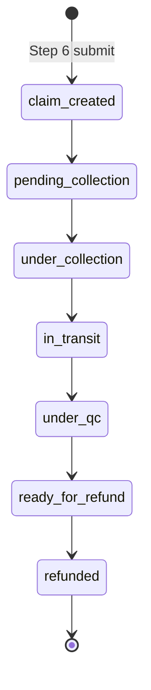
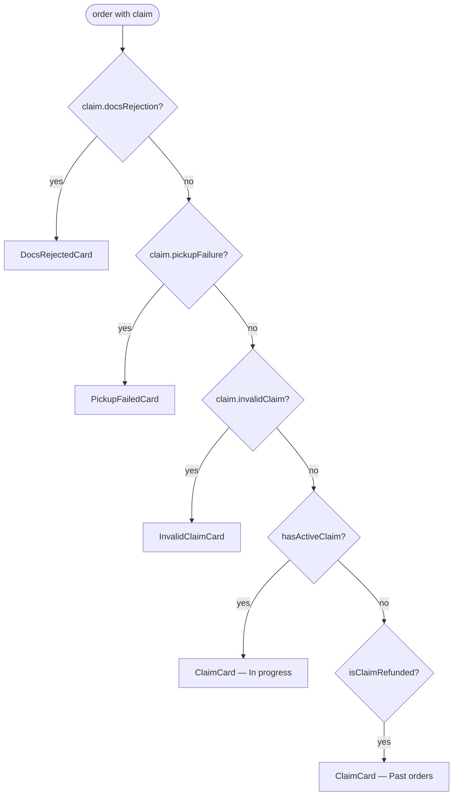
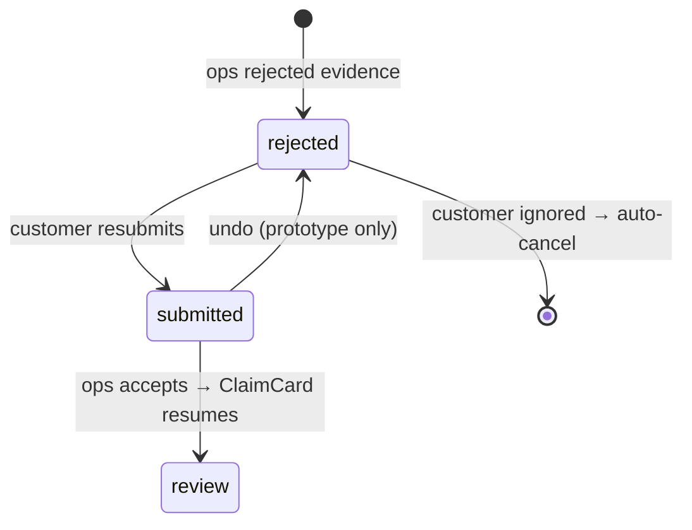
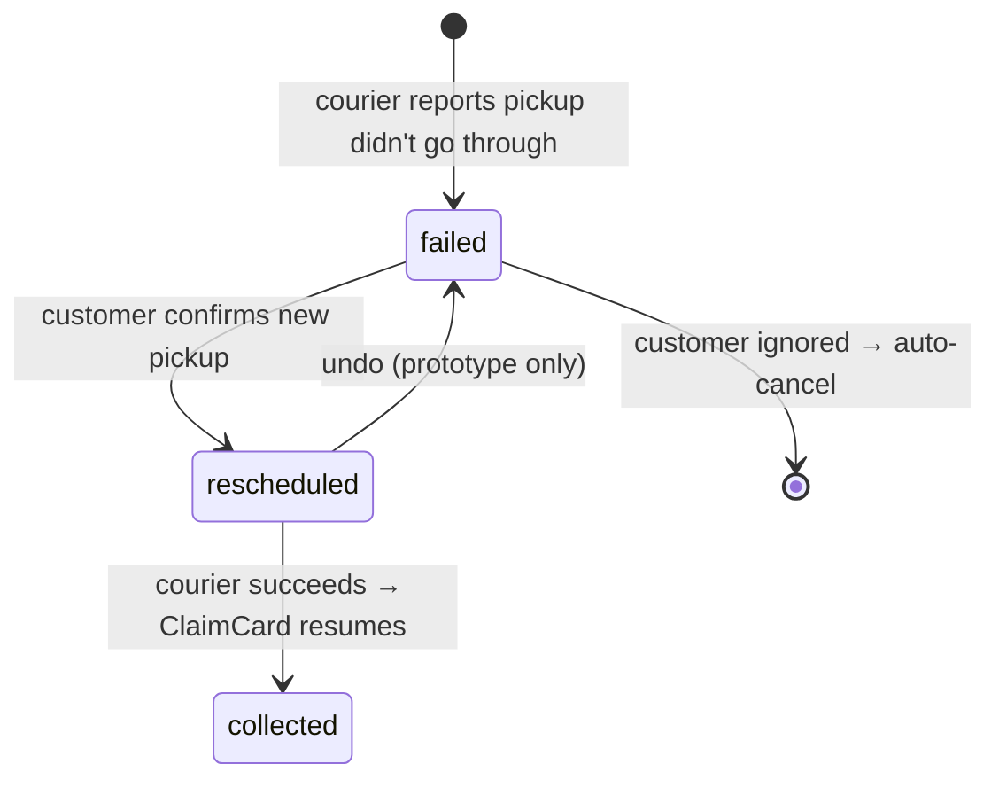
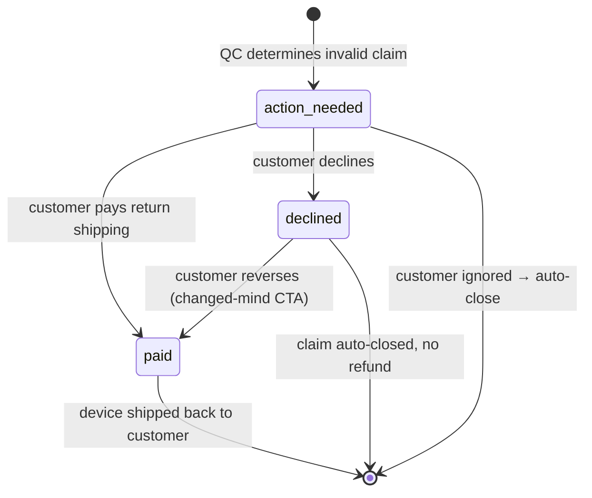

# Returns — Claim tracking

> Once a return claim is submitted, the customer's view of it lives on a new card type that replaces the delivered `PastOrderCard` for that order. This doc covers `ClaimCard` (the 7-state baseline) and the three takeover cards that supersede it when the claim is blocked on a single customer action: `DocsRejectedCard`, `PickupFailedCard`, `InvalidClaimCard`. Includes the canonical sub-status / action-gate / SLA reference tables (these were originally in `../claim_detailed_tracking.md`, which is now design history).

## 1. Overview

A submitted return enters a 7-state customer-facing pipeline:



The seven states live in `CLAIM_STATUSES` inside `src/lib/claims.js` — add, rename, or reorder steps there and the card picks them up.

`claim.subStatusId` (optional, see §4) carries finer-grained branching that hangs off these parents — `awaiting_documents` under `claim_created`, `collection_failed` under `pending_collection`, the `under_revision` / `expert_revision` / `invalid_confirmed` / `awaiting_payment` / `ship_back_*` chain under `under_qc`. Today the card only renders inline notes for `expert_revision`; the other sub-statuses drive the takeover-card routing in §3.

**Card routing precedence.** `App.jsx` checks claim takeovers before the baseline `ClaimCard` (see [../orders.md](../orders.md) §2). Order:



The three takeover cards replace `ClaimCard`'s surface while the claim is blocked on a single customer action and auto-cancel (or auto-close) if ignored. They share a structural pattern (danger-toned hero with an ops/courier/quality message → action gate → customer commits → card flips to a warn-toned "submitted" state with an undo affordance).

## 2. ClaimCard (baseline)

The card carrying any order with an `order.claim` field whose `claimStatusId !== 'refunded'` is **In progress**; refunded claims live in **Past orders**.

### 2.1 Tone progression

The card's left accent strip, state pill, hero block, and 7-step progress dots all share a tone driven by `claimToneFor(claimStatusId)`:

| `claimStatusId` | Tone | Rationale |
|---|---|---|
| `claim_created`, `pending_collection`, `under_collection`, `in_transit`, `under_qc` | **warn (amber)** | The unit is leaving the customer or undergoing verification — an unresolved state. |
| `ready_for_refund` | **brand (purple)** | The payout is being staged — same "active processing" tone the refund-hero card uses for `refund_pending`. |
| `refunded` | **success (green)** | Terminal — the money has moved. |

This piggybacks the existing `warn` / `brand` / `success` tokens — no new colour was added — and matches the convention `PastOrderCard` uses for its cancelled-past variants, so the language reads as one system.

### 2.2 Collapsed view

- Left accent strip (tone-driven).
- `Order · #{id}` eyebrow.
- State pill with the current status's `headline` and a tone-coloured dot (`Pending collection`, `Under Quality Check`, etc.).
- A tinted hero block carrying:
  - `Claim · {type}` eyebrow on the left (e.g. `Claim · Change of mind` / `Claim · Issue`).
  - Tone-coloured phase tag on the right — icon + label (`Submitted` / `Awaiting pickup` / `Collected` / `On the way` / `In review` / `Processing` / `Complete`).
  - Status headline as a `text-[22px]` headline in the tone colour.
  - Sub-line with `claim.claimRef` (tabular-nums) and the most recent timeline timestamp.
  - Separated by a faint divider: `Expected refund` (or `Refunded` once terminal) eyebrow + destination chip on the left and the net refund amount in `text-[22px]` tabular-nums on the right. The destination chip reuses the brand→accent gradient when wallet-bound (echoes the `GreetRow` credits pill) and a neutral chip when card-bound.
- A compact product row (image / name / variant / `Revibe Care +{currency} {amount}` line / total / chevron).

### 2.3 Expanded view

1. **Optional `ClaimActionBanner`** (`src/components/ClaimActionBanner.jsx`), rendered above the dot strip whenever `claim.actionRequired` is present. Warn-toned card with an alert glyph, headline, one-line body, deadline countdown copy (`claim.actionRequired.deadlineLabel`, e.g. "2 days left"), and a single primary CTA. Three gate kinds are wired today via `actionGateCopy()` in `src/lib/claims.js` — see §4.3. The CTA stops propagation so it doesn't toggle the card.
2. **Optional inline sub-status notes**, rendered directly above the dot strip when `claim.subStatusId === 'expert_revision'` — today the only sub-status the card surfaces this way. Two stacked rounded callouts:
   - A muted past-state `Reviewing seller's response` row (green check + day stamp derived from `claim.detailedTimeline.expert_revision.startedAt`).
   - A brand-tinted active `Expert inspection` row carrying the "Sent to our lab for a closer look. This step takes longer than usual." subline.
   Both copies pull from `SUB_STATUS_LABELS` in `src/lib/claims.js`. The notes are always visible (no disclosure), keeping the LAB sub-flow narrative at a glance rather than behind a tap.
3. **7-step horizontal dot timeline** using `CLAIM_STATUSES`. Reached/current dots are filled in the tone colour with the same `shadow-[0_0_0_4px_rgb(255,242,221)]` glow on the current step that `InProgressCard` uses for its top-level timeline. Each reached step renders its date and time on two lines below the label, sourced from `claim.timeline[step.id]`.
4. **`History` thread** (`HistoryThread`) — a compact `History · N earlier events` toggle (chevron-rotated) that is **collapsed by default**. Expanding it reveals a vertical, minimalistic timeline of the order's past events (Placed → Cancellation requested / rejected → Delivered → Evidence resubmitted) derived in `src/lib/events.js` via `getHistoryEvents(order, 'claim')`. Rows render chronologically with the latest at the bottom; tapping a row opens a tone-tinted detail panel below the timeline (one open at a time). The active claim is the hero, so it never appears as a row.
5. **Two-action footer:** `View claim details` (opens `ClaimDetailsSheet`) + icon-only `Download receipt` (decorative).

### 2.4 Claim details sheet

`ClaimDetailsSheet` (`src/components/ClaimDetailsSheet.jsx`) is a bottom sheet mirroring `RefundDetailsSheet`'s chrome (`bg-black/45` scrim, slide-up panel, `Escape` to close, body-scroll lock). Two cards:

- **Summary** — read-only set of choices captured during the returns flow: reason (mapped via `REASON_LABELS`; falls back to the free-text `otherText` when the user picked `Other`), units (e.g. `1 of 1`), device preparation (masked to `Factory reset confirmed` / `Credentials provided` — never plain credentials), pickup details broken out as three rows (`Pickup address`, `Pickup email`, `Pickup phone`), refund destination (wallet icon or card chip + `Includes 10% restocking fee` sub-copy when method is `original`), and `Submitted` timestamp.
- **Refund** — `Expected refund` (or `Refunded` once terminal) row with the net amount in `text-[18px]` tabular-nums. Original-payment refunds also show a small `Gross … · Restocking fee − …` line so the math is visible.

The summary content used to live inline inside the expanded card; it was pulled into the sheet so the expanded body stays focused on progress and the underlying order context, with the full breakdown one tap away.

### 2.5 Section placement

`hasActiveClaim(order)` returns true when an order has a `claim` field whose `claimStatusId !== 'refunded'`. Such orders are included in `isOpen` and surface in **In progress**, regardless of the underlying order's `statusId` (which stays `delivered`). `isClaimRefunded(order)` returns true for refunded claims; these surface in **Past orders**.

Filter counts reflect the same rules — an in-flight claim counts toward the `in_progress` chip and is excluded from `delivered`; a refunded claim counts toward `delivered` (the underlying order was delivered and the journey is complete). No new filter chip was added for claims.

### 2.6 Auto-expand

`ClaimCard` does not currently participate in `pickActiveOrderId`. Fulfilment in-flight orders win the auto-expand slot when both are present; claim cards collapse by default. If customer research shows users want their active claim opened on land, extend the rank function in `src/lib/statuses.js` to consider `claimProgressIndex` from `src/lib/claims.js`.

### 2.7 Source of truth

`src/lib/claims.js` owns:

- `CLAIM_STATUSES` — the 7-state list.
- `claimToneFor(claimStatusId)` — tone mapping.
- `claimProgressIndex` — auto-expand input (not yet wired into `pickActiveOrderId`).
- `claimPhaseTag(claimStatusId)` — phase tag icon + label.
- Headline + sub-line resolution.
- `SUB_STATUS_LABELS` — copy for sub-status inline notes.
- `CLAIM_SLAS` — SLA placeholders (used by the returns flow's Step 4 "What happens next" timeline).
- `actionGateCopy()` — banner copy for the three action gates.
- Summary-label maps: `REASON_LABELS`, `RETURN_METHOD_LABELS`, `reasonText`, `devicePrepText`, `refundMethodLabel`.
- `hasActiveClaim`, `isClaimRefunded`.

Edit copy or add a new claim state here, not in the components.

## 3. Takeover cards

When the claim is blocked on a single customer action, the card flips out of `ClaimCard` chrome into a dedicated takeover. All three follow the same structural pattern:

| Aspect | Pattern |
|---|---|
| Tone (initial) | danger red — the claim is blocked on the customer |
| Tone (post-commit) | warn amber for re-upload / reschedule (live, awaiting verdict); brand purple for paid-and-shipping (forward motion) |
| Hero | Eyebrow `Order · #{id} · Claim RET-{ref}` → `Action needed` pill → `Tap to fix` footer when collapsed |
| Ops message | Avatar + name + role + timestamp + free-text reason (expanded view) |
| Action gate | Single primary CTA, danger-red filled |
| Auto-resolve | `autoCancelAt` (or `autoCloseAt`) — claim auto-cancels/closes if ignored |
| Undo | Local component state, prototype only (replay-the-demo) |

### 3.1 DocsRejectedCard — faulty-product evidence re-upload

Trigger: `claim.docsRejection` is set. The Revibe Quality team has rejected the evidence batch attached to a faulty-product claim. Whole-batch rejection only — no per-document accept/reject. The customer has 3 days to re-upload before the claim auto-cancels.



**Collapsed (rejected state).** Danger-toned left accent strip; eyebrow as above; `Action needed` pill; tinted hero with `Documents rejected` label, headline `We need a few photos re-shot`, one-line truncated ops quote, countdown strip (`2 days, 14 hours left to re-upload · Claim auto-cancels {autoCancelAt}`); compact product row; `Tap to fix` footer.

**Expanded (rejected state).** Same hero but the ops message expands into a full attributed block (avatar with `opsName` initial, name + role, rejection timestamp, full free-text message). Below the header:

1. **`Your last attempt`** — collapsed row that opens a horizontal dimmed thumbnail strip of the previously submitted files, each tagged with the ops reason (`Glare` / `Blurry` / `Too short`) so the customer sees exactly which file was the problem.
2. **`Re-upload your evidence`** — single combined drop zone (no per-category split — ops rejects the whole batch). Taps append fake files; once at least one file is present, the zone becomes `Add more evidence` and a 3-column thumbnail grid renders with × to remove and a `+` tile.
3. **`Note for Revibe Quality`** — optional 280-char free-text textarea; counter goes amber past 90%.
4. **Footer** — `Cancel claim` (visual stub) + `Resubmit for review`. Resubmit is gated: shows `Add evidence to resubmit` in disabled grey until at least one file is added, then flips to a solid danger-red primary action.

**Submitted state.** Tapping `Resubmit` flips the card in place to a warn-toned variant: amber accent strip, pulsing `Back under review` pill, `Resubmitted` phase tag, `Thanks — we've got your new evidence` headline, body that recaps what the customer sent (3-col grid of the same thumbnails + the quoted note when one was written). Footer button — `Undo · edit before review starts` — returns to the rejected state with files and note preserved.

**After the claim moves on.** Once Quality has accepted the new evidence and the claim progresses (e.g., to `under_qc`), the order leaves `DocsRejectedCard` and returns to the regular `ClaimCard`. The resubmission survives as an `Evidence resubmitted` chip inside the `HistoryThread` — a one-line recap (`N new files sent · {date}`) rather than re-surfacing the rejected items or the original ops note. Driven by `claim.proofResubmission`.

### 3.2 PickupFailedCard — collection failed → reschedule

Trigger: `claim.pickupFailure` is set. The courier attempted the pickup and it didn't happen (no answer at the address, couldn't reach the customer, etc.). Same shape as docs-rejected — claim auto-cancels if the customer doesn't act before `autoCancelAt`.



**Collapsed (failed state).** Danger-toned left accent strip; eyebrow; `Action needed` pill; tinted hero with `Pickup failed` label, headline `Pickup didn't go through`, one-line truncated courier quote, countdown strip (`3 days, 18 hours left to reschedule · Claim auto-cancels {autoCancelAt}`); compact product row; `Tap to fix` footer.

**Expanded (failed state).** Same hero but the courier message expands into a full attributed block (avatar with `opsName` initial — typically the courier's first name). Below the header:

1. **`Pickup address`** — read-only confirmation card showing the saved pickup address + phone + email from `claim.pickupDetails`. A stub `Edit` link is wired but inert. The product decision is "address confirm only" — no slot picker, no note field — so the intent is to give the customer a chance to verify the address before re-dispatching.
2. **Confirm summary line** — single sentence preview of what confirming creates: courier + scheduled slot (driven by `claim.pickupFailure.nextPickup`).
3. **Footer** — `Cancel claim` (visual stub) + `Confirm new pickup` (solid danger-red primary action). Confirm is always enabled; the confirmation step itself is the gate.

**Submitted state.** Tapping `Confirm new pickup` flips the card to a warn-toned variant: amber accent strip, pulsing `Pickup rescheduled` pill, `New AWB created` phase tag, `Your new pickup is on the way` headline, body that names the courier + slot + new AWB. Expanded shows a `Your new pickup` summary block (courier, AWB, slot, pickup-from address) followed by an `Undo · replay the demo` button.

In production rescheduling is committal once a new AWB is issued (rolling it back would require a courier cancellation); the undo is demo-only so reviewers can replay the confirmation flow without reloading the page.

**After the claim moves on.** Once the courier successfully collects under the new AWB and the claim moves to `under_collection`, the order leaves `PickupFailedCard` and returns to the regular `ClaimCard`. In production the `claim.pickupFailure` block would clear and the courier success event would surface through the existing claim timeline; no separate history-thread chip is introduced for the failed-then-rescheduled chapter at this stage.

### 3.3 InvalidClaimCard — inspection invalid → pay return shipping

Trigger: `claim.invalidClaim` is set. The QC team inspected the claimed device and couldn't reproduce the issue (or the device is within spec). The customer must pay return shipping to get the device back. Same takeover shape as the others, but with three internal demo states (`action_needed` → `paid` or `declined`) toggled by the CTAs and a reversal flow.



None of the transitions persist across re-renders or unmounts.

**Collapsed (action_needed).** Danger-toned left accent strip; eyebrow; `Action needed` pill; tinted hero with `Return claim` label, `Inspection complete` right-align phase tag (ShieldX glyph), headline `Claim couldn't be approved`, one-line truncated quote from Revibe Quality, countdown strip (`3 days, 8 hours left to pay return shipping · Claim auto-closes {autoCancelAt}`); compact product row; `Tap to fix` footer.

**Expanded (action_needed).** Same hero but the quality message expands into a full attributed block. Below the header:

1. **Return shipping fee card** — single-row read-only summary showing the fee amount (`{currency} {amount}`) on the right and the `Return shipping fee` eyebrow on the left. Intentionally minimal — the address moved out of this card so each block has one job.
2. **Delivery details card** — address + phone + email block carrying the saved values from `claim.pickupDetails`. Read-only by default; when the customer taps the `Change delivery details` button below it, the card flips into an inline edit mode (three input fields stacked with Save / Cancel beneath). Save commits the next values back to local component state and exits edit mode; Cancel discards the draft. Local state only — the change does not propagate back to the order data.
3. **`Change delivery details` button** — solid border-brand outline, Settings2 glyph, copy and chrome borrowed from `InProgressCard`'s "Change details". Hidden while the delivery-details card is in edit mode.
4. **Footer** — `Decline` (secondary outline) + `Pay {currency} {amount}` (solid danger-red primary action with CreditCard glyph). The two actions are mutually exclusive — both flip the card into a different terminal state.

**Paid state.** Tapping `Pay` flips the card to a brand-toned fresh-order-style trajectory. The chrome borrows `InProgressCard`'s family deliberately — once the customer has committed, the return leg should read as a normal forward shipment, not a continuation of a problem flow:

- Eyebrow rewrites to `Order · #{id} · Return from Claim RET-{ref}` so lineage stays visible.
- State pill becomes a brand-toned `Return shipment` (Truck glyph).
- Hero is the gradient brand-bg / brand-bg2 block from `InProgressCard`, carrying `Delivery by` + the estimated delivery date + an `On track` phase tag, with the same `Delivering to · Home` chip beneath.
- Expanded body renders a 4-step horizontal dot timeline (Placed → Quality Check → Shipped → Delivered) driven by `claim.invalidClaim.returnShipment.timeline` keyed on the standard `STATUSES` ids. A small brand-tinted heads-up strip names the claim ref and reminds the customer no refund will be issued.

**Declined state.** Tapping `Decline` flips the card to a muted neutral-toned terminal:

- Muted-foreground left accent strip, `Claim closed` pill (ClipboardList glyph), `No refund issued` right-align tag.
- Hero: `Claim closed — device not returned` with a one-line explanation that the inspection didn't confirm the issue and the customer declined to cover return shipping.
- Expanded body: a warn-toned reversal block headlined `Still want your device back?` with the copy-locked CTA `I changed my mind and will pay for the shipment fee` (CreditCard glyph). The verbatim string is fixed by product. Tapping it flips the card into the paid state.

Both terminal branches expose an `Undo · replay the demo` button below the action area.

### 3.4 Relationship to `ClaimActionBanner`

Phase 30 (PickupFailedCard) and phase 32 (InvalidClaimCard) migrated their gates onto dedicated takeover cards. The inline `ClaimActionBanner` code path remains wired and is still the surface for `awaiting_documents` (Issue flow only) and any future claim that sets `actionRequired` without a dedicated takeover card. The `collection_failed` and `awaiting_payment` branches in `actionGateCopy()` are retained for completeness but effectively dormant — no current mock claim exercises them through the inline banner.

## 4. Sub-status & action-gate reference

These tables are the canonical reference for sub-status copy, action-gate behaviour, and SLA placeholders. Design history (the deprecated `Show detailed tracking` disclosure pattern and its rationale) lives in [`../claim_detailed_tracking.md`](../claim_detailed_tracking.md).

### 4.1 Sub-status enum (`claim.subStatusId`)

| `subStatusId` | Parent (`claimStatusId`) | Applies to | Operational flow node |
|---|---|---|---|
| `awaiting_documents` | `claim_created` | Issue only | issue n6 / n7 |
| `collection_failed` | `pending_collection` | Both | issue n18 / com n20, n30 |
| `under_revision` | `under_qc` | Both | issue n31 / com n43, n72 |
| `expert_revision` | `under_qc` | Issue + CoM UAE/Other | issue n33–n39 / com n45–n51 |
| `invalid_confirmed` | `under_qc` | Both | issue n41 / com n53 |
| `awaiting_payment` | `under_qc` | Both (post-invalid) | issue n42 / com n54 |
| `ship_back_pending` | `under_qc` | Both (post-payment) | issue n45 / com n57, n76 |
| `ship_back_in_transit` | `under_qc` | Both | issue n49–n51 / com n59–n61, n79 |
| `ship_back_delivered` | `under_qc` | Both — terminal for invalid | issue n53 / com n63, n81 |

The ship-back chain hangs off `under_qc` rather than `ready_for_refund`, because in an invalid-claim outcome the claim never reaches `ready_for_refund` — the parent strip arrests at `under_qc` and the resolution is communicated through `InvalidClaimCard` rather than extending `CLAIM_STATUSES`.

### 4.2 Sub-status copy catalog (`SUB_STATUS_LABELS`)

| `subStatusId` | Headline | Subline | Tone |
|---|---|---|---|
| `awaiting_documents` | More info needed | "Revibe Quality asked for a clearer photo / longer video." | warn |
| `collection_failed` | Pickup didn't go through | "We couldn't collect on {date}." | warn |
| `under_revision` | Reviewing seller's response | "Our team is double-checking the seller's notes." | brand |
| `expert_revision` | Expert inspection | "Sent to our lab for a closer look. This step takes longer than usual." | brand |
| `invalid_confirmed` | Claim couldn't be approved | "Inspection didn't confirm the issue you reported." | warn |
| `awaiting_payment` | Payment needed to return device | "Cover return shipping to get your device back." | warn |
| `ship_back_pending` | Preparing to send your device back | "Arranging a courier — should be on the way in a day or two." | brand |
| `ship_back_in_transit` | Your device is on the way back | "Tracking will appear here once the courier scans it in." | brand |
| `ship_back_delivered` | Device returned | "Delivered on {date}." | success |

All copy is customer-facing — internal (IS) labels never appear in the UI.

### 4.3 Action gates (`actionGateCopy`)

Three gates total. Each fires a promoted banner above the dot strip (inline) or routes to a dedicated takeover card.

| Gate (`kind`) | Surface | Banner headline | Body | Deadline | Primary CTA | Secondary |
|---|---|---|---|---|---|---|
| `awaiting_documents` | Inline `ClaimActionBanner` | Action needed — documents requested | "{opsName} from Revibe Quality has asked for a clearer photo / longer video." | "Reply by {deadline} or the claim will close automatically." | Reply with documents | Close claim |
| `collection_failed` | Inline banner (dormant) **or** `PickupFailedCard` takeover | Action needed — pickup didn't go through | "Our courier couldn't pick up your device on {failedAt}." | "Confirm by {deadline} or the claim will close automatically." | Schedule new pickup | Cancel claim |
| `awaiting_payment` | Inline banner (dormant) **or** `InvalidClaimCard` takeover | Action needed — return shipping payment | "Your claim couldn't be approved after inspection. Cover the return shipping fee to get your device sent back." | "Pay by {deadline} or your device will not be returned." | Pay return shipping | Discuss with support |

The deadline label uses the prototype convention from `claim.docsRejection.timeLeftLabel` ("2 days, 14 hours left") for consistency across all three gates.

### 4.4 SLA placeholders (`CLAIM_SLAS`)

Lives in `src/lib/claims.js`. Drives the returns flow's Step 4 "What happens next" timeline. **Placeholder values — ops to revise.**

| Step | `expectedHours` | `bufferHours` | Notes |
|---|---|---|---|
| `claim_created` → `pending_collection` | 1h | 4h | Routing is automated for change-of-mind; Issue may pause at `awaiting_documents`. |
| `awaiting_documents` | 48h | 48h | Customer-action gate; deadline comes from `actionRequired.deadline`, not SLA. |
| `pending_collection` → `under_collection` | 24h | 24h | Courier pickup scheduling. |
| `collection_failed` | n/a | n/a | Customer-action gate; SLA replaced by `actionRequired.deadline`. |
| `under_collection` → `in_transit` | 12h | 12h | Same-day handoff to courier. |
| `in_transit` → `under_qc` | 48h | 48h | Placeholder. Country-aware SLAs deferred. |
| `under_qc` → `ready_for_refund` | 48h | 48h | Happy-path inspection. |
| `under_revision` | 48h | 48h | Agent reviewing seller's invalid-claim proof. |
| `expert_revision` | 120h | 72h | LAB sub-flow — explicitly longer; customers should expect it. |
| `awaiting_payment` | n/a | n/a | Customer-action gate. |
| `ship_back_pending` → `ship_back_in_transit` | 48h | 24h | After payment received. |
| `ship_back_in_transit` → `ship_back_delivered` | 72h | 48h | Final leg. |
| `ready_for_refund` → `refunded` | 24h | 24h | Automated refund posting. |

Track current actuals before promoting these to production.

## 5. Data model — `claim` object

Optional object populated on a delivered order to drive `ClaimCard` and its takeover variants. Production will write this object when the returns flow's Step 6 submit is wired; today four orders carry hand-seeded claims: `89815` (`under_qc` with a rejected cancellation in history, In progress), `89200` (`refunded` with a rejected cancellation in history, Past orders), `89762` (`under_qc` + `expert_revision`, Issue flow, In progress). Plus takeover-card mocks: `89734` (DocsRejected), `89876` (PickupFailed), `89940` (InvalidClaim).

### 5.1 Core claim fields

| Field | Type | Notes |
|---|---|---|
| `claim.claimRef` | string | `RET-XXXXXXXX` shown on the card hero and details sheet. Generated by `generateClaimRef()` in `src/lib/returns.js`. |
| `claim.claimStatusId` | enum | One of `claim_created`, `pending_collection`, `under_collection`, `in_transit`, `under_qc`, `ready_for_refund`, `refunded`. Drives tone, hero copy, progress dot index, and section routing. |
| `claim.type` | `'change_of_mind' | 'issue'` | Drives the `Claim type` row in `ClaimDetailsSheet`, the hero eyebrow on `ClaimCard` (`Claim · Change of mind` / `Claim · Issue`), and the label chip on Step 7. |
| `claim.submittedAt` | string | Human-readable timestamp for the `Submitted` row in `ClaimDetailsSheet`. |
| `claim.units` | integer | Today the returns flow always submits `1`. Kept as an integer for multi-unit future. |
| `claim.reason` *(change-of-mind only)* | `{ value, otherText }` | `value` is one of the keys of `REASON_LABELS`; `otherText` populated only when `value === 'other'`. |
| `claim.issueDetails` *(issue only)* | `{ category, description, attachmentName }` | `category` is the sub-issue id; `description` is the customer's free-text; `attachmentName` is a stub filename today. |
| `claim.devicePrep` | `{ option, os }` | `option` is `'reset'` or `'credentials'` and `os` is `'ios'` or `'android'`. Surfaced as masked `Factory reset confirmed` / `Credentials provided`; raw credentials intentionally not persisted. |
| `claim.pickupDetails` | `{ address, email, phone }` | Three contact fields captured at Step 4. |
| `claim.refundMethod` | `'wallet' | 'original'` | Drives the destination chip and the `Includes 10% restocking fee` sub-copy when `original`. |
| `claim.expectedRefund` | `{ gross, fee, bonus, net, rate }` | Pre-computed at submission so the card doesn't re-run `refundBreakdown` on every render. `net` is what the hero displays. `bonus` is the optional Wallet bonus on issue claims (AED 100); `0` elsewhere. |
| `claim.timeline` | map keyed by `claimStatusId` | Timestamp at which the claim entered each phase. Populated progressively. |

### 5.2 Sub-status & detailed-timeline fields

| Field | Type | Notes |
|---|---|---|
| `claim.subStatusId` *(optional)* | enum | See §4.1. Today `ClaimCard` only acts on it for `expert_revision`. |
| `claim.detailedTimeline` *(optional)* | map | Keyed by either a main `claimStatusId` or a `subStatusId`, with `{ startedAt }` per entry. Today only `claim.detailedTimeline.expert_revision.startedAt` is read — `ClaimCard` uses it as the completion timestamp of the past `Reviewing seller's response` callout. |
| `claim.actionRequired` *(optional)* | `{ kind, deadline, deadlineLabel, failedAt? }` | Drives the inline `ClaimActionBanner`. `kind` is one of `awaiting_documents`, `collection_failed`, `awaiting_payment`; `deadlineLabel` is the hand-written countdown ("2 days left"); `failedAt` is the pickup-failure timestamp used by the `collection_failed` body. |

### 5.3 Takeover-card extensions

Each of these, when set, routes the order to its dedicated takeover card. They mirror each other structurally.

| Field | Type | Routes to |
|---|---|---|
| `claim.docsRejection` | `{ rejectedAt, autoCancelAt, timeLeftLabel, opsName, opsRole, opsMessage, previous }` | `DocsRejectedCard` |
| `claim.pickupFailure` | `{ failedAt, autoCancelAt, timeLeftLabel, opsName, opsRole, opsMessage, nextPickup: { awb, slot, courier } }` | `PickupFailedCard` |
| `claim.invalidClaim` | `{ determinedAt, autoCancelAt, timeLeftLabel, opsName, opsRole, opsMessage, returnShipping: { amount, currency }, returnShipment: { courier, estimatedDelivery, estimatedDeliveryLong, currentStatusId, timeline } }` | `InvalidClaimCard` |
| `claim.proofResubmission` | `{ at, fileCount }` | History chip on `ClaimCard` after the rejection chapter closes |

**Common subfields across takeovers:**

- `rejectedAt` / `failedAt` / `determinedAt` — human-readable timestamp of the triggering event.
- `autoCancelAt` — human-readable timestamp at which the claim auto-cancels (or auto-closes for `invalidClaim`).
- `timeLeftLabel` — hand-written countdown copy ("2 days, 14 hours left"). Production should compute this from the trigger + a policy window (`rejectedAt + 72h`, `failedAt + 96h`, `determinedAt + 168h`).
- `opsName` / `opsRole` / `opsMessage` — free-text block displayed in the hero. The avatar uses `opsName`'s initial.

**Takeover-specific subfields:**

| Subfield | Used by | Notes |
|---|---|---|
| `docsRejection.previous` | DocsRejectedCard | Array of `{ name, size, kind, duration?, tag? }` — `tag` is the per-file ops reason ("Glare" / "Too short") that renders as a red ribbon. |
| `pickupFailure.nextPickup.{awb, slot, courier}` | PickupFailedCard | Hand-written; echoed back on the confirmation state. |
| `invalidClaim.returnShipping.{amount, currency}` | InvalidClaimCard | Carried on the fee card + primary CTA label. |
| `invalidClaim.returnShipment.{currentStatusId, timeline}` | InvalidClaimCard (paid state) | `currentStatusId` is one of the `STATUSES` ids (`created` / `quality_check` / `shipped` / `delivered`); `timeline` is the corresponding map. Drives the 4-step horizontal dot timeline on the paid trajectory. |
| `invalidClaim.returnShipment.{estimatedDelivery, estimatedDeliveryLong}` | InvalidClaimCard (paid state) | Populates the brand-tone ETA hero. |

`order.country` *(optional, default `'AE'`)* sits at the top level of the order, not inside `claim`. Today no UI branches on it; kept on claim-carrying orders for future country-aware behaviour (the ZA/SA repair-partner track on change of mind, etc.).

## 6. UX decisions

**Tone shift from danger to warn/brand on commit is the same across all three takeovers.** The danger red while blocked → warn amber once the customer's action is in flight (DocsRejected: resubmitted, PickupFailed: rescheduled) or brand purple once the return is committed and forward-moving (InvalidClaim: paid). Same convention `ClaimCard` uses (warn = active processing, brand = the system is doing the work).

**Takeover cards instead of an ever-longer status enum.** Earlier drafts considered adding `evidence_rejected`, `pickup_failed`, `invalid_paid`, etc. to `CLAIM_STATUSES`. That would have stretched the 7-dot strip beyond what fits on 430px and conflated "happy-path progress" with "we need you to do something". Takeover cards keep the dot strip stable and put the action-required state on its own card surface.

**`InvalidClaimCard` paid-state borrows `InProgressCard` chrome.** Once the customer has paid for the return shipment, the leg should read as a normal forward shipment — the same chrome family they recognise for fresh orders. Hiding the lineage (eyebrow `Order · #{id} · Return from Claim RET-{ref}`) is intentional but the eyebrow preserves the link back to the originating claim.

**Inline sub-status notes (today: `expert_revision` only) replaced a `Show detailed tracking` disclosure.** Earlier iterations rendered a vertical sub-step timeline behind a tap. We removed the disclosure when usage data showed customers rarely opened it; surfacing the two adjacent sub-statuses (past `under_revision` + active `expert_revision`) above the dot strip carries the LAB-sub-flow narrative at a glance.

**`History` thread collapsed by default.** The chronological event trace adds depth but isn't where the customer's attention lands first. Keeping it collapsed under a `History · N earlier events` toggle preserves space for the active state.

**Whole-batch evidence rejection, not per-document.** `DocsRejectedCard` exposes a single drop zone, not per-category slots. Ops couldn't reliably partial-accept evidence in practice — either the batch was complete or it wasn't.

**Confirm-only flow for `PickupFailedCard`, no slot picker.** Earlier drafts let the customer pick a new pickup slot. Removed because dispatchers wanted to assign slots themselves; the customer's job is to confirm the address looks right.

**`Decline` + `Pay` on `InvalidClaimCard` are intentionally side-by-side, equal weight visually.** The red filled CTA on `Pay` carries the urgency, but `Decline` is a real choice with its own terminal state — not a "Cancel" button.

## 7. Component map

```
src/
├── lib/
│   ├── claims.js                         CLAIM_STATUSES, claimToneFor, claimProgressIndex, claimPhaseTag,
│   │                                     SUB_STATUS_LABELS, CLAIM_SLAS, actionGateCopy,
│   │                                     REASON_LABELS, RETURN_METHOD_LABELS, reasonText, devicePrepText, refundMethodLabel,
│   │                                     hasActiveClaim, isClaimRefunded
│   └── events.js                         getHistoryEvents(order, 'claim') — builds the HistoryThread events
└── components/
    ├── ClaimCard.jsx                     7-state baseline expandable card; also hosts the SubStatusNote helper
    ├── ClaimActionBanner.jsx             Inline warn banner above the dot strip when `claim.actionRequired` is set
    ├── ClaimDetailsSheet.jsx             Bottom sheet opened by ClaimCard's `View claim details` — Summary + Refund cards
    ├── DocsRejectedCard.jsx              Takeover: customer must re-upload faulty-product evidence
    ├── PickupFailedCard.jsx              Takeover: customer must confirm a new pickup
    ├── InvalidClaimCard.jsx              Takeover: customer must pay return shipping after invalid inspection
    └── HistoryThread.jsx                 Compact chip thread for past events on layered cards
```

`App.jsx` carries the routing precedence (see §1).

## 8. Mocked vs production

- **Step 7 of `ClaimFlow` doesn't persist.** Submitting a return through the flow generates a `RET-XXXXXXXX` and advances to Step 7, but does not write back to the order. The mock claims on the demo orders are hand-seeded.
- **`View claim details` and icon-only `Download receipt`** on `ClaimCard` are decorative.
- **`Cancel claim`** — no in-flight cancellation affordance exists for a submitted return. The buttons inside `DocsRejectedCard` / `PickupFailedCard` are visual stubs.
- **Webhook / polling for state progression.** Production needs a mechanism to move the claim through the 7 states as the warehouse handles the unit; today `claim.claimStatusId` is a static field on the mock data.
- **DocsRejectedCard.** File picker is a fake-files cycle, countdown label is hand-written, `Resubmit` doesn't persist (warn state is local component state only), no notification + email trigger.
- **PickupFailedCard.** `Edit` link on the pickup-address card is decorative, new AWB / slot are hand-written rather than generated, `Confirm` doesn't persist.
- **InvalidClaimCard.** Delivery-details edit mode does not persist or revalidate, fee amount is a flat placeholder rather than a real shipping quote, `Pay` doesn't open a real payment sheet, auto-close countdown is hand-written.
- **SLA placeholders.** `CLAIM_SLAS` values are hand-guessed; ops to revise.
- **`order.country` is unused.** No UI branches on it; future country-aware behaviour will need it.

## 9. Open questions

- **Generalising the inline-notes gate.** Today the trigger is hardcoded to `subStatusId === 'expert_revision'`. Other QC sub-statuses with a non-trivial customer narrative (e.g. `ship_back_pending` / `ship_back_in_transit` showing return shipping after an invalid claim) would benefit from the same treatment but need their own data-shape additions (e.g. a `ship_back` tracking link or AWB).
- **Delayed-without-deviation surfacing.** A claim that's late on a happy-path step (e.g. `in_transit` past expected + buffer) currently has no visible signal. Likely follow-up: a small delayed badge on the active dot in the horizontal strip, or a delayed subline on the hero.
- **`DocsRejectedCard` vs `awaiting_documents`.** They cover the same operational state. Three options: (a) keep both, route by `claim.docsRejection` presence; (b) deprecate `DocsRejectedCard` and route everything through `ClaimCard` + `subStatusId: awaiting_documents` + `actionRequired`; (c) merge `claim.docsRejection` into `actionRequired`. Decision deferred — current scope keeps both. Recommended path is (b) once the new flow is validated.
- **Telemetry hooks.** Production should fire events when (i) an action gate banner / takeover is shown, (ii) an action gate CTA is tapped.
- **Auto-expand for active claims.** Extend `pickActiveOrderId` to consider `claimProgressIndex` if research shows customers want their active claim opened on land.
- **Filter chip for claims.** No new filter chip was added for claims — they count toward `in_progress` while active, `delivered` when refunded. Revisit when more than one or two claim cards routinely show at once.
- **Country-aware transit SLAs.** `in_transit` SLA likely differs domestic vs international. Deferred for the prototype.
