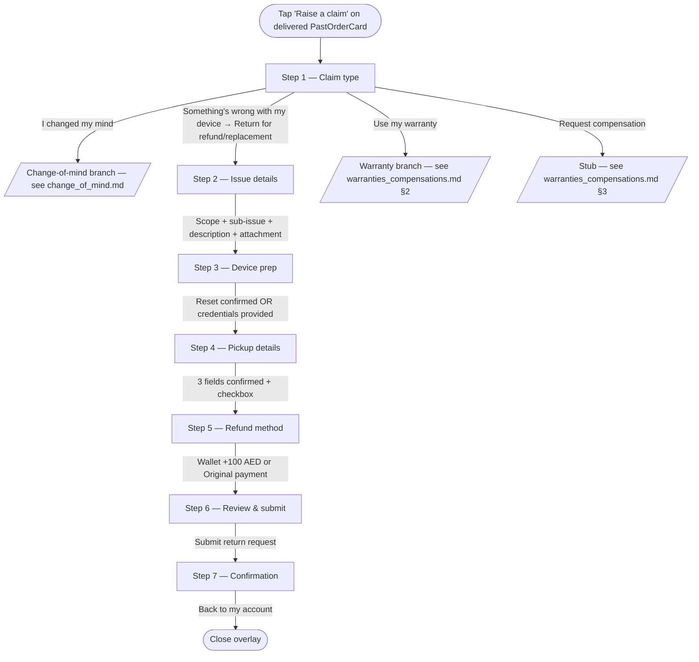

# Returns — Issue & Wrong device

> Customer-facing UI of the faulty-product return branch, launched from `Raise a claim` → `Something's wrong with my device` → `Return for a refund or replacement` on a delivered `PastOrderCard`. Covers Steps 1 (shared), 2 (issue branch), and 3–7 (shared with change-of-mind). The operational state machine (drawio transcription — single repair-supplier path, country-aware AWB creation, LAB sub-flow) is documented separately in [`../../input/return_flow_issue.md`](../../input/return_flow_issue.md). Once submitted, the return appears on the customer's list as a `ClaimCard` — see [claim_tracking.md](./claim_tracking.md).

## 1. Overview

The issue branch is the entry point used when something is wrong with the delivered device — defect, wrong unit, doesn't work as described, etc. From the customer's perspective:

- Eligible for 10 days after delivery (same window as change of mind).
- The device is picked up by courier from the saved delivery address.
- Refund options: net amount + **AED 100 bonus** to **Revibe Wallet** (instant once return is complete), or full net to **original payment method** (5–10 business days). No restocking fee on either path.
- Revibe Care is refunded on top.

Distinguishing characteristics vs change of mind:

- Step 2 collects required structured evidence (sub-issue from a two-scope picker, free-text description, attachment) instead of an optional reason.
- No restocking fee on the original-payment path.
- A flat AED 100 Wallet bonus (`ISSUE_WALLET_BONUS`) is added on the Wallet path — the implicit framing is "we owe you because something went wrong, and we'd like you to stay in the ecosystem".
- The operational flow has a single repair-supplier route (Original supplier) regardless of country, vs change-of-mind's three-way country split.

The flow chrome (white surface, segmented progress, sticky action bar, only-filled-button = Continue) is shared with change of mind. See [change_of_mind.md](./change_of_mind.md) §1 for the visual language rationale.

## 2. UI flow



### 2.1 Step 1 — Claim type (shared)

See [change_of_mind.md](./change_of_mind.md) §2.2. The issue branch is reached via:

`Something's wrong with my device` → expands inline accordion → `Return for a refund or replacement` → `claimType: 'issue'`.

### 2.2 Step 2 — Issue details (issue branch, required)

A required structured-evidence form. `Skip` is hidden; `canAdvance` requires `issueSubtypeId` + non-empty description + a stubbed filename.

**Two-scope sub-issue picker.** Sourced from `src/components/ClaimFlow/issueSubtypes.js`:

| Scope | Sub-issues (count) |
|---|---|
| `Device not working as expected` | 15 items (battery, software, physical, screen, charger, overheating, camera, etc.) |
| `I received the wrong device` | 4 items |

Scopes are mutually exclusive expandable sections; tapping a sub-issue commits the selection (`issueScope` + `issueSubtypeId`) and collapses the picker down to just the chosen row + its guidance panel:

- Optional `Try this first` preflight tip (e.g. "Have you tried a soft reset?").
- One-line `What we need` evidence ask (e.g. "A 30-second video showing the issue").
- A shared `How to provide valid proof` link.

The selected row carries an `X` button that clears the selection and reopens the picker on the same scope so the user can pick again.

**Description and attachment.** Below the picker:

- A required free-text description (500-char max).
- A **fake** attachment slot — clicking the dashed drop-zone stubs in a filename; the prototype has no real file picker.
- A warn-tinted banner reinforces that attachments are required.

The pre-redesign flat `category` field is gone; `Step6Review`'s `IssueSummary` consumes `issueSubtypeId` (via `findSubtype(id)` in `issueSubtypes.js`) and `issueScope`.

### 2.3 Steps 3 & 4 — Device prep + pickup (shared)

Identical to the change-of-mind branch. See [change_of_mind.md](./change_of_mind.md) §2.4–2.5.

### 2.4 Step 5 — Refund method (shared chrome, issue math)

Two stacked refund cards built off `refundBreakdown(order, units, method, 'issue')`. Chrome is identical to the change-of-mind Step 5; only the math and secondary copy diverge.

- **Wallet card.** Net amount (= `gross + AED 100 bonus`) + an accent-tinted `+AED 100 bonus` chip + tagline `Full refund + bonus · instantly once return is complete`.
- **Original-payment card.** Full net (no fee), no breakdown table, tagline `Full refund · 5–10 business days once return is complete`. Card label uses `order.paymentMethod.brand` + `last4`.

### 2.5 Step 6 — Review & submit (shared)

Sectioned summary. Issue-specific section:

- **Issue** — category label (resolved via `findSubtype(id)` against `issueSubtypes.js`) + description + attachment chip.

Shared sections: Device prep (masked to `Factory reset confirmed` / `Credentials provided`), Pickup, Refund.

The refund block surfaces the final net + an explanatory line: `Includes AED 100 bonus` (accent tone) for Wallet, or no extra line for Original payment.

A **packing confirmation** checkbox card gates `canAdvance`. Copy is the issue variant: it merges packing with the "necessary testing" acknowledgement (replacing an earlier double-checkbox bug where ticking "I have *not* done the testing" still let the form submit). The sticky bar swaps `Continue` for a success-tone `Submit return request`.

### 2.6 Step 7 — Confirmation (shared)

Same as change of mind. See [change_of_mind.md](./change_of_mind.md) §2.8.

## 3. Eligibility & refund math

### 3.1 Eligibility

Identical to change of mind. See [change_of_mind.md](./change_of_mind.md) §3.1 for the full decision tree (`eligibilityFor(order, today)` in `src/lib/returns.js`).

### 3.2 Refund math (`refundBreakdown(order, units, method, 'issue')`)

| Step | Formula |
|---|---|
| `unitPrice` | `order.unitPrice` (falls back to `subtotal`, then `total`) |
| `itemTotal` | `unitPrice * units` |
| `warranty` | `order.warranty ?? 0` |
| `gross` | `itemTotal + warranty` |
| **Wallet** | `fee = 0`, `bonus = ISSUE_WALLET_BONUS` (flat AED 100), `net = gross + bonus` |
| **Original payment** | `fee = 0`, `bonus = 0`, `net = gross` |

`bonus` is always present in the return shape (0 when not applicable) so consumers don't need null-guards. Step 5 reads `bonus` to render the `+AED 100 bonus` chip and Step 6 reads it for the `Includes AED 100 bonus` explanatory line.

`ISSUE_WALLET_BONUS` is a constant in `src/lib/returns.js`; the value is currency-agnostic and could grow into a per-order amount sourced from the backend.

## 4. Operational flow (backend / agent / supplier)

The customer-facing UI above stops at submission. Backend state — agent intake review, country-aware AWB creation, collection / QC / LAB sub-flow, refund chain — is described in the operational flow doc.

→ [`../../input/return_flow_issue.md`](../../input/return_flow_issue.md)

That doc carries:

- Mermaid diagrams of the full state machine (intake → agent review → country-aware AWB creation → collection → seller-decision → LAB invalid-claim sub-flow → ship-back chain → refund chain).
- Single repair-supplier path (`Original supplier`) — distinguishing factor vs change of mind.
- Country split on AWB creation: UAE/Others → auto by Revibe; SA → seller manually inputs.
- IS (internal) vs ES (customer-facing) state catalog.
- Decision points and their branches.
- Source-doc ambiguities preserved verbatim.

How the customer-facing UI surfaces backend state:

- **Agent intake review** (`Information complete?` decision in the ops doc — n4). When the agent flags missing documents, `claim.subStatusId` becomes `awaiting_documents` and an inline `ClaimActionBanner` fires on `ClaimCard`. See [claim_tracking.md](./claim_tracking.md) §4. The `DocsRejectedCard` takeover is the equivalent surface when ops rejects an *initial* evidence batch — see [claim_tracking.md](./claim_tracking.md) §3.1.
- **Collection failed.** `claim.pickupFailure` triggers the `PickupFailedCard` takeover. See [claim_tracking.md](./claim_tracking.md) §3.2.
- **LAB invalid-claim sub-flow** (ops nodes n33–n39). Tracked via `claim.subStatusId === 'expert_revision'`; not currently surfaced inline on `ClaimCard` — the long wait is implicit in the parent `qc` step.
- **Invalid claim confirmed + customer must pay return shipping.** `claim.invalidClaim` triggers the `InvalidClaimCard` takeover. See [claim_tracking.md](./claim_tracking.md) §3.3.

## 5. UX decisions

**Two-scope picker, not a flat list.** Earlier drafts had a single 19-item list of sub-issues. Splitting into `Device not working as expected` (15) and `I received the wrong device` (4) reduced perceived overwhelm — most customers can predict which scope their issue lives in and only need to scan ~15 items, not 19. It also creates a natural place to attach scope-specific guidance later.

**Per-sub-issue guidance, not a generic ask.** Once a sub-issue is picked, the panel shows what evidence is needed *for that specific issue* (`What we need` line). Generic asks ("Please provide photo evidence") got ignored. Specific asks ("A 30-second video showing the battery draining…") get followed.

**Attachment is required, no submit without it.** Earlier drafts let the customer submit without a file. Ops spent half their time chasing customers for evidence. The required attachment is enforced in `canAdvance` and reinforced by the warn-tinted banner above the slot.

**No restocking fee on the original-payment path.** The customer didn't choose to return — the seller messed up. Charging a fee felt like punishing the customer for a Revibe-side problem.

**AED 100 bonus on Wallet, not "double the bonus on original payment".** Earlier drafts had a sliding bonus that doubled when the customer chose Wallet. The clean +100 framing is simpler to communicate and easier to A/B against the change-of-mind branch's "no bonus, just a fee waiver".

**Packing checkbox merges with the testing acknowledgement.** The earlier double-checkbox setup ("I've packed the device" + "I have done the testing") had a bug where ticking the negation of the second was still considered a yes. Merging them into a single checkbox copy fixes the bug *and* simplifies the surface.

**`category` field was replaced by `issueSubtypeId` + `issueScope`.** The pre-redesign flat `category` field couldn't differentiate "wrong device" from "battery issue" cleanly. Step 6 review now consumes the structured pair via `findSubtype(id)`.

## 6. Data model

### 6.1 Order fields read by the flow

Same as change of mind. See [change_of_mind.md](./change_of_mind.md) §6.1.

### 6.2 Claim object written by Step 6 (issue shape)

The full claim-object reference (including takeover-card extensions) lives in [claim_tracking.md](./claim_tracking.md) §5. Issue-specific fields:

| Field | Type | Notes |
|---|---|---|
| `claim.type` | `'issue'` | Constant for this branch. |
| `claim.issueDetails` | `{ category, description, attachmentName }` | `category` is one of `battery` / `software` / `physical` / `screen` / `charger` / `overheating` / `camera` (resolved via `issueSubtypes.js`); `description` is the customer's free-text; `attachmentName` is a stub filename today. |
| `claim.expectedRefund.bonus` | number | `ISSUE_WALLET_BONUS` (`100`) when `refundMethod === 'wallet'`; `0` otherwise. |

Fields common to both branches (`claimRef`, `claimStatusId`, `submittedAt`, `units`, `devicePrep`, `pickupDetails`, `refundMethod`, `expectedRefund`, `timeline`) are documented in [change_of_mind.md](./change_of_mind.md) §6.2.

`claim.reason` is **not set** on the issue branch.

## 7. Component map

Same shared components as change of mind. Issue-specific surfaces:

```
src/components/ClaimFlow/
├── Step2IssueDetails.jsx       Two-scope picker + required description + fake attachment slot
└── issueSubtypes.js            ISSUE_SCOPES (2) + SUBTYPES (15 + 4); findSubtype(id) resolver
```

`refundBreakdown` (`src/lib/returns.js`) branches on the 4th argument (`claimType`); the issue branch flows through `case 'issue'`.

## 8. Mocked vs production

- **Step 6 submit seeds an in-session claim.** Same as change of mind — see [change_of_mind.md](./change_of_mind.md) §8. The seeded claim carries `type: 'issue'`, `issueDetails` / `issueScope` / `issueSubtypeId` from the flow state, and the computed `expectedRefund`.
- **Attachment slot is fake.** Clicking the drop-zone stubs in a filename. No real file picker, no upload endpoint, no file-type/size validation.
- **AED 100 bonus is hardcoded** as `ISSUE_WALLET_BONUS` in `src/lib/returns.js`. Production should read from a backend config (per-order or per-category).
- **Sub-issue guidance copy is hardcoded** in `issueSubtypes.js`. Production should source from a content management system so non-engineers can revise.
- **No de-duplication / fraud check.** Production needs to flag repeat claimants and stop submission before it reaches ops.
- **`Try this first` preflight steps are placeholders.** Real preflight scripts (factory reset, signal-strength check, charge-cycle test) need to be sourced from device-care content.

## 9. Open questions

- **Multi-attachment.** The slot today accepts a single fake file. Real evidence often needs photo + video. Likely a small picker carousel with up to N attachments.
- **Live-chat hand-off from Step 2.** Some sub-issues (e.g. screen unresponsive at boot) would be better handled by support before the customer commits to a return. A `Talk to support` exit ramp on the sub-issue guidance panel is a natural addition.
- **Wrong device flow.** The `I received the wrong device` scope today flows through the same Steps 3–7 as a normal issue claim. In practice the device prep step is moot (the customer doesn't own the wrong device's iCloud account). Worth gating Step 3 off when `issueScope === 'wrong_device'`.
- **Bonus tuning.** AED 100 is a fixed placeholder. Production may want to scale by item price, by historical claim rate, or A/B test against alternative incentives (instant replacement, expedited shipping).
- **Replacement-vs-refund branching.** Today the flow always lands on a refund. A `Replace` option (ship a working unit, take the broken one back on the same AWB) is a natural addition for issue claims.
