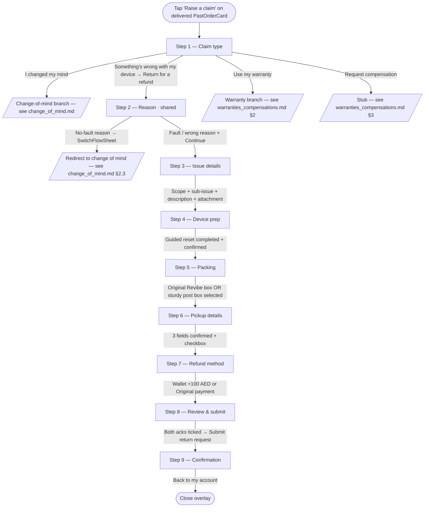

# Returns — Issue & Wrong device

> Customer-facing UI of the faulty-product return branch, launched from `Raise a claim` → `Something's wrong with my device` → `Return for a refund` on a delivered `PastOrderCard` (or reached from the change-of-mind flow's refund-vs-replacement choice — see [change_of_mind.md](./change_of_mind.md) §2.3). Covers Steps 1 (shared), 2 (issue branch), and 3–7 (shared with change-of-mind). The operational state machine (drawio transcription — single repair-supplier path, country-aware AWB creation, LAB sub-flow) is documented separately in [`../../input/return_flow_issue.md`](../../input/return_flow_issue.md). Once submitted, the return appears on the customer's list as a `ClaimCard` — see [claim_tracking.md](./claim_tracking.md).

## 1. Overview

The issue branch is the entry point used when something is wrong with the delivered device — defect, wrong unit, doesn't work as described, etc. From the customer's perspective:

- Eligible for 10 days after delivery (same window as change of mind).
- The device is picked up by courier from the saved delivery address.
- Refund options: net amount + **AED 100 bonus** to **Revibe Wallet** (instant once return is complete), or full net to **original payment method** (5–10 business days). No restocking fee on either path.
- Revibe Care is refunded on top.

Distinguishing characteristics vs change of mind:

- A shared, **required** reason step (Step 2, "Why are you returning it?") now precedes issue details — it's the authoritative router (a no-fault reason picked here redirects to the change-of-mind flow via `SwitchFlowSheet`). See [change_of_mind.md](./change_of_mind.md) §2.3. Issue details (Step 3) then collects required structured evidence (sub-issue from a two-scope picker, free-text description, attachment); when the customer arrived from a fault reason the matching scope is pre-filled.
- No restocking fee on the original-payment path.
- A flat AED 100 Wallet bonus (`ISSUE_WALLET_BONUS`) is added on the Wallet path — the implicit framing is "we owe you because something went wrong, and we'd like you to stay in the ecosystem".
- The operational flow has a single repair-supplier route (Original supplier) regardless of country, vs change-of-mind's three-way country split.

The flow chrome (white surface, segmented progress, sticky action bar, only-filled-button = Continue) is shared with change of mind. See [change_of_mind.md](./change_of_mind.md) §1 for the visual language rationale.

## 2. UI flow



### 2.1 Step 1 — Claim type (shared)

See [change_of_mind.md](./change_of_mind.md) §2.2. The issue branch is reached via:

`Something's wrong with my device` → expands inline accordion → `Return for a refund` → `claimType: 'issue'`. (Also reachable from the change-of-mind flow's refund-vs-replacement choice when a fault reason is caught there — see [change_of_mind.md](./change_of_mind.md) §2.3.)

### 2.2 Step 2 — Reason (shared, required)

The shared "Why are you returning it?" picker — the same step the change-of-mind and warranty flows use, and the authoritative router. A fault / wrong reason (`defective` / `wrong_item` / `damaged`) continues into the issue flow (pre-filling the issue-details scope); a no-fault reason opens `SwitchFlowSheet` and redirects to change of mind; `missing_parts` redirects to compensation. Full table + routing rule + sheet in [change_of_mind.md](./change_of_mind.md) §2.3.

### 2.3 Step 3 — Issue details (issue branch, required)

A required structured-evidence form. `Skip` is hidden; the step gates on `issueSubtypeId` + non-empty description + a stubbed filename, surfaced one at a time via the flow-wide soft validation (`stepError` order: `subtype` → `description` → `attachment`; Continue never grays — see [change_of_mind.md](./change_of_mind.md) §2.1.1).

**Two-scope sub-issue picker.** Sourced from `src/components/ClaimFlow/issueSubtypes.js`:

| Scope | Sub-issues (count) |
|---|---|
| `Device not working as expected` | 15 items (battery, software, physical, screen, charger, overheating, camera, etc.) |
| `I received the wrong device` | 4 items |

Scopes are mutually exclusive expandable sections; tapping a sub-issue commits the selection (`issueScope` + `issueSubtypeId`) and collapses the picker down to just the chosen row. The selected row shows only the optional `Try this first` preflight tip (e.g. "Have you tried a soft reset?"), rendered only when the sub-type defines one. It carries an `X` button that clears the selection and reopens the picker on the same scope so the user can pick again.

The per-issue **`What we need`** evidence ask + the **`How to provide valid proof`** link have moved out of the selected-row panel and down into the **Photo or video of the issue** section (see below) — guidance now sits where the customer actually attaches proof.

**Description and attachment.** Below the picker:

- A required free-text description (500-char max).
- The **Photo or video of the issue** section. Once a sub-type is picked it leads with a brand-tinted `ProofGuidance` box — the sub-type's one-line `What we need` ask + a `How to provide valid proof` link — placed above the upload box. Before a sub-type is picked, the section shows just the upload box (no guidance).
- A **fake** attachment slot — clicking the dashed drop-zone stubs in a filename; the prototype has no real file picker.
- A warn-tinted banner reinforces that attachments are required (kept alongside the per-issue guidance).

**Real proof-guide links.** `How to provide valid proof` is a live `<a target="_blank">` (no longer a placeholder). It resolves per sub-type via `sub.proofGuideUrl`, falling back to `DEFAULT_PROOF_GUIDE_URL` ("how-to-show-us-your-issue") for any sub-type without its own article. Specific articles today: `battery` → battery-draining guide; `physical` → device-conditions guide; the four hardware sub-types (`camera` / `microphone` / `button` / `speaker`) share one `HARDWARE_PROOF_GUIDE_URL`. All defined in `issueSubtypes.js`.

**Physical-condition disclaimer.** When `issueSubtypeId === 'physical'` and the device's condition grade (from `conditionGradeOf(order)`) is known and **not `excellent`** (i.e. very good / good / fair), an amber `PhysicalConditionNote` renders in the photo section beside the guidance. It names the grade ("Your device is graded **Good**…") and explains that some signs of previous use are expected at that grade and aren't treated as a defect. Renders nothing for Excellent-grade devices or when the grade can't be derived.

The pre-redesign flat `category` field is gone; `Step6Review`'s `IssueSummary` consumes `issueSubtypeId` (via `findSubtype(id)` in `issueSubtypes.js`) and `issueScope`.

**Optional battery check (battery sub-type only).** When `issueSubtypeId === 'battery'`, a `BatteryHealthCheck` card renders under the selected-sub-type guidance (in both the issue **and** the warranty issue-details step — both reuse `Step2IssueDetails`). It lets the customer self-assess against the §7.2 Battery Standards before committing:

- A **capacity %** input (the figure from Settings → Battery → Battery Health) and a **non-original part** self-report toggle. Both live in `state.batteryCheck` (`SET_BATTERY_CHECK`); **fully optional** — never gates `canAdvance`, so the customer can skip it and submit proof + description as usual.
- The card derives the device's guaranteed floor from its condition grade (last segment of `product.variant`): `excellent` 95, `very good` 90, `good` 85, `fair` 85 (no published floor — treated as Good). Time-since-delivery comes from `deliveredOn`.
- A live, **generic** verdict (no flow-switching nudge) computed by `assessBattery(...)` in `src/lib/returns.js`, evaluated most-favourable-first: non-original part → **full refund**; > 3% degradation within 10 days → **full refund**; > 10% within 6 months **or** > 20% within 12 months → **free battery replacement**; otherwise **normal wear, not a covered defect** (still submittable). Each remedy names its delivery window (10 days / 6 months / 12 months) so the **time component is visible**, and every verdict carries an "estimate only — final eligibility is confirmed by quality check after inspection" caveat.
- The **time component is part of the math, not just the copy**: each tier requires both the degradation threshold *and* its window, checked against `deliveredOn` vs today (`daysSinceDelivery` + month math in `assessBattery`). The card surfaces this directly — it shows how many days ago the device was delivered next to the guaranteed floor.
- A collapsible **"What counts as a battery defect?"** disclosure (`BatteryThresholds`) lists all three §7.2 thresholds (window + degradation + remedy) plus the normal-wear / non-original-part rules, so a customer who just wants to understand normal battery usage can read the policy without entering anything.

The filled-in result is carried onto the claim as `claim.batteryAssessment` (`{ capacity, baseline, degradation, nonOriginal, remedy, reason }`) for the issue and warranty shapes — data only; no tracking-card surface reads it yet. Logic + thresholds live in `src/lib/returns.js` (`BATTERY_BASELINE_BY_GRADE`, `conditionGradeOf`, `batteryBaselineFor`, `assessBattery`).

### 2.4 Steps 4 – 6 — Device prep + packing + pickup (shared)

Identical to the change-of-mind branch (device prep / packing / pickup). See [change_of_mind.md](./change_of_mind.md) §2.4–2.6.

### 2.5 Step 7 — Refund method (shared chrome, issue math)

Two stacked refund cards built off `refundBreakdown(order, units, method, 'issue')`. Chrome is identical to the change-of-mind refund step; only the math and secondary copy diverge.

- **Wallet card.** Net amount (= `gross + AED 100 bonus`) + an accent-tinted `+AED 100 bonus` chip + tagline `Full refund + bonus · instantly once return is complete`.
- **Original-payment card.** Full net (no fee), no breakdown table, tagline `Full refund · 5–10 business days once return is complete`. Card label uses `order.paymentMethod.brand` + `last4`. BNPL handling identical to the change-of-mind flow — see [change_of_mind.md](./change_of_mind.md) §2.7 for the `BnplDisclaimerTooltip` treatment.

### 2.6 Step 8 — Review & submit (shared)

Sectioned summary. Issue-specific section:

- **Issue** — category label (resolved via `findSubtype(id)` against `issueSubtypes.js`) + description + attachment chip.

Shared sections: Device prep (shows `Factory reset confirmed` — the single guided-reset path; `Unlinked + passcode shared` survives only for seeded credentials mocks), Packing summary (with the chosen method label), Pickup, Refund.

Two soft-validated ack cards sit inside the Review surface — **☑︎ I have factory reset my device** directly under Device preparation, **☑︎ I have packed the device properly** directly under the Packing summary. Submit stays clickable; clicking with either unchecked flips the topmost unchecked card into a danger-toned error state and blocks submission. Same `AckCard` chrome as the change-of-mind branch — see [change_of_mind.md](./change_of_mind.md) §2.8 for the full soft-validation contract.

The refund block surfaces the final net + an explanatory line: `Includes AED 100 bonus` (accent tone) for Wallet, or no extra line for Original payment.

The sticky bar swaps `Continue` for a success-tone `Submit return request`.

### 2.7 Step 9 — Confirmation (shared)

Same as change of mind. See [change_of_mind.md](./change_of_mind.md) §2.8.

## 3. Eligibility & refund math

### 3.1 Eligibility

Identical to change of mind. See [change_of_mind.md](./change_of_mind.md) §3.1 for the full decision tree (`eligibilityFor(order, today)` in `src/lib/returns.js`).

### 3.2 Refund math (`refundBreakdown(order, units, method, 'issue')`)

| Step | Formula |
|---|---|
| `unitPrice` | `order.unitPrice` (falls back to `subtotal`, then `total`) |
| `itemTotal` | `unitPrice * units` |
| `warranty` | `order.warranty ?? 0` |
| `gross` | `itemTotal + warranty` |
| **Wallet** | `fee = 0`, `bonus = ISSUE_WALLET_BONUS` (flat AED 100), `net = gross + bonus` |
| **Original payment** | `fee = 0`, `bonus = 0`, `net = gross` |

`bonus` is always present in the return shape (0 when not applicable) so consumers don't need null-guards. The refund step reads `bonus` to render the `+AED 100 bonus` chip and Review reads it for the `Includes AED 100 bonus` explanatory line.

`ISSUE_WALLET_BONUS` is a constant in `src/lib/returns.js`; the value is currency-agnostic and could grow into a per-order amount sourced from the backend.

## 4. Operational flow (backend / agent / supplier)

The customer-facing UI above stops at submission. Backend state — agent intake review, country-aware AWB creation, collection / QC / LAB sub-flow, refund chain — is described in the operational flow doc.

→ [`../../input/return_flow_issue.md`](../../input/return_flow_issue.md)

That doc carries:

- Mermaid diagrams of the full state machine (intake → agent review → country-aware AWB creation → collection → seller-decision → LAB invalid-claim sub-flow → ship-back chain → refund chain).
- Single repair-supplier path (`Original supplier`) — distinguishing factor vs change of mind.
- Country split on AWB creation: UAE/Others → auto by Revibe; SA → seller manually inputs.
- IS (internal) vs ES (customer-facing) state catalog.
- Decision points and their branches.
- Source-doc ambiguities preserved verbatim.

How the customer-facing UI surfaces backend state:

- **Agent intake review** (`Information complete?` decision in the ops doc — n4). When the agent flags missing documents, `claim.subStatusId` becomes `awaiting_documents` and an inline `ClaimActionBanner` fires on `ClaimCard`. See [claim_tracking.md](./claim_tracking.md) §4. The `DocsRejectedCard` takeover is the equivalent surface when ops rejects an *initial* evidence batch — see [claim_tracking.md](./claim_tracking.md) §3.1.
- **Collection failed.** `claim.pickupFailure` triggers the `PickupFailedCard` takeover. See [claim_tracking.md](./claim_tracking.md) §3.2.
- **LAB invalid-claim sub-flow** (ops nodes n33–n39). Tracked via `claim.subStatusId === 'expert_revision'`; not currently surfaced inline on `ClaimCard` — the long wait is implicit in the parent `qc` step.
- **Invalid claim confirmed + customer must pay return shipping.** `claim.invalidClaim` triggers the `InvalidClaimCard` takeover. See [claim_tracking.md](./claim_tracking.md) §3.3.

## 5. UX decisions

**Two-scope picker, not a flat list.** Earlier drafts had a single 19-item list of sub-issues. Splitting into `Device not working as expected` (15) and `I received the wrong device` (4) reduced perceived overwhelm — most customers can predict which scope their issue lives in and only need to scan ~15 items, not 19. It also creates a natural place to attach scope-specific guidance later.

**Per-sub-issue guidance, not a generic ask.** Once a sub-issue is picked, the panel shows what evidence is needed *for that specific issue* (`What we need` line). Generic asks ("Please provide photo evidence") got ignored. Specific asks ("A 30-second video showing the battery draining…") get followed.

**Attachment is required, no submit without it.** Earlier drafts let the customer submit without a file. Ops spent half their time chasing customers for evidence. The requirement is enforced as the `attachment` gate in `stepError` (a Continue click with no file reddens the dropzone + shows *"Attach a photo or video — it's required."*) and reinforced by the warn-tinted banner above the slot.

**No restocking fee on the original-payment path.** The customer didn't choose to return — the seller messed up. Charging a fee felt like punishing the customer for a Revibe-side problem.

**AED 100 bonus on Wallet, not "double the bonus on original payment".** Earlier drafts had a sliding bonus that doubled when the customer chose Wallet. The clean +100 framing is simpler to communicate and easier to A/B against the change-of-mind branch's "no bonus, just a fee waiver".

**Packing and factory-reset acks moved onto Review as a soft-validated pair.** Earlier drafts had a single trailing packing checkbox on Review that hard-gated Submit; an even earlier version merged packing with a "testing acknowledged" checkbox to fix a negation-tick bug. Both got replaced when Step 4 became a dedicated packing-instructions screen — packing is now its own surface, and the *acknowledgments* (factory-reset + packed-properly) live on Review where they're enforced right before submission. See [change_of_mind.md](./change_of_mind.md) §5 for the rationale on splitting the two acks and using soft validation instead of disabling Submit.

**`category` field was replaced by `issueSubtypeId` + `issueScope`.** The pre-redesign flat `category` field couldn't differentiate "wrong device" from "battery issue" cleanly. Review now consumes the structured pair via `findSubtype(id)`.

## 6. Data model

### 6.1 Order fields read by the flow

Same as change of mind (see [change_of_mind.md](./change_of_mind.md) §6.1), plus — for the optional battery check on the `battery` sub-type — `order.product.variant` (the condition grade is its last `·`-separated segment) and `order.deliveredOn` (delivery date for the time-window math). Both are read through `conditionGradeOf` / `batteryBaselineFor` / `daysSinceDelivery` in `src/lib/returns.js`.

### 6.2 Claim object written at submit (issue shape)

The full claim-object reference (including takeover-card extensions) lives in [claim_tracking.md](./claim_tracking.md) §5. Issue-specific fields:

| Field | Type | Notes |
|---|---|---|
| `claim.type` | `'issue'` | Constant for this branch. |
| `claim.issueDetails` | `{ description, attachmentName }` | `description` is the customer's free-text; `attachmentName` is a stub filename today. The sub-issue id and scope are **separate** top-level fields (below), not nested here. |
| `claim.issueSubtypeId` | string | One of the sub-issue ids (`battery` / `software` / `physical` / `screen` / `charger` / `overheating` / `camera` / `wrong_item` / …), resolved via `findSubtype(id)` in `issueSubtypes.js`. |
| `claim.issueScope` | `'not_working' | 'wrong_device'` | The two-scope picker value; pre-filled from the fault reason via `scopeForReason`. |
| `claim.batteryAssessment` *(optional)* | `{ capacity, baseline, degradation, nonOriginal, remedy, reason }` | Written **only** when the `battery` sub-type's optional check was filled in (a capacity entered or the non-original toggle ticked). `remedy` is `'refund'` / `'replacement'` / `'none'` / `null`; `reason` is `'non_original'` / `'refund_10d'` / `'replacement_6m'` / `'replacement_12m'` / `'normal_wear'` / `null`. Computed by `assessBattery(...)` in `src/lib/returns.js`. Data only — no tracking-card / `ClaimDetailsSheet` surface reads it yet. |
| `claim.expectedRefund.bonus` | number | `ISSUE_WALLET_BONUS` (`100`) when `refundMethod === 'wallet'`; `0` otherwise. |

Fields common to both branches (`claimRef`, `claimStatusId`, `submittedAt`, `units`, `devicePrep`, `pickupDetails`, `refundMethod`, `expectedRefund`, `timeline`) are documented in [change_of_mind.md](./change_of_mind.md) §6.2.

`claim.reason` is **not set** on the issue branch.

## 7. Component map

Same shared components as change of mind. Issue-specific surfaces:

```
src/components/ClaimFlow/
├── Step2IssueDetails.jsx       Two-scope picker + required description + fake attachment slot.
│                               Private BatteryHealthCheck + BatteryVerdict + BatteryThresholds
│                               render on the `battery` sub-type (also used by the warranty flow,
│                               which reuses this component). Receives `order`.
└── issueSubtypes.js            ISSUE_SCOPES (2) + SUBTYPES (15 + 4); findSubtype(id) resolver
```

`refundBreakdown` (`src/lib/returns.js`) branches on the 4th argument (`claimType`); the issue branch flows through `case 'issue'`. The battery check's logic also lives in `src/lib/returns.js` (`BATTERY_BASELINE_BY_GRADE`, `conditionGradeOf`, `batteryBaselineFor`, `daysSinceDelivery`, `assessBattery`); `ClaimFlow.buildClaim` attaches the result via the private `batteryAssessmentForClaim(state, order)` helper.

## 8. Mocked vs production

- **Submit seeds an in-session claim.** Same as change of mind — see [change_of_mind.md](./change_of_mind.md) §8. The seeded claim carries `type: 'issue'`, `issueDetails` / `issueScope` / `issueSubtypeId` from the flow state, and the computed `expectedRefund`.
- **Attachment slot is fake.** Clicking the drop-zone stubs in a filename. No real file picker, no upload endpoint, no file-type/size validation.
- **AED 100 bonus is hardcoded** as `ISSUE_WALLET_BONUS` in `src/lib/returns.js`. Production should read from a backend config (per-order or per-category).
- **Sub-issue guidance copy is hardcoded** in `issueSubtypes.js`. Production should source from a content management system so non-engineers can revise.
- **No de-duplication / fraud check.** Production needs to flag repeat claimants and stop submission before it reaches ops.
- **`Try this first` preflight steps are placeholders.** Real preflight scripts (factory reset, signal-strength check, charge-cycle test) need to be sourced from device-care content.
- **Battery check is a customer-facing estimate, not a verified reading.** The capacity % is hand-typed (no Battery Health screenshot parsing / OCR), the condition grade is parsed from the `product.variant` string, and `deliveredOn` drives the time window. The verdict is advisory — `assessBattery` runs entirely client-side and the real eligibility is decided by QC. `claim.batteryAssessment` is captured but not surfaced on any tracking card / review screen / ops surface yet. Thresholds (3% / 10% / 20%, 10 days / 6 / 12 months) and grade baselines (95 / 90 / 85, fair→85) are hardcoded in `src/lib/returns.js` — production should source them from the same policy config as §7.2.

## 9. Open questions

- **Multi-attachment.** The slot today accepts a single fake file. Real evidence often needs photo + video. Likely a small picker carousel with up to N attachments.
- **Live-chat hand-off from issue details.** Some sub-issues (e.g. screen unresponsive at boot) would be better handled by support before the customer commits to a return. A `Talk to support` exit ramp on the sub-issue guidance panel is a natural addition.
- **Wrong device flow.** The `I received the wrong device` scope today flows through the same device-prep / packing / pickup steps as a normal issue claim. In practice the device prep step is moot (the customer doesn't own the wrong device's iCloud account). Worth gating device prep off when `issueScope === 'wrong_device'`.
- **Bonus tuning.** AED 100 is a fixed placeholder. Production may want to scale by item price, by historical claim rate, or A/B test against alternative incentives (instant replacement, expedited shipping).
- **Replacement-vs-refund branching.** Today the flow always lands on a refund. A `Replace` option (ship a working unit, take the broken one back on the same AWB) is a natural addition for issue claims.
- **Battery check → flow routing.** The check verdict is deliberately generic and never steers the customer between the return (refund) and warranty (replacement) flows, even when the computed remedy points at the other one. A future iteration could nudge (e.g. "your numbers point to a battery replacement — use your warranty instead") or surface `batteryAssessment` on Review / `ClaimDetailsSheet` / the QC ops view so the self-reported figure travels with the claim.
