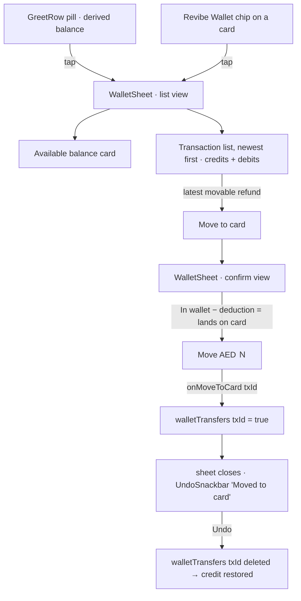

# Revibe Wallet

> The customer-facing Revibe Wallet surface inside My Account: the balance pill in `GreetRow`, the `WalletSheet` bottom sheet it opens (balance + transaction history), and the **Move to card** flow that switches the latest store-credit refund back to the customer's card — re-applying the deduction the customer avoided by taking store credit. Refund-method *selection* (at cancel / claim time) lives in [cancellations.md](./cancellations.md) and [returns/change_of_mind.md](./returns/change_of_mind.md); this doc is about what happens to the credit *after* it lands.

## 1. Overview

The wallet pill (`GreetRow`) was a decorative chip with a hardcoded balance. It is now a live entry point:

- **Balance is derived** from a curated, believable history (`data/wallet.js`) plus the **live in-context refund** — in journey mode, the replayed order's wallet refund. It is not hardcoded.
- Tapping the pill — **or** the "Revibe Wallet" refund-destination chip on a claim/cancellation card (§6) — opens `WalletSheet`: an **available balance** card + a newest-first **transaction list** of credits (refunds, referral) and debits (purchases).
- The **latest movable refund** exposes a **Move to card** action. Moving re-applies the deduction store credit waived, so less money reaches the card than sat in the Wallet (zero-deduction cases move the full amount).

The switch is **self-contained**: it changes the Wallet (balance drops, the row is marked *Moved to card*) but does **not** rewrite the originating `ClaimCard` / `PastOrderCard`. It is in-session and **undoable** via the shared `UndoSnackbar`.

## 2. Flow

## 3. Ledger source & what's movable

`walletLedger(contextOrders, transfers)` (`lib/wallet.js`) builds the ledger from the **curated seed** (`data/wallet.js`) plus any **live refund** derived from `contextOrders`. `App.jsx` passes `journeyMode ? projectedOrders : []` — so in journey mode the replayed order's wallet refund appears live, and in the static demo the seed is the whole history (we don't auto-sum every order's refund — that read as an unrealistic pile).

Live-derived credits come from two refund paths:

| Source | Credit when | Amount |
|---|---|---|
| Return claim | `claim.refundMethod === 'wallet'` **and** `claimStatusId === 'refund_credited'` | `claim.expectedRefund.net` |
| Cancellation | `refund.destination.kind === 'wallet'` **and** `cancellationStatusId === 'refunded'` | `refund.amount` |

**Ordering — live refund pins to the top.** The sort is tiered: live-derived credits (`via` `claim`/`cancellation`) rank **above** all seeded entries (`via: 'seed'`), then newest-date, then id. So the journey refund is always row 1 regardless of the date its node hardcodes (seed dates are kept in spring 2026, earlier than the journeys' late-May base, so the display also stays chronological).

**Movable = the single latest refund, funds-gated.** Any refund credit is movable (a seed entry carrying a precomputed `cardEquivalent`, or any live claim/cancellation refund — including Revibe-initiated and compensation). Promo/referral credits and debits are not. `latestSwitchableCredit` returns **only the freshest** switchable credit, and only if it isn't already `moved` and the wallet still holds at least its amount (you can't move a credit you've spent). **Latest-only — no cascade**: once it's moved, no further Move button appears even if older unspent refunds exist.

## 4. Deduction math (Move to card)

`cardEquivalentFor(tx)` returns a seed entry's precomputed `cardEquivalent` if present, else computes from `tx.order`: returns reuse `refundBreakdown(order, units, 'original', claimType)`; cancellations use `CANCELLATION_FEE_RATE` (lifted into `lib/returns.js`, shared with `CancelOrderSheet`).

| Credit origin | In Wallet | Lands on card | Deduction shown |
|---|---|---|---|
| change_of_mind return | gross | gross − 10% restocking | Restocking fee (10%) |
| issue return | gross + AED 100 bonus | gross | Wallet bonus forfeited (AED 100) |
| cancellation (normal, customer) | total | total − 5% processing | Processing fee (5%) |
| cancellation (breached/late) | total + AED 100 bonus | total | Wallet bonus forfeited (AED 100) |
| cancellation (Revibe-initiated) | total | total | — none (full amount) |
| compensation | net | net | — none (full amount) |

Zero-deduction cases (`deductions: []`) move the full amount; the confirm view swaps its "store credit waived this deduction" note for a neutral one. When a deduction applies, the forfeited amount leaves the Wallet entirely — balance drops by the **full credit**, only the (lower) card amount is "sent."

## 5. State & data

- **`walletTransfers`** (`App.jsx`) — in-session `{ txId: true }` map, the only mutation over the derived ledger. Cleared on refresh; `UndoSnackbar` (`kind: 'wallet_transfer'`, keyed by `txId`) deletes the entry to restore the credit. A journey node change drops the journey order's `cancel:<id>`/`claim:<id>` keys so a move doesn't leak across replays.
- **Derivation source.** Journey mode → the replayed order (`projectedOrders`); static demo → the seed only. The balance reacts to the journey reaching a refunded-to-wallet node.
- **Transaction shape** — `{ id, kind: 'credit'|'debit', source, dateLabel, sortTs, amount, currency, switchable, moved, via, order, cardEquivalent }`. Stable ids: `claim:<orderId>`, `cancel:<orderId>`, `seed:<n>`. Dates parse with a year-aware parser (timeline strings carry no year — year comes from `order.placedAt` / the seed entry's `year`); ties break by id.

## 6. Component map

| Piece | File |
|---|---|
| Ledger derivation, balance, tier sort, latest-movable selector, deduction math | `src/lib/wallet.js` |
| Curated seed history (refund credits, referral, purchase debits) | `src/data/wallet.js` |
| Bottom sheet (list + confirm views, zero-deduction note) | `src/components/WalletSheet.jsx` |
| Pill entry point (now a button) | `src/components/GreetRow.jsx` |
| **Card entry point** — the "Revibe Wallet" refund-destination chip opens the ledger (`onOpenWallet`) | `DestinationChip` in `src/components/ClaimCard.jsx` + the exported one in `src/components/PastOrderCard.jsx` (also used by `RevibeCancellationCard.jsx`) |
| State + undo + open wiring | `src/App.jsx` (`walletOpen`, `walletTransfers`, `handleMoveToCard`, `openWallet`) |
| `WalletInfoTooltip` / `REVIBE_WALLET_ICON` | `src/components/WalletInfoTooltip.jsx` (reused; tooltip relocated into the sheet header) |

## 7. Mocked vs production

- **Mocked:** the seed history (`data/wallet.js`); AED-only currency; the destination label falling back to "your original card" when a cancellation mock has no `paymentMethod`; the 5–10-business-day card-refund estimate (copy).
- **Live in the prototype:** the journey-reactive derivation, the tier sort, the full deduction math, the funds-gated latest-only move + undo, and the card-chip entry point.
- **Demo reach:**
  - *Static demo* — balance ~AED 699 (a ~AED 80 used-wallet baseline + a fresh +AED 619 `#89200` return refund on top, movable → 557.10 to Visa ••4242). Debits ("Applied to order #…") and a referral credit fill out the history.
  - *Journey mode* — replaying the cancellation or change-of-mind journey to its wallet-refunded node surfaces a +AED 1,029 refund **pinned to the top**, movable (cancellation → 977.55 at 5%; change-of-mind → 926.10 at 10%); balance AED 1,728. Reset/advance clears the move.

## 8. Open questions

- Should a moved credit also rewrite the originating `ClaimCard` / `PastOrderCard` refund line ("Refunded to Mastercard ••8210")? Currently self-contained by decision.
- Production destination: order's original card only, or a chooser across saved payment methods?
- The card chip opens the wallet for any wallet-destination refund (active or credited); confirm whether it should only surface once the refund is actually credited.
