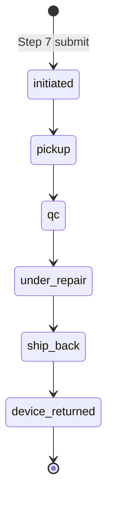
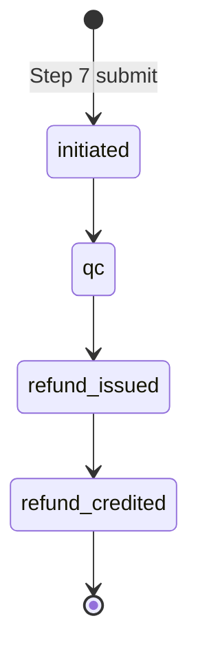

# Warranties & compensations

> Coverage of two Step 1 entries on the returns flow. **Warranty** is wired end-to-end (intake submits an in-session claim that flips the order to a `WarrantyClaimCard`); two hand-seeded mocks also exercise the post-pickup heroes that the prototype can't reach without ops simulation. **Compensation** is now also wired end-to-end (refund-only, no pickup — intake submits an in-session claim tracked on `ClaimCard`); three hand-seeded mocks exercise the under-review / refunded / closed-invalid surfaces. This doc covers both intakes + their tracking cards.

## 1. Status

Step 1's full option set across the returns flow:

| Step 1 option | Sub-options | Status |
|---|---|---|
| `I changed my mind` | — | **Wired** — see [returns/change_of_mind.md](./returns/change_of_mind.md) |
| `Something's wrong with my device` | `Return for a refund or replacement` | **Wired** — see [returns/issue.md](./returns/issue.md) |
| `Something's wrong with my device` | `Use my warranty` | **Wired** — intake + tracking — covered here (§2) |
| `Request compensation` | shipping refund / faulty charger — keep the item | **Wired** — intake + tracking — covered here (§3) |

Selecting `Request compensation` now dispatches `SET_CLAIM_TYPE: 'compensation'` (the old inline `not part of this build` note is gone); `canAdvance` accepts `change_of_mind`, `issue`, `warranty`, **and** `compensation`. The **warranty tracking card** has two hand-seeded mocks (89610, 89580) to exercise the `under_repair` and `ship_back` heroes that the in-session pipeline can't reach without ops simulation — see §2. The **compensation tracking card** has three hand-seeded mocks (89630 under review, 89605 refunded, 89572 closed-invalid) — see §3.8.

## 2. Warranty (repair-and-return)

### 2.1 Scope

The customer's device is faulty but within warranty. Outcome is always **repair + ship-back**; no money changes hands. The customer keeps the same physical unit (repaired by either the seller or, on the LAB-confirmed branch, by Revibe's lab). Operational source: [`../input/return_flow_warranty.md`](../input/return_flow_warranty.md).

### 2.2 Pipeline

6-state customer-facing chain in `WARRANTY_CLAIM_STATUSES` (`src/lib/claims.js`):



The head (`initiated → pickup → qc`) is shared with the refund pipeline; the tail (`under_repair → ship_back → device_returned`) replaces the refund chain. Seller-vs-LAB repair routing is internal to operations — both paths surface as a single neutral "Under repair" state. The prototype's in-session submit always lands a warranty claim on `initiated` (with a seeded `scheduledPickup` strip and a placeholder `repairWindow`); progressing through the pipeline requires manually editing the seeded claim or the two hand-seeded mocks (see §2.8).

### 2.3 WarrantyClaimCard

Lives at `src/components/WarrantyClaimCard.jsx`. Mirrors `ClaimCard`'s chrome (left accent strip, eyebrow, state pill, tinted hero, compact product row, expand-on-tap, history thread, view-details + download footer) but the hero block and post-QC tail diverge.

#### 2.3.1 Tone progression

| `claimStatusId` | Tone | Rationale |
|---|---|---|
| `initiated`, `pickup`, `qc` | **warn (amber)** | Device leaving the customer or being inspected — same posture as `ClaimCard`. |
| `under_repair`, `ship_back` | **brand (purple)** | Revibe is doing the work (repairing + shipping back) — matches `ClaimCard`'s `refund_issued`. |
| `device_returned` | **success (green)** | Terminal — device is home. |

#### 2.3.2 State-specific heroes

Most states reuse a generic claim hero (eyebrow + headline + ref + updated timestamp). Three states layer state-specific content inside or in place of that hero:

- **`initiated`** — `ScheduledPickupStrip` (CalendarClock + scheduled date/slot, MapPin + pickup address). Same shape as `ClaimCard`'s initiated strip.
- **`under_repair`** — `RepairWindowStrip`: Wrench-iconed "Estimated repair complete" date + optional one-line note ("Charging-port assembly swap — typically wraps up within 7–10 days").
- **`ship_back`** — **replaces** the generic hero with a brand-gradient ETA hero borrowed from `InProgressCard`: "Back with you by {date}" headline, "Delivering to · Home" chip, claim-ref + type subline. Once the device is on its way back the leg should read as a forward shipment, not a continuation of claim chrome — same rationale as `InvalidClaimCard`'s paid state.
- **`device_returned`** — `ReturnedStrip`: success-toned CheckCircle2 + "Returned on {date}".

#### 2.3.3 Detailed tracking dropdown

A brand-toned `See detailed tracking` button (Truck glyph, `border-brand bg-brand-bg/60 text-brand`) surfaces in the expanded view whenever `claim.shipBack?.awb` is set — i.e. as soon as the ship-back AWB has been issued. **Collapsed by default**; the brand styling cues "tap me" without stealing focus from the hero.

The dropdown reuses the standard outbound `SHIPPING_SUB_STATUSES` from `lib/statuses.js` so a warranty return reads with the **same four milestones as a normal outgoing order**:

1. Arrived in destination country
2. Cleared customs
3. Forwarded to third-party agent
4. Out for delivery

Plus a courier strip (DHL chip + courier + AWB + copy button) above the timeline. Driven by `claim.shipBack.subStatusId` (one of the four ids) and `claim.shipBack.subTimeline` (map of id → timestamp).

#### 2.3.4 Expanded view

1. **6-step horizontal dot timeline** using `WARRANTY_CLAIM_STATUSES`. Same chrome as `ClaimCard`'s 5-dot strip; tone-aware glow on the current step. Step labels: `Initiated · Pickup · QC · Repair · Ship back · Returned`.
2. **`See detailed tracking` dropdown** (§2.3.3), collapsed by default.
3. **`HistoryThread`** — same `getHistoryEvents(order, 'claim')` source as `ClaimCard`.
4. **Two-action footer** — `View claim details` (opens `ClaimDetailsSheet` — warranty-aware, see §2.5) + icon-only `Download receipt` (decorative).

#### 2.3.5 Section placement

`hasActiveClaim` is type-aware: warranty's terminal is `device_returned` (refund pipelines remain `refund_credited`). The new helper `isWarrantyDelivered(order)` flags warranty terminals for the **Past orders** section. Both routings live in `App.jsx`.

### 2.4 Intake flow

The warranty intake reuses the existing returns-flow chrome and most of the existing steps. Total visible step count is **7** (not 8) — Step 6 (Refund method) is skipped because no money changes hands. The progress bar reads "Step X of 7"; internally `state.step` still uses 1..8 indexing so Step 4 = packing, Step 7 = review and Step 8 = confirmation stay aligned across all three claim types. Routing lives in `flowReducer.js`:

- `visibleStepCount(claimType)` → 8 for refund flows, 7 for warranty.
- `visibleStepIndex(step, claimType)` → maps internal 1..8 onto displayed 1..7, subtracting 1 once `step >= 6` when the claim type is warranty.
- `NEXT` / `BACK` / `GO_TO_STEP` step over `state.step === 6` for warranty so the user never lands on the refund-method screen.

| Step | Behaviour on warranty |
|---|---|
| 1 — Claim type | `Use my warranty` row is in-scope. Selecting it dispatches `SET_CLAIM_TYPE: 'warranty'`. Continue is always clickable; tapping it with no type picked surfaces an inline error (flow-wide soft validation — see [returns/change_of_mind.md](./returns/change_of_mind.md) §2.1.1). |
| 2 — Issue details | **Reuses `Step2IssueDetails`** (same two-scope picker + description + attachment as the Issue branch), including the optional **battery check** that surfaces on the `battery` sub-type (capacity % + non-original-part toggle → §7.2 Battery Standards verdict; see [returns/issue.md](./returns/issue.md) §2.2). A filled-in result rides onto the warranty claim as `claim.batteryAssessment`. Production may swap this for a warranty-specific intake (proof of warranty / serial / purchase date) — see §2.9. |
| 3 — Device prep | Shared with refund flows — single guided-reset path (see [returns/change_of_mind.md](./returns/change_of_mind.md) §2.4). |
| 4 — Packing | Shared with refund flows. Radio pick between original Revibe box and sturdy post box with bubble wrap — see [returns/change_of_mind.md](./returns/change_of_mind.md) §2.5. |
| 5 — Pickup details | Shared with refund flows. The Step 5 "Expected by" headline (see [returns/claim_tracking.md](./returns/claim_tracking.md) §4) reads the warranty pipeline so the date is computed off `WARRANTY_CLAIM_STATUSES` + warranty-tail SLAs, and the detailed-timeline dropdown shows 6 steps (Initiated → Pickup → QC → Under repair → On its way back → Device returned). |
| 6 — Refund method | **Skipped.** |
| 7 — Review | Refund section is replaced by a **What you'll get back** card: Wrench-iconed "Your repaired device" + "Expected back" date + "No refund — the same unit is returned to you after repair." The Edit-by-section navigation only exposes Fault / Device prep / Packing / Pickup. CTA reads `Submit warranty claim` (still success-toned). Two soft-validated ack cards sit inline (factory-reset + packed-properly) — same `AckCard` contract as the refund branches; see [returns/change_of_mind.md](./returns/change_of_mind.md) §2.8. |
| 8 — Confirmation | Title swaps to "Your warranty claim is in"; chip reads `Warranty`; second row swaps "Expected refund" (Clock glyph) for **"Expected back"** (Wrench glyph) with the computed return date and a "No refund issued — same device returned after repair" note. Secondary CTA reads "Track this claim". |

On submit, `ClaimFlow.handlePrimary` builds a warranty-shaped claim object (`buildClaim` at the bottom of `ClaimFlow.jsx`) and bubbles it up via the new `onSubmitClaim(orderId, claim)` prop. The shape:

```js
{
  claimRef, claimStatusId: 'initiated', type: 'warranty',
  submittedAt, units: 1,
  issueDetails, issueScope, issueSubtypeId,
  devicePrep, pickupDetails,
  scheduledPickup: { courier: 'DHL Express', date, slot },
  timeline: { initiated: <stamp> },
  repairWindow: { expectedComplete, expectedCompleteLong,
                  note: "We'll confirm the exact repair window after inspection." },
}
```

`App.jsx` stores it in `submittedClaims[orderId]` and projects it over `ORDERS` before filtering. The order immediately re-renders as a `WarrantyClaimCard` (initiated state, scheduled-pickup strip visible). The `UndoSnackbar` slides up after the flow closes so reviewers can revert to the baseline `PastOrderCard` mid-demo. Submitted claims are cleared on refresh — no backend.

### 2.5 ClaimDetailsSheet — warranty branch

`ClaimDetailsSheet` is warranty-aware. For `claim.type === 'warranty'`:

- The "Refund destination" row in **Summary** is hidden (no refund-method picker on intake).
- The bottom **Refund** card becomes **Return** — shows the expected return date (or the actual returned-on date for `device_returned`) with a one-line note: "No refund is issued — the same device is returned to you after repair."

No `expectedRefund` field is required on warranty claims; the sheet reads from `claim.shipBack` / `claim.repairWindow` instead.

### 2.6 Card routing

`App.jsx` routes a warranty claim to `WarrantyClaimCard` after the three takeover checks and before the generic `ClaimCard` fallback:


The takeover cards currently fire only on refund-type mocks; a warranty claim that triggers a takeover (e.g. docs-rejected at intake — `n6` on the operational diagram) would route to the takeover ahead of `WarrantyClaimCard`. The precedence is in place but the takeover copy was written for refund-flow context and may need a warranty variant — see §2.9.

### 2.7 Data model — warranty-specific fields

On top of the standard claim shape (`claimRef`, `claimStatusId`, `type`, `submittedAt`, `pickupDetails`, `scheduledPickup`, `timeline`, `issueDetails`, `devicePrep`), warranty claims carry:

| Field | Type | Used by |
|---|---|---|
| `claim.type` | `'warranty'` | Routing in `App.jsx`; hero copy; sheet branching |
| `claim.repairWindow` *(optional)* | `{ expectedComplete, expectedCompleteLong, note? }` | `under_repair` hero strip |
| `claim.shipBack` *(optional)* | `{ courier, awb, estimatedDelivery, estimatedDeliveryLong, subStatusId, subTimeline, deliveredOn?, deliveredOnLong? }` | `ship_back` hero + detailed-tracking dropdown; `device_returned` hero strip |
| `claim.batteryAssessment` *(optional)* | `{ capacity, baseline, degradation, nonOriginal, remedy, reason }` | Set when the optional Step-2 battery check (§7.2) was filled in on the `battery` sub-type — same shape and helper (`assessBattery`) as the issue branch (see [returns/issue.md](./returns/issue.md) §6.2). Data only; no warranty-card surface reads it yet. |

`claim.shipBack.subStatusId` is one of the four `SHIPPING_SUB_STATUSES` ids (`arrived_destination`, `cleared_customs`, `forwarded_to_agent`, `out_for_delivery`). `claim.shipBack.subTimeline` is a map keyed by the same ids with human-readable timestamps (e.g. `'19 May · 4:45 PM'`).

No `refundMethod` / `expectedRefund` fields are needed — the warranty branch has no refund. On the in-session submit `claim.reason` is omitted (warranty intake doesn't collect a reason field); the two hand-seeded mocks still carry `{ value: 'other', otherText: '' }` for shape parity with refund claims. A future production intake may swap the reused Issue picker for a warranty-specific block (proof of warranty / serial / purchase date) — see §2.9.

### 2.8 Mocked vs production

- **In-session submit only.** A submitted warranty claim is stored in `App.jsx`'s `submittedClaims` state and projected over `ORDERS`. There's no backend; the claim is cleared on refresh and can be reverted mid-demo via the `UndoSnackbar`.
- **Pipeline progression isn't simulated.** Submitted claims always land on `claimStatusId: 'initiated'`. The post-pickup heroes (`under_repair` `RepairWindowStrip`, `ship_back` brand-gradient ETA, `device_returned` `ReturnedStrip`, the `See detailed tracking` dropdown) only render on the two hand-seeded mocks **89610** (`under_repair`) and **89580** (`ship_back`). Production needs the same webhook / polling mechanism as the refund flow to move the claim through the 6 states.
- **`scheduledPickup`, `repairWindow`, `shipBack.*`** are either hand-written (mocks) or filled with placeholders by `buildClaim` (`'DHL Express'`, "10 AM – 12 PM", tomorrow's date for the scheduled pickup; SLA-summed estimated complete date for the repair window). Production needs the supplier + courier integrations that today feed the refund flow.
- **Seller-vs-LAB routing not surfaced.** A neutral "Under repair" state is shown regardless of which actor is doing the work; per the §2 design decision the customer doesn't need to see the distinction.
- **Invalid-warranty path not wired.** The `Inspector decision = Invalid → customer pays return shipping` branch from the operational diagram is structurally identical to today's Issue-flow invalid path (`InvalidClaimCard`) and would route there. Today's mocks don't exercise it.
- **Auto-expand.** Warranty claims do not currently participate in `pickActiveOrderId` — same posture as `ClaimCard`.

### 2.9 Open questions

- **Warranty-specific Step 2.** Today the warranty branch reuses the Issue scope picker (battery / screen / wrong device / etc.). Production may want a warranty-specific intake block (proof of warranty / serial / purchase date) — particularly if extended-warranty vs manufacturer's-warranty distinction needs to route differently downstream.
- **Takeover copy on warranty claims.** `DocsRejectedCard` and `PickupFailedCard` would route ahead of `WarrantyClaimCard` if the corresponding fields are set, but the ops/quality message copy was written for refund-flow context. May need a warranty variant.
- **Auto-expand for active warranty claims.** Same question as `ClaimCard` ([returns/claim_tracking.md §9](./returns/claim_tracking.md)). Worth revisiting now that customers can routinely have an active warranty claim.
- **Repair-window source.** Today `claim.repairWindow.expectedComplete` is either hand-written (mocks) or computed from `expectedCompletionFor('warranty')` (in-session submit). Production needs either a per-supplier SLA-driven estimate or a seller-input field at intake.
- **Single warranty branch or sub-branched intake?** Warranty coverage varies (manufacturer's warranty / Revibe Care add-on / extended warranty). The current intake collapses to one branch; production may want to split at Step 2 with the source determined backend-side.

## 3. Compensation (shipping refund / faulty charger)

### 3.1 Scope

The customer reports a problem but **keeps the device** — the outcome is always a **refund, never a return**. Two sub-cases (`src/components/ClaimFlow/compensationSubtypes.js`):

- **`shipping_refund`** — the customer was charged shipping they shouldn't have paid. They get the shipping amount back.
- **`charger`** — the device is fine but the bundled charger is faulty. They get a refund (no replacement accessory is shipped).

The customer uploads evidence for either case; support reviews it and reaches a **valid / invalid** decision. Valid → refund; invalid → the claim closes with no refund (and, since nothing was shipped, nothing to send back). The refund **amount is unknown at submission** — support confirms it after the review — so every customer-facing surface reads "amount confirmed by support after review" rather than a figure.

### 3.2 Divergence from the wired branches

| Aspect | Refund / warranty branches | Compensation branch |
|---|---|---|
| Device prep (Step 3) | Required | **Skipped** |
| Packing (Step 4) | Required | **Skipped** |
| Pickup (Step 5) | Required | **Skipped** — the customer keeps the device |
| Refund amount | Computed (`refundBreakdown`) | **Unknown at submission** — confirmed by support after review |
| Pipeline | 5-state refund / 6-state warranty | 4-state, no Pickup leg (§3.5) |
| Invalid verdict | Pay return shipping (`InvalidClaimCard`) | Claim closed, no refund — nothing to ship back (§3.7) |

Structurally the simplest of the three — it skips three steps — and the only one where the figure is deferred.

### 3.3 Intake flow

Total visible step count is **5** (1, 2, 6, 7, 8); Steps 3/4/5 are skipped by the reducer. The progress bar reads "Step X of 5". Internally `state.step` still uses 1..8 indexing so Step 6 = refund destination, Step 7 = review and Step 8 = confirmation stay aligned across all claim types. Routing lives in `flowReducer.js`:

- `visibleStepCount('compensation')` → `TOTAL_STEPS - 3` = 5.
- `visibleStepIndex(step, 'compensation')` → `step >= 6 ? step - 3 : step` (1→1, 2→2, 6→3, 7→4, 8→5).
- `NEXT` from Step 2 jumps to Step 6 (skips 3/4/5); `BACK` from Step 6 returns to Step 2. `GO_TO_STEP` edit links from Review only target Step 2 and Step 6.

| Step | Behaviour on compensation |
|---|---|
| 1 — Claim type | `Request compensation` dispatches `SET_CLAIM_TYPE: 'compensation'` and highlights (no longer a stub). |
| 2 — What happened | **`Step2Compensation.jsx`** — a two-option sub-type picker (`shipping_refund` / `charger`, each with a "what we need" evidence hint) + description + attachment. Gates on `compensationSubtype` + a non-empty description + an attachment, one at a time via the flow-wide soft validation (`stepError` order `subtype` → `description` → `attachment`; see [returns/change_of_mind.md](./returns/change_of_mind.md) §2.1.1). Description/attachment reuse `state.issueDetails`; the sub-type is `state.compensationSubtype` (set via `SET_COMPENSATION_SUBTYPE`). |
| 3 — Device prep | **Skipped.** |
| 4 — Packing | **Skipped.** |
| 5 — Pickup | **Skipped.** |
| 6 — Refund destination | `Step5RefundMethod`'s `CompensationDestination` branch — Wallet vs original payment, **no amount/bonus/restocking** math. Each card shows "Amount confirmed by support after review" in place of a figure. Gates on `refundMethod` (`stepError` key `refundMethod`); Continue stays clickable and reddens both cards on a premature tap (§2.1.1). |
| 7 — Review | `Step6Review` compensation branch — a **What happened** section (sub-type + description + proof) and a **Refund** section showing the chosen destination + "To be confirmed" / "Confirmed by support after review". No Device prep / Packing / Pickup sections, and **no ack cards** (nothing to reset or pack), so `ClaimFlow.handlePrimary` skips the factory-reset/packing gate for compensation. CTA reads `Submit compensation request`. |
| 8 — Confirmation | Title swaps to "Your compensation request is in"; chip reads `Compensation`; the middle row shows "Amount confirmed after review · {destination}" (Clock glyph) with a "You keep the device…" note; the Device-preparation row is dropped. Secondary CTA reads "Track this compensation". |

On submit, `ClaimFlow.buildClaim` builds a compensation-shaped claim (§3.6) and bubbles it via `onSubmitClaim(orderId, claim)`. `App.jsx` projects it over `ORDERS`; the order re-renders as a `ClaimCard` on the compensation pipeline's `initiated` ("Claim submitted") state. The `UndoSnackbar` slides up so reviewers can revert. In-session only — cleared on refresh.

### 3.4 Card routing

A compensation claim is **not** a takeover and **not** warranty, so `App.jsx` routes it through the generic `ClaimCard` fallback (`hasActiveClaim` → in progress; `isClaimRefunded` → past). The only exception is an invalid verdict: `claim.invalidClaim` is checked ahead of the `ClaimCard` fallback, so a closed-invalid compensation claim routes to `InvalidClaimCard`, which short-circuits to its compensation branch (§3.7).

### 3.5 Compensation pipeline

4-state customer-facing chain in `COMPENSATION_CLAIM_STATUSES` (`src/lib/claims.js`):



Reuses the refund status **ids** (`initiated` / `qc` / `refund_issued` / `refund_credited`) so `claimToneFor` and `claimPhaseTag` apply unchanged — only the labels differ (`initiated` → "Claim submitted", `qc` → "Under review"). There is **no Pickup leg** (nothing is collected). `claimStatusesFor(claim)` returns this list when `claim.type === 'compensation'` (and `WARRANTY_CLAIM_STATUSES` is unaffected — warranty has its own dedicated functions); `ClaimCard`'s dot timeline and `claimStatusHeadline` resolve through it. Tone progression is identical to the refund pipeline: warn (initiated/qc) → brand (refund_issued) → success (refund_credited). `hasActiveClaim` / `isClaimRefunded` work as-is (terminal is `refund_credited`).

### 3.6 ClaimCard — compensation specifics

`ClaimCard` renders compensation claims with two adjustments:

- **Dot timeline** uses `claimStatusesFor(claim)` (4 dots, no Pickup) instead of hard-coding `CLAIM_STATUSES`.
- **Hero amount** falls back to "To be confirmed" when `claim.expectedRefund` is absent (the in-session submit and the under-review mock carry no figure). A refunded mock that carries `expectedRefund` shows the real amount.

`ClaimDetailsSheet` is compensation-aware: the Summary shows the claim sub-type + description (no Reason / Device-prep / Pickup rows), the refund destination row drops the "10% restocking fee" sub, and the Refund card shows the amount if known else "To be confirmed" with a "you keep the device" note.

### 3.7 Invalid verdict — compensation closed card

When support can't approve the claim, `InvalidClaimCard` short-circuits to **`CompensationClosedCard`** (when `claim.type === 'compensation'`) instead of its return-shipping machinery. Muted-danger terminal mirroring `ClaimClosedCard`'s chrome: a "Claim closed" pill, a `ShieldX` "No refund issued" tag, the headline "Claim closed — no refund", a body line ("…you keep your device"), the Revibe Quality ops message (if present on `claim.invalidClaim.opsMessage`), and a **"Discuss with support"** CTA (decorative). No payment gate, no reversal-to-pay — there's nothing to ship back.

### 3.8 Mocked vs production

- **In-session submit only.** Same as warranty (§2.8) — stored in `App.jsx`'s `submittedClaims`, projected over `ORDERS`, cleared on refresh, undoable via `UndoSnackbar`. Submits always land on `initiated`.
- **Pipeline progression isn't simulated.** Three hand-seeded mocks exercise the later surfaces: **89630** (`qc`, shipping refund — "Under review", TBD amount), **89605** (`refund_credited`, charger — past, with a real `expectedRefund`), **89572** (`qc` + `invalidClaim`, charger — `CompensationClosedCard`). Production needs the same webhook / polling mechanism as the refund flow to move a claim through the four states and to set the amount on `refund_issued`.
- **Amount is always deferred.** `buildClaim` sets `amountPending: true` and omits `expectedRefund`; the figure is hand-written only on the refunded mock. Production fills it from the agent's assessment.
- **No operational sub-flow doc yet.** A `docs/input/return_flow_compensation.md` (drawio source) is still pending.
- **Replay journey.** `?journey=claim_compensation` exercises the full lifecycle as a journey-mode replay (submit → under review → refund issued/credited, plus the unclear-evidence and invalid-verdict forks) without the hand-seeded mocks — the amount is revealed at `refund_issued`, and the invalid fork lands on `CompensationClosedCard`. See [journey_backend_spec.md](./journey_backend_spec.md).

### 3.9 Open questions — compensation

- **Compensation approval gate.** Whether the review is a hard gate or a soft gate (claim advances; agent intervenes only for fraud).
- **`HistoryThread` on a compensation claim.** With no pickup or device prep the history is short (placed → delivered). The `'claim'` mode works today; a `'compensation'` variant may read better.
- **Charger verification cutoff.** A faulty charger may operationally need shipping back for verification; the prototype assumes refund-on-evidence. Production needs a policy on the value cutoff.
- **Where the refund lands when the amount is a goodwill credit.** The destination picker offers Wallet vs original payment, but a goodwill credit may be Wallet-only.

## 4. Data model

### 4.1 Warranty-specific fields

(See §2.7.)

### 4.2 Compensation-specific fields

On top of the standard claim shape (`claimRef`, `claimStatusId`, `type`, `submittedAt`, `units`, `timeline`, `refundMethod`), compensation claims carry:

| Field | Type | Used by |
|---|---|---|
| `claim.type` | `'compensation'` | Routing; `claimStatusesFor`; sheet branching |
| `claim.compensationSubtype` | `'shipping_refund'` \| `'charger'` | Step 2 intake; Review / sheet labels |
| `claim.issueDetails` | `{ description, attachmentName }` | Evidence (reused from the issue branch) |
| `claim.amountPending` | `true` on submit | Marker that the amount is deferred (no `expectedRefund`) |
| `claim.expectedRefund` *(optional)* | (existing shape) | Only present once support confirms a figure (refunded mock) — `ClaimCard` / sheet show "To be confirmed" when absent |
| `claim.invalidClaim` *(optional)* | `{ determinedAt, opsName, opsRole, opsMessage }` | `CompensationClosedCard` — note the **absence** of `returnShipping` / `returnShipment` distinguishes it from a refund-flow invalid claim |

Compensation carries **no** `scheduledPickup` / `devicePrep` / `pickupDetails` — those steps are skipped. `COMPENSATION_CLAIM_STATUSES` reuses the refund status ids, so no new terminal is needed.
