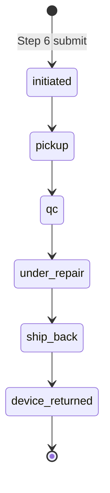
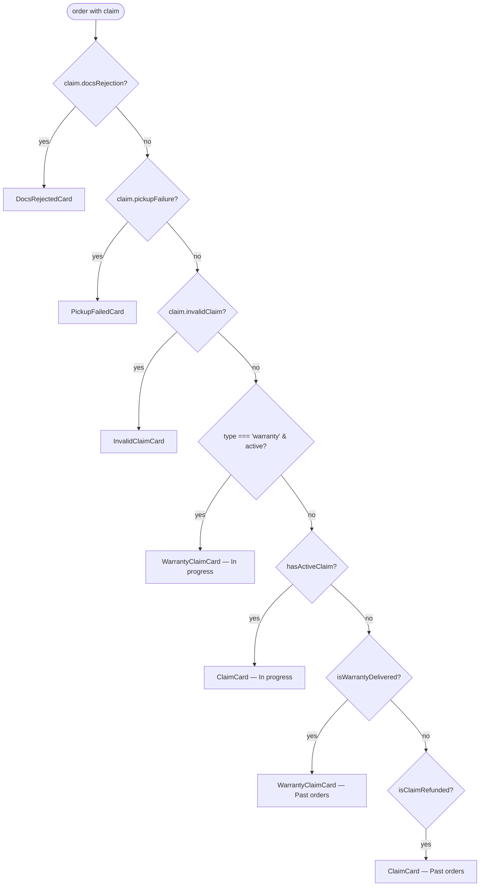

# Warranties & compensations

> Coverage of two Step 1 entries on the returns flow. **Warranty** is wired end-to-end (intake submits an in-session claim that flips the order to a `WarrantyClaimCard`); two hand-seeded mocks also exercise the post-pickup heroes that the prototype can't reach without ops simulation. **Compensation** is still stub end-to-end. This doc covers the wired warranty intake + tracking card plus the open scope on the compensation branch.

## 1. Status

Step 1's full option set across the returns flow:

| Step 1 option | Sub-options | Status |
|---|---|---|
| `I changed my mind` | — | **Wired** — see [returns/change_of_mind.md](./returns/change_of_mind.md) |
| `Something's wrong with my device` | `Return for a refund or replacement` | **Wired** — see [returns/issue.md](./returns/issue.md) |
| `Something's wrong with my device` | `Use my warranty` | **Wired** — intake + tracking — covered here (§2) |
| `Request compensation` | shipping refund / faulty accessory — keep the item | **Stub** — covered here (§3) |

Selecting the still-stubbed `Request compensation` entry renders an inline `not part of this build` note instead of setting a `claimType`; `canAdvance` requires `change_of_mind`, `issue`, or `warranty`, so the compensation entry can't advance past Step 1. The **warranty tracking card** has two hand-seeded mocks (89610, 89580) to exercise the `under_repair` and `ship_back` heroes that the in-session pipeline can't reach without ops simulation — see §2.

## 2. Warranty (repair-and-return)

### 2.1 Scope

The customer's device is faulty but within warranty. Outcome is always **repair + ship-back**; no money changes hands. The customer keeps the same physical unit (repaired by either the seller or, on the LAB-confirmed branch, by Revibe's lab). Operational source: [`../input/return_flow_warranty.md`](../input/return_flow_warranty.md).

### 2.2 Pipeline

6-state customer-facing chain in `WARRANTY_CLAIM_STATUSES` (`src/lib/claims.js`):



The head (`initiated → pickup → qc`) is shared with the refund pipeline; the tail (`under_repair → ship_back → device_returned`) replaces the refund chain. Seller-vs-LAB repair routing is internal to operations — both paths surface as a single neutral "Under repair" state. The prototype's in-session submit always lands a warranty claim on `initiated` (with a seeded `scheduledPickup` strip and a placeholder `repairWindow`); progressing through the pipeline requires manually editing the seeded claim or the two hand-seeded mocks (see §2.8).

### 2.3 WarrantyClaimCard

Lives at `src/components/WarrantyClaimCard.jsx`. Mirrors `ClaimCard`'s chrome (left accent strip, eyebrow, state pill, tinted hero, compact product row, expand-on-tap, history thread, view-details + download footer) but the hero block and post-QC tail diverge.

#### 2.3.1 Tone progression

| `claimStatusId` | Tone | Rationale |
|---|---|---|
| `initiated`, `pickup`, `qc` | **warn (amber)** | Device leaving the customer or being inspected — same posture as `ClaimCard`. |
| `under_repair`, `ship_back` | **brand (purple)** | Revibe is doing the work (repairing + shipping back) — matches `ClaimCard`'s `refund_issued`. |
| `device_returned` | **success (green)** | Terminal — device is home. |

#### 2.3.2 State-specific heroes

Most states reuse a generic claim hero (eyebrow + headline + ref + updated timestamp). Three states layer state-specific content inside or in place of that hero:

- **`initiated`** — `ScheduledPickupStrip` (CalendarClock + scheduled date/slot, MapPin + pickup address). Same shape as `ClaimCard`'s initiated strip.
- **`under_repair`** — `RepairWindowStrip`: Wrench-iconed "Estimated repair complete" date + optional one-line note ("Charging-port assembly swap — typically wraps up within 7–10 days").
- **`ship_back`** — **replaces** the generic hero with a brand-gradient ETA hero borrowed from `InProgressCard`: "Back with you by {date}" headline, "Delivering to · Home" chip, claim-ref + type subline. Once the device is on its way back the leg should read as a forward shipment, not a continuation of claim chrome — same rationale as `InvalidClaimCard`'s paid state.
- **`device_returned`** — `ReturnedStrip`: success-toned CheckCircle2 + "Returned on {date}".

#### 2.3.3 Detailed tracking dropdown

A brand-toned `See detailed tracking` button (Truck glyph, `border-brand bg-brand-bg/60 text-brand`) surfaces in the expanded view whenever `claim.shipBack?.awb` is set — i.e. as soon as the ship-back AWB has been issued. **Collapsed by default**; the brand styling cues "tap me" without stealing focus from the hero.

The dropdown reuses the standard outbound `SHIPPING_SUB_STATUSES` from `lib/statuses.js` so a warranty return reads with the **same four milestones as a normal outgoing order**:

1. Arrived in destination country
2. Cleared customs
3. Forwarded to third-party agent
4. Out for delivery

Plus a courier strip (DHL chip + courier + AWB + copy button) above the timeline. Driven by `claim.shipBack.subStatusId` (one of the four ids) and `claim.shipBack.subTimeline` (map of id → timestamp).

#### 2.3.4 Expanded view

1. **6-step horizontal dot timeline** using `WARRANTY_CLAIM_STATUSES`. Same chrome as `ClaimCard`'s 5-dot strip; tone-aware glow on the current step. Step labels: `Initiated · Pickup · QC · Repair · Ship back · Returned`.
2. **`See detailed tracking` dropdown** (§2.3.3), collapsed by default.
3. **`HistoryThread`** — same `getHistoryEvents(order, 'claim')` source as `ClaimCard`.
4. **Two-action footer** — `View claim details` (opens `ClaimDetailsSheet` — warranty-aware, see §2.5) + icon-only `Download receipt` (decorative).

#### 2.3.5 Section placement

`hasActiveClaim` is type-aware: warranty's terminal is `device_returned` (refund pipelines remain `refund_credited`). The new helper `isWarrantyDelivered(order)` flags warranty terminals for the **Past orders** section. Both routings live in `App.jsx`.

### 2.4 Intake flow

The warranty intake reuses the existing returns-flow chrome and most of the existing steps. Total visible step count is **6** (not 7) — Step 5 (Refund method) is skipped because no money changes hands. The progress bar reads "Step X of 6"; internally `state.step` still uses 1..7 indexing so Step 6 = review and Step 7 = confirmation stay aligned across all three claim types. Routing lives in `flowReducer.js`:

- `visibleStepCount(claimType)` → 7 for refund flows, 6 for warranty.
- `visibleStepIndex(step, claimType)` → maps internal 1..7 onto displayed 1..6, subtracting 1 once `step >= 5` when the claim type is warranty.
- `NEXT` / `BACK` / `GO_TO_STEP` step over `state.step === 5` for warranty so the user never lands on the refund-method screen.

| Step | Behaviour on warranty |
|---|---|
| 1 — Claim type | `Use my warranty` row is in-scope. Selecting it dispatches `SET_CLAIM_TYPE: 'warranty'` and unlocks Continue. |
| 2 — Issue details | **Reuses `Step2IssueDetails`** (same two-scope picker + description + attachment as the Issue branch). Production may swap this for a warranty-specific intake (proof of warranty / serial / purchase date) — see §2.9. |
| 3 — Device prep | Shared with refund flows (factory reset or credentials). |
| 4 — Pickup details | Shared with refund flows. The Step 4 "Expected by" headline (see [returns/claim_tracking.md](./returns/claim_tracking.md) §4) reads the warranty pipeline so the date is computed off `WARRANTY_CLAIM_STATUSES` + warranty-tail SLAs, and the detailed-timeline dropdown shows 6 steps (Initiated → Pickup → QC → Under repair → On its way back → Device returned). |
| 5 — Refund method | **Skipped.** |
| 6 — Review | Refund section is replaced by a **What you'll get back** card: Wrench-iconed "Your repaired device" + "Expected back" date + "No refund — the same unit is returned to you after repair." The Edit-by-section navigation only exposes Fault / Device prep / Pickup. CTA reads `Submit warranty claim` (still success-toned). The packing-confirmation checkbox uses the issue variant ("packed properly and performed the necessary testing") since warranty also collects evidence. |
| 7 — Confirmation | Title swaps to "Your warranty claim is in"; chip reads `Warranty`; second row swaps "Expected refund" (Clock glyph) for **"Expected back"** (Wrench glyph) with the computed return date and a "No refund issued — same device returned after repair" note. Secondary CTA reads "Track this claim". |

On submit, `ClaimFlow.handlePrimary` builds a warranty-shaped claim object (`buildClaim` at the bottom of `ClaimFlow.jsx`) and bubbles it up via the new `onSubmitClaim(orderId, claim)` prop. The shape:

```js
{
  claimRef, claimStatusId: 'initiated', type: 'warranty',
  submittedAt, units: 1,
  issueDetails, issueScope, issueSubtypeId,
  devicePrep, pickupDetails,
  scheduledPickup: { courier: 'DHL Express', date, slot },
  timeline: { initiated: <stamp> },
  repairWindow: { expectedComplete, expectedCompleteLong,
                  note: "We'll confirm the exact repair window after inspection." },
}
```

`App.jsx` stores it in `submittedClaims[orderId]` and projects it over `ORDERS` before filtering. The order immediately re-renders as a `WarrantyClaimCard` (initiated state, scheduled-pickup strip visible). The `UndoSnackbar` slides up after the flow closes so reviewers can revert to the baseline `PastOrderCard` mid-demo. Submitted claims are cleared on refresh — no backend.

### 2.5 ClaimDetailsSheet — warranty branch

`ClaimDetailsSheet` is warranty-aware. For `claim.type === 'warranty'`:

- The "Refund destination" row in **Summary** is hidden (no refund-method picker on intake).
- The bottom **Refund** card becomes **Return** — shows the expected return date (or the actual returned-on date for `device_returned`) with a one-line note: "No refund is issued — the same device is returned to you after repair."

No `expectedRefund` field is required on warranty claims; the sheet reads from `claim.shipBack` / `claim.repairWindow` instead.

### 2.6 Card routing

`App.jsx` routes a warranty claim to `WarrantyClaimCard` after the three takeover checks and before the generic `ClaimCard` fallback:



The takeover cards currently fire only on refund-type mocks; a warranty claim that triggers a takeover (e.g. docs-rejected at intake — `n6` on the operational diagram) would route to the takeover ahead of `WarrantyClaimCard`. The precedence is in place but the takeover copy was written for refund-flow context and may need a warranty variant — see §2.9.

### 2.7 Data model — warranty-specific fields

On top of the standard claim shape (`claimRef`, `claimStatusId`, `type`, `submittedAt`, `pickupDetails`, `scheduledPickup`, `timeline`, `issueDetails`, `devicePrep`), warranty claims carry:

| Field | Type | Used by |
|---|---|---|
| `claim.type` | `'warranty'` | Routing in `App.jsx`; hero copy; sheet branching |
| `claim.repairWindow` *(optional)* | `{ expectedComplete, expectedCompleteLong, note? }` | `under_repair` hero strip |
| `claim.shipBack` *(optional)* | `{ courier, awb, estimatedDelivery, estimatedDeliveryLong, subStatusId, subTimeline, deliveredOn?, deliveredOnLong? }` | `ship_back` hero + detailed-tracking dropdown; `device_returned` hero strip |

`claim.shipBack.subStatusId` is one of the four `SHIPPING_SUB_STATUSES` ids (`arrived_destination`, `cleared_customs`, `forwarded_to_agent`, `out_for_delivery`). `claim.shipBack.subTimeline` is a map keyed by the same ids with human-readable timestamps (e.g. `'19 May · 4:45 PM'`).

No `refundMethod` / `expectedRefund` fields are needed — the warranty branch has no refund. On the in-session submit `claim.reason` is omitted (warranty intake doesn't collect a reason field); the two hand-seeded mocks still carry `{ value: 'other', otherText: '' }` for shape parity with refund claims. A future production intake may swap the reused Issue picker for a warranty-specific block (proof of warranty / serial / purchase date) — see §2.9.

### 2.8 Mocked vs production

- **In-session submit only.** A submitted warranty claim is stored in `App.jsx`'s `submittedClaims` state and projected over `ORDERS`. There's no backend; the claim is cleared on refresh and can be reverted mid-demo via the `UndoSnackbar`.
- **Pipeline progression isn't simulated.** Submitted claims always land on `claimStatusId: 'initiated'`. The post-pickup heroes (`under_repair` `RepairWindowStrip`, `ship_back` brand-gradient ETA, `device_returned` `ReturnedStrip`, the `See detailed tracking` dropdown) only render on the two hand-seeded mocks **89610** (`under_repair`) and **89580** (`ship_back`). Production needs the same webhook / polling mechanism as the refund flow to move the claim through the 6 states.
- **`scheduledPickup`, `repairWindow`, `shipBack.*`** are either hand-written (mocks) or filled with placeholders by `buildClaim` (`'DHL Express'`, "10 AM – 12 PM", tomorrow's date for the scheduled pickup; SLA-summed estimated complete date for the repair window). Production needs the supplier + courier integrations that today feed the refund flow.
- **Seller-vs-LAB routing not surfaced.** A neutral "Under repair" state is shown regardless of which actor is doing the work; per the §2 design decision the customer doesn't need to see the distinction.
- **Invalid-warranty path not wired.** The `Inspector decision = Invalid → customer pays return shipping` branch from the operational diagram is structurally identical to today's Issue-flow invalid path (`InvalidClaimCard`) and would route there. Today's mocks don't exercise it.
- **Auto-expand.** Warranty claims do not currently participate in `pickActiveOrderId` — same posture as `ClaimCard`.

### 2.9 Open questions

- **Warranty-specific Step 2.** Today the warranty branch reuses the Issue scope picker (battery / screen / wrong device / etc.). Production may want a warranty-specific intake block (proof of warranty / serial / purchase date) — particularly if extended-warranty vs manufacturer's-warranty distinction needs to route differently downstream.
- **Takeover copy on warranty claims.** `DocsRejectedCard` and `PickupFailedCard` would route ahead of `WarrantyClaimCard` if the corresponding fields are set, but the ops/quality message copy was written for refund-flow context. May need a warranty variant.
- **Auto-expand for active warranty claims.** Same question as `ClaimCard` ([returns/claim_tracking.md §9](./returns/claim_tracking.md)). Worth revisiting now that customers can routinely have an active warranty claim.
- **Repair-window source.** Today `claim.repairWindow.expectedComplete` is either hand-written (mocks) or computed from `expectedCompletionFor('warranty')` (in-session submit). Production needs either a per-supplier SLA-driven estimate or a seller-input field at intake.
- **Single warranty branch or sub-branched intake?** Warranty coverage varies (manufacturer's warranty / Revibe Care add-on / extended warranty). The current intake collapses to one branch; production may want to split at Step 2 with the source determined backend-side.

## 3. Compensation (shipping refund / faulty accessory)

### 3.1 Scope

The customer reports a problem but **keeps the device**. Likely sub-cases:

- **Shipping refund** — courier delay, damaged packaging, or a duplicate ship-fee charge. Customer gets the shipping amount back (or a goodwill credit).
- **Faulty accessory** — the device is fine but a bundled accessory (cable, adapter, case) is defective. Customer gets a partial refund or a replacement accessory.

### 3.2 Divergence from the wired branches

| Aspect | Wired branches | Compensation branch |
|---|---|---|
| Device pickup | Always required (Step 4) | **Not required** — the customer keeps the device |
| Device prep (Step 3) | Required (factory reset or credentials) | **Not required** |
| Refund math | Computed on `gross` | Computed on a sub-amount (shipping fee, accessory price) |
| Operational flow | Country routing → collection → QC → refund | Goes straight to `refund_issued` (or to an agent-review state) |

This is the simplest of the three stubbed branches *structurally* — it skips Steps 3 and 4 entirely — but the hardest to scope, because the compensation amount and approval rules are case-by-case.

### 3.3 Hook-in points

- `flowReducer.js` would gain a `'compensation'` claim type.
- Step 2 needs a compensation sub-type picker (likely a flat list: shipping refund / damaged packaging / faulty accessory / other) similar to `issueSubtypes.js`.
- Step 2 needs an evidence section similar to the issue branch (description + attachment).
- Steps 3 and 4 are **skipped** by the reducer — the flow jumps from Step 2 to Step 5.
- Step 5 needs a compensation-specific refund-method card (wallet vs original payment, but with a smaller `gross`).
- Step 6 + Step 7 are reusable with copy tweaks.
- A new operational sub-flow doc would live in `docs/input/return_flow_compensation.md` (drawio source pending).

### 3.4 UX considerations

- Compensation amount is often unknown at submission — it needs an agent to assess. Step 5 may need to communicate "expected within X days, amount to be confirmed by support" rather than a precise figure.
- For faulty-accessory cases, customers may prefer a **replacement accessory** over a partial refund. Step 5 could carry a replace-or-refund choice.
- The submission shouldn't promise instant refund timing (unlike the wired Wallet path), because the agent review adds latency.

## 4. Data model — compensation

(Warranty data model lives in §2.7.) Compensation is still stub end-to-end. When wired, the `claim` shape would extend:

| New field | Type | Used by |
|---|---|---|
| `claim.type` | `'compensation'` (in addition to `'change_of_mind'` / `'issue'` / `'warranty'`) | Routing surfaces |
| `claim.compensationDetails` | `{ subtype, description, attachmentName, amountClaimed }` | Step 2 compensation intake |
| `claim.expectedRefund` | (existing shape) | Reused with a smaller `gross` (shipping fee or accessory price) |

`CLAIM_STATUSES` can likely reuse `qc` → `refund_issued` → `refund_credited` as-is for compensation — no new terminal needed.

## 5. Open questions — compensation

(Warranty open questions live in §2.9.)

- **Single warranty branch or sub-branched?** Warranty coverage varies (manufacturer's warranty / Revibe Care add-on / extended warranty). Intake currently collapses to one branch with the source determined backend-side; production may want to split at Step 2 like the change-of-mind / issue divergence. (Note: the **tracking** card already collapses these into one neutral "Under repair" surface — see §2.2; the question here is about intake. Also discussed under warranty open questions §2.9.)
- **Compensation approval gate.** Whether the agent review is a hard gate (claim doesn't even reach `pickup` without it) or a soft gate (the claim moves forward and the agent intervenes for fraud detection).
- **Replace vs refund on faulty accessory.** Does the customer choose, or does the agent dictate based on stock?
- **Pickup-less claims and `pickupDetails`.** The compensation branch skips Step 4. Does `claim.pickupDetails` stay as a required field on the claim object (filled with the order's defaults so the operational flow is uniform), or does it become optional? Cleaner shape vs ops-pipeline uniformity — pick one.
- **History thread on a compensation claim.** With no pickup or device prep, the history is shorter. The `HistoryThread` mode may need a `'compensation'` variant.
- **Faulty-accessory routing.** Operationally, a faulty cable may need to be shipped back for verification; in practice ops may waive that for low-value items. The flow needs a policy decision on the cutoff.
